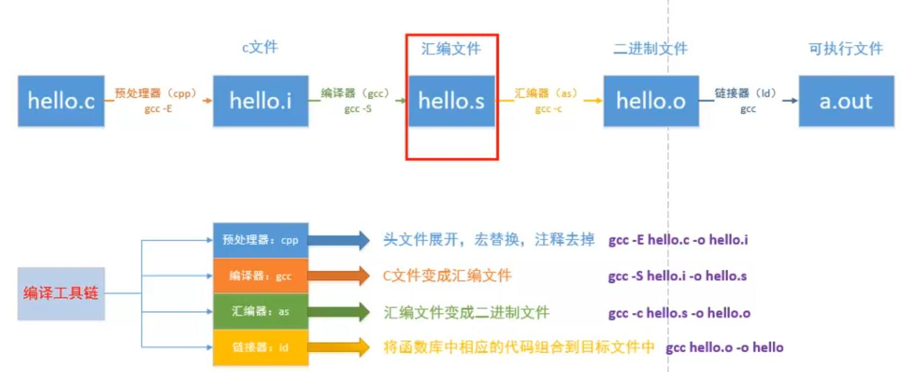

## 编译过程



```bash
# 预处理器 cpp, 展开通文件, 宏替换, 去掉注释
gcc -E hello.c -o hello.i
    
# 编译器 gcc, c文件 -> 汇编文件
gcc -S hello.i -o hello.s
    
# 汇编器 as, 汇编文件 -> 二进制文件
gcc -c hello.s -o hello.o
    
# 链接器 ld, 将函数库中的代码组合到目标文件中
gcc hello.o -o hello
```


## 编译参数

- 指定宏

  ```cpp
  #include <iostream>
  
  int main() {
  
  #ifdef DEBUG
  	std::cout << "hello world\n";
  #endif
  	return 0;
  }
  ```

  ```bash
  gcc sum.c -o sum -D DEGUB
  ```

- 输出警告信息

  ```bash
  gcc sum.c -o sum -Wall
  ```

- 优化代码

  ```
  # 优化等级分为o1、 o2、 o3
  gcc sum.c -o sum -o3 
  ```

- 生成调试信息

  ```
  gcc sum.c -o sum -g
  ```

  

```c
gcc 指令
-I			指定头文件所在目录位置
-c 			只做预处理，编译，汇编。得到二进制文件
-g 			编译时添加调试文件，用于gdb调试
-Wall 		显示所有警告信息
-D  		向程序中“动态”注册宏定义
-l			指定动态库库名
-L			指定动态库路径
-E          生成预处理文件
-O          优化级别

```

**gcc -D 例子演示**  注册宏定义

