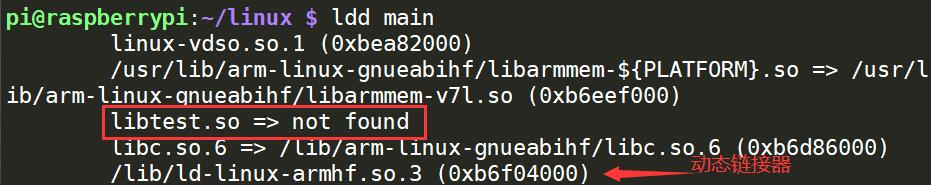

## 静态库

### 创建静态库

```cpp
// include/head.h 
#ifndef HEAD_H
#define HEAD_H

int sum(int, int);
int mul(int, int);

#endif
```

```cpp
// ./sum.c
#include "head.h"

int sum(int a, int b) {
	return a + b;
}

// ./mul.c
#include "head.h"

int mul(int a, int b) {
	return a * b;
}
```

生成.o文件

```
gcc -c *.c -I include
```

打包静态库

```
ar rcs lib/libtest.a *.o
```


### 使用静态库

```cpp
// ./main.c
#include "head.h"
#include "stdio.h"

int main()
{
	int a = sum(2, 4);
	int b = mul(2, 4);
	printf("%d %d\n", a, b);

	return 0;
}
```

使用静态库编译文件

```bash
gcc main.c lib/libtest.a -I include -o main
gcc main.c -I include -L lib -l test -o main
```

查看查看文件中符号

```
nm main
```

### 优缺点

静态库在使用的时候，会根据程序中用的到函数，将对应函数所在的.o打包到程序中。

- 发布程序的时候，不需要提供对应的库。
- 加载库的速度快

将这些库打包到可执行文件中同时也会造成：

- 可执行程序的体积大
- 库发生改变，需要重新编译程序


静态库使用步骤：

```
静态库制作及使用步骤：

	1. 将 .c 生成 .o 文件

		gcc -c add.c -o add.o

	2. 使用 ar 工具制作静态库

		ar rcs  lib库名.a  add.o sub.o div.o

	3. 编译静态库到可执行文件中：

		gcc test.c lib库名.a -o a.out
```

**头文件守卫**

```c

头文件守卫：防止头文件被重复包含

	#ifndef _HEAD_H_

	#define _HEAD_H_

	......

	#endif
```


一、静态链接
1.为什么要进行静态链接
    在我们的实际开发中，不可能将所有代码放在一个源文件中，所以会出现多个源文件，而且多个源文件之间不是独立的，而会存在多种依赖关系，如一个源文件可能要调用另一个源文件中定义的函数，但是每个源文件都是独立编译的，即每个*.c文件会形成一个*.o文件，为了满足前面说的依赖关系，则需要将这些源文件产生的目标文件进行链接，从而形成一个可以执行的程序。这个链接的过程就是静态链接

2.静态链接的原理
     由很多目标文件进行链接形成的是静态库，反之静态库也可以简单地看成是一组目标文件的集合，即很多目标文件经过压缩打包后形成的一个文件，如下图，使用ar命令的-a参数查看静态库的组成：


3.静态链接的优缺点
    静态链接的缺点很明显，一是浪费空间，因为每个可执行程序中对所有需要的目标文件都要有一份副本，所以如果多个程序对同一个目标文件都有依赖，如多个程序中都调用了printf()函数，则这多个程序中都含有printf.o，所以同一个目标文件都在内存存在多个副本；另一方面就是更新比较困难，因为每当库函数的代码修改了，这个时候就需要重新进行编译链接形成可执行程序。但是静态链接的优点就是，在可执行程序中已经具备了所有执行程序所需要的任何东西，在执行的时候运行速度快。

问题：

二、动态链接
1.为什么会出现动态链接
    动态链接出现的原因就是为了解决静态链接中提到的两个问题，一方面是空间浪费，另外一方面是更新困难。下面介绍一下如何解决这两个问题。

2.动态链接的原理
    动态链接的基本思想是把程序按照模块拆分成各个相对独立部分，在程序运行时才将它们链接在一起形成一个完整的程序，而不是像静态链接一样把所有程序模块都链接成一个单独的可执行文件。下面简单介绍动态链接的过程：

​    假设现在有两个程序program1.o和program2.o，这两者共用同一个库lib.o,假设首先运行程序program1，系统首先加载program1.o，当系统发现program1.o中用到了lib.o，即program1.o依赖于lib.o，那么系统接着加载lib.o，如果program1.o和lib.o还依赖于其他目标文件，则依次全部加载到内存中。当program2运行时，同样的加载program2.o，然后发现program2.o依赖于lib.o，但是此时lib.o已经存在于内存中，这个时候就不再进行重新加载，而是将内存中已经存在的lib.o映射到program2的虚拟地址空间中，从而进行链接（这个链接过程和静态链接类似）形成可执行程序。

3.动态链接的优缺点
    动态链接的优点显而易见，就是即使需要每个程序都依赖同一个库，但是该库不会像静态链接那样在内存中存在多分，副本，而是这多个程序在执行时共享同一份副本；另一个优点是，更新也比较方便，更新时只需要替换原来的目标文件，而无需将所有的程序再重新链接一遍。当程序下一次运行时，新版本的目标文件会被自动加载到内存并且链接起来，程序就完成了升级的目标。但是动态链接也是有缺点的，因为把链接推迟到了程序运行时，所以每次执行程序都需要进行链接，所以性能会有一定损失。

​    据估算，动态链接和静态链接相比，性能损失大约在5%以下。经过实践证明，这点性能损失用来换区程序在空间上的节省和程序构建和升级时的灵活性是值得的。

4.动态链接地址是如何重定位的呢？
    前面我们讲过静态链接时地址的重定位，那我们现在就在想动态链接的地址又是如何重定位的呢？虽然动态链接把链接过程推迟到了程序运行时，但是在形成可执行文件时（注意形成可执行文件和执行程序是两个概念），还是需要用到动态链接库。比如我们在形成可执行程序时，发现引用了一个外部的函数，此时会检查动态链接库，发现这个函数名是一个动态链接符号，此时可执行程序就不对这个符号进行重定位，而把这个过程留到装载时再进行。


## 动态库

### 创建动态库

生成与位置无关的目标文件

```
gcc -fPIC -c *.c -I include
```

打包动态库**.so**

```
gcc -shared -o lib/libtest.so *.o -I include
```


### 使用动态库

```bash
gcc main.c lib/libtest.so -I include -o main
gcc main.c -L lib -l test -I include -o main
```

在使用第二种方法，执行可执行文件时，会出现找不到路径的问题，这是因为动态库在加载的时候，需要动态链接器进行加载，可以适应**ldd**命令查看可执行程序需要的动态库。



动态链接器在加载库的时候，根据环境变量中的目录惊进行查找，可以添加自己的目录到环境变量中。

**动态库的搜索路径的顺序**

1. 编译目标代码时指定的动态库搜索路径
2. 环境变量`LD_LIBRARY_PATH`指定的动态库搜索路径
3. 配置文件/etc/ld.so.conf中指定的动态库搜索路径
4. 默认的动态库搜索路径/lib和/usr/lib

添加到LD_LIBRARY_PATH，这种方法是临时的。

```bash
export LD_LIBRARY_PATH=./lib:$LD_LIBRARY_PATH
```

可以将命令写到bash配置文件里面，这样每次加载shell之前，都会配置目录。

```bash
vim ~/.bashrc
export LD_LIBRARY_PATH=./lib:$LD_LIBRARY_PATH
```

另外也可以配置**ld.so.conf**。

```bash
sudo vim /etc/ld.so.conf
/home/user/linux/lib
sudo ldconfig -v
```


查看可执行文件依赖的动态库

```bash
ldd app
```


### 优缺点

动态库只是在内存地址的共享库中标记，在程序运行时才加载。

- 可执行程序体积小
- 动态库更新，不需要重新编译
- 发布程序需要将库提供给用户
- 动态库没有打包应用程序中，加载速度相对慢


```
动态库制作及使用：

	1.  将 .c 生成 .o 文件， （生成与位置无关的代码 -fPIC）

		gcc -c add.c -o add.o -fPIC

	2. 使用 gcc -shared 制作动态库

		gcc -shared -o lib库名.so	add.o sub.o div.o

	3. 编译可执行程序时，指定所使用的动态库。  -l：指定库名(去掉lib前缀和.so后缀)  -L：指定库路径。

		gcc test.c -o a.out -lmymath -L./lib

	4. 运行可以执行程序 ./a.out 出错！！！！ --- ldd a.out --> "not found"

		error while loading shared libraries: libxxx.so: cannot open shared object file: No such file or directory

		原因：
			链接器：	工作于链接阶段， 工作时需要 -l 和 -L

			动态链接器：	工作于程序运行阶段，工作时需要提供动态库所在目录位置。

		解决方式：				

			【1】 通过环境变量：  export LD_LIBRARY_PATH=动态库路径

				./a.out 成功！！！  （临时生效， 终端重启环境变量失效）

			【2】 永久生效： 写入 终端配置文件。  .bashrc  建议使用绝对路径。

				1) vi ~/.bashrc

				2) 写入 export LD_LIBRARY_PATH=动态库路径  保存

				3）. .bashrc/  source .bashrc / 重启 终端  ---> 让修改后的.bashrc生效

				4）./a.out 成功！！！ 

			【3】 拷贝自定义动态库 到 /lib (标准C库所在目录位置)

			【4】 配置文件法

				1）sudo vi /etc/ld.so.conf

				2) 写入 动态库绝对路径  保存

				3）sudo ldconfig -v  使配置文件生效。

				4）./a.out 成功！！！--- 使用 ldd  a.out 查看
```


数据段合并


链接时 rodata 和text 合并  data 和 bss 合并

