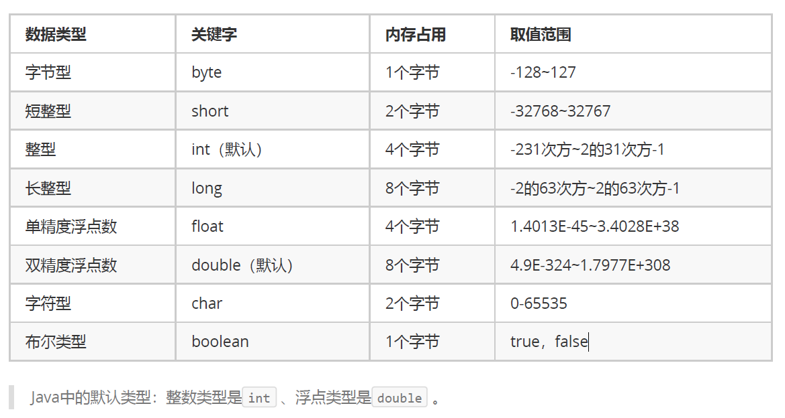
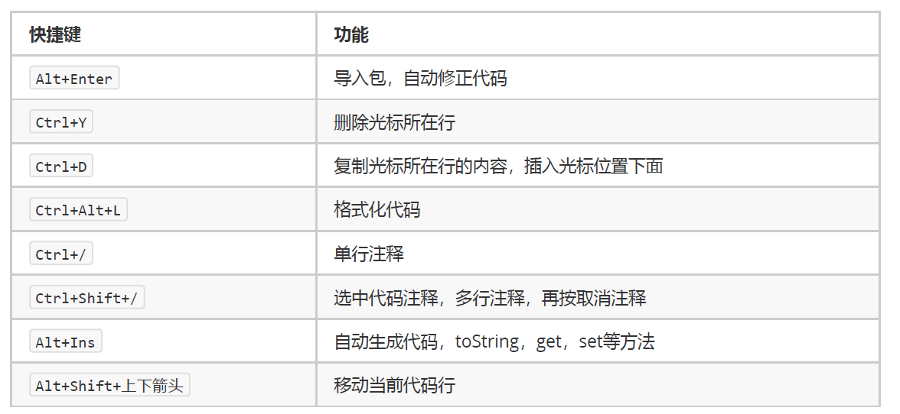
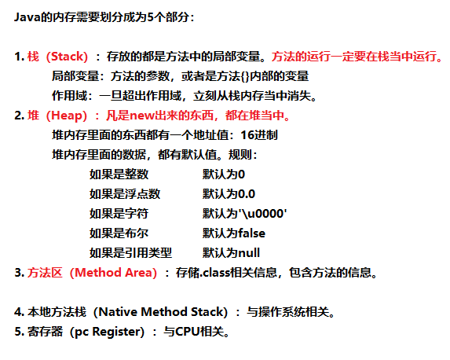
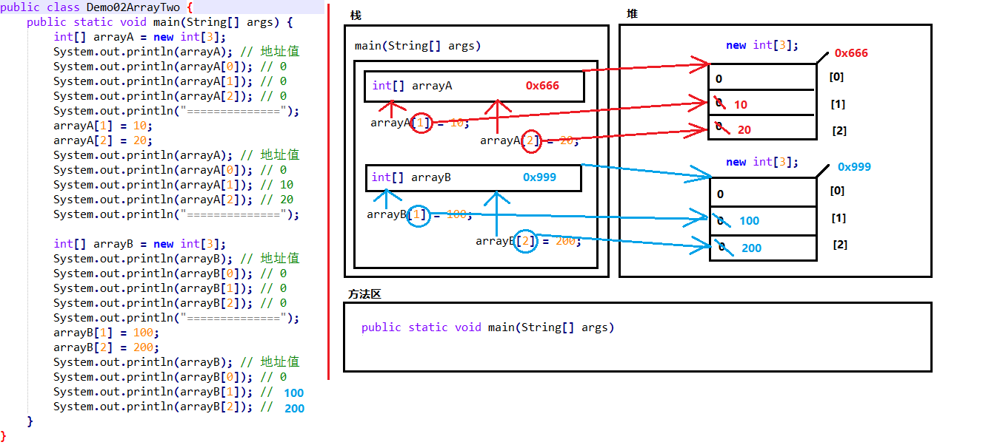
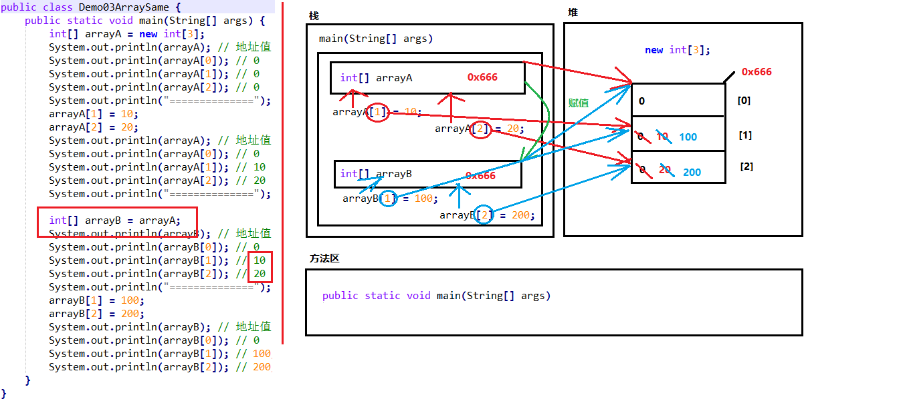
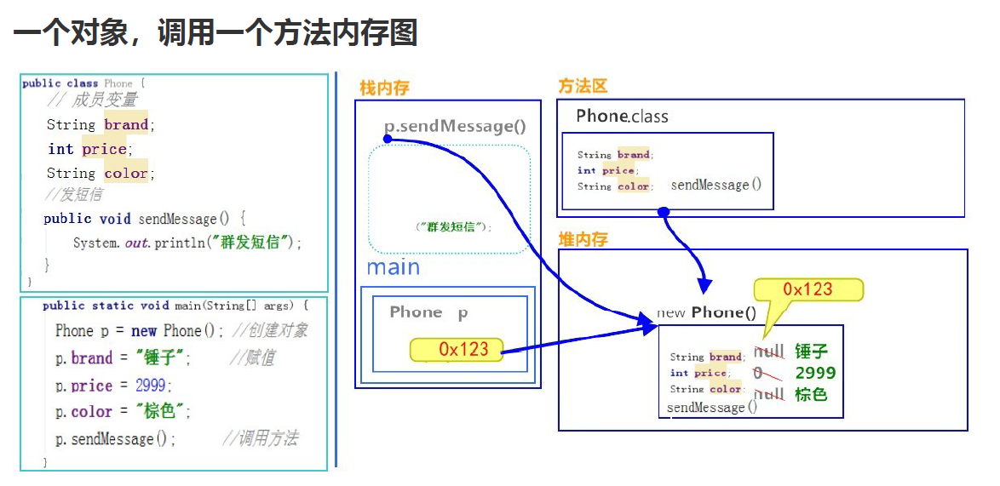

# java语法

## java初级语法

jvm

JVM（Java Virtual Machine ）：Java虚拟机，简称JVM，是运行所有Java程序的假想计算机，是Java程序的
运行环境，是Java 最具吸引力的特性之一。我们编写的Java代码，都运行在JVM 之上。

JRE (Java Runtime Environment) ：是Java程序的运行时环境，包含JVM 和运行时所需要的核心类库 。
JDK (Java Development Kit)：是Java程序开发工具包，包含JRE 和开发人员使用的工具。


标识符：是指在程序中，我们自己定义内容。比如类的名字、方法的名字和变量的名字等等，都是标识符。
HelloWorld案例中，出现的标识符有类名字HelloWorld 。

命名规则： 硬性要求
标识符可以包含英文字母26个(区分大小写) 、0-9数字 、$（美元符号） 和_（下划线） 。
标识符不能以数字开头。
标识符不能是关键字。
命名规范： 软性建议
类名规范：首字母大写，后面每个单词首字母大写（大驼峰式）。
方法名规范： 首字母小写，后面每个单词首字母大写（小驼峰式）。
变量名规范：全部小写。


#### 数据类型分类

Java的数据类型分为两大类：
基本数据类型：包括 整数、浮点数、字符、布尔。
引用数据类型：包括 类、数组、接口。



**注意，字符型为2个字节**

IDEA 快捷键




定义数组

```java
//数组一旦创建，不能改变长度
int[] nums = new int[20];//动态定义数组
int[] numsb = new int[]{4,20,10};//静态定义
int[] numsc = {19,20};//静态定义省略格式
int len = nums.length;
int[] dn;
dn = new int[]{135,456,234};

String[] array = new String[]{"hello","world","nihao"};


int[] nums = new int[20];
System.out.println(nums);//打印数组名代表数组地址


```

#### java的内存划分









### 面向对象

什么是类
类：是一组相关属性和行为的集合。可以看成是一类事物的模板，使用事物的属性特征和行为特征来描述该
类事物。
现实中，描述一类事物：
属性：就是该事物的状态信息。
行为：就是该事物能够做什么。

```java
public class Phone {
// 成员变量
String brand; //品牌
int price; //价格
String color; //颜色
// 成员方法
//打电话
public void call(String name) {
System.out.println("给"+name+"打电话");
}
//发短信
public void sendMessage() {
System.out.println("群发短信");
}
}
```

对象内存图



