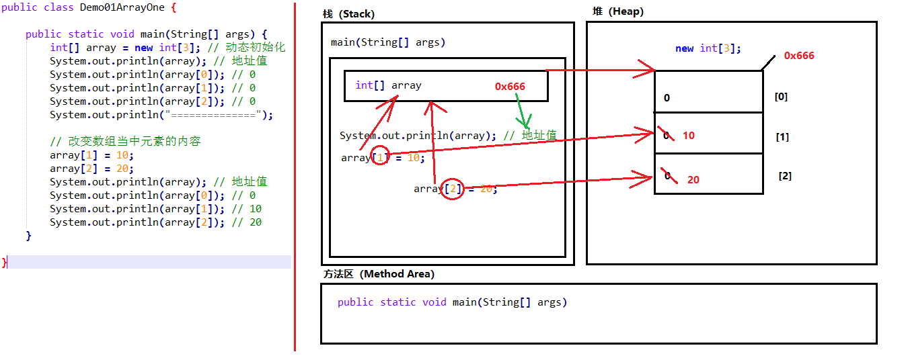

# java语法

## java初级语法

jvm

JVM（Java Virtual Machine ）：Java虚拟机，简称JVM，是运行所有Java程序的假想计算机，是Java程序的
运行环境，是Java 最具吸引力的特性之一。我们编写的Java代码，都运行在JVM 之上。

JRE (Java Runtime Environment) ：是Java程序的运行时环境，包含JVM 和运行时所需要的核心类库 。
JDK (Java Development Kit)：是Java程序开发工具包，包含JRE 和开发人员使用的工具。


标识符：是指在程序中，我们自己定义内容。比如类的名字、方法的名字和变量的名字等等，都是标识符。
HelloWorld案例中，出现的标识符有类名字HelloWorld 。

命名规则： 硬性要求
标识符可以包含英文字母26个(区分大小写) 、0-9数字 、$（美元符号） 和_（下划线） 。
标识符不能以数字开头。
标识符不能是关键字。
命名规范： 软性建议
类名规范：首字母大写，后面每个单词首字母大写（大驼峰式）。
方法名规范： 首字母小写，后面每个单词首字母大写（小驼峰式）。
变量名规范：全部小写。


#### 数据类型分类

Java的数据类型分为两大类：
基本数据类型：包括 整数、浮点数、字符、布尔。
引用数据类型：包括 类、数组、接口。


**注意，字符型为2个字节**

IDEA 快捷键


定义数组

```java
//数组一旦创建，不能改变长度
int[] nums = new int[20];//动态定义数组
int[] numsb = new int[]{4,20,10};//静态定义
int[] numsc = {19,20};//静态定义省略格式
int len = nums.length;
int[] dn;
dn = new int[]{135,456,234};

String[] array = new String[]{"hello","world","nihao"};


int[] nums = new int[20];
System.out.println(nums);//打印数组名代表数组地址


```

#### java的内存划分





### 面向对象

什么是类
类：是一组相关属性和行为的集合。可以看成是一类事物的模板，使用事物的属性特征和行为特征来描述该
类事物。
现实中，描述一类事物：
属性：就是该事物的状态信息。
行为：就是该事物能够做什么。

```java
public class Phone {
// 成员变量
String brand; //品牌
int price; //价格
String color; //颜色
// 成员方法
//打电话
public void call(String name) {
System.out.println("给"+name+"打电话");
}
//发短信
public void sendMessage() {
System.out.println("群发短信");
}
}
```

对象内存图


**两个对象，调用一个方法内存图**


#### 成员变量和局部变量区别

1 在类中的位置不同 重点
成员变量：类中，方法外
局部变量：方法中或者方法声明上(形式参数)
作用范围不一样 重点
成员变量：类中
局部变量：方法中
初始化值的不同 重点
成员变量：有默认值
局部变量：没有默认值。必须先定义，赋值，最后使用
在内存中的位置不同 了解
成员变量：堆内存
局部变量：栈内存
生命周期不同 了解
成员变量：随着对象的创建而存在，随着对象的消失而消失
局部变量：随着方法的调用而存在，随着方法的调用完毕而消失

#### 封装的操作——private关键字

private的含义
1. private是一个权限修饰符，代表最小权限。

2. 可以修饰成员变量和成员方法。

3. 被private修饰后的成员变量和成员方法，只在本类中才能访问。

   

private 数据类型 变量名 ；

```java
//修饰成员变量
public class Student {
    private String name;
    private int age;
}


public class Student {
    private String name;
    private int age;
    public void setName(String n) {
    	name = n;
    }
    public String getName() {
    	return name;
    }
    public void setAge(int a) {
    	age = a;
    }
    public int getAge() {
    	return age;
    }
}


```

#### this 关键字

```java
public class Student {
    private String name;
    private int age;
    public void setName(String name) {
    	name = name;
    }
    public void setAge(int age) {
    	age = age;//同名造成的错误
    }
}

//this代表所在类的当前对象的引用（地址值），即对象自己的引用。

public class Student {
    private String name;
    private int age;
    public void setName(String name) {
        //name = name;
        this.name = name;
    }
    public String getName() {
    	return name;
    }
    public void setAge(int age) {
    //age = age;
    	this.age = age;//this解决同名问题
    }
}


```

### Java  API

#### Scanner

```java
//使用import关键字导包，在类的所有代码之前导包，引入要使用的类型，java.lang包下的所有类无需导入。


import java.util.Scanner;
public class demoScanner {
    public static void main(String[] args) {
        //获取键盘输入
        Scanner sc = new Scanner(System.in);//创建对象
        int num = sc.nextInt();//获取键盘输入的一个int 数字
        System.out.println(num);
        String str = sc.next();//获取键盘的一个字符串
        System.out.println(str);
        
    }
}

```

#### 匿名对象

```java
//创建对象时，只有创建对象的语句，却没有把对象地址值赋值给某个变量。虽然是创建对象的简化写法，但是应用场景非常有限。
new 类名(参数列表)；
new Scanner(System.in)；
    //一旦调用两次方法，就是创建了两个对象，造成浪费，请看如下代码。
new Scanner(System.in).nextInt();
new Scanner(System.in).nextInt();

//小贴士：一个匿名对象，只能使用一次。
//匿名对象可以作为方法的参数和返回值
class Test {
    public static void main(String[] args) {
    // 普通方式
        Scanner sc = new Scanner(System.in);
        input(sc);
        //匿名对象作为方法接收的参数
        input(new Scanner(System.in));
    }
    public static void input(Scanner sc){
    	System.out.println(sc);
    }
}

//作为返回值
class Test2 {
    public static void main(String[] args) {
    // 普通方式
    	Scanner sc = getScanner();
    }
    public static Scanner getScanner(){
    //普通方式
    //Scanner sc = new Scanner(System.in);
    //return sc;
    //匿名对象作为方法返回值
    	return new Scanner(System.in);
    }
}


```

#### Random类

```java
Random使用步骤
查看类
java.util.Random ：该类需要 import导入使后使用。
查看构造方法
public Random() ：创建一个新的随机数生成器。
查看成员方法
public int nextInt(int n) ：返回一个伪随机数，范围在 0 （包括）和指定值 n （不包括）之间的
int 值。

//1. 导包
import java.util.Random;
public class Demo01_Random {
    public static void main(String[] args) {
    //2. 创建键盘录入数据的对象
        Random r = new Random();
        for(int i = 0; i < 3; i++){
        //3. 随机生成一个数据
            int number = r.nextInt(10);
            //4. 输出数据
            System.out.println("number:"+ number);
        }
    }
}

```

#### ArrayList类

```java
java.util.ArrayList 是大小可变的数组的实现，存储在内的数据称为元素。此类提供一些方法来操作内部存储
的元素。 ArrayList 中可不断添加元素，其大小也自动增长。
    
查看类
java.util.ArrayList <E> ：该类需要 import导入使后使用。
<E> ，表示一种指定的数据类型，叫做泛型。E ，取自Element（元素）的首字母。在出现E 的地方，我们使
用一种引用数据类型将其替换即可，表示我们将存储哪种引用类型的元素。代码如下：
查看构造方法
public ArrayList() ：构造一个内容为空的集合。
    
基本格式:
在JDK 7后,右侧泛型的尖括号之内可以留空，但是<>仍然要写。简化格式：
查看成员方法
public boolean add(E e) ： 将指定的元素添加到此集合的尾部。
参数 E e ，在构造ArrayList对象时， <E> 指定了什么数据类型，那么add(E e) 方法中，只能添加什么数据
    
ArrayList<String> list = new ArrayList<>();
list.add("赵丽颖");
list.add("古力热巴");      
System.out.println(list);//打印的值，而不是地址,打印所有内容


对于元素的操作,基本体现在——增、删、查。常用的方法有：
public boolean add(E e) ：将指定的元素添加到此集合的尾部。
public E remove(int index) ：移除此集合中指定位置上的元素。返回被删除的元素。
public E get(int index) ：返回此集合中指定位置上的元素。返回获取的元素。
public int size() ：返回此集合中的元素数。遍历集合时，可以控制索引范围，防止越界。  

public class Demo01ArrayListMethod {
    public static void main(String[] args) {
    //创建集合对象
        ArrayList<String> list = new ArrayList<String>();
        //添加元素
        list.add("hello");
        list.add("world");
        list.add("java");
        //public E get(int index):返回指定索引处的元素
        System.out.println("get:"+list.get(0));
        System.out.println("get:"+list.get(1));
        System.out.println("get:"+list.get(2));
        //public int size():返回集合中的元素的个数
        System.out.println("size:"+list.size());
        //public E remove(int index):删除指定索引处的元素，返回被删除的元素
        System.out.println("remove:"+list.remove(0));
        //遍历输出
        for(int i = 0; i < list.size(); i++){
        	System.out.println(list.get(i));
        }
    }
}


```

#### ArrayList类如何存储基本数据类型

```java
ArrayList对象不能存储基本类型，只能存储引用类型的数据。类似<int> 不能写，但是存储基本数据类型对应的
包装类型是可以的。所以，想要存储基本类型数据， <> 中的数据类型，必须转换后才能编写，转换写法如下：
基本类型基本类型包装类
byte                    Byte
short                   Short
int                     Integer
long                    Long
float                   Float
double                  Double
char                    Character
boolean                 Boolean
    
public class Demo02ArrayListMethod {
    public static void main(String[] args) {
        ArrayList<Integer> list = new ArrayList<Integer>();
        list.add(1);
        list.add(2);
        list.add(3);
        list.add(4);
        System.out.println(list);
    }
}

自动装箱 基本类型  包装类型
自动拆箱 包装类型  基本类型
    
```

#### String类

```java
java.lang.String 类代表字符串。Java程序中所有的字符串文字（例如"abc" ）都可以被看作是实现此类的实
例。
类 String 中包括用于检查各个字符串的方法，比如用于比较字符串，搜索字符串，提取子字符串以及创建具有翻
译为大写或小写的所有字符的字符串的副本。
    
特点：1. 字符串不变：字符串的值在创建后不能被更改。
String s1 = "abc";
s1 += "d";
System.out.println(s1); // "abcd"
// 内存中有"abc"，"abcd"两个对象，s1从指向"abc"，改变指向，指向了"abcd"。

2.因为String对象是不可变的，所以它们可以被共享。
String s1 = "abc";
String s2 = "abc";
// 内存中只有一个"abc"对象被创建，同时被s1和s2共享。

3."abc" 等效于 char[] data={ 'a' , 'b' , 'c' }
例如：
String str = "abc";
相当于：
char data[] = {'a', 'b', 'c'};
String str = new String(data);
// String底层是靠字符数组实现的。


查看类
java.lang.String ：此类不需要导入。
查看构造方法
public String() ：初始化新创建的 String对象，以使其表示空字符序列。
public String(char[] value) ：通过当前参数中的字符数组来构造新的String。
public String(byte[] bytes) ：通过使用平台的默认字符集解码当前参数中的字节数组来构造新的
String。
    
// 无参构造
String str = new String（）；
// 通过字符数组构造
char chars[] = {'a', 'b', 'c'};
String str2 = new String(chars);
// 通过字节数组构造
byte bytes[] = { 97, 98, 99 };
String str3 = new String(bytes);


public boolean equals (Object anObject) ：将此字符串与指定对象进行比较。
public boolean equalsIgnoreCase (String anotherString) ：将此字符串与指定对象进行比较，忽略大小
写。
    
public int length () ：返回此字符串的长度。
public String concat (String str) ：将指定的字符串连接到该字符串的末尾。
public char charAt (int index) ：返回指定索引处的 char值。
public int indexOf (String str) ：返回指定子字符串第一次出现在该字符串内的索引。
public String substring (int beginIndex) ：返回一个子字符串，从beginIndex开始截取字符串到字符
串结尾。
public String substring (int beginIndex, int endIndex) ：返回一个子字符串，从beginIndex到
endIndex截取字符串。含beginIndex，不含endIndex。    

public char[] toCharArray () ：将此字符串转换为新的字符数组。
public byte[] getBytes () ：使用平台的默认字符集将该 String编码转换为新的字节数组。
public String replace (CharSequence target, CharSequence replacement) ：将与target匹配的字符串使用replacement字符串替换。
    
public String[] split(String regex) ：将此字符串按照给定的regex（规则）拆分为字符串数组。
    
public class String_Demo03 {
    public static void main(String[] args) {
    //创建字符串对象
        String s = "aa|bb|cc";
        String[] strArray = s.split("|"); // ["aa","bb","cc"]
        for(int x = 0; x < strArray.length; x++) {
        	System.out.println(strArray[x]); // aa bb cc
        }
    }
}    


public static void main(String[] args) {

    String str1 = "abc";
    String str2 = "abc";
    //str2 和 str1 指向相同的地址  放在字符串常量池中

    char[] charArray = {'a','b','c'};
    String str3 = new String(charArray); //不在字符串常量池中

    //引用类型 == 是地址值的比较
    System.out.println(str1 == str2);//true
    System.out.println(str1 == str3);//false
    System.out.println(str2 == str3);//false
}


```

#### static 关键字

```java
类变量
当 static 修饰成员变量时，该变量称为类变量。该类的每个对象都共享同一个类变量的值。任何对象都可以更改
该类变量的值，但也可以在不创建该类的对象的情况下对类变量进行操作。
类变量：使用 static关键字修饰的成员变量。
定义格式：

static 数据类型 变量名；
static int numberID；
    
静态方法
当static 修饰成员方法时，该方法称为类方法 。静态方法在声明中有static ，建议使用类名来调用，而不需要
创建类的对象。调用方式非常简单。
类方法：使用 static关键字修饰的成员方法，习惯称为静态方法。
    
修饰符 static 返回值类型 方法名 (参数列表){
// 执行语句
}

public static void showNum() {
System.out.println("num:" + numberOfStudent);
}

静态方法调用的注意事项：
1、静态方法可以直接访问类变量和静态方法。
2、静态方法不能直接访问普通成员变量或成员方法。反之，成员方法可以直接访问类变量或静态方法。
3、静态方法中，不能使用this关键字。
小贴士：静态方法只能访问静态成员。
    
static 修饰的内容：
是随着类的加载而加载的，且只加载一次。
存储于一块固定的内存区域（静态区），所以，可以直接被类名调用。
它优先于对象存在，所以，可以被所有对象共享。    
    
//静态代码块
静态代码块：定义在成员位置，使用static修饰的代码块{ }。
位置：类中方法外。
执行：随着类的加载而执行且执行一次，优先于main方法和构造方法的执行。
//给类变量进行初始化赋值
public class Game {
    public static int number;
    public static ArrayList<String> list;
    static {
    // 给类变量赋值
        number = 2;
        list = new ArrayList<String>();
        // 添加元素到集合中
        list.add("张三");
        list.add("李四");
    }
}
```

#### Arrays类

```java
java.util.Arrays 此类包含用来操作数组的各种方法，比如排序和搜索等。其所有方法均为静态方法，调用起来
非常简单。
    
public static String toString(int[] a) ：返回指定数组内容的字符串表示形式。
public static void main(String[] args) {
// 定义int 数组
    int[] arr = {2,34,35,4,657,8,69,9};
    // 打印数组,输出地址值
    System.out.println(arr); // [I@2ac1fdc4
    // 数组内容转为字符串
    String s = Arrays.toString(arr);
    // 打印字符串,输出内容
    System.out.println(s); // [2, 34, 35, 4, 657, 8, 69, 9]
}    

public static void sort(int[] a) ：对指定的 int 型数组按数字升序进行排序。
    
 int[] arr2 = {24, 7, 5, 48, 4, 46, 35, 11, 6, 2};

System.out.println(Arrays.toString(arr2));
Arrays.sort(arr2);
System.out.println(Arrays.toString(arr2));   


```

#### Math

```java
public static double abs(double a) ：返回 double 值的绝对值。
public static double ceil(double a) ：返回大于等于参数的最小的整数。
public static double floor(double a) ：返回小于等于参数最大的整数。
public static long round(double a) ：返回最接近参数的 long。(相当于四舍五入方法)
    
```

#### 继承

```java
通过 extends 关键字，可以声明一个子类继承另外一个父类，定义格式如下：
继承演示，代码如下：
class 父类 {
...
}
class 子类 extends 父类 {
...
}

成员变量重名
class Fu {
// Fu中的成员变量。
	int num = 5;
}

class Zi extends Fu {
// Zi中的成员变量
    int num = 6;
    public void show() {
        // 访问父类中的num
        System.out.println("Fu num=" + num);
        // 访问子类中的num
        System.out.println("Zi num=" + num);
    }
}

class ExtendsDemo03 {
    public static void main(String[] args) {
        // 创建子类对象
        Zi z = new Zi();
        // 调用子类中的show方法
        z.show();
    }
}

super
子父类中出现了同名的成员变量时，在子类中需要访问父类中非私有成员变量时，需要使用super 关键字，修饰
父类成员变量，类似于之前学过的 this 。
class Zi extends Fu {
    // Zi中的成员变量
    int num = 6;
    public void show() {
        //访问父类中的num
        System.out.println("Fu num=" + super.num);
        //访问子类中的num
        System.out.println("Zi num=" + this.num);
    }
}    

Override
成员方法重名——重写(Override)
如果子类父类中出现重名的成员方法，这时的访问是一种特殊情况，叫做方法重写 (Override)。
方法重写 ：子类中出现与父类一模一样的方法时（返回值类型，方法名和参数列表都相同），会出现覆盖效
果，也称为重写或者复写。声明不变，重新实现。

1. 子类方法覆盖父类方法，必须要保证权限大于等于父类权限。、
    public > protected > (default) > private
2. 子类方法覆盖父类方法，返回值类型、函数名和参数列表都要一模一样。
    子类方法的返回值必须小于等于父类的返回值范围。
    java.long.Object 类是所有类的公共最高父类，java.long.String 是Object的子类
    
class Fu {
    public void show() {
    	System.out.println("Fu show");
    }
}
class Zi extends Fu {
//子类重写了父类的show方法
    @Override  //可选，写在方法前用于检测是不是有效的正确覆盖重写，如果不一致会报错
    public void show() {
    	System.out.println("Zi show");
    }
}
public class ExtendsDemo05{
    public static void main(String[] args) {
        Zi z = new Zi();
        // 子类中有show方法，只执行重写后的show方法
        z.show(); // Zi show  
    }
}   


```

