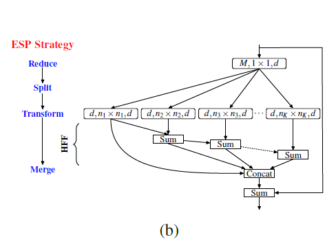

# Image Segmentation

一，Unet 

网络框架

一种编码器-[解码器](https://www.baidu.com/s?wd=%E8%A7%A3%E7%A0%81%E5%99%A8&tn=24004469_oem_dg&rsv_dl=gh_pl_sl_csd)结构。编码器逐渐减少池化层的空间维度，解码器逐步修复物体的细节和空间维度。编码器和解码器之间通常存在快捷连接，因此能帮助解码器更好地修复目标的细节。[U-Net](https://www.baidu.com/s?wd=U-Net&tn=24004469_oem_dg&rsv_dl=gh_pl_sl_csd)是这种方法中最常用的结构。

Network Architecture

the expansive path      the contracting path

The network does not have any fully connected layers

and only uses the valid part of each convolution,

there is very little training data available, we use excessive

data augmentation by applying elastic deformations to the available training im-

ages. This allows the network to learn invariance to such deformations, without

the need to see these transformations in the annotated img corpus.

Training

The energy function is computed by a pixel-wise soft-max over the nal

feature map combined with the cross entropy loss function

The separation border is computed using morphological operations.

a good initialization of the weights is extremely important.

Data Augmentation

primarily need shift and rotation invariance as well as robustness to deformations and gray value variations.

Especially random elastic deformations of the training samples seem to be the key concept to train

a segmentation network with very few annotated images

二，FCN

Fully Convolutional Networks for Semantic Segmentation

全卷积网络(FCN)是从抽象的特征中恢复出每个像素所属的类别。即从图像级别的分类进一步延伸到像素级别的分类。

该论文包含了当下CNN的三个思潮 

- 不含全连接层(fc)的全卷积(fully conv)网络。可适应任意尺寸输入。 

- 增[大数据](http://lib.csdn.net/base/hadoop)尺寸的反卷积(deconv)层。能够输出精细的结果。 

- 结合不同深度层结果的跳级(skip)结构。同时确保鲁棒性和精确性。

一些重点：

损失函数是在最后一层的 spatial map上的 pixel 的 loss 和，在每一个 pixel 使用 softmax loss 

使用 skip 结构融合多层（3层）输出，底层网络应该可以预测更多的位置信息，因为他的感受野小可以看到小的 pixels

上采样 lower-resolution layers 时，如果采样后的图因为 padding 等原因和前面的图大小不同，使用 crop ，当裁剪成大小相同的，spatially aligned ，使用 concat 操作融合两个层 

# 网络结构

网络结构如下。输入可为任意尺寸图像彩色图像；输出与输入尺寸相同，深度为：20类目标+背景=21。 （在PASCAL数据集上进行的，PASCAL一共20类）

## 全卷积-提取特征

论文中，达到最高精度的分类网络是VGG16，但提供的模型基于AlexNet。此处使用AlexNet便于绘图。

全连接层转换为卷积层：在两种变换中，将全连接层转化为卷积层在实际运用中更加有用。假设一个卷积神经网络的输入是 224x224x3 的图像，一系列的卷积层和下采样层将图像数据变为尺寸为 7x7x512 的激活数据体。AlexNet使用了两个尺寸为4096的全连接层，最后一个有1000个神经元的全连接层用于计算分类评分。我们可以将这3个全连接层中的任意一个转化为卷积层：

针对第一个连接区域是[7x7x512]的全连接层，令其滤波器尺寸为F=7，这样输出数据体就为[1x1x4096]了。

针对第二个全连接层，令其滤波器尺寸为F=1，这样输出数据体为[1x1x4096]

对最后一个全连接层也做类似的，令其F=1，最终输出为[1x1x1000]

虚线下半部分中，分别从卷积网络的不同阶段，以卷积层（蓝色×3）预测深度为21的分类结果。

例：第一个预测模块 

输入16*16*4096，卷积模板尺寸1*1，输出16*16*21。 

相当于对每个像素施加一个全连接层，从4096维特征，预测21类结果。

### **逐像素点预测分类**

采用反卷积层对最后一个卷积层的feature map进行上采样, 使它恢复到输入图像相同的尺寸，从而可以对每个像素都产生了一个预测, 同时保留了原始输入图像中的空间信息, 最后在上采样的特征图上进行逐像素分类。

## 反卷积-升采样

（这里会先进行上采样，即扩大像素；再进行卷积——通过学习获得权值）

下半部分，反卷积层（橙色×3）可以把输入数据尺寸放大。和卷积层一样，上采样的具体参数经过训练确定。

这里图像的反卷积与下图的full卷积原理是一样的，使用了这一种反卷积手段使得图像可以变大，FCN作者使用的方法是这里所说反卷积的一种变体，这样就可以获得相应的像素值，图像可以实现end to end。

（feature map值与权重不同，生成的上采样的二值区域也是不一样的。）

## 跳级结构

如下图所示：对原图进行卷积conv1、pool1后图像缩小为1/2；对图像进行第二次卷积conv2、pool2后图像缩小为1/4；对图像进行第三次卷积conv3、pool3后图像缩小为1/8，此时保留pool3的featuremap；对图像进行第四次卷积conv4、pool4后图像缩小为1/16，此时保留pool4的featuremap；对图像进行第五次卷积conv5、pool5后图像缩小为1/32，然后把原来CNN操作过程中的全连接编程卷积操作的conv6、conv7，图像的featuremap的大小依然为原图的1/32,此时图像不再叫featuremap而是叫heatmap。

其实直接使用前两种结构就已经可以得到结果了，这个上采样是通过反卷积（deconvolution）实现的，对第五层的输出（32倍放大）反卷积到原图大小。但是得到的结果还上不不够精确，一些细节无法恢复。于是将第四层的输出和第三层的输出也依次反卷积，分别需要16倍和8倍上采样，结果过也更精细一些了。这种做法的好处是兼顾了local和global信息。

### 网络的loss层

fcn网络的输入batchsize是1，因为分割loss的计算在每一个像素点都一个真值（标签），相当于每一个像素点的都是一个分类任务，一个图像就有对应像素点个样本。所以分割任务的batch是一个图片，将一个图片最后在所有像素点上的分类loss加起来计算一次梯度的更新。

**DEEPLAB**

**V2:**

Deeplabv2 在之前的基础上又给出了三个方面的贡献：

一是使用Atrous Convolution 代替原来上采样的方法，比之前得到更高像素的score map，并且增加了感受野的大小；

二是使用ASPP 代替原来对图像做预处理resize 的方法，使得输入图片可以具有任意尺度，而不影响神经网络中全连接层的输入大小；

三是使用全连接的CRF，利用低层的细节信息对分类的局部特征进行优化。

论文采用全连接的CRF 的原因是对于深度神经网络，在分类的准确率上比较好，意味着其在高层的语义上是有明显优势的，但是对于像素级的分类，是属于低层的语义信息，因此在局部细节上显得非常模糊，由此作者希望通过CRF 来提升优化细节信息。

Deeplab 是将VGG 网络的pool4 和pool5 层的步长由2 改为1，这样的改动使得vgg 网络总的步长由原来的32 变为了8，进而使得输入图像变为514*514，正常padding 的时候，fc7 能得到67*67 的score map，比FCN得到的要多很多。这种调整同时又导致了想要继续使用vgg model 进行fine tuning，会导致感受野发生变化，作者使用Atrous Convolution（Hog 算法）解决这个问题。

**Atrous Convolution**

这个问题实际上就是解决了DCNN 特征的分辨率比较小的问题，这里的hole size 也可以叫rate。之前的方法使用卷积和下采样得到score map，再利用上采样得到和原来一样大小的图片，但是这样得到的图片比较模糊。使用Atrous Convolution 代替这两个过程，使得参数量减少，计算量也减少了，增加了感受野的大小。

**ASPP（Atrous spatial pyramid pooling）**

传统方法是把图像强行resize 成相同尺寸，但是这样会导致某些特征扭曲或者消失，这里联想到在SIFT 特征提取的时候用到过图像金字塔，将图像scale到不同的尺度，再提取的SIFT 特征点具有旋转，放缩不变性。因此这里也是借鉴这种方式使用空间金字塔池化的方法，来实现对图像大小和不同长宽比的处理。这样产生的新的网络，叫做SPP-Net，可以不论图像的大小产生相同大小长度的表示特征。ASPP 实际上就是通过不同的atrous convolution 来对图像进行不同程度的缩放，得到不同大小的input feature map，因为deeplab-ASPP拥有不同rate 的滤波器，再把子窗口的特征进行池化就生成了固定长度的表示。

之前DCNN 需要固定输入图像的大小是因为卷积部分不需要固定图像的大小（它的输出大小是跟输入图像的大小相关的），真正有固定输入图像大小需求的是全连接部分，全连接部分的参数的个数是需要固定的。将SPP 层接到最后一个卷积层后面，SPP 层池化特征并且产生固定大小的输出，它的输出然后再送到第一个全连接层。这样就可以避免在网络的输入口处就要求它们大小相同。

**CRF**

以分类为中心的DCNN 学习了位置不变的特征，但是在做分割的时候，必须要位置相关。越深的层，它的位置信息可能越少，要恢复出位置，必须去前面层找。在FCN 使用的是skip layer。论文中使用的是dense CRF，具体确定了该使用多少低层的信息。

V3    

简要介绍

DeeplabV1和V2 ，即带孔卷积(atrous convolution), 能够明确地调整filters的感受野，并决定DNN计算得到特征的分辨率；

DeeplabV3，即多尺度(multiple scales)分割物体，设计了串行和并行的带孔卷积模块，采用多种不同的atrous rates来获取多尺度的内容信息；

DeeplabV3中提出 Atrous Spatial Pyramid Pooling(ASPP)模块, 挖掘不同尺度的卷积特征，以及编码了全局内容信息的图像层特征，提升分割效果；

DeeplabV3中，不需要DenseCRF后处理（与之前的不一样的处理）。

DeeplabV3

**为了解决在多尺度上处理图像分割的问题，** **我们设计了空洞卷积级联或不同采样率空洞卷积并行架构**

**强调了ASPP(Atrous Spatial Pyramid Pooling)模块，该模块可以在获取多个尺度上卷积特征，进一步提升性能**

**在串行模块和空间金字塔池化（spatial pyramid pooling，SPP）模块的网络结构中，atrous convolution都能够有效增加filters的感受野，整合多尺度信息；**

**提出的串行和并行（atrous spatial pyramid pooling，ASPP）网络模块中包含了不同rates的atrous convolution处理与batch normalization layers，对于网络训练非常重要；**

**采用rate非常大的3×3 atrous convolution，由于图像边界效应，不能捕捉图像的大范围信息，effectively simply degenerating to 1×1 convolution, 所以提出将图像层特征整合仅在ASPP模块中。**

语义分割任务，在应用深度卷积神经网络中的有两个挑战：

第一个挑战：连续池化和下采样，让高层特征具有局部图像变换的内在不变性，这允许DCNN学习越来越抽象的特征表示。但同时引起的特征分辨率下降，会妨碍密集的定位预测任务，因为这需要详细的空间信息。DeepLabv3系列解决这一问题的办法是使用空洞卷积(前两个版本会使用CRF细化分割结果)，这允许我们可以保持参数量和计算量的同时提升计算特征响应的分辨率，从而获得更多的上下文。

第二个挑战：多尺度目标的存在。现有多种处理多尺度目标的方法，我们主要考虑4种，如下图：

**Going Deeper with Atrous Convolution**

以串行方式设计atrous convolution 模块，复制ResNet的最后一个block，如下图的block4，并将复制后的[blocks](https://www.baidu.com/s?wd=blocks&tn=24004469_oem_dg&rsv_dl=gh_pl_sl_csd)以串行方式级联。

其中，各block中有三个convolutions， 除了最后一个block， 其它block的最后一个convolution的步长都为2， 类似于原来的ResNet（残差网络）。

这种网络模型设计的动机，引入的stride能更容易的捕获较深的blockes中的大范围信息。例如，整体图像feature可以融合到最后一个小分辨率的feature map中，如上图（a）。

不过，这种连续的步长式设计，对于语义分割是不利的，会破坏图像的细节信息。因此，这里采用由期望outpur_stride值来确定rates的atrous convolution 进行模型设计，如上图（b）。

**Multi-grid Method**

对block4～block7 采用不同atrous rates.。即，定义Multi_Grid=(r1,r2,r3)为block4～block7的三个convolutional layers的 unit rates。

convolutional layer最终的atrous rate等于unit rate与对应的rate的乘积。例如，当output_stride=16， Multi_Grid=(1,2,4)时, block4中three convolutions的rate分别为：rates=2∗(1,2,4) = (2,4,8)。

**Atrous Spatial Pyramid Pooling**

ASPP, 采用四个并行的不同atrous rates的atrous convolutions对feature map进行处理，灵感来自spatial pyramid pooling。

ASPP, deeplabv3 中将batch normalization加入到ASPP模块。

具有不同atrous rates的ASPP能够有效的捕获多尺度信息。不过，论文发现，随着sampling rate的增加，有效filter特征权重（即有效特征区域，而不是补零区域的权重）的数量会变小。如下图所示，当采用具有不同atrous rates的3×3 filter应用到65×65 feature map时，在rate值接近于feature map 大小的极端情况，该3×3 filter不能捕获整个图像内容嘻嘻，而退化成了一个简单的1×1 filter， 因为只有中心 filter 权重才是有效的。

**改进了ASPP， 即：**

**当output_stride=16时，包括一个1×1 convolution和3×3 convolutions，其中3×3 convolutions的rates=(6,12,18)，(所有的filter个数为256，并加入batch normalization)。需要注意的是，当output_stride=8时，rates将加倍；**

**c

**

**deeplab v3+**

DeepLabv3+ 对[DeepLabV3](http://arxiv.org/abs/1706.05587)添加了一个简单有效的解码模块，提升了分割效果，尤其是对物体边界的分割. 基于提出的**编码-解码结构**，可以任意通过控制 atrous convolution 来输出编码特征的分辨率，来平衡精度和运行时间(已有编码-解码结构不具有该能力.). **编码-解码模型编码计算速度快，且解码能够逐步重构更好的物体边界.**

DeepLabV3+ 进一步利用[Xception 模块](https://arxiv.org/abs/1610.02357)，将深度可分卷积结构(depthwise separable convolution) 用到带孔空间金字塔池化(Atrous Spatial Pyramid Pooling, ASPP)模块和解码模块中，得到更快速有效的 编码-解码网络.

### **DeepLabv3 as encoder**

DeepLabV3 采用 ASPP 模块，采用不同比率的 atrous conv 来得到不同尺度的卷积特征.

DeepLabV3+ 采用DeepLabV3 输出的 feature map 作为提出的 编码-解码结构的编码输出. 编码输出 feature map 是 256 channels 的，包含丰富的语义信息.

### **DeepLabV3+ Proposed decoder**

DeepLabV3 输出的编码特征，一般 output_stride=16.

DeepLabV3 中的对 feature map 采用因子为 16 的双线性插值(bilinearly upsampled)处理，可以看做是 naive 的解码模块，但不足以重构物体分割细节.

DeepLabV3++ 解码模块中，首先将编码特征采用因子 4 的双线性上采样；然后，连接(Concatenation)从主干网络所输出的对应的具有相同空间分辨率的 low-level 特征(如，ResNet-101 中 Conv2).

由于对应的 low-level 特征往往包含较多的 channels(如256, 512)，可能会超过输出编码特征(这里输出 256 channels) 导致训练困难，故在连接(Concatenation)操作前，采用 1×1 卷积对 low-level 特征进行操作，以减少 channels 数.

连接(Concatenation) 处理后，采用 3×3 卷积和因子 4 的双线性上采样来改善特征.

## **Modified Aligned Xception**

## **这里，基于******[Aligned Xception](http://presentations.cocodataset.org/COCO17-Detect-MSRA.pdf)******进行一些改进：**

* 相同
* 采用 depthwise separable conv 来替换所有的 max-pooling 操作，以利用 atrous separable conv 来提取任意分辨率的 feature maps.
* 在每个 3×3 depthwise conv 后，添加 BN 和 ReLU，类似于

# Pyramid Scene Parsing Network(PSPNet)

PSPNet能够聚合不同区域的上下文信息,从而提高获取全局信息的能力

problem：  FCN缺乏依据上下文推断的能力， 不能有效的处理场景之间的关系和全局信息。本论文提出了能够获取全局场景的深度网络PSPNet，能够融合合适的全局特征，将局部和全局信息融合到一起

本文的主要贡献如下：

提出了一个金字塔场景解析网络，能够将难解析的场景信息特征嵌入基于FCN预测框架中

在基于深度监督损失ResNet上制定有效的优化策略

构建了一个实用的系统，用于场景解析和语义分割，并包含了实施细节

该模块融合了4种不同金字塔尺度的特征，第一行红色是最粗糙的特征–全局池化生成单个bin输出，后面三行是不同尺度的池化特征。为了保证全局特征的权重，如果金字塔共有N个级别，则在每个级别后使用1×1 1×11×1的卷积将对于级别通道降为原本的1/N。再通过双线性插值获得未池化前的大小，最终concat到一起。

金字塔等级的池化核大小是可以设定的，这与送到金字塔的输入有关。论文中使用的4个等级，核大小分别为1×1，2×2，3×3，6×6 

### **整体架构**

基础层经过预训练的模型(ResNet101)和空洞卷积策略提取feature map,提取后的feature map是输入的1/8大小

eature map经过Pyramid Pooling Module得到融合的带有整体信息的feature，在上采样与池化前的feature map相concat

最后过一个卷积层得到最终输出

### **基于ResNet的深度监督网络**

**

**

**

**

# ESPNet: Efficient Spatial Pyramid of Dilated Convolutions for Semantic Segmentation

**problem：之前的方案资源开销太大**了

基于传统卷积模块设计，提出一种高效空间金字塔卷积模块（ESP Module），有助于减小模型运算量和内存、功率消耗，以提高在终端设备上的适用性。

**效果：**

理论上，ESP模块比Inception 和 ResNext的模块更高效。另外的试验结果表明，在相同硬件和计算条件下，ESP模块也优于现有表现最佳的MobileNet 和 ShuffleNet

**ESP Module**

基于卷积分解原理，将标准卷积分解为两个步骤：

1）point-wise convolutions 

2）spatial pyramid of dilated convolutions 空间金字塔型膨胀卷积

ESP运算高效，并且可以用在CNNs的不同空间级别上（主要是相对ASP而言）

ESP模块是ESPNet的核心组成部分，其基于"reduce-split-transform-merge"的策略设计，主要由point-wise conv和基于空间金字塔的膨胀卷积两部分组成。

基于卷积分解理论，ESP模块首先通过1x1 conv对输入特征进行降维，然后使用多个不同膨胀率的卷积核对低维特征特征进行卷积，因为各个膨胀卷积核的感受野不同，而且从小到大都有，有点类似空间金字塔，所以作者将其命名为ESP模块。

对于一个的标准卷积核，ESP模块将其分解为以下三步：

    Step-1: Reduce(Point-wise convolutions)：d个1*1*M卷积核，将M维的输入feature map降至d维

    Step-2: Split & Transform(Spatial pyramid of dilated convolutions)：使用个不同膨胀率的卷积核对上一步输出的feature map并行进行卷积，将会得到个相同大小的feature map

    Step-3*: HFF(Hierarchical feature fusion，图中未体现)：分层特征融合，即将上一步得到的个相同大小的feature map按照一定规则进行拼接，得到最终的输出feature

**『举个例子』**

类比一个(w*h*M*N)大小的标准卷积核，即设输入的feature map大小为128*128*M，输出的feature map大小为128*128*N。ESP模块的具体计算如下：

① 经过Reduce以后，变为128*128*d

② 经过Split后，可以得到K张128*128*d的feature map

③ 经过HFF融合以后，变为128*128*(d*K)，注意d=N/K，所以输出大小为128*128*N

如：当n=3,N=M=128,K=4时，一个标准卷积核参数量是一个ESP模块参数量的3.6倍，但ESP模块的感受野可以达到17*17.

因为使用了大感受野的膨胀卷积，导致了gridding artifacts现象，如下图所示。本文提出了使用HFF方法来解决该问题，具体做法就是从最小的膨胀卷积核输出的那张feature map开始，逐级叠加。这样的做法并没有引入任何新的参数，同时计算量上也没有增加太多，但却有效地改善了网格效应。

## 与其他CNN模块的关系

### MobileNet 

如图所示，MobileNet模块 = Depth-wise Conv + Point-wise Conv

与ESP模块相比，参数量少，内存占用大，感受野小

对ESP模块而言，当K=N时，与MobileNet模块很相似，只是两步的顺序颠倒一下

与MobileNet模块相比，ESP模块的优势主要是感受野大

### ShuffleNet 

基于reduce-transform-expand策略设计

ResNet中bottleneck模块的改进：

1x1 conv => 1x1 grouped conv

3x3 conv => 3x3 depth-wise conv

与ESP模块相比，虽然ShuffleNet模块的参数量少，但会占用更大的内存同时无法扩大感受野  

### Atrous spatial pyramid (ASP) module

**

**

**

**

文中给出了4种网络结构，其中前3种网络的输出mask为输入尺寸的1/8。为了适配不同的应用场景，引入了超参数，其实就是ESP模块的重复堆叠个数。因为在网络前两个stage()，feature map较大，占用内存和计算开销较多，所以没有堆叠，主要都是在后面几级堆ESP模块。

四种网络结构（从简到繁）简单解释如下：

ESPNet-A：基本网络。学习不同级别的特征，最后通过1x1 conv得到mask；

ESPNet-B：在A的基础上添加了跨步连接，改善了信息流；

ESPNet-C：在B的基础上继续添加跨步连接，这次连接的是下采样后的输入图像；

ESPNet：最终形态。在ESPNet-C的基础上，添加了一个轻量级的解码器，从而得到与输入图像相同分辨率的mask。

DAnet

        在已知的解决分割的网络架构中，例如FCN系列，deeplab系列等这些网络用到了多尺度，高层语义与底层语义特征融合的方式，以及采用空洞卷积扩大感受野，或者扩大卷积核大小以获得更大的感受野，但是它不能利用全局视图中对象或事物之间的关系，这对场景分割也很重要。因此引入了一个自注意力机制分别从空间维度和通道的维度的相互关联建模，自适应的整合局部特征和全局依赖。

两个注意力模块

position attention module  捕获任意两个位置的相互依赖性，选择性的通过所有的位置的加权求和聚集每个位置的特征，无论距离的远近，相似的特征相互关联，可以促进相互改进，

channel attention module   捕获任意通道间的依赖关系，通过整合所有通道图中的相关特征，有选择性的强调相互关联的通道图

最后将两种attention 的output 求和得到最后的特征表达

网络结构

基础网络：

预训练的resnet 网络 ，dilated residual network  跟deeplab相同的，输出的featuremap是输入图像的1/8，接着，在后面接上两个attention module网络

PAM

CAM

Attention-guided Unified Network

全景分割（Panoptic Segmentation）是一个比较新的分割概念，是指的对目标区域做实例分割（Instance Segmentation），对背景区域做语义分割（Semantic Segmentation）。这里借助论文中的一张图片进一步的说明

作者指出，之前的很多工作只是把实例分割和语义分割加在一起，但是并没有考虑二者内在的上下文信息的关系，比如说虽然树木和草地都是绿油油的有点相似，但是人只会站在草地上而不会站在树上。作者也是基于此提出了把语义分割和实例分割二者融合在一起的模型。同时，这篇文章也探讨了如何通过注意力机制实现用高层的图像特征提高分割的准确性。

这篇文章的主要贡献有以下几个：

1）作者提出了一个可以端到端训练的网络，用于前景和背景的分割，并且在MS-COCO数据集上取得了目前最好的结果。

2）尝试将前景信息和背景信息互补，并共同作用于提高结果。

网络整体框架

该方法以特征金字塔（FPN）作为主干，之后分为了三个分支，分别叫做前景的分支，背景分支和RPN（faster-RCNN中的结构）分支。其中如前文提到的，作者用了两个注意力机制，试图互补前景的信息和背景的信息，其中一个方法叫做PAM （Proposal Attention Module）一个叫做MAM（Mask Attention Module）

1、我们采用了一个基于提案的实例分割模块来在前台分支中生成更好的mask。

2、对于背景分支，从共享的多尺度特征中聚集场景信息。

3、共享主干FPN网络同时受到fg和bg的影响，促进了特征空间中两个分支之间的连接。

4、为了更明确地建立fg对象和bg内容之间的联系，增加了两个注意力模块

Proposal Attention Module

在经典的两阶段检测框架中，引入区域建议网络（RPN）[28]来给出预测的二进制类标签（前景和背景）和边界框坐标。这意味着RPN功能包含丰富的背景信息

这里提出了一个新的方法，PAM，应用在RPN的每个尺度特征中用于应用在前景的对象和背景内容建立互补的关系

Mask Attention Module

随着PAM引入上下文的联系，背景的分支被鼓励更多地关注内容的区域。然而，从RPN分支预测的粗糙区域缺乏足够引导来精确地表示BG。与RPN特性不同，前景分支生成的m×m固定形状mask编码更精细的FG布局。因此，我们建议mask注意模块（MAM）进一步给这种关系建模

前景分支产生的mask需要给背景分支更多的上下文的引导，因此把前景分支产生的特征图用roiupsamle生成C*W*H的特征图，然后添加到MAM中，

前景分支利用roialign产生的固定大小的mask（14*14 28*28），首先reshape成ROIs一样大小的尺寸，再利用roiupsample 产生W*H大小的特征图

**RoIUpsample**

是roialign的逆过程，从固定的m*m特征图生成W*H大小的特征图

##  Segmenting Objects by Locations

创新点 box free，直接预测instance segmentation

实例分割一般有两种做法，一种是top-down，既先检测 bbox，后在每个bbox中进行mask的分割，例如Mask R-CNN。第二种为bottom-up做法，先分割出每一个像素，再进行归类。本文介绍的两篇论文另辟蹊径, 直接分割实例 mask，属于box-free的做法

问题：

实例分割和语义分割在算法处理上最大的不同就是，实例分割需要处理同类别的实例重叠或粘连的问题

### 网络设计

类似YOLO做法，将图片分为S * S 格子，网络输出为两个分支，分类分支和mask分支，当目标物体中心落入哪一个格子，分类分支对应位置以及mask分支对应通道负责该物体的预测。

分类分支大小 S * S * C, C个通道表示C个类别，每个格子预测一个类别，

mask分支大小为H * W * S*S , 像素级的预测，每个位置有$S^2$ 个通道，跟分类分支是对应的。当实例分配到$(i,j)$ 格子上，则$k = i * S + j$ 通道负责预测该目标的mask图，即每个通道负责预测不同的实例

而对于Sizes，则采用通用做法：FPN。大的特征图负责预测小的目标，小的特征图负责预测大的目标。 FPN也可以一定程度上缓解目标重叠的问题，尺度不同的实例会被分配到不同FPN输出层中进行预测。

**CoordConv**

使用了**CoordConv**，将像素横纵坐标x，y（归一化到[-1,1]）与输入特征做了concat再输入网络中。这样**输入的维度**就是 **H\*W\*(D+2）**

#### Decoupled head

由于mask分支预测 $S^2$ 个通道, 如果grid cell 设置过多的话，该输出通道会过于庞大。因此论文提出Decoupled head的改进方式。具体见下图，将mask分支拆分为X方向和Y方向两个分支，每一个分支的通道数为 $S$。将两个分支按照element-wise的方式进行相乘获取mask输出，这样预测通道由原来的  $S^2$ 变为了$S$个。此时想要获取第$k$个格子预测的mask，只需要将Y分支的第$i$个通道和X分支的第 个$j$通道取出来，进行element-wise乘即可，其中$k = i * S + j$.

### 损失函数设计

位置多分类损失函数使用focal loss 

mask损失采用dice loss 损失函数

mask 只在有实例的位置计算损失  ，如果没有目标，当前通道被忽视

## **预测过程**

因此整个预测的过程为：

1. 提取所有分类分支的预测概率值，并利用阈值（例如0.1）进行过滤；
2. 获取过滤后剩下的分类位置对应的 i,j索引；
3. 将X分支***i***通道和Y分支**j**通道利用element-wise相乘的方式获取该类别的mask；
4. 利用阈值（例如0.5）对mask进行筛选；
5. 对所有mask进行nms；
6. 将最终mask缩放到原图大小。

#### 性能比较

#### 不同 grid size 的性能比较

## SOLOV2

**SOLOv2中引入动态方案，原来的Mask分支被解藕成Mask kernel分支和Mask feature分支**，用来分开预测卷积核和卷积特征。

对于每个grid cell，**Mask kernel分支预测D维输出来表示预测的卷积核权重**，其中D是参数的数量。例如，为了生成具有E个输入通道的1×1卷积的权重，D等于E。对于3×3卷积，D等于9E。产生的这些权值是和位置关联在一起的，比如grid cell。如果把输入图像划分为S * S个grid，那么输出就是S * S * D维的tensor。

**Mask feature 分支用来预测实例感知特征图**F∈R H×W×E，其中E是Mask特征的维数。特征图F将由Mask kernel分支进行卷积。如果使用了所有预测的权重，即S^2分类器，则最终卷积后的输出实例蒙版将为$H*W* S^2$，这与SOLOv1的输出空间相同。

作者将Mask feature 分支与Mask kernel分支一起放入头部，为所有FPN级别预测统一的Mask特征表示。

### Matrix NMS

