# NLP

## 一、基础知识

token 是什么  

发音单元 phoneme           每一个词汇都对应相应的发音单元

书写单元 grapheme         中英文不同，英文指字母，中文指汉字

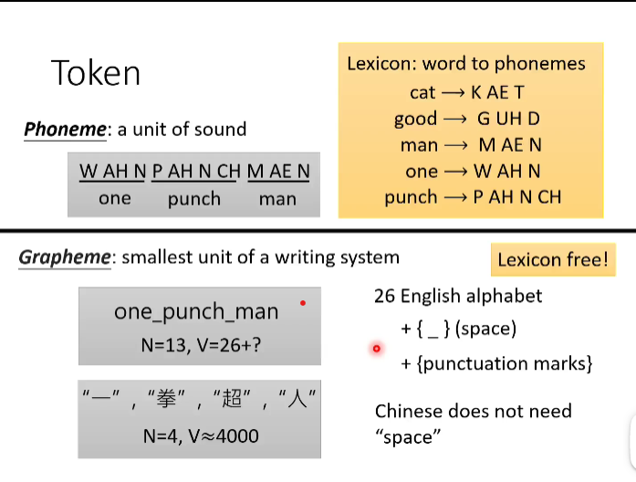

词汇word 作为token  ，一个词汇作为token，数据总量会非常大

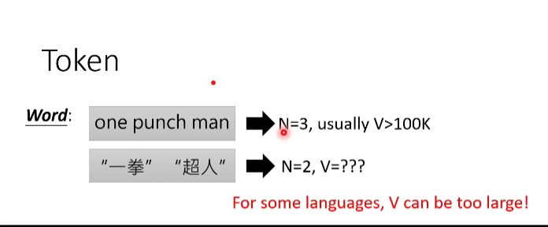

语素单元    morpheme   

例如字根，字首，比word小的单元

使用字节utf-8 作为token    

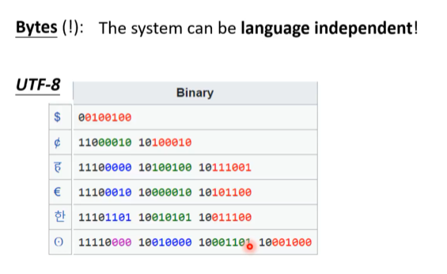

声学特征

25ms为一帧，采样率为16khz，采样点为400个，每10ms移动一次，1s的音频会有100帧

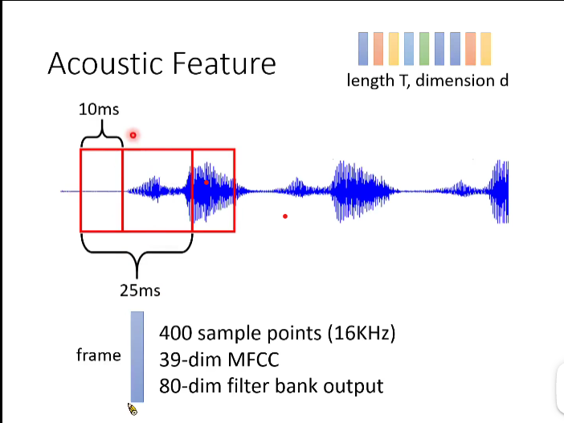

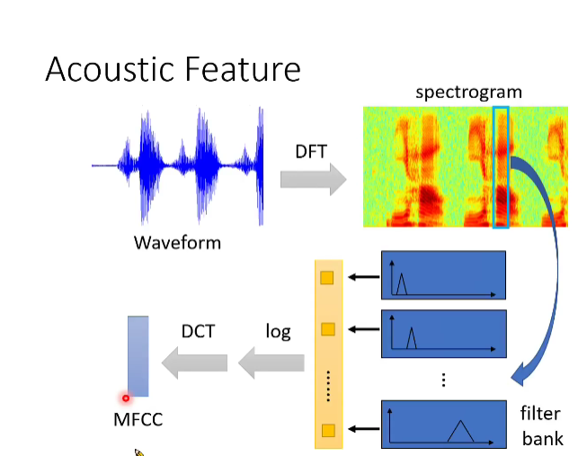

目前流行的语音识别模型

encoder阶段

一维的cnn用于提取语音浅层特征，高层使用rnn提取特征

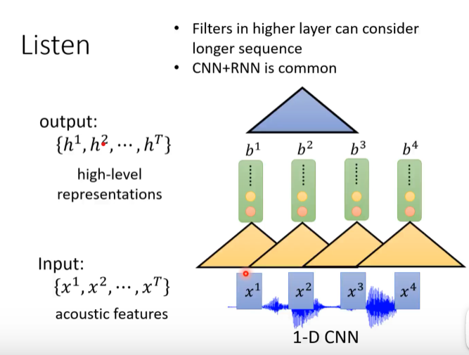

self-attention 模型

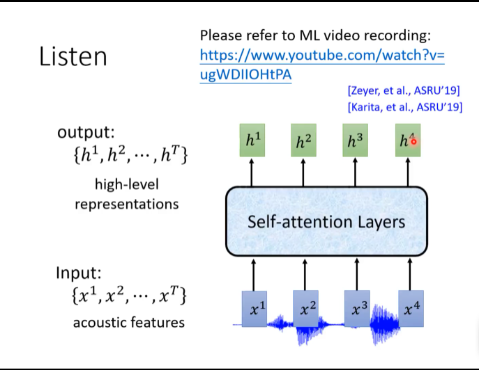

rnn下采样 节省计算量

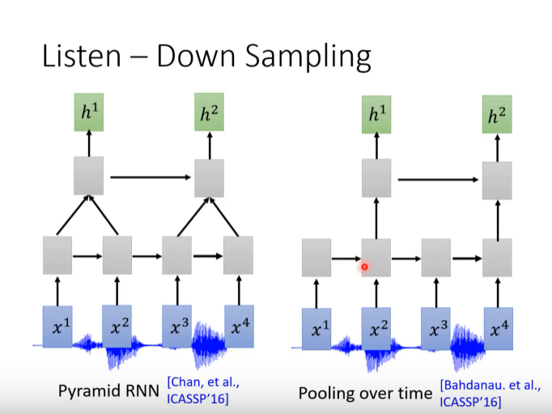

第一个类似于dilation cnn ，第二个减少长依赖

decoder阶段

如图所示，decoder阶段输出所有token的概率分布

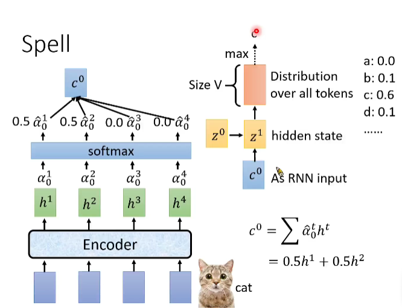

beam search 每次都保留B个最好的路径

greedy decoding 每次都选择最优的

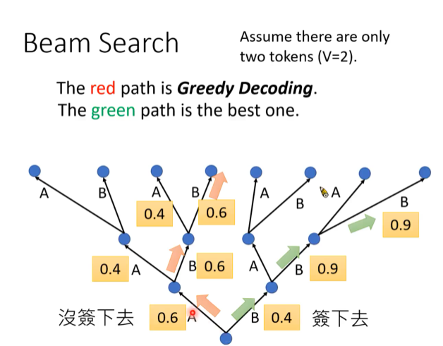

在翻译任务中，attention的应用可以捕获长远的依赖，因为可能解码的第一个词汇是由编码中的最后一个词汇产生，可能没有顺序性，因此需要attention这种机制

几种语音识别模型

listen attend and spell（LAS）

connectionist temporal classification (CTC)

CTC可以实现online speech recognition

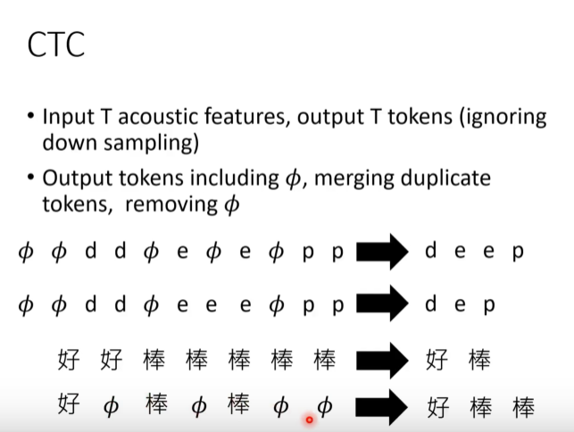

CTC 训练时的一个问题就是输出与label 无法一一对应

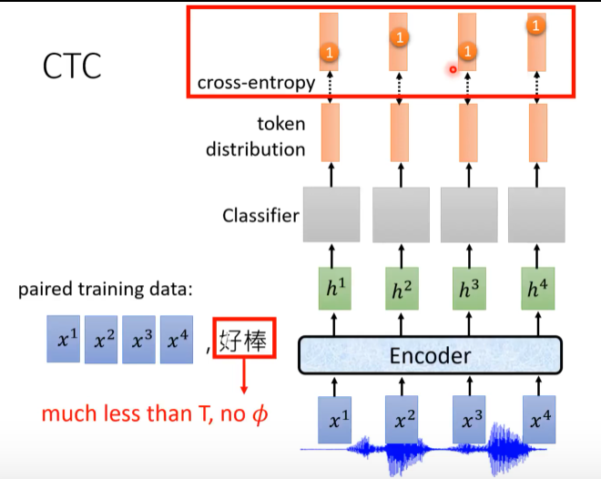

一个label结果其实可以对应无数种输出的结果

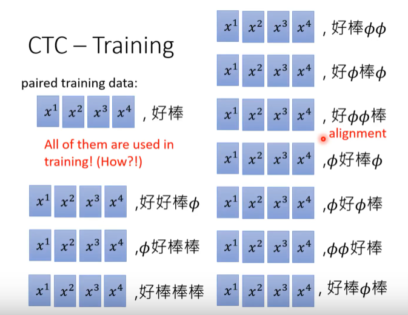

RNN Transducer (RNN-T)

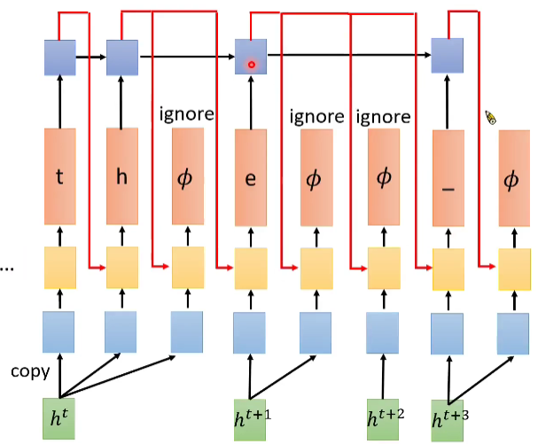

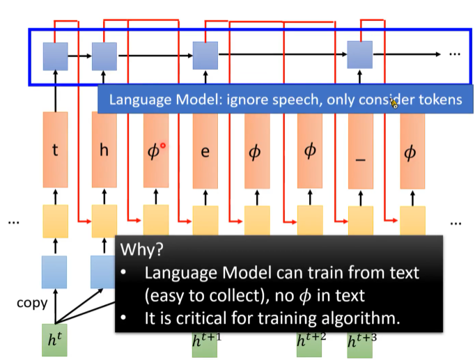

Neural Transducer

每次读一堆的acoustic feathure , 由attention 决定关注哪些feathure

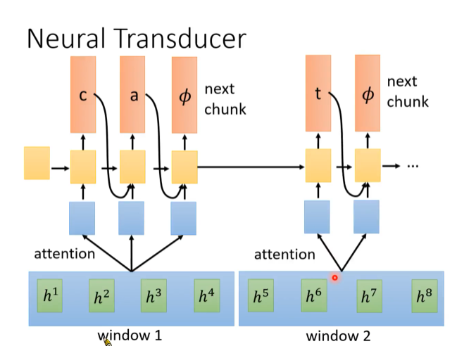

Monotonic Chunkwise Attention(MoChA)

dynamic shift window 

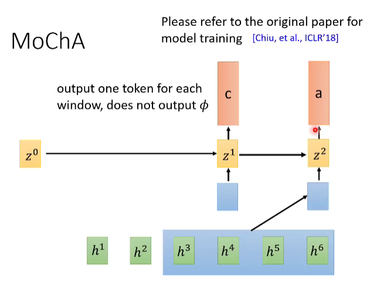

每次输入都判断是否在这个位置输出，否则继续输入直到确定输出结果，这种方式可以过滤输出间隔符

HMM模型 （Hidden Markov Model）

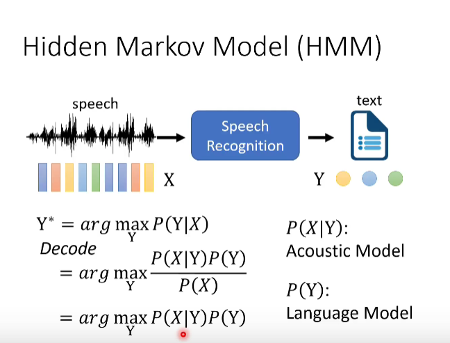

phoneme 是发音单元

tri-phone 表示将前后共三个发音单元组合

而state 表示更小的单元，每个tri-phone由三个state组成

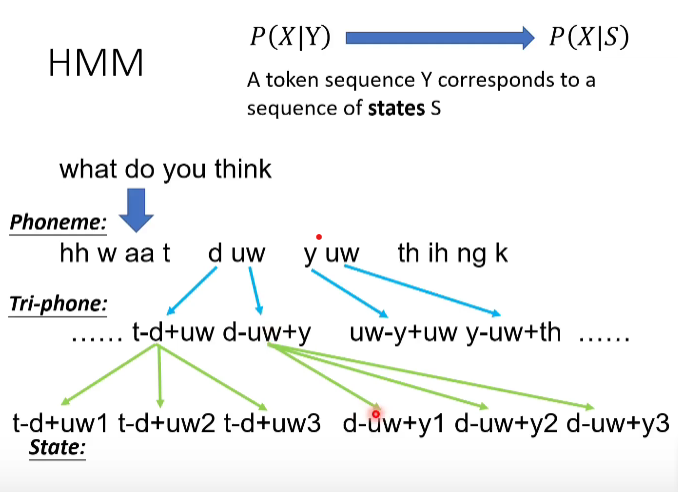

transition probability 

从state 跳到state 的概率

emission probability 

给定一个state,产生 acoustic x的概率有多大

从state 到 acoustic x 有一个固定的概率分布，使用GMM 模型表示

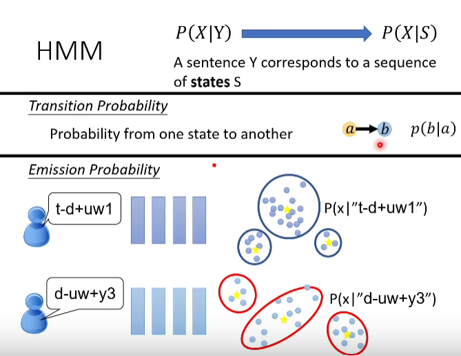

使用dnn产生更好的作用

a 指 state 单元，a产生x的概率可以根据

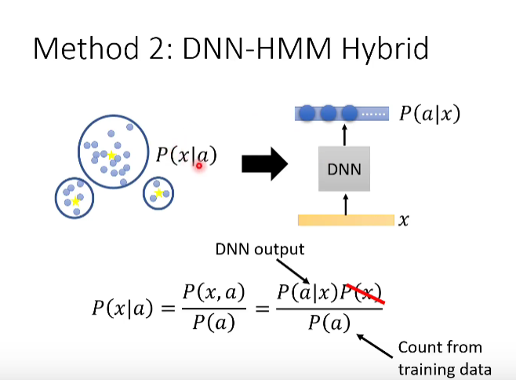

如何找到state 与 acoustic 之间的对应关系

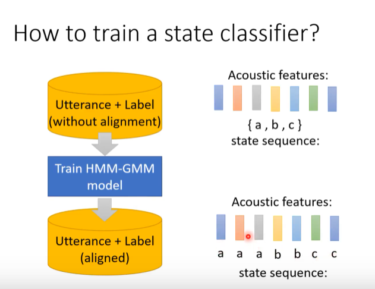

使用dnn 来训练state 与 acoustic之间的对应关系

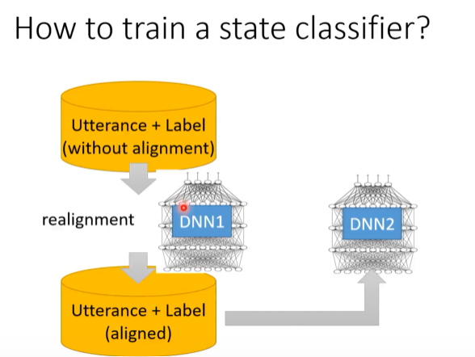

CTC，RNN-T 也需要alignment 对齐

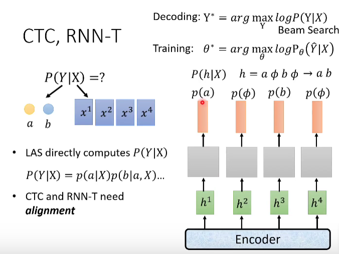

比较 HMM CTC RNN-T 的对齐方式

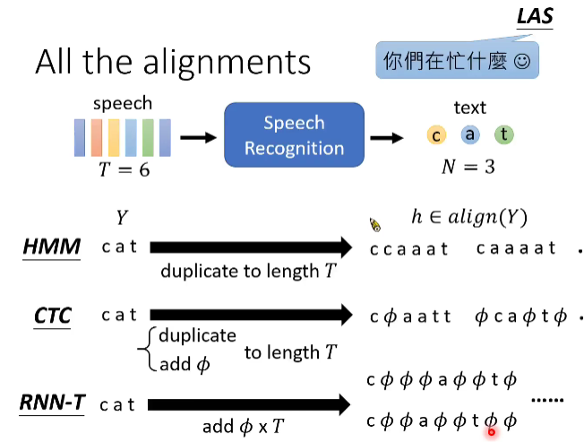

HMM 对齐

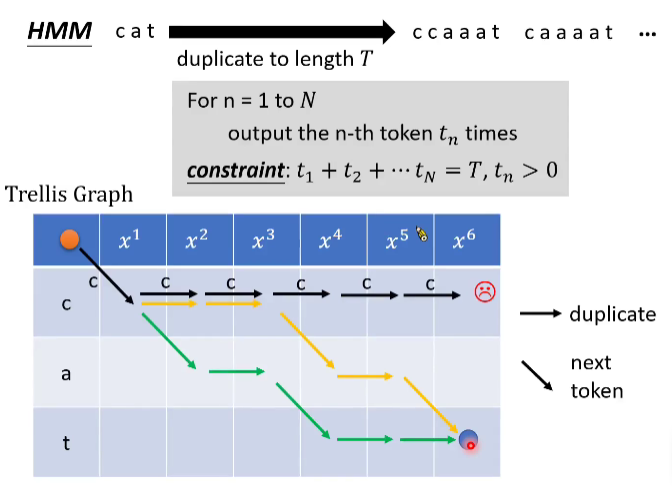

CTC 对齐

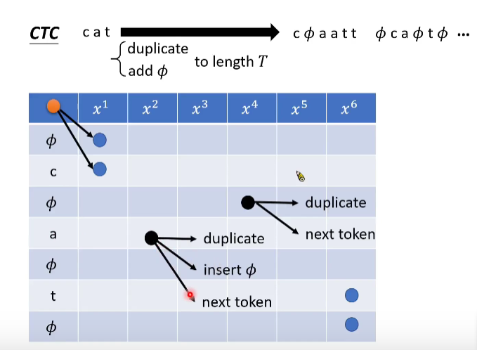

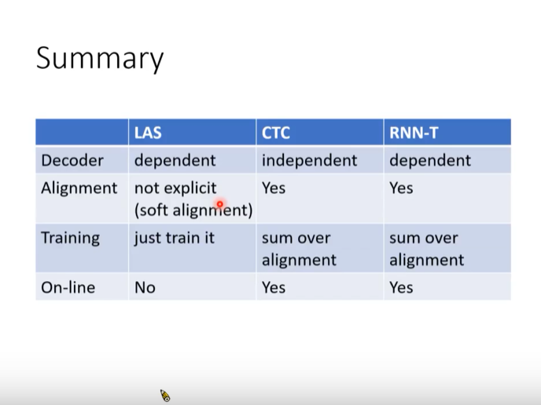