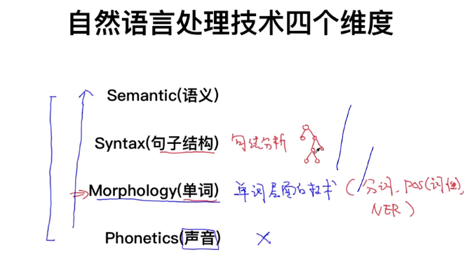

## 一、分词

分词工具介绍

### 前向最大匹配算法 (forward max matching)

定义max _len  = 5 

先选择max _len 个字符，依次减一判断剩下的字符串在不在词典中直到匹配，然后再次循环取max _len 个字符

### 后向匹配算法 （backward max matching）

### 考虑语义（incorporate semantic）

问题：复杂度很高，效率低

怎么解决效率的问题

#### 维特比算法

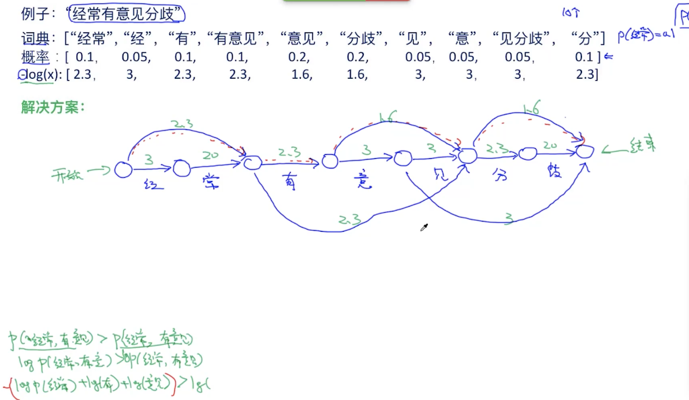

给定词典和词的概率，分词问题变为找路径问题，找概率乘积最大的路径，即找-log和 最小的路径

因此变成最小路径问题，动态规划

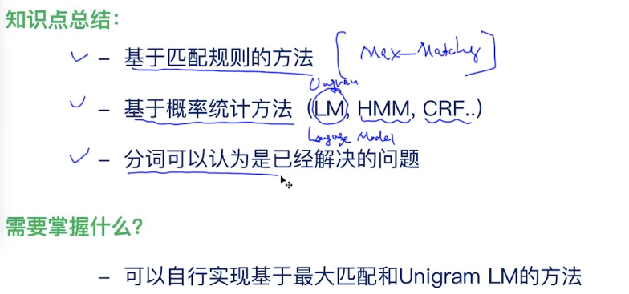

## spell correction 拼写错误纠正 

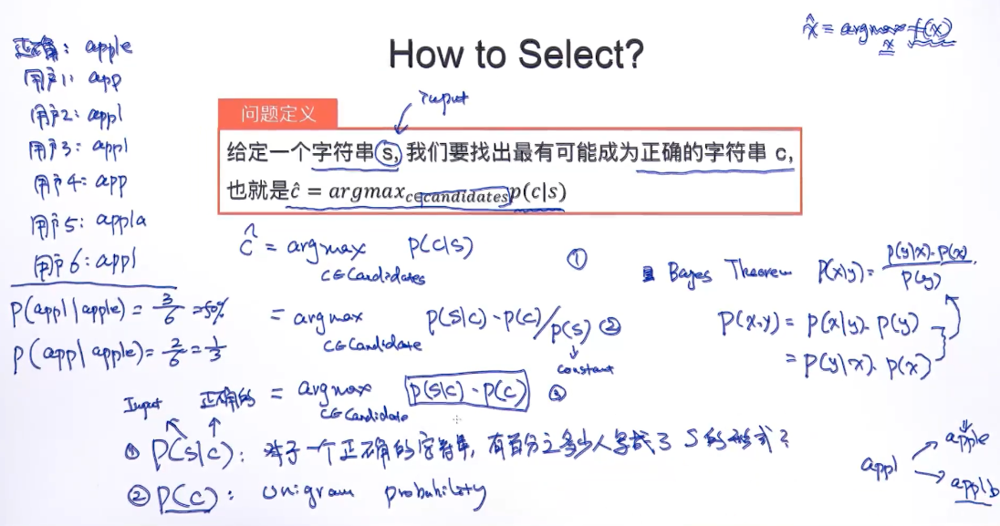

argmax p(c|s) 表示给定字符串，找到最可能的字符串c

根据贝叶斯公式 p(c|s) = p(s|c)*p(c)/p(s), s给定,p(s)固定，p(s|c) 表示用户把字符串c输入错为s的概率，可以通过历史统计得到，p(c) 表示c 出现的概率，unigram probabilty 可能根据文献，图书中出现的概率求得,因此，通过贝叶斯公式可以转化为可求得的方式

## Filtering words 词过滤

停用词过滤，出现频率低的词汇过滤

英文中 the an their 都可以作为停用词，但是可要考虑自己的应用场景

stemming ：one way to normalize

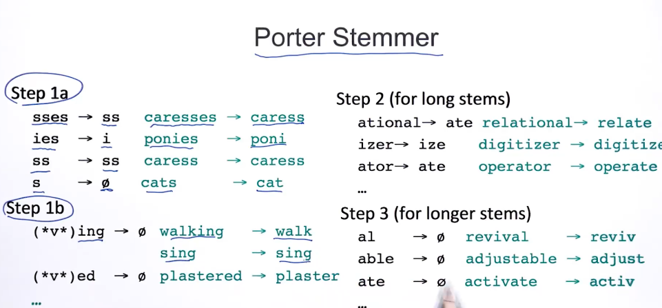

## word representation

one hot 向量表示，向量长度等于词典大小，词典里面为已分词的词

boolean 类型的one hot 表示

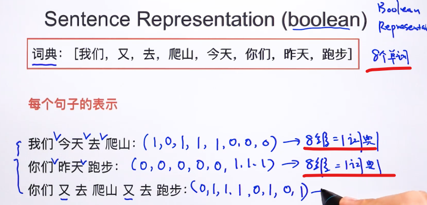

统计个数的one hot,考虑词频

### 文本相似度

欧式距离计算相似度

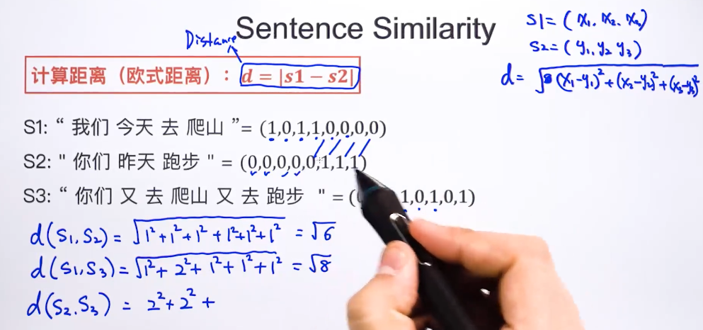

余弦相似度 cosine  similarity

one hot 向量表示缺点

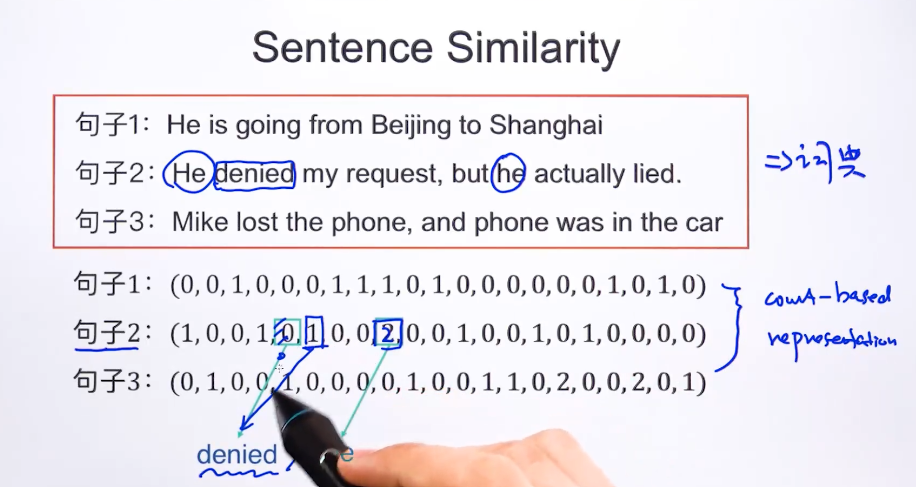

出现频次高的不一定最重要，因此one hot 表示有缺陷，在句子2中，denied 重要性最高，而 he 相对不重要，但是频次2 高于denied 的1

### tf-idf representation

tf(d,w) 表示当前词w的词频，idf(w)  表示词w的重要性，在N中出现的次数越少越重要，例如 he 可能在很多文档里都出现过，因此N/N(w) 会比较小，因此综合的tfidf(w) 不一定会很大

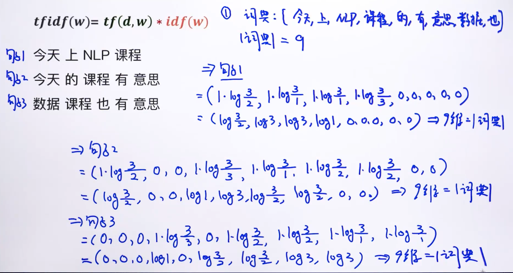

给三句话如何计算tfidf  

1.根据这三句话创建词典

2.N = 3，N(w)表示该词出现在几句话中

3.tf(d,w) 计算词频，计算idf(w) 

### measure similaritybetween words 词相似度

上面讨论的都是文本的相似度，如何表示词之间的相似度？ 

显然，one hot 表示的词向量中，计算词向量相似度中，欧式距离和余弦距离都失效了，词的相似度从语义相关的角度来考虑

由于词典数量很大，而one hot 表示的向量太sparsity 

#### from one-hot representation to distributed representation

 

分布式的表示方法向量的每个位置都是非0表示，同时向量的长度可自定义，不依赖词典的长度

通过分布式的词向量表示，因此可以计算词向量的相似度

### learn word embeddings 学习词向量

学习词向量的模型这里一般为深度学习模型

skip-grim,rnn mf,CBOW,Glove等可以训练词向量

训练词向量的流程，输入大量的句子到深度学习模型中，训练得到词向量

很多时候，大公司已经训练好了很多的词向量，直接拿过来用就行了，但是针对特殊领域，医疗，金融领域依然需要手动训练词向量

### essence of word embedding

词向量从某种意义上可以理解成为词的意思，meaning

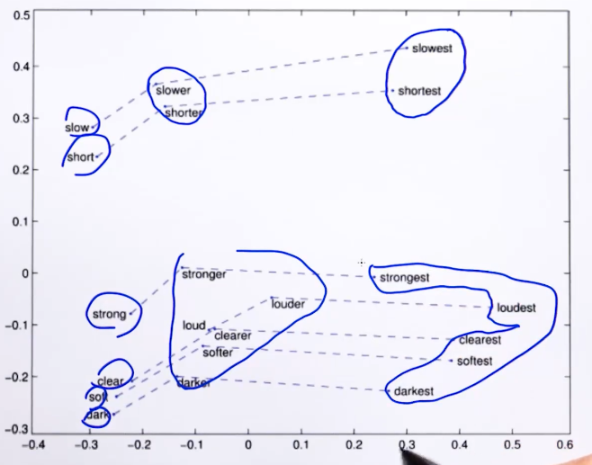

### from word embedding to sentence embedding

根据词向量如何得到句子的向量

1、平均法

 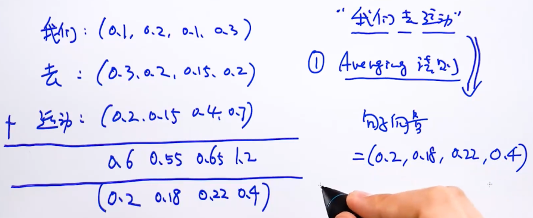

2、lstm  rnn 方法得到句子向量

### recap retrieval based QA system

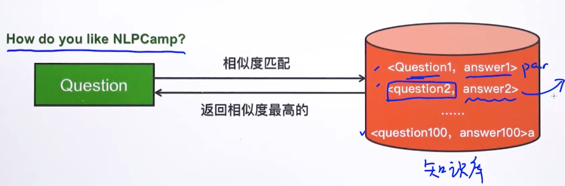

问答系统中，给出一个问题question，同时有一个知识库，知识库里面是问题和答案pair 的库，

问答系统的功能就是从知识库里面挑一个跟问题最相似的 问题答案pair,有N个pair，就有N个求相似度的过程，时间复杂度O(N) 

How to reduce time complexity 

核心思路 层次过滤思想

先过滤掉不可能的选项，再拿剩下的选项去做余弦相似度计算比对

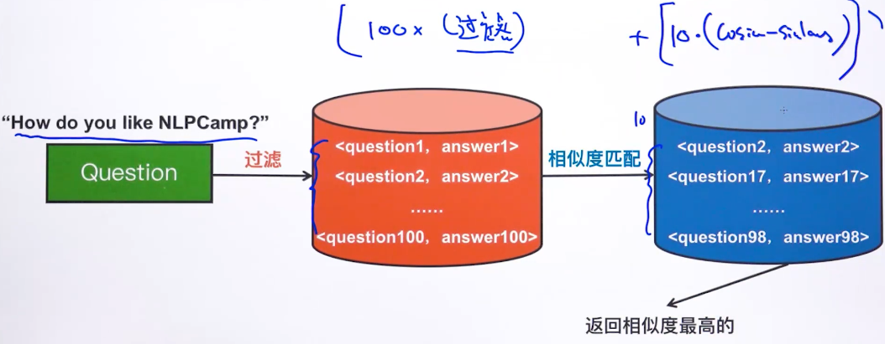

过滤可以极大低降低时间复杂度

#### introducing inverted index 倒排表

从搜索引擎来看，现在的做法是预先检索文档里面出现的所有词汇，根据词汇建立词汇与文档的索引关系，当用于输入一个词汇时，可以直接根据这个索引直接找到所有的相关的文档,**这种方法叫做倒排表**

回到QA，首先把question 分词，**根据预先建立好的索引**，然后从知识库的问题中过滤掉不包含question输入的，即过滤知识库的每一个问题中都没有输入的question中的词汇，剩下的问题都是可能相关的，通过这种方法可以极大地降低计算量

### Noisy channel model 

在机器翻译中，可以使用上述的表达式来表示，以英中翻译为例，根据贝叶斯公式，可以得到右侧的模型，p(英|中)表示的是中英的翻译模型，而p(中)表示的是中文的语言模型

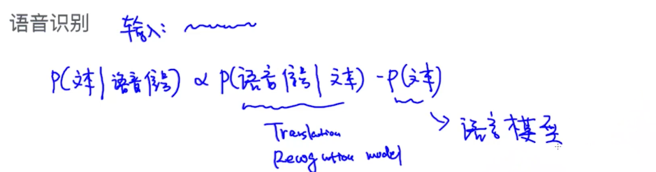

p(信号|文本)  识别模型

p(文本) 判断输出文本是合理的

### language model  （LM）

语言模型作用，用于判断一句话从语法上通顺

 

在翻译任务中，很可能得到的是右边的结果，因此需要用语言模型纠正成左边的结果

#### Chain rule 

联合概率的链式法则  ，当 A B C D 非条件独立时，可以使用上述的式子求出联合概率

同理，当求语言模型的概率时

#### markov assumption 马尔可夫假设

当要预测 **休息** 的概率时，已知的条件概率前提太长了，在文档中出现的概率很小，或者可能没有，因此，根据马尔库夫假设，可以将条件概率约等于 p(休息|都)，这是1st order assumption，或者p(休息|我们，都) 这是2st order assumption 等等，从而极大地简化计算

根据马尔可夫假设，可以在求语言模型时简化概率如下，

p(w1,w2,w3,...wn) = p(w1)p(w2|w1)P(w3|w2)P(w4|w3)...p(wn|wn-1)  一阶马尔可夫假设

还有二阶，或者三阶概率

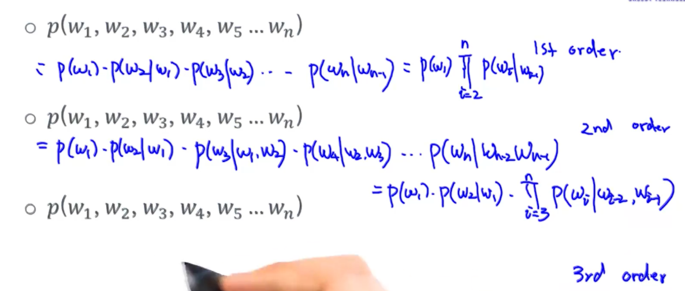

使用一阶 马尔可夫假设时，语言模型的计算过程如下

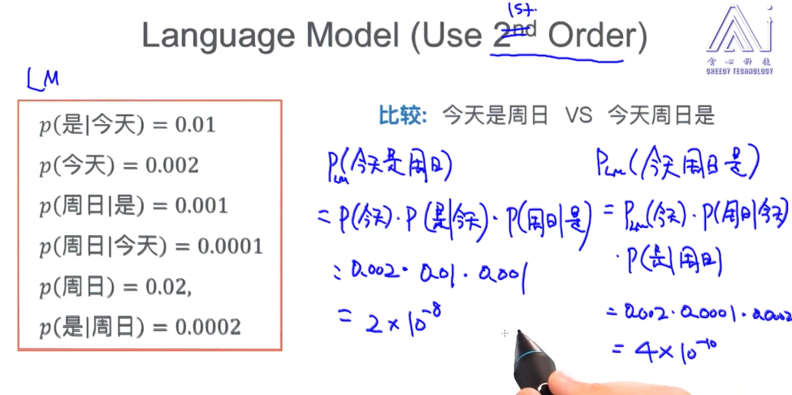

### language model : unigram

当认为变量条件独立时，即为unigram 模型

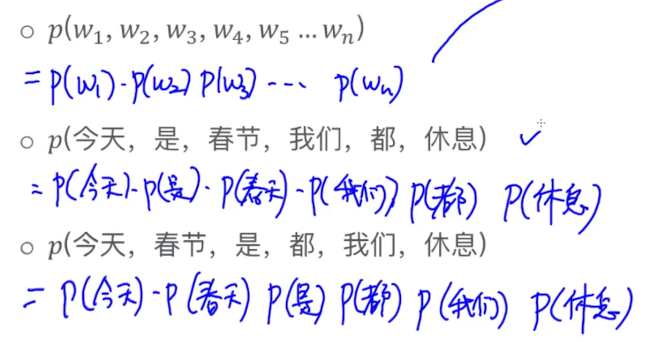

显然，在第二种情况和第三种情况下时，概率是相等的，但是语义没有考虑

### language model ：bigram   -> 1st order  markov assumption

一阶马尔可夫假设即是 bigram 

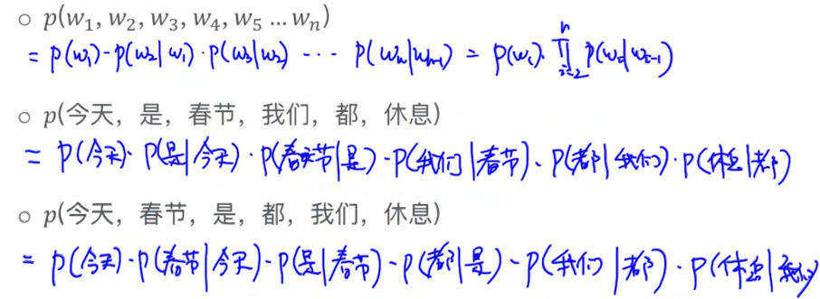

### language model : N-gram    N > 2 higher order

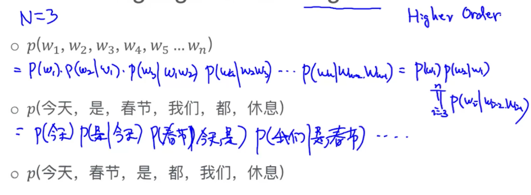

### unigram : estimating probability

如何计算单个词汇的概率 

统计法，统计某个词汇出现的次数，除以语料库中总的词汇量

 

当某些词汇并不在语料库中的时候，会采用平滑项，避免出现0的情况

### bigram : estimating probability

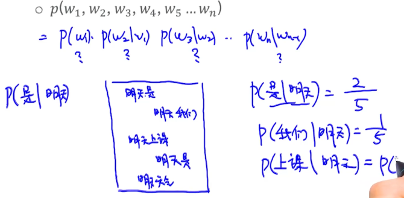

以例子中的条件为例，bigram 求条件概率时，统计文档中满足条件的概率

求p(w2| w1) 时，计算c(w2,w1)/c(w1), 出现的次数的比值即得到概率

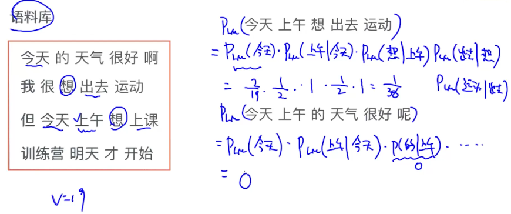

### N-gram : estimating probability

### evaluation of language model 

 perplexity = 2exp(-x)    x: average log likelihood

perplexity 越小越好

计算perplexity

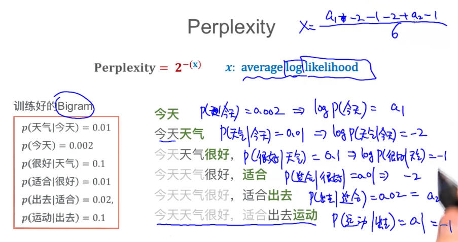

依次计算条件概率，即likelihood，然后取log，再取平均值，得到x,可求得perplexity

*<u>当语料库中没有某个出现的词汇时，会导致计算的概率为0，因此采用平滑的方法规避这种情况</u>*

### Smoothing

add-one smoothing

add-k smoothing

interpolation

good-turning smoothing

#### add-one smoothing (laplace smoothing)

通过加上平滑项  **1 和 V** ，避免出现概率为0 的情况

v 表示词典中的词汇的数量（去重）

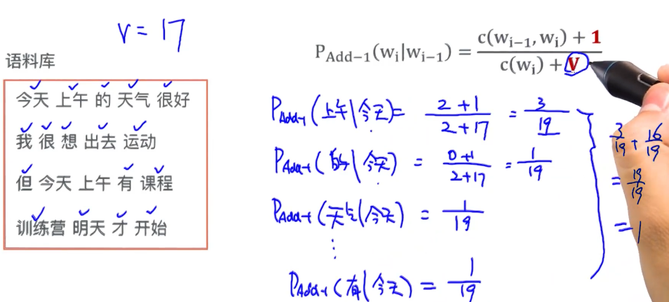

例如语料库中v=17,分别计算条件为<u>**今天**</u>时，其他词汇出现的概率

<u>今天</u>出现两次，今天上午 ，带入公式计算概率值

#### add-k smoothing ( laplace smoothing)

 

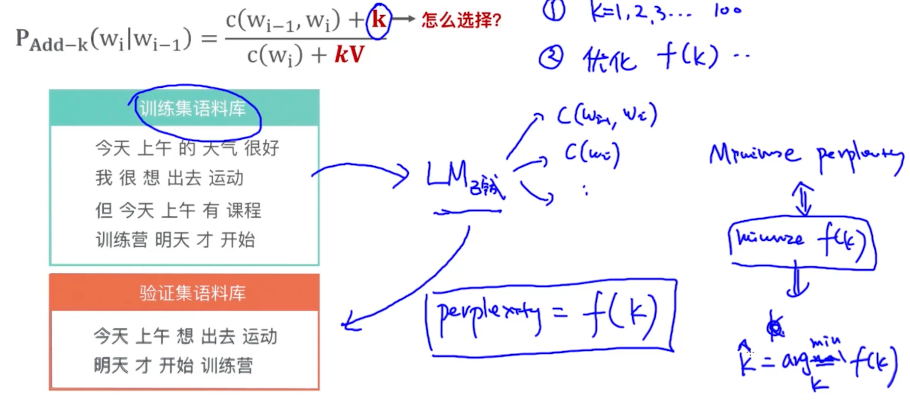

在训练数据集上训练好的模型，放在验证集上测试时，求的的perplexity 相当于k的函数，因此整个过程可以认为是k的最优化问题，使得perplexity最小

#### interpolation

核心思路：在计算trigram 概率时同时考虑unigram，bigram,trigram 出现的频次

解决方法是对 trigram bigram unigram 做加权平均 

# Learning

专家系统与基于概率的学习

专家系统基于规则

## 专家系统 expert system

## 

### 搭建知识图谱的work flow

1 金融专家 风控专家 生成经验

2 图谱工程师 根据专家经验生成图数据库

3 ai工程师 nlp工程师做推理层

4 提供api 接口

### 专家系统的特点

优点：

处理不确定性 

知识的表示

可解释性

可以做知识推理

缺点：

设计大量的规则 design lots of rules

需要领域专家指导 heavily reply on domain expert

可移植性差 limited transferability to other domain

学习能力差 inability to learn

人能考虑的范围有限  human capacity is limited

### 推理引擎

#### problems to consider

逻辑推理 logical inference

解决规则冲突  conflict resolution 

选择最小规则子集

## 基于概率的系统 probabilistic

## 

categorization of ml algorithms

 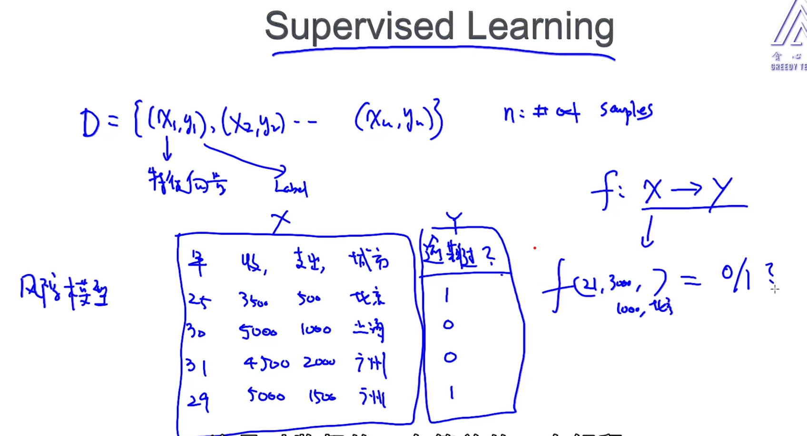

监督学习，给定x,y 学习x到y的映射

## working pipeline of constructing models

数据->清洗-> 特征工程 -> 建模

## naive bayes 朴素贝叶斯

#### 如何分类垃圾邮件和正常邮件

统计正常邮件中 “购买”，“物品”，“广告” 词汇出现的概率

先验（prior infotmation）： 垃圾邮件和正常邮件的概率

贝叶斯定律：

$p(x|y) = \frac{p(y|x)*p(x)}{p(y)}$

条件独立：conditional independence

$p(xy) = p(x)*p(y)$

根据贝叶斯定律

p(正常|内容) = p(内容|正常) * p(正常) /p(内容)

p(垃圾|内容) = p(内容|垃圾) * p(垃圾) /p(内容)

由先验已知，p(正常) 和 p(垃圾) 是已知的，因此知道 p(内容|正常)   和 p(内容|垃圾) 即可判断是否为垃圾邮件

 p(内容|正常)    近似表示为p(购买，物品，不是，广告 | 正常)，

由条件独立，p(购买，物品，不是，广告 | 正常) = p(购买|正常) * p(物品|正常) *  p(不是|正常)  * p(广告 |正常)  

 p(内容|垃圾)    近似表示为p(购买，物品，不是，广告 | 垃圾)

由条件独立，p(购买，物品，不是，广告 | 垃圾) = p(购买|垃圾) * p(物品|垃圾) *  p(不是|垃圾)  * p(广告 |垃圾)  

分别计算正常邮件中和垃圾邮件中上述词汇出现的概率即可

给定词库V，分别计算正常邮件和垃圾邮件中的词汇出现的概率，然后进行比较得出是否为垃圾邮件

## 词性标注问题实战

给定标注好词性的数据集，然后给出新的一句话，判断新的句子的词性

句子s 由若干个词汇w 组成，已知w 词汇的词性用z表示

给定新的句子s',有若干词汇w', 判断 w'的词性

根据贝叶斯公式，可以转换为求给定词性z，求最可能的句子s

由隐马尔可夫链以及独立假设，上述的公式可以转化为如下，

显然，给定数据集，可以统计 A B pi 的统计概率，

A 给定词性，求在某种词性下的词汇出现的概率

B 词性出现的概率

pi 状态转移矩阵，计算词性与词性的转移矩阵

### 维特比算法求解

给定一句话 单词为w1,w2,...wt  ,词性一共有z1,z2,z3...zn种

目的是找到一条最优的路径

# NER 命名实体识别

## NER 的三种主要方法

### rule based approach

### majority voting 投票模型

统计每个单词的实体类型，记录针对于每个单词，概率最大的实体类型

### simple feature engineering for supervised learning

特征工程-》特征向量-》模型训练-》分类

the professor **Colin** proposed a model for NER in 1999

#### 1.bag of word features

可提取的特征：当前词，前后词，前前、后后词，bigram，trigram

Colin,professor,proposed ,the,a,professor Colin...

#### 2.词性 feature

当前词，前后词，前前、后后词

名词，动词，冠词...

#### 3.前缀，后缀，

pro,or,ed...

#### 4.当前词的特性

词长，大写字母，开头，是否包含‘’-'',是否包含数字，

#### 5.steming

## feature encoding

常见特征种类

1 .分类型特征，男女，地名      one hot

2.连续特征，身高，温度，    

直接用，或者离散化，

3.ordinal feature 

直接使用，或者当作分类型特征使用

# Relation Extraction

## rule-based method  基于规则的方法

### extracting "is a" 

给规则集加上实体限定，可以提升抽取的准确率，

只返回想要的结果

比如，在 x such as y 中，给 x 加上限定fruit

优点：准确，不需要训练数据

缺点：低召回率，高人力成本，规则本身难以设计

## 基于监督学习的方法 supervised learning for relation extraction

1,定义关系类型

2.定义实体类型

3.训练数据准备

特征工程

提取的特征包括，词性，实体，实体类别，ngram,等

位置相关信息，两个实体之间包含多少单词，这句话在本文的位置

句法分析相关特征 ： 语法树中两个节点之间的最短路径，

依存文法相关，

依据上述的特征后，训练分类模型

## Bootstrap 算法

1，生成规则，pattern

x 写了 y ,y 是由 x 写的，。。。等

创建规则库

2.生成tuple/record 元组

扫描文档，根据规则找到匹配规则的句子

bootstrap 缺点：错误累积，精准匹配

## snowball 算法

样例： 公司 -- 地点

从实体识别得到 公司ORG  LOC 

给出一个seed  tuple 

step1 ：生成规则

pattern representation 

将一句话分为5个tuple，其中两个实体 ORG LOC ，其他三个称为left,mid,right, 将left,mid，right 分别转换为向量的形式

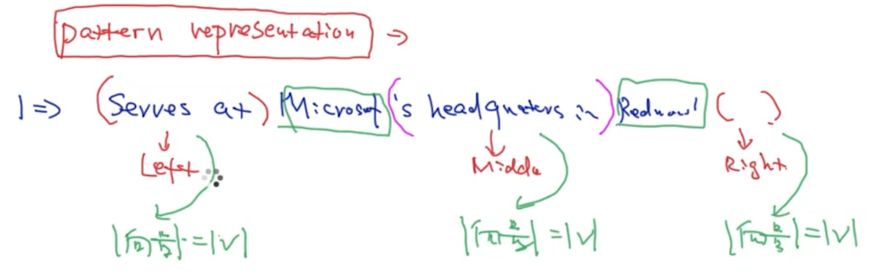

这5个tuple 成为规则

规则1： P=<L1,T1,M,T2,R>

规则1： S=<L2,T1',M2,T2',R2>

计算 规则 P 和 S 相似度sin(P,S) = u1 * L1*L2 + u2 * M1*M2 + u3 * R*R2,    u1=u3 =0.2,u2=0.6

生成模板，然后计算相似度，合并近似的模板

计算模板相似度的方法，聚类方法，kmeans,spectral cluster...

step2: 生成tuple 

根据生成的规则库，从文章里面挖掘匹配规则的句子，搜集起来，生成tuple

step3 : pattern evaluation + 过滤

step4: tuple evaluation + 过滤

# Hidden Markov

抛出问题1
有两种硬币，A B ，小明每次扔的硬币是哪一种不知道，硬币的正反概率也不知道，但是能看到小明扔的硬币的正反，即观测结果

问题一：根据参数，小明扔硬币的顺序 也称为**inference/decoding 问题**

问题二：根据观测的结果，评估小明扔硬币的概率以及转移矩阵，也成为**参数估计问题**

问题三：小明扔出的硬币的顺序的概率是多少  

问题2
part of speech tagging (pos) 词性标注问题

给定一句话 ，单词已知 w1,w2,w3,w4,.....wn，词性不知道，词性的转移概率也不知，观测结果是单词

问题一：词性标注，sequence of taggings  **inference/decoding 问题**，维特比算法

问题二：参数估计问题，给出单词序列，估计 在某种词性下单词出现的概率，以及词性之间的转移概率，以及单词出现在开头的概率

问题三：单词序列概率，DP 算法

问题3

语音识别问题

## HMM 参数

三种参数 A 状态转移概率（非随机），B 发射概率（生成概率，观测概率），  pi  起始概率

## HMM 中的inference 问题 已知参数

给定 A,B,PI，根据观测现象，找到最合适的隐藏状态z(z 有多个状态)

假设z 有三种状态abc，则可能的状态顺序会有很多种，以硬币问题来说，状态意味着可能是某一种硬币，A 是状态的转移概率，以硬币问题为例，即投了硬币a,后，投了硬币b的概率，B 是在某种状态下发生事件的概率，以硬币问题为例，即硬币正反的概率

显然，要找到最可能的状态z,可以把所有可能的状态全部算一遍，已知A B PI, 将各个状态都带入概率计算

### 维特比算法 viterbi

**前提假设，HMM 时序模型状态只跟前后状态有联系**

在时间序列k 时刻，在状态i的最好路径定义为 $\delta_{k}(i)$

显然，在k-1时刻可能处于m个状态,因此要遍历m个状态找到最可能的

因此动态规划公式表示如下,i 取值范围 1~m,  复杂度 mn

$\delta_{k+1}(j) = max_{i = 1-m}{(\delta_{k}(i) + log p(z_{k+1}=j|z_{k}=i) + log p(x_{k+1}|z_{k+1}=j))} $

## HMM 中参数估计

forward and backward 算法

给定观测值，计算某个状态的可能性概率是多少$p(z_{k}|x)$, x是观测值，zk是可能的状态

forward 算法，计算$p(z_{k},x_{1:k})$ 联合概率

backward 算法，计算$p(x_{k+1:n}|z_{k})$ 

$p(z_{k}|x) = p(z_{k},x)/p(x) \propto p(z_{k},x)$

假设条件独立，$p(z_{k}|x) = p(x_{k+1:n} | z_{k},x_{1:k}) * p(z_{k},x_{1:k})$, $p(x_{k+1:n})$ 跟$p(x_{1:k})$ 条件独立

$p(z_{k},x) = p(x_{k+1:n}|z_{k}) * p(z_{k},x_{1:k})$

正好组合成forward 和 backward 算法

### Forward algorithm

动态规划的思路

### Backward algorithm

# latent variable model and EM 隐变量模型和EM 算法

## Data representation

## latent variable model

Generative vs Discriminative Model 生成模型和判别模型

数学方式    p(x,y)     vs    p(y|x)

# Log Linear Model 

1 logistic regression

2 conditional random field

