# NLP

### 一、ASR基础知识

#### token 是什么  

**发音单元 phoneme**           每一个词汇都对应相应的发音单元  

需要词典来对应，跟声音信号关系比较明确，

**书写单元 grapheme**         中英文不同，英文指字母，中文指汉字

同样发音可能对应不同的汉字，因此需要上下文一起来识别， 

**词汇word 作为token**  ，一个词汇作为token，数据总量会非常大

**语素单元    morpheme**   

例如字根，字首，比word小的单元

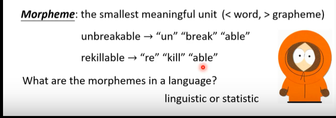

**使用字节utf-8 作为token**    

#### 声学特征

25ms为一帧，采样率为16khz，采样点为400个，每10ms移动一次，1s的音频会有100帧

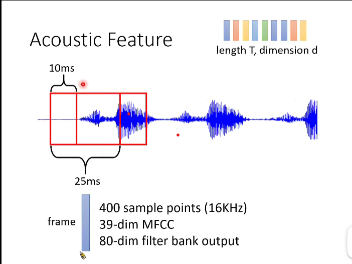

目前流行的语音识别模型

encoder阶段

一维的cnn用于提取语音浅层特征，高层使用rnn提取特征

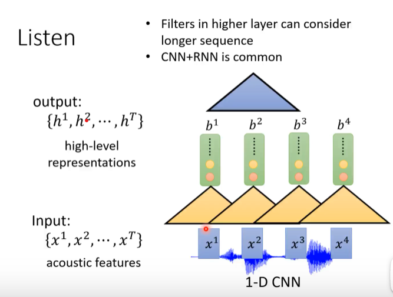

self-attention 模型

rnn下采样 节省计算量

truncated self attention 

attention 只关注前几帧的特征

#### attention

下图是dot product attention 

h 和z  相乘，计算出的是相似度

decoder阶段 

如图所示，decoder阶段输出所有token的概率分布

c 是context vector 承上启下作用，从encoder 得到，然后再跟decoder 计算，$\alpha$ 就是attention 

#### 解码

beam search 每次都保留B个最好的路径

greedy decoding 每次都选择最优的，但是最终结果不是最优的

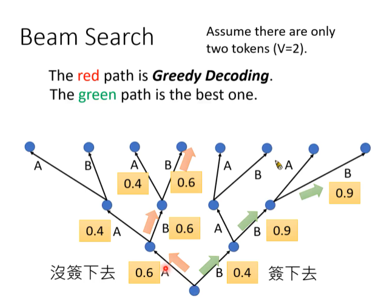

#### training

以CE loss 为例，通过计算预测值和 真实label one hot 向量的loss 反向传播

attention 虽然能捕获长的依赖，但是关注的重点可能不在当前帧的附近，存在乱跳的情况，因此应该重点关注 当前帧附近的，

下文的location aware attention 即为了解决这种情况

LAS 缺点： 不能实现online 在线语音识别

#### CTC

CTC可以实现online speech recognition

CTC 训练时的一个问题就是输出与label 无法一一对应

一个label结果其实可以对应无数种输出的结果

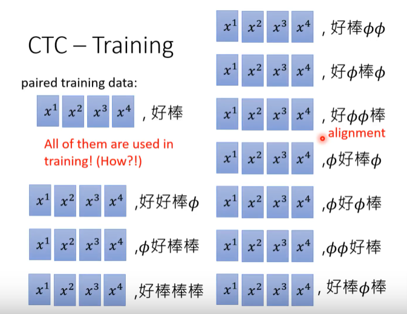

RNA  一帧特征 输出一个字符，需要历史的输入

RNN Transducer (RNN-T)

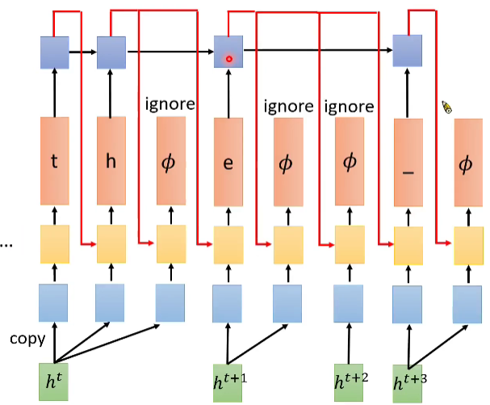

Neural Transducer

每次读一堆的acoustic feathure , 由attention 决定关注哪些feathure

Monotonic Chunkwise Attention(MoChA)

dynamic shift window 

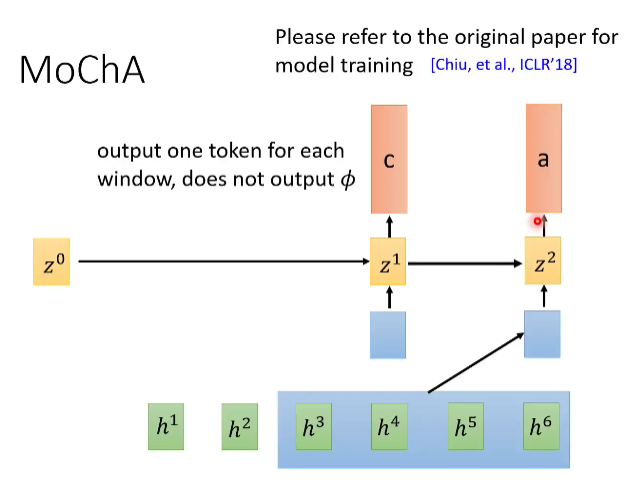

每次输入都判断是否在这个位置输出，否则继续输入直到确定输出结果，这种方式可以过滤输出间隔符

#### HMM模型 （Hidden Markov Model）

**phoneme 是发音单元**

**而state 表示更小的单元，每个tri-phone由三个state组成，**state 是比phoneme 更小的单元

transition probability  转移概率

从state 跳到state 的概率

emission probability 

给定一个state,产生 acoustic x的概率有多大

从state 到 acoustic x 有一个固定的概率分布，使用GMM 模型表示

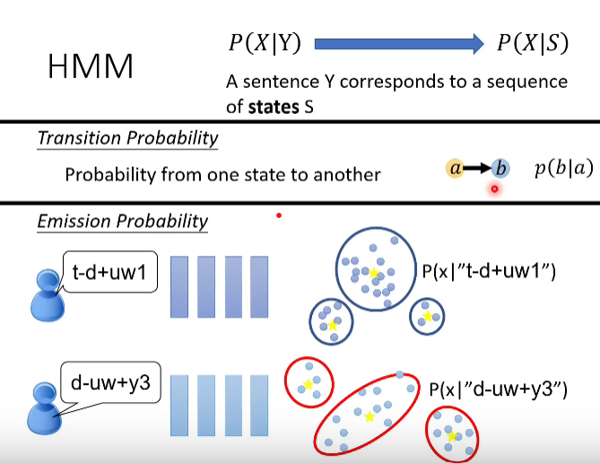

如何对齐

显然，state 跟acoustic 是不等长的，因此需要对齐操作，hmm 中简单的将state 进行复制，从而跟acoustic 长度进行对齐，如何计算呢，**实际上就是穷取所有的对齐方式**，使用动态规划简化计算

如何使用dnn 进行语音识别

上文使用dnn 对acoustic 进行分类，输出每一帧acoustic 属于某一个state 的概率

之前的方案，对于每一个state 都有一个GMM, 输出概率的功能使用dnn 替代，所有的state 共用同一个dnn，

如何找到state 与 acoustic 之间的对应关系

先使用HMM GMM model 训练一个对齐model，根据这个model ，找到state 与 acoustic 之间的对应关系，即alignment

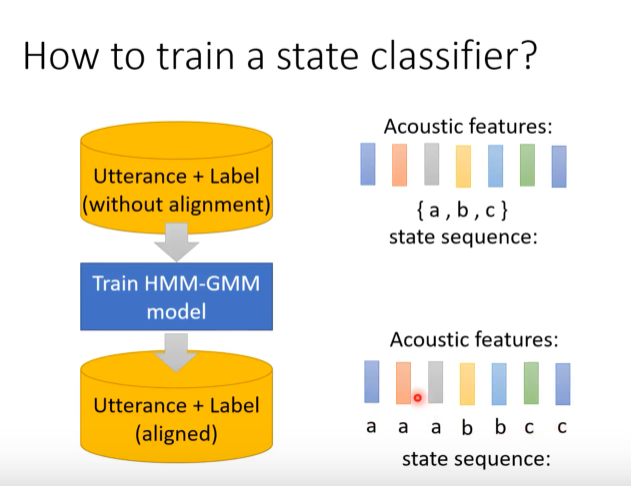

根据上一步的alignment ，可以使用dnn 来训练state 与 acoustic之间的对应关系

#### **end to end model**

LAS

训练网络使得网络学习到给定 X, 输出最大的 Y

CTC，RNN-T 也需要alignment 对齐

给定X,输出Y 的概率，就是将所有的alignment 方式的概率加在一起

比较 HMM CTC RNN-T 的对齐方式

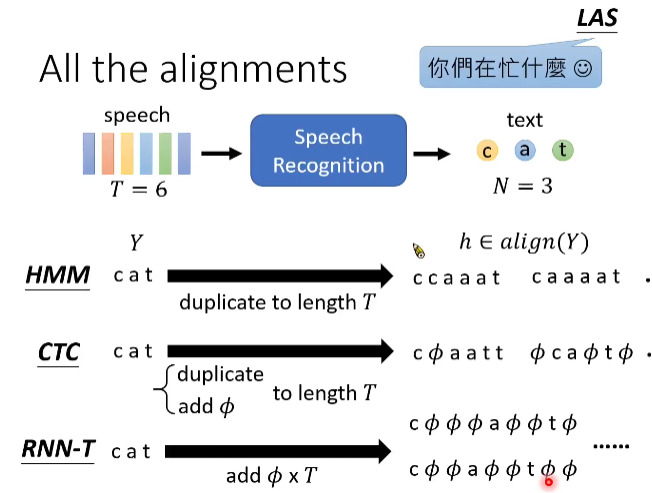

HMM 对齐

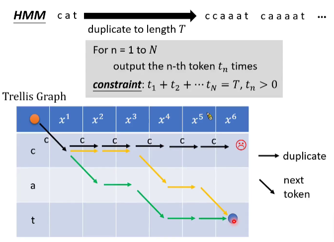

CTC 对齐

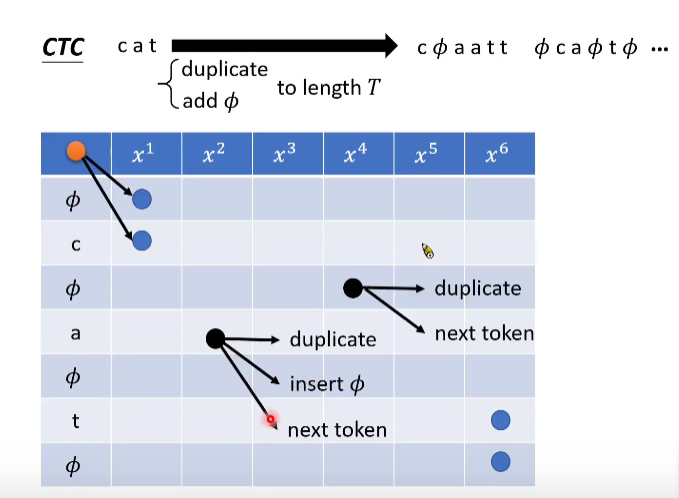

rnnt alignment

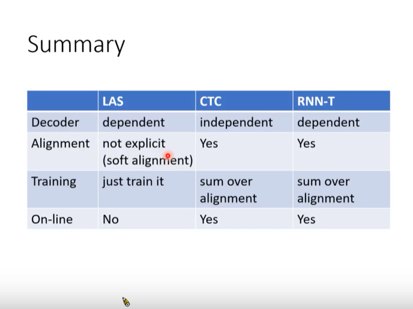

如何计算所有的alignment 的概率之和

rnnt 的梯度计算

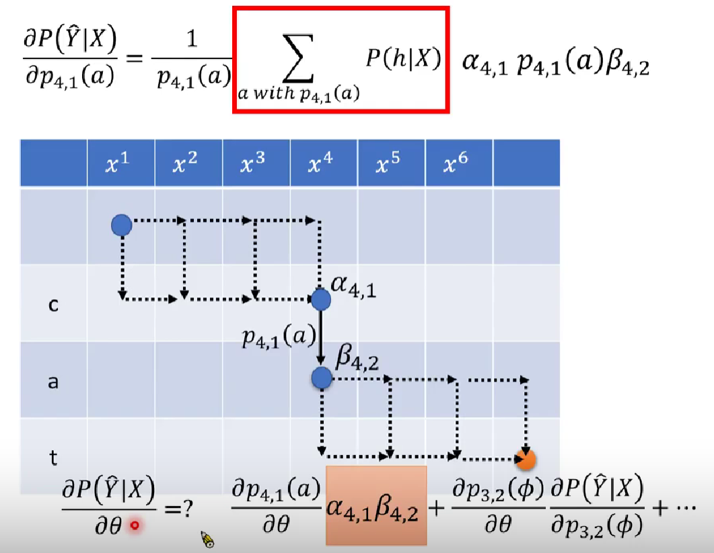

language model

在HMM 阶段，需要language model 

但是在dnn 方式，好像不需要language，因为网络会自主学习最优的后验概率，但是在model 中加入language 会让网络性能更好

一般情况，搜集Y的数据是容易的，即语言模型学习容易，很容易得到预料去训练P(Y)，但是训练P(Y|X)是不容易的，因为需要成对的语料，依赖标注，对齐

什么是ngram language model

challenge of ngram

rnn based language model

language model  如何结合acoustic model

shallow fusion

直接在输出的位置跟language 相加 或 相乘 再输出

deep fusion

就是联合language model 一起训练，训练之后language 就不可以更换了，如果domain 换了，需要重新训练

下面的改进可以不用重新训练整个model，即可替换language model 、

deep fusion 

language model acoustic model 已经训好了，然后接在一起训

cold fusion 

从头一起训

### 二、voice conversion

## 二、论文解析

### 2.1 neural machine translation by jointly learning to align and translate

摘要：

近年来，基于神经网络的机器翻译模型经常被用来处理机器翻译任务。与传统基于统计的翻译方法相比，神经机器翻译模型意在构建单个神经网络模型来提升整体翻译准确率，主要的模型架构基本都是seq2seq家族的。在本论文中，作者认为该模型的瓶颈主要在于中间转换的固定纬度大小的向量。因此，作者提出了一种新的解码方式，其解码的源头并不仅仅包括该向量，**他们希望构建一种为当前预测词从输入序列中自动搜寻相关部分的机制（soft-search，也就是注意力机制）。**作者运用这种新的机制来搭建升级版的神经机器翻译模型，取得了卓越的效果，并且也通过定量分析来证明这种注意力机制的合理性。

注意力机制：

潜在的问题就是，在编码输入序列时，该模型框架需要压缩（compress）所有的信息在一个固定长度的向量中（虽然这个向量的长度其实也是可以变化的），这就会让该模型在面对长句的时候显得十分无力（seq2seq论文中的图也表明当大于35个字的时候，模型的表现直线下降），而且随着序列的增长，句子越前面的词的信息就会丢失的越厉害，虽然有几个小trick来解决这些问题，比如倒序输入句子一遍，或者重复输入两遍，或者使用LSTM模型。但这些都治标不治本，对模型的提升微乎其微，因为在解码时，当前预测词对应的输入词的上下文信息，位置信息等基本都已丢失。

为了解决这个问题，才引入了注意力机制，该机制的本质其实就是引入了当前预测词对应输入词的上下文信息以及位置信息。或者用论文中比较易懂的说法就是，我们现在这个模型不再是傻乎乎的把输入序列编码为一个固定向量，再去解码这个固定向量；我们现在的解码本质上是自动从这个固定向量中抽取有用的信息来解码我的当前词。

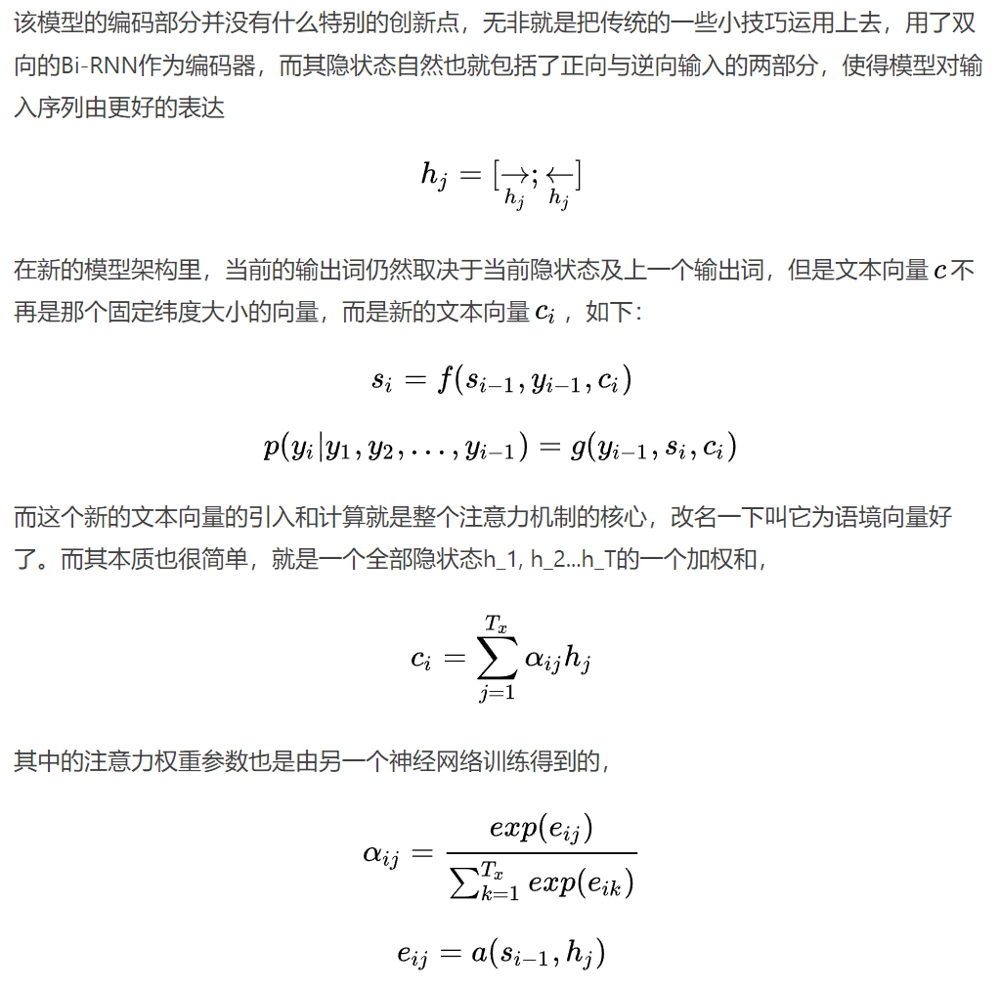

### **2.2 Attention-Based Models for Speech Recognition**

摘要：

attention模型已经在机器翻译，手写文字合成，图像描述任务中表现出优异性能。本文把attention模型扩展到语音识别任务上。直接用机器翻译中的attention模型来做语音识别也有不错的效果，但是只适用于与训练集中utterances(单词和一些非语言学声音构成)长度相当的情况。文中对出现这种现象的原因做了定性分析，并提出一个在attention机制中加入location-awareness的方法来缓和这个问题。最后，对attention机制做了修改以防止它过于集中在单帧上，进一步提升了性能。

problems:

语音识别的过程可以看作将给定的序列(语音)转换为另一个序列，从这个角度来看，语音识别与机器翻译任务和手写字体合成任务相似，都很适合用attention模型。但是，与机器翻译相比，**语音识别的输入序列要长的多(几千帧，而机翻是几十个词)，这给语音识别带来了非常大的挑战(很难区分相似的语音片段)**；与手写文字识别相比，**语音序列的噪声非常大**，并且没有清晰的结构。基于这两个原因，语音识别任务是一个很好的实验平台，用于开发一种能处理带噪声和较长的输入序列的attenion模型。

