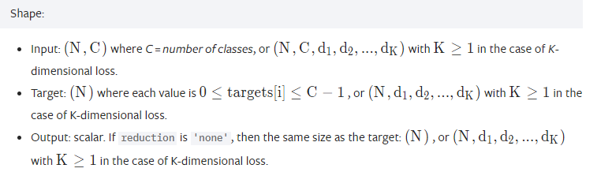
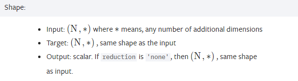
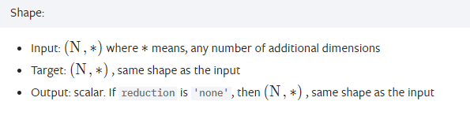
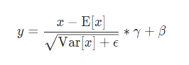

# 基础知识

### 损失函数

#### pytorch中交叉熵损失(nn.CrossEntropyLoss())的计算过程详解

```python
## 一维计算
import torch
import torch.nn as nn
import math

criterion = nn.CrossEntropyLoss()
output = torch.randn(1, 5, requires_grad=True)
label = torch.empty(1, dtype=torch.long).random_(5)
loss = criterion(output, label)

print("网络输出为5类:")
print(output)
print("要计算label的类别:")
print(label)
print("计算loss的结果:")
print(loss)

first = 0
for i in range(1):
  first = -output[i][label[i]]
second = 0
for i in range(1):
  for j in range(5):
    second += math.exp(output[i][j])
res = 0
res = (first + math.log(second))
print("自己的计算结果：")
print(res)

##多维计算
import torch
import torch.nn as nn
import math
criterion = nn.CrossEntropyLoss()
output = torch.randn(3, 5, requires_grad=True)
label = torch.empty(3, dtype=torch.long).random_(5)
loss = criterion(output, label)

print("网络输出为3个5类:")
print(output)
print("要计算loss的类别:")
print(label)
print("计算loss的结果:")
print(loss)

first = [0, 0, 0]
for i in range(3):
  first[i] = -output[i][label[i]]
second = [0, 0, 0]
for i in range(3):
  for j in range(5):
    second[i] += math.exp(output[i][j])
res = 0
for i in range(3):
  res += (first[i] + math.log(second[i]))
print("自己的计算结果：")
print(res/3)


```

##### 交叉熵的计算

$$
C = - \sum_{i}{y_i lna_i}
$$

nn.CrossEntropyLoss() 包含了`nn.LogSoftmax()` and `nn.NLLLoss()` in one single class.

This criterion expects a class index in the range[0,C−1] as the target for each value of a 1D tensor of size minibatch;  这里期待放入**的是类别的索引**



注意输入与输出的维度


CrossEntropyLoss计算公式为：
$$
loss(x,class) = -log(\frac{exp(x[class])}{\sum_{j}{exp(x[j])}}) = - x[class] + log(\sum_{j}{exp(x[j])})
$$
CrossEntropyLoss带权重的计算公式为（默认weight=None）：
$$
loss(x,class) = weight[class](- x[class] + log(\sum_{j}{exp(x[j])})) 
$$

##### 普通crossentropy的计算

```python
from sklearn.metrics import log_loss
from sklearn.preprocessing import LabelBinarizer
from math import log
 
y_true = ['1', '4', '5'] # 样本的真实标签
y_pred = [[0.1, 0.6, 0.3, 0, 0, 0, 0, 0, 0, 0],
          [0, 0.3, 0.2, 0, 0.5, 0, 0, 0, 0, 0],
          [0.6, 0.3, 0, 0, 0, 0.1, 0, 0, 0, 0]
         ]               # 样本的预测概率
labels = ['0','1','2','3','4','5','6','7','8','9'] # 所有标签
 
 
# 利用sklearn中的log_loss()函数计算交叉熵
sk_log_loss = log_loss(y_true, y_pred, labels=labels)
print("Loss by sklearn is:%s." %sk_log_loss)
 
# 利用公式实现交叉熵
# 交叉熵的计算公式网址为：
# http://scikit-learn.org/stable/modules/model_evaluation.html#log-loss
 
# 对样本的真实标签进行标签二值化
lb = LabelBinarizer()
lb.fit(labels)
transformed_labels = lb.transform(y_true)
print(transformed_labels)

N = len(y_true)  # 样本个数
K = len(labels)  # 标签个数
 
eps = 1e-15      # 预测概率的控制值
Loss = 0         # 损失值初始化
 
for i in range(N):
    for k in range(K):
        # 控制预测概率在[eps, 1-eps]内，避免求对数时出现问题
        if y_pred[i][k] < eps:
            y_pred[i][k] = eps
        if y_pred[i][k] > 1-eps:
            y_pred[i][k] = 1-eps
        # 多分类问题的交叉熵计算公式
        Loss -= transformed_labels[i][k]*log(y_pred[i][k])
        if(transformed_labels[i][k] > 0):
            print(log(y_pred[i][k]))
 
Loss /= N
print("Loss by equation is:%s." % Loss)

print(log(0.6))
```

#### nn.BCEloss

使用nn.BCELoss需要在该层前面加上Sigmoid函数。

This is used for measuring the error of a reconstruction in for example an auto-encoder. Note that the targets y should be numbers between 0 and 1.

**输入的targets y 是0 或 1**

计算公式
$$
loss(X_i,y_i) = -w_i[y_ilogx_i + (1-y_i)log(1-x_i)]
$$

#### nn.BCEWithLogistsLoss

This loss combines a **Sigmoid layer and the BCELoss** in one single class. This version is more numerically stable than using a plain Sigmoid followed by a BCELoss as, by combining the operations into one layer, we take advantage of the log-sum-exp trick for numerical stability.

计算公式
$$
loss(x_i,y_i) = -w_i[y_ilog(\sigma(x_i)) + (1-y_i)log(1-\sigma(x_i))]
$$


#### nn.SmoothL1Loss

$$
loss(x,y) = \frac{1}{N}\sum_{i}{\begin{cases} 0.5(x_i-y_i)^2 /beta,\quad if |x_i - y_i| < beta \\ |x_i-y_i|-0.5*beta,\quad otherwise   \end{cases}}
$$




### pytorch 中的Normalization 使用

将输入的图像shape记为[N, C, H, W]，这几个方法主要的区别就是在，


- batchNorm是在batch上，对NHW做归一化，对小batchsize效果不好；
- layerNorm在通道方向上，对CHW归一化，主要对RNN作用明显；
- instanceNorm在图像像素上，对HW做归一化，用在风格化迁移；
- GroupNorm将channel分组，然后再做归一化；
- SwitchableNorm是将BN、LN、IN结合，赋予权重，让网络自己去学习归一化层应该使用什么方法。


1. batchNorm 

batchNorm是在batch上，对NHW做归一化;即是将同一个batch中的所有样本的同一层特征图抽出来一起求mean和variance

加快收敛速度，允许网络使用更高的学习率。可作为一个正则化器，减少对dropout的需求

但是当batch size较小时(小于16时)，效果会变差，这时使用group norm可能得到的效果会更好



Shape:

- Input: (N, C, H, W)(*N*,*C*,*H*,*W*)
- Output: (N, C, H, W)(*N*,*C*,*H*,*W*) (same shape as input)


2.InstanceNorm

instanceNorm在图像像素上，对HW做归一化；即是对batch中的单个样本的每一层特征图抽出来一层层求mean和variance，与batch size无关。若特征层为1，即C=1，准则instance norm的值为输入本身


Shape:

- Input: (N, C, H, W)(*N*,*C*,*H*,*W*)
- Output: (N, C, H, W)(*N*,*C*,*H*,*W*) (same shape as input)


3.LayerNorm

layerNorm在通道方向上，对CHW归一化；即是将batch中的单个样本的每一层特征图抽出来一起求一个mean和variance，与batch size无关，不同通道有着相同的均值和方差


