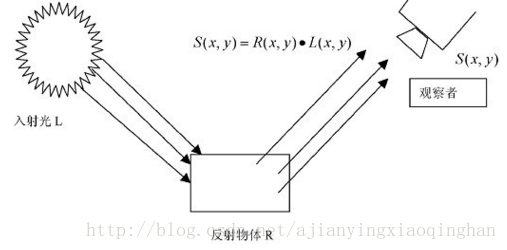
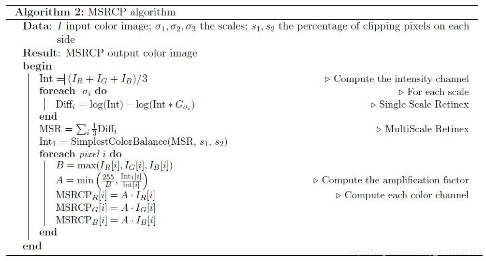

# 图像处理

### Retinex图像增强算法(SSR, MSR, MSRCR)详解

### 单尺度SSR(Single Scale Retinex)


$$
r(x,y)=logR(x,y)=log\frac{S(x,y)}{L(x,y)}

$$
其中，`R(x, y)`表示了物体的反射性质，即图像内在属性，我们应该最大程度的保留；而`L(x, y)`表示入射光图像，决定了图像像素能达到的动态范围，我们应该尽量去除。
一般，我们把照射图像假设估计为空间平滑图像，原始图像为`S(x, y)`，反射图像为`R(x, y)`，亮度图像为`L(x, y)`，可以得出上面的公式(1)，以及下面的公式：
$$
r(x,y)=logS(x,y)−logL(x,y) = logS(x,y)−log[F(x,y)⨂S(x,y)]\\

F(x,y)=λe^{\frac{−(x^2+y^2)}{c^2} }\\
$$
r(x, y)是输出图像，式(3)中后面中括号里的运算是卷积运算。F(x, y)是中心环绕函数

**单尺度Retinex算法SSR的实现流程可以概括如下：**

1. 读原图S(x, y)：
   - 若原图为灰度图：将图像各像素的灰度值由整数型(int)转换为浮点数(float)，并转换到对数域；
   - 若原图为彩色图：将颜色分通道处理，每个分量像素值由整数型(int)转换为浮点数(float)，并转换到对数域；
2. 输入高斯环绕尺度C，把积分运算离散化，转为求和运算，通过上式(4)(5)确定λ的值；
3. 
   - 若原图是灰度图，则只有一个`r(x, y)`；
   - 若原图为彩色图，则每个通道都有一个对应的`r(x, y)`；
4. 将`r(x, y)`从对数域转换到实数域，得到输出图像`R(x, y)`；
5. 此时的`R(x, y)`值的范围并不是0–255，所以还需要进行线性拉伸并转换成相应的格式输出显示。

前面的公式中，中心环绕函数`F(x, y)`用的是低通函数，这样能够在算法中估计出入射图像对应原始图像的低频部分。从原始图像中除去低频照射部分，就会留下原始图像所对应的高频分量。高频分量很有价值，因为在人类的视觉系统中，人眼对边缘部分的高频信息相当敏感，所以SSR算法可以较好的增强图像中的边缘信息。
由于SSR算法中所选用的高斯函数特点，对于动态范围大幅度压缩和对比度增强两个指标，增强后的图像不能同时保证。但是为了平衡两种增强效果，就必须选择一个较为恰当的高斯尺度常量C。C值一般取值在80–100之间。

```python
#SSR
def replaceZeroes(data):
    min_nonzero = min(data[nonzero(data)])
    data[data == 0] = min_nonzero
    return data
 
def SSR(img,size):
    L_blur = cv2.GaussianBlur(img,(size,size),0)
    eps = float(1e-10)
 
    h,w = img.shape[:2]
    dst_img = zeros((h,w),dtype = float32)
    dst_Lblur = zeros((h, w),dtype=float32)
    dst_R = zeros((h, w), dtype=float32)
 
    img = replaceZeroes(img)
    L_blur = replaceZeroes(L_blur)
    cv2.log(img,dst_img)
    cv2.log(L_blur,dst_Lblur)
    log_R = cv2.subtract(dst_img,dst_Lblur)#减法，两个图作差

    cv2.normalize(log_R,dst_R,0,255,cv2.NORM_MINMAX)
    log_uint8 = cv2.convertScaleAbs(dst_R)#将像素点进行绝对值计算， src表示当前图片
 
    minvalue,maxvalue,minloc,maxloc = cv2.minMaxLoc(log_R)#返回矩阵的最小值，最大值，并得到最大值，最小值的索引
    for i in range(h):
        for j in range(w):
            log_R[i,j] = (log_R[i,j]-minvalue)*255.0/(maxvalue-minvalue)
    log_uint8 = cv2.convertScaleAbs(log_R)
    return log_uint8


def single_scale_retinex(img, sigma):
    """Single Scale Retinex
    Arguments:
        img {np.ndarray} -- process image
        sigma {int} -- [description]
    Returns:
        retinex {np.ndarray} -- float64, needs to rescale to 0~255
    """
    retinex = np.log10(img) - np.log10(cv2.GaussianBlur(img, (0, 0), sigma))
    return retinex
```

### 多尺度MSR(Multi-Scale Retinex)

MSR是在SSR基础上发展来的，优点是可以同时保持图像高保真度与对图像的动态范围进行压缩的同时，MSR也可实现色彩增强、颜色恒常性、局部动态范围压缩、全局动态范围压缩，也可以用于X光图像增强。


原始图像进行三次SSR
高斯模糊选择15，80，200作为高斯模糊sigma参数
对三次的SSR结果做平均即为MSR图像
$$
r(x,y)=\sum_{k}^{K}w_k{logS(x,y)−log[F_k(x,y)⋅S(x,y)]}\\
$$

```python
def multi_scale_retinex(img, sigma_list):
    """Multi Scale Retinex
    Arguments:
        img {np.ndarray} -- process image
        sigma_list {list of int} -- list of sigma for SSR
    Returns:
        retinex {np.ndarray} -- float64, needs to rescale to 0~255
    """
    retinex = np.zeros_like(img)
    for sigma in sigma_list:
        retinex += single_scale_retinex(img, sigma)
    retinex = retinex / len(sigma_list)
    return retinex

#MSR
def replaceZeroes(data):
    min_nonzero = min(data[nonzero(data)])
    data[data == 0] = min_nonzero
    return data
 
 
def MSR(img, scales):
    weight = 1/3.0
    scales_size = 3
 
    h, w = img.shape[:2]
    dst_img = zeros((h, w), dtype=float32)
    dst_Lblur = zeros((h, w), dtype=float32)
    dst_R = zeros((h, w), dtype=float32)
    log_R = zeros((h, w), dtype=float32)
 
    for i in range(0,scales_size):
        img = replaceZeroes(img)
        L_blur = cv2.GaussianBlur(img, (scales[i], scales[i]), 0)
        L_blur = replaceZeroes(L_blur)
        cv2.log(img, dst_img)
        cv2.log(L_blur, dst_Lblur)
        log_R += weight*cv2.subtract(dst_img, dst_Lblur)
 
 
    cv2.normalize(log_R, dst_R, 0, 255, cv2.NORM_MINMAX)
    log_uint8 = cv2.convertScaleAbs(dst_R)
 
    return log_uint8

```

MSRCP




代码总结

```python
import numpy as np
import cv2

def singleScaleRetinex(img, sigma):

    retinex = np.log10(img) - np.log10(cv2.GaussianBlur(img, (0, 0), sigma))

    return retinex

def multiScaleRetinex(img, sigma_list):

    retinex = np.zeros_like(img)
    for sigma in sigma_list:
        retinex += singleScaleRetinex(img, sigma)

    retinex = retinex / len(sigma_list)

    return retinex

def colorRestoration(img, alpha, beta):

    img_sum = np.sum(img, axis=2, keepdims=True)

    color_restoration = beta * (np.log10(alpha * img) - np.log10(img_sum))

    return color_restoration

def simplestColorBalance(img, low_clip, high_clip):    

    total = img.shape[0] * img.shape[1]
    for i in range(img.shape[2]):
        unique, counts = np.unique(img[:, :, i], return_counts=True)
        current = 0
        for u, c in zip(unique, counts):            
            if float(current) / total < low_clip:
                low_val = u
            if float(current) / total < high_clip:
                high_val = u
            current += c
                
        img[:, :, i] = np.maximum(np.minimum(img[:, :, i], high_val), low_val)

    return img    

def MSRCR(img, sigma_list, G, b, alpha, beta, low_clip, high_clip):

    img = np.float64(img) + 1.0

    img_retinex = multiScaleRetinex(img, sigma_list)

    img_color = colorRestoration(img, alpha, beta)    
    img_msrcr = G * (img_retinex * img_color + b)

    for i in range(img_msrcr.shape[2]):
        img_msrcr[:, :, i] = (img_msrcr[:, :, i] - np.min(img_msrcr[:, :, i])) / \
                             (np.max(img_msrcr[:, :, i]) - np.min(img_msrcr[:, :, i])) * \
                             255
    
    img_msrcr = np.uint8(np.minimum(np.maximum(img_msrcr, 0), 255))
    img_msrcr = simplestColorBalance(img_msrcr, low_clip, high_clip)       

    return img_msrcr

def automatedMSRCR(img, sigma_list):

    img = np.float64(img) + 1.0

    img_retinex = multiScaleRetinex(img, sigma_list)

    for i in range(img_retinex.shape[2]):
        unique, count = np.unique(np.int32(img_retinex[:, :, i] * 100), return_counts=True)
        for u, c in zip(unique, count):
            if u == 0:
                zero_count = c
                break
            
        low_val = unique[0] / 100.0
        high_val = unique[-1] / 100.0
        for u, c in zip(unique, count):
            if u < 0 and c < zero_count * 0.1:
                low_val = u / 100.0
            if u > 0 and c < zero_count * 0.1:
                high_val = u / 100.0
                break
            
        img_retinex[:, :, i] = np.maximum(np.minimum(img_retinex[:, :, i], high_val), low_val)
        
        img_retinex[:, :, i] = (img_retinex[:, :, i] - np.min(img_retinex[:, :, i])) / \
                               (np.max(img_retinex[:, :, i]) - np.min(img_retinex[:, :, i])) \
                               * 255

    img_retinex = np.uint8(img_retinex)
        
    return img_retinex

def MSRCP(img, sigma_list, low_clip, high_clip):

    img = np.float64(img) + 1.0

    intensity = np.sum(img, axis=2) / img.shape[2]    

    retinex = multiScaleRetinex(intensity, sigma_list)

    intensity = np.expand_dims(intensity, 2)
    retinex = np.expand_dims(retinex, 2)

    intensity1 = simplestColorBalance(retinex, low_clip, high_clip)

    intensity1 = (intensity1 - np.min(intensity1)) / \
                 (np.max(intensity1) - np.min(intensity1)) * \
                 255.0 + 1.0

    img_msrcp = np.zeros_like(img)
    
    for y in range(img_msrcp.shape[0]):
        for x in range(img_msrcp.shape[1]):
            B = np.max(img[y, x])
            A = np.minimum(256.0 / B, intensity1[y, x, 0] / intensity[y, x, 0])
            img_msrcp[y, x, 0] = A * img[y, x, 0]
            img_msrcp[y, x, 1] = A * img[y, x, 1]
            img_msrcp[y, x, 2] = A * img[y, x, 2]

    img_msrcp = np.uint8(img_msrcp - 1.0)

    return img_msrcp

```

