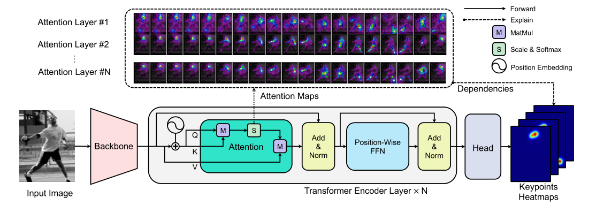
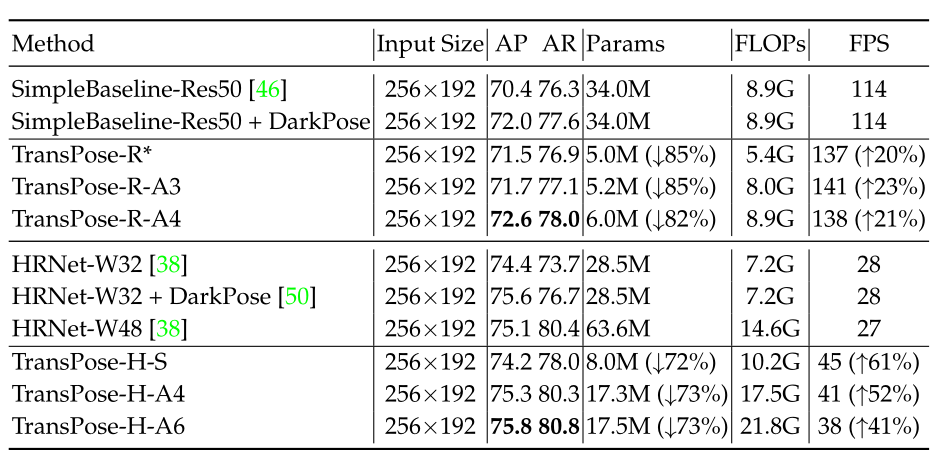

# 关键点检测论文以及代码

## 论文解读

### Multi-Scale Structure-Aware Network for Human Pose Estimation

在表记项目上可以有的应用，解决拍摄角度问题造成的遮挡问题，我觉得可以试一试

贡献：

1、多尺度监督
2、多尺度回归
3、结构性损失函数设计
4、keypoint masking作为数据扩增的方式

2、传统网络的缺陷
1）大部分方法在某一个尺度上过度拟合，使得某一个尺度的结果占据主导的地位，引起了尺度的不稳定，通常的方法是不断的前传各个尺度的图片进行测试，选取分数最高的结果。
2）没有足够的结构先验，所以文章中的structure-aware,回归网络和keypoint masking的样本扩充都能够对结构先验有益处。

结构性损失函数设计

mask 数据增广

### Distribution-Aware Coordinate Representation for Human Pose Estimation

姿态估计使用热度图来定位已成为惯例，但是据作者所知并没有文献对热度图进行系统的研究，本文将填补这个空白。特别是关注热度图的坐标表示。发现热度图解码坐标点时最为关键，因而我们探讨现有的标准坐标解码方法的局限性，提出可感知的分布解码方法（a more principled distribution-aware decoding method） 改进了标准坐标编码过程，制定了DARK（Aware coordinate Representation of Keypoint ）分布感知坐标方法，在MPII和COCO上达到有效效果

重点关注了 训练数据生成的热力图，改进了热度图的训练

### hourglass

项目中使用的hourglass 损失函数设计威mse loss ，实际上并不合理，改进点包括centernet 中的guassian map 改进，对热力图进行改进，实际上一个map上绝大部分都是稀疏的，只有关键点部分的值是贡献的，

loss 的改进，mse的loss 感觉不是很合理，相当于分类，

#### TransPose: Towards Explainable Human Pose Estimation by Transformer

摘要：

深度卷积神经网络（CNN）在人体姿态估计任务上取得了显着进展。 但是，对于CNN如何预测身体关键点的位置尚无明确的了解，并且还未知在模型中了解到哪些结构变量之间的空间依赖性关系。 为了探讨这些问题，我们基于Transformer体系结构和低级卷积块构造了一个可解释的模型TransPose。 给定一张图像，Transformer中内置的注意层可以捕获关键点之间的远程空间关系，并解释预测的关键点位置高度依赖于哪些相关性。 我们分析了使用注意力作为解释以揭示此任务中空间依赖性的合理性。 揭示的依存关系是特定于图像的，并且对于不同的关键点类型，图层深度或训练的模型是可变的。 实验表明，TransPose可以准确预测关键点的位置。 它在COCO数据集上实现了最先进的性能，同时比主流的全卷积体系结构更具解释性，轻量级和高效。

本文关注重点：可解释性，利用transformer的attention机制解释如何预测各个关键点的相关性

（note: CNN 利用多层的卷积堆叠扩大了感受野，实际上高层的语义信息利用大的感受野也能捕获全局的关键点与关键点之间的关系）

本文重点认为：CNN 卷积参数太少，不能解释？？    没有工具显示关键点预测与其他部位关键点的关系

在这项工作中，我们旨在建立一个可以解释其预测并直接揭示关键点之间图像相关的空间关系的人体姿态估计模型，如图1所示。**我们认为卷积在提取低层特征方面具有优势， 但是在高层次上深度堆叠卷积层以扩大接收域并不能有效地捕获全局依赖性。 这样的深度增加了解释CNN预测的难度。 通常在NLP任务中使用的Transformer体系结构[44]在绘制成对或更高阶交互方面优于卷积体系。**

transformer层只使用了encoder层，作者认为任务足够简单，不用复杂的编解码结构

Position Embedding

我们遵循正弦位置编码[44]，但进一步假设位置信息在图像的x（水平）和y（垂直）方向上是独立的。 因此，我们对图像特征采用x方向和y方向位置嵌入

