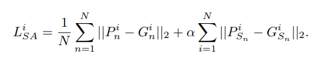

# 关键点检测论文以及代码

## 论文解读

### Multi-Scale Structure-Aware Network for Human Pose Estimation

在表记项目上可以有的应用，解决拍摄角度问题造成的遮挡问题，我觉得可以试一试

贡献：

1、多尺度监督
2、多尺度回归
3、结构性损失函数设计
4、keypoint masking作为数据扩增的方式

2、传统网络的缺陷
1）大部分方法在某一个尺度上过度拟合，使得某一个尺度的结果占据主导的地位，引起了尺度的不稳定，通常的方法是不断的前传各个尺度的图片进行测试，选取分数最高的结果。
2）没有足够的结构先验，所以文章中的structure-aware,回归网络和keypoint masking的样本扩充都能够对结构先验有益处。

结构性损失函数设计

mask 数据增广

### Distribution-Aware Coordinate Representation for Human Pose Estimation

姿态估计使用热度图来定位已成为惯例，但是据作者所知并没有文献对热度图进行系统的研究，本文将填补这个空白。特别是关注热度图的坐标表示。发现热度图解码坐标点时最为关键，因而我们探讨现有的标准坐标解码方法的局限性，提出可感知的分布解码方法（a more principled distribution-aware decoding method） 改进了标准坐标编码过程，制定了DARK（Aware coordinate Representation of Keypoint ）分布感知坐标方法，在MPII和COCO上达到有效效果

重点关注了 训练数据生成的热力图，改进了热度图的训练