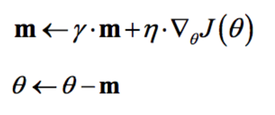

# machine learn

* [机器学习]()    * [1 优化方法]()    * [SGD]()
  
    * [反向传播]()    * [softmax]()
        * [sigmoid]()
        * [tanh]()
        * [batchnorm]()
    
    * [评价指标]()    * [P-R曲线]()
        * [ROC曲线]()
    
    * [机器学习方法]()    * [LR]()    * [LR 优缺点]()
            * [LR 为什么不用MSE损失函数]()
            * [LR正则化与数据先验分布的关系]()
            * [SVM、logistic regression、linear regression对比]()
        
        * [推导 SVM KKT 条件，hinge loss]()
        * [SMO 思想]()
        * [kernel trick 对应无限维空间可以使用哪种kernel function？]()
    
    * [损失函数]()    * [回归损失函数]()
        * [分类问题的损失函数]()
    
    * [正则化]()    * [L1,L2,L0区别，为什么可以防止过拟合]()    * [L0范数]()
            * [L1范数]()
            * [L2范数]()
            * [L1为什么比L2更容易获得稀疏解？]()
        
        * [归一化对LR和决策树的影响]()
    
    * [模型误差]()    * [经验误差与泛化误差]()
        * [偏差与方差]()
        * [欠拟合与过拟合]()
        * [交叉验证]()
    
    * [特征工程]()    * [1 特征的标准化和归一化]()
        * [2 处理不平衡数据]()
        * [3 缺失值处理]()
        * [4 离散特征的连续化处理]()
        * [5 连续特征离散化的好处]()
        * [6 什么样的模型对缺失值更敏感？]()
        * [7 特征选择]()
    
    * [决策树]()    * [信息增益]()
        * [增益率]()
        * [基尼系数]()
    
    * [集成学习]()
    * [极大似然估计 贝叶斯估计]()    * [贝叶斯公式]()
        * [问题]()
        * [极大似然估计]()    * [求解极大似然函数]()
        
        * [朴素贝叶斯]()
    
    * [机器学习“判定模型”和“生成模型”有什么区别？]()    * [两种模式优缺点]()
    
    * [参数模型 VS 非参数模型]()
    * [极大似然]()
    * [EM]()
    * [机器学习问题]()    * [1 简述解决一个机器学习问题时，你的流程是怎样的？]()
        * [什么是结构误差和经验误差？训练模型的时候如何判断已经达到最优？]()
        * [什么是混淆矩阵？]()
        * [kmeans]()

* [图像知识]()    * [彩色如何变灰度？]()    * [1. 基于均值的方法：]()
        * [基于照度的方法：]()
        * [2. 基于亮度的方法：]()
    
    * [除了RGB还了解哪些模型？]()
    * [CNN中感受野大小的计算]()
    * [卷积计算量]()
    * [深度学习的BN层 反向传播]()

* [深度学习]()
* [C++]()    * [static关键字]()
    * [c++中四种cast转换]()
    * [C/C++ 中指针和引用的区别？]()
    * [c++中的smart pointer四个智能指针： shared_ptr,unique_ptr,weak_ptr,auto_ptr]()
    * [const]()
    * [为什么析构函数必须是虚函数？为什么C++默认的析构函数不是虚函数]()
    * [函数指针]()
    * [C++中析构函数的作用]()
    * [静态函数和虚函数的区别]()
    * [++i和i++的实现]()
    * [虚函数表具体是怎样实现运行时多态的?]()
    * [malloc与new区别]()
    * [STL数据结构]()
    * [STL迭代器是怎么删除元素]()
    * [C++类内可以定义引用数据成员吗]()
    * [什么是右值引用，跟左值又有什么区别]()
    * [什么时候会发生段错误]()
    * [什么是memory leak，也就是内存泄漏]()
    * [new和malloc的区别]()
    * [设计一下如何采用单线程的方式处理高并发]()

# 机器学习

## 1 优化方法

### SGD

梯度下降法的优化思想是用当前位置负梯度方向作为搜索方向，因为该方向为当前位置的最快下降方向

梯度下降算法背后的原理：目标函数J(θ)关于参数θ的梯度将是目标函数上升最快的方向，对于最小化优化问题，只需要将参数沿着梯度相反的方向前进一个步长(学习速率)，就可以实现目标函数的下降


1. 根据计算目标函数J(θ)采用数据量的大小，梯度下降算法又可以分为批量梯度下降算法（Batch Gradient Descent），随机梯度下降算法（Stochastic GradientDescent）和小批量梯度下降算法（Mini-batch Gradient Descent）。

2. 批量梯度下降算法，J(θ)是在整个训练集上计算的，如果数据集比较大，可能会面临内存不足问题，而且其收敛速度一般比较慢。

3. 随机梯度下降算法，J(θ)是针对训练集中的一个训练样本计算的，又称为在线学习，即得到了一个样本，就可以执行一次参数更新。所以其收敛速度会快一些，但是有可能出现目标函数值震荡现象，因为高频率的参数更新导致了高方差。

小批量梯度下降算法，是折中方案，J(θ)选取训练集中一个小批量样本计算，这样可以保证训练过程更稳定，而且采用批量训练方法也可以利用矩阵计算的优势。这是目前最常用的梯度下降算法。
momentum

GD方法的一个缺点是，其更新方向完全依赖于当前的batch，因而其更新十分不稳定，每次迭代计算的梯度含有比较大的噪音。解决这一问题的一个简单的做法便是引入momentum

即更新的时候***在一定程度上保留之前更新的方向，同时利用 当前batch的梯度 微调最终的更新方向***。这样一来，可以在一定程度上增加稳定性，从而学习地更快，并且还有一定摆脱局部最优的能力。



Adam 


其中，一阶动量s，二阶动量r（初始化为0），一阶动量衰减系数ρ1, 二阶动量衰减系数ρ2 超参数的建议值是ρ1=0.9，ρ2 =0.999，epsilon: 设置较小的值，防止分母的为 0。

## 反向传播

### softmax


### sigmoid


### tanh


### batchnorm

%!(EXTRA markdown.ResourceType=, string=, string=)

## 评价指标


精度

Accuracy

定义：(TP+TN)/(TP+FN+FP+TN)

即所有分类正确的样本占全部样本的比例

问：accuracy 作为指标有哪些局限性？

答：

因为只使用准确率作为评估指标，所以样本的分布对结果影响很大。举例来说：如果样本中负样本占95%，正样本占5%，那么如果将正样本全部误分类为负样本，准确率也可以达到95%

精确率Precision

查准率定义：(TP)/(TP+FP)

即预测是正例的结果中，确实是正例的比例

召回率Recall

查全率定义：(TP)/(TP+FN)

即所有正例的样本中，被找出的比例

### P-R曲线

定义：根据预测结果将预测样本排序，最有可能为正样本的在前，最不可能的在后，依次将样本预测为正样本，分别计算当前的精确率和召回率，绘制P-R曲线


例子：


真实情况正例反例各有10个。

先用分数（score）：0.9作为阈值（大于等于为正例，小于为反例），此时TP=1，FP=0，FN=9，故P=1，R=0.1。

用0.8作为阈值，P=1，R=0.2。

用0.7作为阈值，P=0.67，R=0.2。

用0.6作为阈值，P=0.75，R=0.3。

### ROC曲线

很多学习器是为测试样本产生一个实值或概率预测，然后将这个预测值与一个分类阈值进行比较，若大于阈值分为正类，否则为反类，因此分类过程可以看作选取一个截断点。

不同任务中，可以选择不同截断点，若更注重”查准率”，应选择排序中靠前位置进行截断，反之若注重”查全率”，则选择靠后位置截断。因此排序本身质量的好坏，可以直接导致学习器不同泛化性能好坏，ROC曲线则是从这个角度出发来研究学习器的工具。

可以用AUC的值得大小来评价分类器的好坏（是否可以用PR曲线围成面积大小来评价呢？）。

正负样本的分布失衡的时候，ROC曲线保持不变，而PR曲线会产生很大的变化。


问：如何处理数据中的“类别不平衡”？例如二分类问题，训练集中80%分类为A，20%分类为B。

答：

简单方法数据多的欠采样(under-sampling)，舍弃一部分数据，使其与较少类别的数据相当。数据少的过采样(over-sampling)，即重复使用一部分数据，使其与较多类别的数据相当。阈值调整（threshold moving，例如数据均衡时，阈值为0.5，那么可以按比例，例如调整到 0.8。复杂方法数据采样过程中，生成并插样“少数类别”数据，代表算法 SMOTE 和 ADASYN。数据先聚类，“多数类别”随机欠采样，“少数类别”数据生成。随机欠采样容易丢失重要信息，可结合集成学习欠采样，代表算法：EasyEnsemble。利用集成学习机制，将大类划分为若干个集合供不同的学习器使用。相当于对每个学习器欠采样，避免全局丢失重要信息。

## 机器学习方法

### LR

#### LR 优缺点

优点：

适合需要得到一个分类概率的场景。相比于linear regression而言，线性回归做分类因为考虑了所有样本点到分类决策面的距离，所以在两类数据分布不均匀的时候将导致误差非常大；LR和SVM克服了这个缺点，其中LR将所有数据采用sigmod函数进行了非线性映射，使得远离分类决策面的数据作用减弱；SVM直接去掉了远离分类决策面的数据，只考虑支持向量的影响。

**计算代价不高，容易理解实现**。LR在时间和内存需求上相当高效。它可以应用于分布式数据，并且还有在线算法实现，用较少的资源处理大型数据。

**LR对于数据中小噪声的鲁棒性很好**，并且不会受到轻微的多重共线性的特别影响。（严重的多重共线性则可以使用逻辑回归结合L2正则化来解决，但是若要得到一个简约模型，L2正则化并不是最好的选择，因为它建立的模型涵盖了全部的特征。）

缺点：

**容易欠拟合，分类精度不高**

数据特征有缺失或者特征空间很大时表现效果并不好。

#### LR 为什么不用MSE损失函数

上面的均方误差损失函数一般是非凸函数（non-convex），其在使用梯度下降算法的时候，容易得到局部最优解，而不是全局最优解。因此要选择凸函数（二阶导大于等于0）。

使用MSE的另一个缺点就是其偏导值在输出概率值接近0或者接近1的时候非常小，这可能会造成模型刚开始训练时，偏导值几乎消失。

#### LR正则化与数据先验分布的关系

正则化参数等价于对参数引入先验分布，使得 模型复杂度 变小（缩小解空间），对于噪声以及 outliers 的鲁棒性增强（泛化能力）。整个最优化问题从贝叶斯观点来看是一种贝叶斯最大后验估计，其中 正则化项 对应后验估计中的 先验信息，损失函数对应后验估计中的似然函数，两者的乘积即对应贝叶斯最大后验估计的形式。


这就导出了我们原始的 least-squares 损失函数，但这是在我们对参数 w 没有加入任何先验分布的情况下。在数据维度很高的情况下，我们的模型参数很多，模型复杂度高，容易发生过拟合。

这个时候，我们可以对参数 w 引入先验分布，降低模型复杂度。


#### SVM、logistic regression、linear regression对比

线性回归 vs LR vs SVM： 线性回归做分类因为考虑了所有样本点到分类决策面的距离，所以在两类数据分布不均匀的时候将导致误差非常大； LR和SVM克服了这个缺点，其中**LR将所有数据采用sigmod函数进行了非线性映射，使得远离分类决策面的数据作用减弱**； **SVM直接去掉了远离分类决策面的数据，只考虑支持向量的影**响。有异常点的时候，LR vs SVM： 对于这两种算法来说，在线性分类情况下，如果异常点较多无法剔除的话，LR中每个样本都是有贡献的， 最大似然后会自动压制异常的贡献；SVM+软间隔对异常比较敏感，因为其训练只需要支持向量，有效样本本来就不高，一旦被干扰，预测结果难以预料。

LR vs SVM 详细对比： 链接：https://zhuanlan.zhihu.com/p/30419036联系：

1、LR和SVM都可以处理分类问题，且一般都用于处理线性二分类问题（在改进的情况下可以处理多分类问题）

2、两个方法都可以增加不同的正则化项，如l1、l2等等。所以在很多实验中，两种算法的结果是很接近的。

3、LR和SVM都可以用来做非线性分类，只要加核函数就好。

4、LR和SVM都是线性模型，当然这里我们不要考虑核函数

5、**都属于判别模型区别：**

1、**LR是参数模型，SVM是非参数模型**。

2、从目标函数来看，区别在于逻辑回归采用的是logistical loss，SVM采用的是hinge loss，这两个损失函数的目的都是增加对分类影响较大的数据点的权重，减少与分类关系较小的数据点的权重。

3、逻辑回归相对来说模型更简单，好理解，特别是大规模线性分类时比较方便。而SVM的理解和优化相对来说复杂一些，SVM转化为对偶问题后,分类只需要计算与少数几个支持向量的距离,这个在进行复杂核函数计算时优势很明显,能够大大简化模型和计算。

4、SVM不直接依赖数据分布，而LR则依赖，因为SVM只与支持向量那几个点有关系，而LR和所有点都有关系。

5、SVM依赖penalty系数，实验中需要做CV

6、SVM本身是结构风险最小化模型，而LR是经验风险最小化模型另外怎么选模型：

在Andrew NG的课里讲到过：如果Feature的数量很大，跟样本数量差不多，这时候选用LR或者是Linear Kernel的SVM如果Feature的数量比较小，样本数量一般，不算大也不算小，选用SVM+Gaussian Kernel如果Feature的数量比较小，而样本数量很多，需要手工添加一些feature变成第一种情况

### 推导 SVM KKT 条件，hinge loss

推导多练习 hinge loss = max(0,1-z)


### SMO 思想

### kernel trick 对应无限维空间可以使用哪种kernel function？

## 损失函数

### 回归损失函数


### 分类问题的损失函数


## 正则化

### L1,L2,L0区别，为什么可以防止过拟合

实现参数的稀疏有什么好处吗？一个好处是可以简化模型，避免过拟合。

#### L0范数

L0是指向量中非0的元素的个数。如果我们用L0范数来规则化一个参数矩阵W的话，就是希望W的大部分元素都是0。换句话说，让参数W是稀疏的。但不幸的是，L0范数的最优化问题是一个NP hard问题，而且理论上有证明，L1范数是L0范数的最优凸近似，因此通常使用L1范数来代替。

#### L1范数

L1范数是指向量中各个元素绝对值之和，也有个美称叫“稀疏规则算子”（Lasso regularization）。L1正则化之所以可以防止过拟合，是因为L1范数就是各个参数的绝对值相加得到的，我们前面讨论了，参数值大小和模型复杂度是成正比的。因此复杂的模型，其L1范数就大，最终导致损失函数就大，说明这个模型就不够好。

#### L2范数

也叫“岭回归”（Ridge Regression），也叫它“权值衰减weight decay”但与L1范数不一样的是，它不会是每个元素为0，而只是接近于0。越小的参数说明模型越简单，越简单的模型越不容易产生过拟合现象。

#### L1为什么比L2更容易获得稀疏解？


### 归一化对LR和决策树的影响

## 模型误差

### 经验误差与泛化误差

经验误差（训练误差）：模型在训练集上的误差称为“经验误差”（empirical error）或者“训练误差”“training error”。泛化误差：模型在新样本集（测试集）上的误差称为“泛化误差”（generalization error）。

### 偏差与方差

“噪声”：描述了在当前任务上任何学习算法所能达到的期望泛化误差的下界，即刻画了学习问题本身的难度。“偏差”：描述了模型的期望预测（模型的预测结果的期望）与真实结果的偏离程度。偏离程度越大，说明模型的拟合能力越差，此时造成欠拟合。“方差”：描述了数据的扰动造成的模型性能的变化，即模型在不同数据集上的稳定程度。方差越大，说明模型的稳定程度越差。如果模型在训练集上拟合效果比较优秀，但是在测试集上拟合效果比较差劣，则方差较大，说明模型的稳定程度较差，出现这种现象可能是由于模型对训练集过拟合造成的。简单的总结一下：偏差大，说明模型欠拟合；方差大，说明模型过拟合。如何平衡模型的偏差和方差，一直是我们追求的效果。感兴趣的童鞋，可以阅读《Understanding the Bias-Variance Tradeoff》。


### 欠拟合与过拟合

模型欠拟合时，在训练集以及测试集上同时具有较高的误差，此时模型的偏差较大；模型过拟合时，在训练集上具有较低的误差，在测试集上具有较高的误差，此时模型的方差较大。模型正常时，在训练集以及测试集上，同时具有相对较低的偏差以及方差。如何解决过拟合：

1）重新清洗数据，导致过拟合的一个原因也有可能是数据不纯导致的，如果出现了过拟合就需要我们重新清洗数据。

2）增加训练样本数量

3）降低模型复杂程度

4）增大正则项系数

5）采用dropout方法，这个方法在神经网络里面很常用。dropout方法，通俗一点讲就是在训练的时候让神经元以一定的概率不工作

6）early stoping

7）减少迭代次数

8）增大学习率

9）添加噪声数据

10）树结构中，可以对树进行剪枝。

等等，方法很多，需要根据实际问题，实际模型，进行选择。

### 交叉验证

这里主要介绍“K折交叉验证”：将数据集（其实是训练集，我们暂且称为数据集吧，假设含有N个样本）分成K份（每份含有N/K个样本），选择其中1份作为测试集，另外K-1份作为训练集。这样的话，测试集就有K种情况。在每种情况中，用训练集训练模型，用测试集测试模型，计算模型的泛化误差（暂且这么叫吧）。将K种情况下，模型的泛化误差取均值，得到模型最终的泛化误差。

## 特征工程

### 1 特征的标准化和归一化

z-score标准化：这是最常见的特征预处理方式，基本所有的线性模型在拟合的时候都会做 z-score标准化。具体的方法是求出样本特征x的均值mean和标准差std，然后用（x-mean)/std来代替原特征。**这样特征就变成了均值为0，方差为1了**。在sklearn中，我们可以用StandardScaler来做z-score标准化。

max-min标准化：也称为离差标准化，预处理后使特征值映射到[0,1]之间。具体的方法是求出样本特征x的最大值max和最小值min，然后用(x-min)/(max-min)来代替原特征。

此外，经常我们还会用到中心化，主要是在PCA降维的时候，此时我们求出特征x的平均值mean后，**用x-mean代替原特征，也就是特征的均值变成了0, 但是方差并不改变。**这个很好理解，因为PCA就是依赖方差来降维的。

也有不少模型可以不做做标准化和归一化，主要是基于概率分布的模型，比如决策树大家族的CART，随机森林等。

### 2 处理不平衡数据

权重法是比较简单的方法，我们可以对训练集里的每个类别加一个权重class weight。如果该类别的样本数多，那么它的权重就低，反之则权重就高。如果更细致点，我们还可以对每个样本加权重sample weight，思路和类别权重也是一样，即样本数多的类别样本权重低，反之样本权重高。sklearn中，绝大多数分类算法都有class weight和 sample weight可以使用。

采样法常用的也有两种思路，一种是对类别样本数多的样本做子采样, 比如训练集里A类别样本占90%，B类别样本占10%。那么我们可以对A类的样本子采样，直到子采样得到的A类样本数和B类别现有样本一致为止，这样我们就只用子采样得到的A类样本数和B类现有样本一起做训练集拟合模型。第二种思路是对类别样本数少的样本做过采样, 还是上面的例子，我们对B类别的样本做过采样，直到过采样得到的B类别样本数加上B类别原来样本一起和A类样本数一致，最后再去拟合模型。

### 3 缺失值处理

首先我们会看是该特征是连续值还是离散值。如果是连续值，那么一般有两种选择，一是**选择所有有该特征值的样本，然后取平均值，来填充缺失值**，另一种是取中位数来填充缺失值。如果**是离散值，则一般会选择所有有该特征值的样本中最频繁出现的类别值，来填充缺失值**。在sklearn中，可以使用preprocessing.Imputer来选择这三种不同的处理逻辑做预处理。

### 4 离散特征的连续化处理

最常见的离散特征连续化的处理方法是独热编码**one-hot encoding**。处理方法其实比较简单，比如某特征的取值是高，中和低，那么我们就可以创建三个取值为0或者1的特征，将高编码为1,0,0这样三个特征，中编码为0,1,0这样三个特征，低编码为0,0,1这样三个特征。也就是说，之前的一个特征被我们转化为了三个特征。sklearn的OneHotEncoder可以帮我们做这个处理。

第二个方法是特征嵌入embedding。这个一般用于深度学习中。比如对于用户的ID这个特征，如果要使用独热编码，则维度会爆炸，如果使用特征嵌入就维度低很多了。对于每个要嵌入的特征，我们会有一个特征嵌入矩阵，这个矩阵的行很大，对应我们该特征的数目。比如用户ID，如果有100万个，那么嵌入的特征矩阵的行就是100万。但是列一般比较小，比如可以取20。这样每个用户ID就转化为了一个20维的特征向量。进而参与深度学习模型。在tensorflow中，我们可以先随机初始化一个特征嵌入矩阵，对于每个用户，可以用tf.nn.embedding_lookup找到该用户的特征嵌入向量。特征嵌入矩阵会在反向传播的迭代中优化。　　 此外，在自然语言处理中，我们也可以用word2vec将词转化为词向量，进而可以进行一些连续值的后继处理。

### 5 连续特征离散化的好处

离散特征的增加和减少都很容易，易于模型的快速迭代

稀疏向量内积乘法运算速度快，计算结果方便存储，容易扩展

离散化后的特征对异常数据有很强的鲁棒性

### 6 什么样的模型对缺失值更敏感？

1. 树模型对于缺失值的敏感度较低，大部分时候可以在数据有缺失时使用。
2. 涉及到距离度量(distance measurement)时，如计算两个点之间的距离，缺失数据就变得比较重要。因为涉及到“距离”这个概念，那么缺失值处理不当就会导致效果很差，如K近邻算法(KNN)和支持向量机(SVM)
3. 线性模型的代价函数(loss function)往往涉及到距离(distance)的计算，计算预测值和真实值之间的差别，**这容易导致对缺失值敏感。**
4. 神经网络的鲁棒性强，对于缺失数据不是非常敏感，但一般没有那么多数据可供使用。
5. 贝叶斯模型对于缺失数据也比较稳定，数据量很小的时候首推贝叶斯模型。6. 总结来看，对于有缺失值的数据在经过缺失值处理后：(1) 数据量很小，用朴素贝叶斯(2) 数据量适中或者较大，用树模型，优先 xgboost(3) 数据量较大，也可以用神经网络(4) 避免使用距离度量相关的模型，如KNN和SVM
### 7 特征选择

最简单的方法就是方差筛选。方差越大的特征，那么我们可以认为它是比较有用的。如果方差较小，比如小于1，那么这个特征可能对我们的算法作用没有那么大。最极端的，如果某个特征方差为0，即所有的样本该特征的取值都是一样的，那么它对我们的模型训练没有任何作用，可以直接舍弃。在实际应用中，我们会指定一个方差的阈值，当方差小于这个阈值的特征会被我们筛掉。sklearn中的VarianceThreshold类可以很方便的完成这个工作。

特征选择方法有很多，一般分为三类：第一类过滤法比较简单，它按照特征的发散性或者相关性指标对各个特征进行评分，设定评分阈值或者待选择阈值的个数，选择合适特征。上面我们提到的方差筛选就是过滤法的一种。第二类是包装法，根据目标函数，通常是预测效果评分，每次选择部分特征，或者排除部分特征。第三类嵌入法则稍微复杂一点，它先使用某些机器学习的算法和模型进行训练，得到各个特征的权值系数，根据权值系数从大到小来选择特征。类似于过滤法，但是它是通过机器学习训练来确定特征的优劣，而不是直接从特征的一些统计学指标来确定特征的优劣。下面我们分别来看看3类方法。

## 决策树

决策树学习的关键是如何选择最优的划分属性

### 信息增益


ID3 使用信息增益作为准则选择划分属性

信息增益准则对可取数目较多的属性有所偏好，改进的方法是增益率

### 增益率

C4.5 选择增益率作为划分属性依据


### 基尼系数

CART 使用基尼系数作为划分属性依据


## 集成学习

个体学习器间存在强依赖关系，必须串行生成序列方法，代表是Boosting

个体学习器不存在强依赖关系，可并行的生成 代表是 Bagging 和 Random Forest

## 极大似然估计 贝叶斯估计

### 贝叶斯公式


P(w) 是先验概率，表示每种类别分布的概率

P(x|w) 类别概率，表示再某种类别的前提下，x发生的概率

P(w|x) 后验概率，x发生了，属于类别w的概率

### 问题

我们来看一个直观的例子：已知：在夏季，某公园男性穿凉鞋的概率为1/2，女性穿凉鞋的概率为2/3，并且该公园中男女比例通常为2:1，问题：若你在公园中随机遇到一个穿凉鞋的人，请问他的性别为男性或女性的概率分别为多少？

设类别w1 男性 w2 女性 x穿凉鞋


实际中我们能获得的数据可能只有有限数目的样本数据，而先验概率和类条件概率(各类的总体分布) 都是未知的，根据仅有的样本数据进行分类时，**一种可行的办法是我们需要先对先验概率P(w)和类条件概率P(x|w) 进行估计，然后再套用贝叶斯分类器**。

类条件概率的估计（非常难），原因包括：概率密度函数包含了一个随机变量的全部信息；样本数据可能不多；特征向量x的维度可能很大等等。总之要直接估计类条件概率的密度函数很难。解决的办法就是，把估计完全未知的概率密度转化为估计参数。

**假设其具有固定的概率分布模式，再基于训练样本对概率分布参数进行估计**


参数估计问题只是实际问题求解过程中的一种简化方法（由于直接估计类条件概率密度函数很困难）。所以能够使用极大似然估计方法的样本必须需要满足一些前提假设。        

重要前提：训练样本的分布能代表样本的真实分布。每个样本集中的样本都是所谓独立同分布的随机变量 (iid条件)，且有充分的训练样本。

### 极大似然估计

总结起来，**最大似然估计的目的就是：利用已知的样本结果，反推最有可能（最大概率）导致这样结果的参数值。**

由于样本集中的**样本都是独立同分布**，可以只考虑一类样本集D，来估计参数向量θ。记已知的样本集为：_D_={_x_1​,_x_2​,..._x__N_​}

似然函数（linkehood function）：联合概率密度函数_p_(_D_∣_θ_) 称为相对于D 的 _θ_ 的似然函数

_l_(_θ_)=_p_(_D_∣_θ_)=_p_(_x_1​,_x_2​,..._x__N_​∣_θ_)=_i_=1∏_N_​_p_(_x__i_​∣_θ_)

使得_l_(_θ_) 最大的_θ_^ 就是_θ_ 的极大似然估计量

#### 求解极大似然函数

_θ_^=_a__r__g__m__a__x__l_(_θ_)=_a__r__g__m__a__x__i_=1∏_N_​_p_(_x__i_​∣_θ_)

便于分析取对数


总结

（1）写出似然函数；       

（2）对似然函数取对数，并整理；       

（3）求导数；       

（4）解似然方程。       

最大似然估计的特点：       

1.比其他估计方法更加简单；       

2.收敛性：无偏或者渐近无偏，当样本数目增加时，收敛性质会更好；       

3.如果假设的类条件概率模型正确，则通常能获得较好的结果。但如果假设模型出现偏差，将导致非常差的估计结果。

### 朴素贝叶斯

假设属性相互独立


## 机器学习“判定模型”和“生成模型”有什么区别？

生成模型

HMM 朴素贝叶斯

判别模型

逻辑回归 SVM CRF 最近邻 一般的神经网络

对于输入数据集X，输出类别Y，生成模型和判别模型可以这样定义　　

判别模型：由数据集直接学习决策函数y = f(x) 或者条件概率分布P(y|x) 作为预测的模型（决策函数事实上是可以用条件概率表示的，例如在逻辑回归中的决策函数和转换成条件概率），这样的模型称为判别模型。基本思想就是在有限样本条件下建立判别函数，不考虑样本的产生模型，直接研究预测模型。典型的判别模型包括K近邻，感知机，决策树，支持向量机等。　　

生成模型：由数据学习联合概率密度分布P(x, y)，然后求出条件概率分布P(y|x)作为预测的模型。即生成模型：P(y|x) = P(x, y)/P(x)。典型的生成模型包括朴素贝叶斯，高斯混合模型，隐马尔科夫模型等。

### 两种模式优缺点

判别模型：判别模型是寻找不同类别之间的最优分类面，**反映的是异类数据之间的差异。判别模型不能反映数据本身的特性**。但是判别模型简单易懂，而且可以对数据进行各种抽象、定义特征并使用特征，可以简化学习问题。

生成模型：**生成模型能反映数据之间的关系**，而且可以做增量学习，生成模型的学习收敛速度更快，而且对于存在隐变量的问题，仍可以使用生成模型（如隐马尔科夫，混合高斯模型等）。但是生成模型学习和计算过程更加复杂。

## 参数模型 VS 非参数模型

参数模型如果我们对所要学习的问题有足够的认识，具备一定的先验知识，此时我们一般会假定要学习的目标函数f(x)或分布P(y|x)的具体形式。然后，通过训练数据集，基于ERM、SRM、MLE、MAP等学习策略，可以估计出f(x)或P(y|x)中含有的未知参数。一旦未知参数估计完毕，训练数据一般来说，就失去其作用了，因为这些估计出来的参数就是训练数据的浓缩。通过这种方式建立起来的模型就是参数模型。参数模型的一个很重要的特点是，如果对于模型的假设正确，那么只需要很少的训练数据就可以从假设空间中学出一个很好的模型。但是，如果模型的假设错误，那么无论训练的数据量有多大，甚至趋于无穷大，学出的模型都会与实际模型出现不可磨灭的偏差。感知机、逻辑斯特回归、高斯判别分析、朴素贝叶斯、线性支持向量机都属于参数模型。对于神经网络来说，当固定了隐层的数目以及每一层神经元的个数，它也属于参数模型。但由于隐层数目与每一层神经元个数的不确定性，很多时候，神经网络都被归类为半参数模型。

非参数模型当我们对所要学习的问题知之甚少，此时我们一般不会对潜在的模型做过多的假设。在面对预测任务的时候，我们通常会用上所有的训练数据。例如简单的核密度估计(KDE)的表达式中，就带有所有训练数据的信息。通过这种方式建立的模型就是非参数模型。非参数模型的一个很重要的特点就是：let the data speak for itself. 正因为如此，非参数模型的存储开销、计算开销都会比参数模型大的多。但是，由于不存在模型的错误假定问题，可以证明，当训练数据量趋于无穷大的时候，非参数模型可以逼近任意复杂的真实模型。这正是非参数模型诱人的一点。另外需要说明的一点是，非参数模型之所以叫做非参数，并不是因为模型中没有参数。实际上，非参数模型中一般会含有一个或多个超参数，外加无穷多个普通的参数。k近邻就是典型的非参数模型。

## 极大似然


## EM

%!(EXTRA markdown.ResourceType=, string=, string=)

## 机器学习问题

### 1 简述解决一个机器学习问题时，你的流程是怎样的？

确定问题：有监督问题还是无监督问题？回归问题还是分类问题？

数据收集与处理

特征工程：包括特征构建、特征选择、特征组合等

模型训练、调参、评估：包括模型的选择，选择最优的参数

模型部署：模型在线上运行的效果直接决定模型的成败

### 什么是结构误差和经验误差？训练模型的时候如何判断已经达到最优？

经验风险（经验损失）：模型 _f_(_X_)关于训练数据集的平均损失

_R__e__m__p_​(_f_)=_N_1​_i_=1∑_N_​_L_(_y__i_​,_f_(_x__i_​))

结构风险：**是在经验风险上加上表示模型复杂度的正则化项**

_R__s__r__m_​(_f_)=_N_1​_i_=1∑_N_​_L_(_y__i_​,_f_(_x__i_​))+_λ__J_(_f_)

经验风险最小化的策略认为，经验风险最小的模型是最优的模型。结构风险最小化是为了防止过拟合而提出的，结构风险最小化等价于正则化。结构风险最小化的策略认为结构风险最小的模型是最优的模型。

### 什么是混淆矩阵？

混淆矩阵，又称误差矩阵，就是分别统计分类模型归错类，归对类的观测值个数，然后把结果放在一个表里展示出来。这个表就是混淆矩阵。混淆矩阵是ROC曲线绘制的基础，同时它也是衡量分类型模型准确度中最基本，最直观，计算最简单的方法。

### kmeans

（1）随机确定K个初始点作为质心（这里如何确定k将在下面给出解释）

（2）将数据集中的每个点分配到一个簇中，即为每个点找距离其最近的质心，并将其分配给之心所对应的簇

（3）簇分好后，计算每个簇所有点的平均值，将平均值作为对应簇新的质心

（4）循环2、3步骤，直到质心不变

如何选择k

肘部法则–Elbow Method

将每个簇的质点与簇内样本点的平方距离误差和称为畸变程度(distortions)，那么，对于一个簇，它的畸变程度越低，代表簇内成员越紧密，畸变程度越高，代表簇内结构越松散。 畸变程度会随着类别的增加而降低，但对于有一定区分度的数据，在达到某个临界点时畸变程度会得到极大改善，之后缓慢下降，这个临界点就可以考虑为聚类性能较好的点。 基于这个指标，

我们可以重复训练多个k-means模型，选取不同的k值，来得到相对合适的聚类类别，

轮廓系数–Silhouette Coefficient

# 图像知识

## 彩色如何变灰度？

https://blog.csdn.net/grafx/article/details/45441351

### 1. 基于均值的方法：

```

uchar *pSrcImg = src.data;
for (int i = 0; i < src.rows; i++)
{
	for (int j = 0; j < src.cols; j++, pSrcImg += 3)
	{
		double average = (pSrcImg[0] + pSrcImg[1] + pSrcImg[2]) / 3;
		pSrcImg[0] = (uchar)MIN(255, average);
		pSrcImg[1] = (uchar)MIN(255, average);
		pSrcImg[2] = (uchar)MIN(255, average);
	}
}
```

### 基于照度的方法：

```
// HDTV with BT.709
uchar *pSrcImg = src.data;
for (int i = 0; i < src.rows; i++)
{
	for (int j = 0; j < src.cols; j++, pSrcImg += 3)
	{
		double luminosity = pSrcImg[0] * 0.0722 + pSrcImg[1] * 0.7152 + pSrcImg[2] * 0.2126;
		pSrcImg[0] = (uchar)MIN(255, luminosity);
		pSrcImg[1] = (uchar)MIN(255, luminosity);
		pSrcImg[2] = (uchar)MIN(255, luminosity);
	}
}

```

### 2. 基于亮度的方法：

```

uchar *pSrcImg = src.data;
for (int i = 0; i < src.rows; i++)
{
	for (int j = 0; j < src.cols; j++, pSrcImg += 3)
	{
		uchar max_val = MAX(pSrcImg[0], pSrcImg[1]);
		max_val = MAX(max_val, pSrcImg[2]);
		uchar min_val = MIN(pSrcImg[0], pSrcImg[1]);
		min_val = MIN(min_val, pSrcImg[2]);
 
		double lightness = (max_val + min_val) / 2;
		pSrcImg[0] = (uchar)MIN(255, lightness);
		pSrcImg[1] = (uchar)MIN(255, lightness);
		pSrcImg[2] = (uchar)MIN(255, lightness);
	}
}

```

## 除了RGB还了解哪些模型？

常见的设备相关模型有：RGB、CMYK、YUV、HSL、HSB(HSV)、YCbCr等。这类颜色模型主要用于设备显示、数据传输等。

## CNN中感受野大小的计算

卷积计算公式 (n + 2p - f)/s + 1

https://blog.csdn.net/wgx571859177/article/details/80983043

https://blog.csdn.net/lx_xin/article/details/82713045

[感受野](https://blog.csdn.net/lx_xin/article/details/82713045)

```
PHNwYW4gY2xhc3M9ImthdGV4LWRpc3BsYXkiPjxzcGFuIGNsYXNzPSJrYXRleCI+PHNwYW4gY2xhc3M9ImthdGV4LW1hdGhtbCI+PG1hdGg+PHNlbWFudGljcz48bXJvdz48bXN1Yj48bWk+bDwvbWk+PG1pPms8L21pPjwvbXN1Yj48bW8+PTwvbW8+PG1zdWI+PG1pPmw8L21pPjxtcm93PjxtaT5rPC9taT48bW8+4oiSPC9tbz48bW4+MTwvbW4+PC9tcm93PjwvbXN1Yj48bW8+KzwvbW8+PG1yb3c+PG1vIGZlbmNlPSJ0cnVlIj5bPC9tbz48bW8+KDwvbW8+PG1zdWI+PG1pPmY8L21pPjxtaT5rPC9taT48L21zdWI+PG1vPuKIkjwvbW8+PG1uPjE8L21uPjxtbz4pPC9tbz48bW8+4oiXPC9tbz48bXVuZGVyb3Zlcj48bW8+4oiPPC9tbz48bXJvdz48bWk+aTwvbWk+PG1vPj08L21vPjxtbj4xPC9tbj48L21yb3c+PG1yb3c+PG1pPms8L21pPjxtbz7iiJI8L21vPjxtbj4xPC9tbj48L21yb3c+PC9tdW5kZXJvdmVyPjxtc3ViPjxtaT5zPC9taT48bWk+aTwvbWk+PC9tc3ViPjxtbyBmZW5jZT0idHJ1ZSI+XTwvbW8+PC9tcm93PjwvbXJvdz48YW5ub3RhdGlvbiBlbmNvZGluZz0iYXBwbGljYXRpb24veC10ZXgiPmxfe2t9ID0gbF97ay0xfSsgXGxlZnQgWyAoZl97a30tMSkqXHByb2Rfe2k9MX1ee2stMX1zX3tpfSBccmlnaHQgXQo8L2Fubm90YXRpb24+PC9zZW1hbnRpY3M+PC9tYXRoPjwvc3Bhbj48c3BhbiBjbGFzcz0ia2F0ZXgtaHRtbCIgYXJpYS1oaWRkZW49InRydWUiPjxzcGFuIGNsYXNzPSJzdHJ1dCIgc3R5bGU9ImhlaWdodDoxLjgzNjExMzAwMDAwMDAwMDNlbTsiPjwvc3Bhbj48c3BhbiBjbGFzcz0ic3RydXQgYm90dG9tIiBzdHlsZT0iaGVpZ2h0OjMuMTEzNzgyMDAwMDAwMDAwNWVtO3ZlcnRpY2FsLWFsaWduOi0xLjI3NzY2OWVtOyI+PC9zcGFuPjxzcGFuIGNsYXNzPSJiYXNlIj48c3BhbiBjbGFzcz0ibW9yZCI+PHNwYW4gY2xhc3M9Im1vcmQgbWF0aGl0IiBzdHlsZT0ibWFyZ2luLXJpZ2h0OjAuMDE5NjhlbTsiPmw8L3NwYW4+PHNwYW4gY2xhc3M9Im1zdXBzdWIiPjxzcGFuIGNsYXNzPSJ2bGlzdC10IHZsaXN0LXQyIj48c3BhbiBjbGFzcz0idmxpc3QtciI+PHNwYW4gY2xhc3M9InZsaXN0IiBzdHlsZT0iaGVpZ2h0OjAuMzM2MTA3OTk5OTk5OTk5OTZlbTsiPjxzcGFuIHN0eWxlPSJ0b3A6LTIuNTUwMDAwMDAwMDAwMDAwM2VtO21hcmdpbi1sZWZ0Oi0wLjAxOTY4ZW07bWFyZ2luLXJpZ2h0OjAuMDVlbTsiPjxzcGFuIGNsYXNzPSJwc3RydXQiIHN0eWxlPSJoZWlnaHQ6Mi43ZW07Ij48L3NwYW4+PHNwYW4gY2xhc3M9InNpemluZyByZXNldC1zaXplNiBzaXplMyBtdGlnaHQiPjxzcGFuIGNsYXNzPSJtb3JkIG10aWdodCI+PHNwYW4gY2xhc3M9Im1vcmQgbWF0aGl0IG10aWdodCIgc3R5bGU9Im1hcmdpbi1yaWdodDowLjAzMTQ4ZW07Ij5rPC9zcGFuPjwvc3Bhbj48L3NwYW4+PC9zcGFuPjwvc3Bhbj48c3BhbiBjbGFzcz0idmxpc3QtcyI+4oCLPC9zcGFuPjwvc3Bhbj48c3BhbiBjbGFzcz0idmxpc3QtciI+PHNwYW4gY2xhc3M9InZsaXN0IiBzdHlsZT0iaGVpZ2h0OjAuMTVlbTsiPjwvc3Bhbj48L3NwYW4+PC9zcGFuPjwvc3Bhbj48L3NwYW4+PHNwYW4gY2xhc3M9Im1vcmQgcnVsZSIgc3R5bGU9Im1hcmdpbi1yaWdodDowLjI3Nzc3Nzc3Nzc3Nzc3NzhlbTsiPjwvc3Bhbj48c3BhbiBjbGFzcz0ibXJlbCI+PTwvc3Bhbj48c3BhbiBjbGFzcz0ibW9yZCBydWxlIiBzdHlsZT0ibWFyZ2luLXJpZ2h0OjAuMjc3Nzc3Nzc3Nzc3Nzc3OGVtOyI+PC9zcGFuPjxzcGFuIGNsYXNzPSJtb3JkIj48c3BhbiBjbGFzcz0ibW9yZCBtYXRoaXQiIHN0eWxlPSJtYXJnaW4tcmlnaHQ6MC4wMTk2OGVtOyI+bDwvc3Bhbj48c3BhbiBjbGFzcz0ibXN1cHN1YiI+PHNwYW4gY2xhc3M9InZsaXN0LXQgdmxpc3QtdDIiPjxzcGFuIGNsYXNzPSJ2bGlzdC1yIj48c3BhbiBjbGFzcz0idmxpc3QiIHN0eWxlPSJoZWlnaHQ6MC4zMzYxMDc5OTk5OTk5OTk5ZW07Ij48c3BhbiBzdHlsZT0idG9wOi0yLjU1MDAwMDAwMDAwMDAwMDNlbTttYXJnaW4tbGVmdDotMC4wMTk2OGVtO21hcmdpbi1yaWdodDowLjA1ZW07Ij48c3BhbiBjbGFzcz0icHN0cnV0IiBzdHlsZT0iaGVpZ2h0OjIuN2VtOyI+PC9zcGFuPjxzcGFuIGNsYXNzPSJzaXppbmcgcmVzZXQtc2l6ZTYgc2l6ZTMgbXRpZ2h0Ij48c3BhbiBjbGFzcz0ibW9yZCBtdGlnaHQiPjxzcGFuIGNsYXNzPSJtb3JkIG1hdGhpdCBtdGlnaHQiIHN0eWxlPSJtYXJnaW4tcmlnaHQ6MC4wMzE0OGVtOyI+azwvc3Bhbj48c3BhbiBjbGFzcz0ibWJpbiBtdGlnaHQiPuKIkjwvc3Bhbj48c3BhbiBjbGFzcz0ibW9yZCBtdGlnaHQiPjE8L3NwYW4+PC9zcGFuPjwvc3Bhbj48L3NwYW4+PC9zcGFuPjxzcGFuIGNsYXNzPSJ2bGlzdC1zIj7igIs8L3NwYW4+PC9zcGFuPjxzcGFuIGNsYXNzPSJ2bGlzdC1yIj48c3BhbiBjbGFzcz0idmxpc3QiIHN0eWxlPSJoZWlnaHQ6MC4yMDgzMzFlbTsiPjwvc3Bhbj48L3NwYW4+PC9zcGFuPjwvc3Bhbj48L3NwYW4+PHNwYW4gY2xhc3M9Im1vcmQgcnVsZSIgc3R5bGU9Im1hcmdpbi1yaWdodDowLjIyMjIyMjIyMjIyMjIyMjJlbTsiPjwvc3Bhbj48c3BhbiBjbGFzcz0ibWJpbiI+Kzwvc3Bhbj48c3BhbiBjbGFzcz0ibW9yZCBydWxlIiBzdHlsZT0ibWFyZ2luLXJpZ2h0OjAuMjIyMjIyMjIyMjIyMjIyMmVtOyI+PC9zcGFuPjxzcGFuIGNsYXNzPSJtaW5uZXIiPjxzcGFuIGNsYXNzPSJtb3BlbiBkZWxpbWNlbnRlciIgc3R5bGU9InRvcDowZW07Ij48c3BhbiBjbGFzcz0iZGVsaW1zaXppbmcgc2l6ZTQiPls8L3NwYW4+PC9zcGFuPjxzcGFuIGNsYXNzPSJtb3BlbiI+KDwvc3Bhbj48c3BhbiBjbGFzcz0ibW9yZCI+PHNwYW4gY2xhc3M9Im1vcmQgbWF0aGl0IiBzdHlsZT0ibWFyZ2luLXJpZ2h0OjAuMTA3NjRlbTsiPmY8L3NwYW4+PHNwYW4gY2xhc3M9Im1zdXBzdWIiPjxzcGFuIGNsYXNzPSJ2bGlzdC10IHZsaXN0LXQyIj48c3BhbiBjbGFzcz0idmxpc3QtciI+PHNwYW4gY2xhc3M9InZsaXN0IiBzdHlsZT0iaGVpZ2h0OjAuMzM2MTA3OTk5OTk5OTk5OTZlbTsiPjxzcGFuIHN0eWxlPSJ0b3A6LTIuNTUwMDAwMDAwMDAwMDAwM2VtO21hcmdpbi1sZWZ0Oi0wLjEwNzY0ZW07bWFyZ2luLXJpZ2h0OjAuMDVlbTsiPjxzcGFuIGNsYXNzPSJwc3RydXQiIHN0eWxlPSJoZWlnaHQ6Mi43ZW07Ij48L3NwYW4+PHNwYW4gY2xhc3M9InNpemluZyByZXNldC1zaXplNiBzaXplMyBtdGlnaHQiPjxzcGFuIGNsYXNzPSJtb3JkIG10aWdodCI+PHNwYW4gY2xhc3M9Im1vcmQgbWF0aGl0IG10aWdodCIgc3R5bGU9Im1hcmdpbi1yaWdodDowLjAzMTQ4ZW07Ij5rPC9zcGFuPjwvc3Bhbj48L3NwYW4+PC9zcGFuPjwvc3Bhbj48c3BhbiBjbGFzcz0idmxpc3QtcyI+4oCLPC9zcGFuPjwvc3Bhbj48c3BhbiBjbGFzcz0idmxpc3QtciI+PHNwYW4gY2xhc3M9InZsaXN0IiBzdHlsZT0iaGVpZ2h0OjAuMTVlbTsiPjwvc3Bhbj48L3NwYW4+PC9zcGFuPjwvc3Bhbj48L3NwYW4+PHNwYW4gY2xhc3M9Im1vcmQgcnVsZSIgc3R5bGU9Im1hcmdpbi1yaWdodDowLjIyMjIyMjIyMjIyMjIyMjJlbTsiPjwvc3Bhbj48c3BhbiBjbGFzcz0ibWJpbiI+4oiSPC9zcGFuPjxzcGFuIGNsYXNzPSJtb3JkIHJ1bGUiIHN0eWxlPSJtYXJnaW4tcmlnaHQ6MC4yMjIyMjIyMjIyMjIyMjIyZW07Ij48L3NwYW4+PHNwYW4gY2xhc3M9Im1vcmQiPjE8L3NwYW4+PHNwYW4gY2xhc3M9Im1jbG9zZSI+KTwvc3Bhbj48c3BhbiBjbGFzcz0ibW9yZCBydWxlIiBzdHlsZT0ibWFyZ2luLXJpZ2h0OjAuMjIyMjIyMjIyMjIyMjIyMmVtOyI+PC9zcGFuPjxzcGFuIGNsYXNzPSJtYmluIj7iiJc8L3NwYW4+PHNwYW4gY2xhc3M9Im1vcmQgcnVsZSIgc3R5bGU9Im1hcmdpbi1yaWdodDowLjIyMjIyMjIyMjIyMjIyMjJlbTsiPjwvc3Bhbj48c3BhbiBjbGFzcz0ibW9wIG9wLWxpbWl0cyI+PHNwYW4gY2xhc3M9InZsaXN0LXQgdmxpc3QtdDIiPjxzcGFuIGNsYXNzPSJ2bGlzdC1yIj48c3BhbiBjbGFzcz0idmxpc3QiIHN0eWxlPSJoZWlnaHQ6MS44MzYxMTMwMDAwMDAwMDAzZW07Ij48c3BhbiBzdHlsZT0idG9wOi0xLjg3MjMzMWVtO21hcmdpbi1sZWZ0OjBlbTsiPjxzcGFuIGNsYXNzPSJwc3RydXQiIHN0eWxlPSJoZWlnaHQ6My4wNWVtOyI+PC9zcGFuPjxzcGFuIGNsYXNzPSJzaXppbmcgcmVzZXQtc2l6ZTYgc2l6ZTMgbXRpZ2h0Ij48c3BhbiBjbGFzcz0ibW9yZCBtdGlnaHQiPjxzcGFuIGNsYXNzPSJtb3JkIG1hdGhpdCBtdGlnaHQiPmk8L3NwYW4+PHNwYW4gY2xhc3M9Im1yZWwgbXRpZ2h0Ij49PC9zcGFuPjxzcGFuIGNsYXNzPSJtb3JkIG10aWdodCI+MTwvc3Bhbj48L3NwYW4+PC9zcGFuPjwvc3Bhbj48c3BhbiBzdHlsZT0idG9wOi0zLjA1MDAwNWVtOyI+PHNwYW4gY2xhc3M9InBzdHJ1dCIgc3R5bGU9ImhlaWdodDozLjA1ZW07Ij48L3NwYW4+PHNwYW4+PHNwYW4gY2xhc3M9Im1vcCBvcC1zeW1ib2wgbGFyZ2Utb3AiPuKIjzwvc3Bhbj48L3NwYW4+PC9zcGFuPjxzcGFuIHN0eWxlPSJ0b3A6LTQuMzAwMDA1ZW07bWFyZ2luLWxlZnQ6MGVtOyI+PHNwYW4gY2xhc3M9InBzdHJ1dCIgc3R5bGU9ImhlaWdodDozLjA1ZW07Ij48L3NwYW4+PHNwYW4gY2xhc3M9InNpemluZyByZXNldC1zaXplNiBzaXplMyBtdGlnaHQiPjxzcGFuIGNsYXNzPSJtb3JkIG10aWdodCI+PHNwYW4gY2xhc3M9Im1vcmQgbWF0aGl0IG10aWdodCIgc3R5bGU9Im1hcmdpbi1yaWdodDowLjAzMTQ4ZW07Ij5rPC9zcGFuPjxzcGFuIGNsYXNzPSJtYmluIG10aWdodCI+4oiSPC9zcGFuPjxzcGFuIGNsYXNzPSJtb3JkIG10aWdodCI+MTwvc3Bhbj48L3NwYW4+PC9zcGFuPjwvc3Bhbj48L3NwYW4+PHNwYW4gY2xhc3M9InZsaXN0LXMiPuKAizwvc3Bhbj48L3NwYW4+PHNwYW4gY2xhc3M9InZsaXN0LXIiPjxzcGFuIGNsYXNzPSJ2bGlzdCIgc3R5bGU9ImhlaWdodDoxLjI3NzY2OWVtOyI+PC9zcGFuPjwvc3Bhbj48L3NwYW4+PC9zcGFuPjxzcGFuIGNsYXNzPSJtb3JkIHJ1bGUiIHN0eWxlPSJtYXJnaW4tcmlnaHQ6MC4xNjY2NjY2NjY2NjY2NjY2NmVtOyI+PC9zcGFuPjxzcGFuIGNsYXNzPSJtb3JkIj48c3BhbiBjbGFzcz0ibW9yZCBtYXRoaXQiPnM8L3NwYW4+PHNwYW4gY2xhc3M9Im1zdXBzdWIiPjxzcGFuIGNsYXNzPSJ2bGlzdC10IHZsaXN0LXQyIj48c3BhbiBjbGFzcz0idmxpc3QtciI+PHNwYW4gY2xhc3M9InZsaXN0IiBzdHlsZT0iaGVpZ2h0OjAuMzExNjYzOTk5OTk5OTk5OTRlbTsiPjxzcGFuIHN0eWxlPSJ0b3A6LTIuNTUwMDAwMDAwMDAwMDAwM2VtO21hcmdpbi1sZWZ0OjBlbTttYXJnaW4tcmlnaHQ6MC4wNWVtOyI+PHNwYW4gY2xhc3M9InBzdHJ1dCIgc3R5bGU9ImhlaWdodDoyLjdlbTsiPjwvc3Bhbj48c3BhbiBjbGFzcz0ic2l6aW5nIHJlc2V0LXNpemU2IHNpemUzIG10aWdodCI+PHNwYW4gY2xhc3M9Im1vcmQgbXRpZ2h0Ij48c3BhbiBjbGFzcz0ibW9yZCBtYXRoaXQgbXRpZ2h0Ij5pPC9zcGFuPjwvc3Bhbj48L3NwYW4+PC9zcGFuPjwvc3Bhbj48c3BhbiBjbGFzcz0idmxpc3QtcyI+4oCLPC9zcGFuPjwvc3Bhbj48c3BhbiBjbGFzcz0idmxpc3QtciI+PHNwYW4gY2xhc3M9InZsaXN0IiBzdHlsZT0iaGVpZ2h0OjAuMTVlbTsiPjwvc3Bhbj48L3NwYW4+PC9zcGFuPjwvc3Bhbj48L3NwYW4+PHNwYW4gY2xhc3M9Im1jbG9zZSBkZWxpbWNlbnRlciIgc3R5bGU9InRvcDowZW07Ij48c3BhbiBjbGFzcz0iZGVsaW1zaXppbmcgc2l6ZTQiPl08L3NwYW4+PC9zcGFuPjwvc3Bhbj48L3NwYW4+PC9zcGFuPjwvc3Bhbj48L3NwYW4+
```

## 卷积计算量

1、卷积操作如下：http://cs231n.github.io/assets/conv-demo/index.html假设卷积层的输入特征图大小为C_in x H x W,

卷积核大小为K_1 x K_2,

padding = P_1 x P_2,

stride = S_1 x S_2,

filter 数目为C_out。

输出的特征图大小为C_out x H_out x W_out,

其中　

H_out = [(H - K_1 + 2P_1) / S_1] + 1　

W_out = [(W - K_2 + 2P_2) / S_2] + 1[]表示向下取整。

2、计算量分析 只考虑乘法计算量：为了得到输出的特征图的某一个位置的像素值，需要 C_in x K_1 x K_2次乘法操作，而特征图总共有C_out x H_out x W_out个像素，

因此总计算量为　　　　　　　　　　　　　　　　　　　　

C_out x H_out x W_out x ( C_in x K_1 x K_2)

3.加法操作计算量：为了得到输出的特征图的某一个位置的像素值

，需要 (C_in x （K_1 x K_2 - 1）) + (C_in - 1) + 1  = C_in x K_1 x K_2 次加法操作，

可以看成三部分，第一部分表示在某一个通道进行一个K_1 x K_2 大小的卷积操作需要 (K_1 x K_2 - 1)次加法，

有C_in个通道，故 C_in x (K_1 x K_2 - 1)次加法，

每个通道都卷积后，得到C_in个数，

接下来需要有 C_in - 1次加法，最后加上bias又1次加法。 

而特征图总共有C_out x H_out x W_out个像素，因此总加法计算量为　　　　　　　　　　　　　　　　　　　

C_out x H_out x W_out x ( C_in x K_1 x K_2) 

因此综上所述，乘加法计算量为 2 x  C_out x H_out x W_out x (C_in x K_1 x K_2)次

## 深度学习的BN层 反向传播


前向传播

```

def batchnorm_forward(x, gamma, beta, bn_param):
    """
    Forward pass for batch normalization.
    Input:
    - x: Data of shape (N, D)
    - gamma: Scale parameter of shape (D,)
    - beta: Shift paremeter of shape (D,)
    - bn_param: Dictionary with the following keys:
    - mode: 'train' or 'test'; required
    - eps: Constant for numeric stability
    - momentum: Constant for running mean / variance.
    - running_mean: Array of shape (D,) giving running mean of features
    - running_var Array of shape (D,) giving running variance of features
    Returns a tuple of:
    - out: of shape (N, D)
    - cache: A tuple of values needed in the backward pass
    """
    mode = bn_param['mode']
    eps = bn_param.get('eps', 1e-5)
    momentum = bn_param.get('momentum', 0.9)

    N, D = x.shape
    running_mean = bn_param.get('running_mean', np.zeros(D, dtype=x.dtype))
    running_var = bn_param.get('running_var', np.zeros(D, dtype=x.dtype))

    out, cache = None, None
    
    if mode == 'train':

        sample_mean = np.mean(x, axis=0)
        sample_var = np.var(x, axis=0)
        out_ = (x - sample_mean) / np.sqrt(sample_var + eps)

        running_mean = momentum * running_mean + (1 - momentum) * sample_mean
        running_var = momentum * running_var + (1 - momentum) * sample_var

        out = gamma * out_ + beta
        cache = (out_, x, sample_var, sample_mean, eps, gamma, beta)

    elif mode == 'test':

        scale = gamma / np.sqrt(running_var + eps)
        out = x * scale + (beta - running_mean * scale)

    else:
        raise ValueError('Invalid forward batchnorm mode "%s"' % mode)

    # Store the updated running means back into bn_param
    bn_param['running_mean'] = running_mean
    bn_param['running_var'] = running_var

    return out, cache
```

反向传播

```

def batchnorm_backward(dout, cache):
    """
    Backward pass for batch normalization.
    Inputs:
    - dout: Upstream derivatives, of shape (N, D)
    - cache: Variable of intermediates from batchnorm_forward.
    Returns a tuple of:
    - dx: Gradient with respect to inputs x, of shape (N, D)
    - dgamma: Gradient with respect to scale parameter gamma, of shape (D,)
    - dbeta: Gradient with respect to shift parameter beta, of shape (D,)
    """
    dx, dgamma, dbeta = None, None, None

    out_, x, sample_var, sample_mean, eps, gamma, beta = cache

    N = x.shape[0]
    dout_ = gamma * dout
    dvar = np.sum(dout_ * (x - sample_mean) * -0.5 * (sample_var + eps) ** -1.5, axis=0)
    dx_ = 1 / np.sqrt(sample_var + eps)
    dvar_ = 2 * (x - sample_mean) / N

    # intermediate for convenient calculation
    di = dout_ * dx_ + dvar * dvar_
    dmean = -1 * np.sum(di, axis=0)
    dmean_ = np.ones_like(x) / N

    dx = di + dmean * dmean_
    dgamma = np.sum(dout * out_, axis=0)
    dbeta = np.sum(dout, axis=0)

    return dx, dgamma, dbeta
```

# 深度学习

为什么fasterRCNN精度比yolov3高

rpn使得正负样本更加均匀

One stage detector 的一个通病就是既要做定位又要做classification。最后几层1x1 conv layer 的loss 混在一起，并没有什么专门做detection 或者专门做bbox regression的参数，那每个参数的学习难度就大一点。Two stage detector 的第一个stage相当于先拿一个one stage detector 来做一次前景后景的classification + detection。这个任务比 one stage detector 的直接上手N class classification + detection 要简单很多。有了前景后景，就可以选择性的挑选样本使得正负样本更加均衡，然后拿着一些参数重点训练classification。训练classification的难度也比直接做混合的classification 和 regression 简单很多。其实就是把一个复杂的大问题拆分成更为简单的小问题。各个参数有专攻，Two Stage Detector 在这个方面是有优势的。

补充：关于正负样本平衡的问题在 RetinaNet 里已经被解决了。所以现在面试回答的话应该说，one stage detector 里如果用了 focal loss 和 separate detection/classification head 那效果跟 two stage detector 应该是一样的。


