# network

### 

### transformer 模型

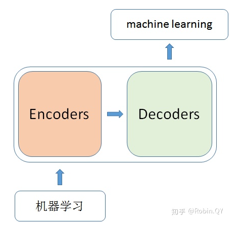

当我输入一个文本的时候，该文本数据会先经过一个叫Encoders的模块，对该文本进行编码，然后将编码后的数据再传入一个叫Decoders的模块进行解码，解码后就得到了翻译后的文本，对应的我们称Encoders为编码器，Decoders为解码器。

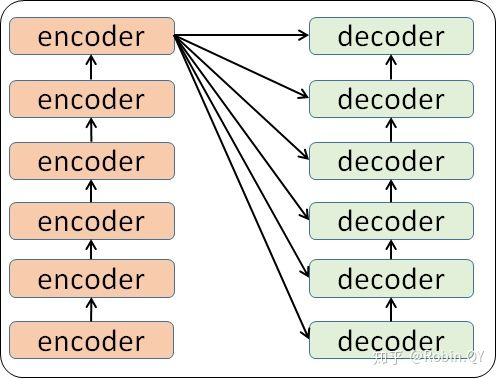

我们看到，在编码部分，每一个的小编码器的输入是前一个小编码器的输出，而每一个小解码器的输入不光是它的前一个解码器的输出，还包括了整个编码部分的输出。

我们放大一个encoder，发现里边的结构是一个自注意力机制加上一个前馈神经网络。

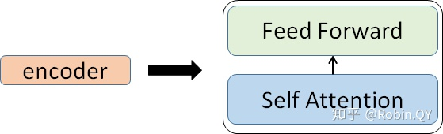

我们先来看下self-attention是什么样子的。

1、首先，self-attention的输入就是词向量，即整个模型的最初的输入是词向量的形式。那自注意力机制呢，顾名思义就是自己和自己计算一遍注意力，即对每一个输入的词向量，我们需要构建self-attention的输入。在这里，transformer首先将词向量乘上三个矩阵，得到三个新的向量，之所以乘上三个矩阵参数而不是直接用原本的词向量是因为这样增加更多的参数，提高模型效果。对于输入X1(机器)，乘上三个矩阵后分别得到Q1,K1,V1，同样的，对于输入X2(学习)，也乘上三个不同的矩阵得到Q2,K2,V2。

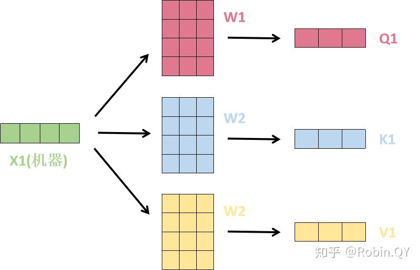

2、那接下来就要计算注意力得分了，这个得分是通过计算Q与各个单词的K向量的点积得到的。我们以X1为例，分别将Q1和K1、K2进行点积运算，假设分别得到得分112和96。

**注意，这里每一个位置的词向量都需要跟所有位置做计算，N * N 次**

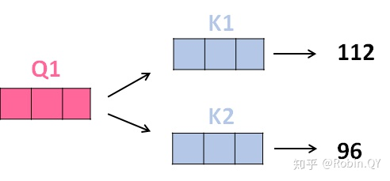

3、将得分分别除以一个特定数值8（K向量的维度的平方根，通常K向量的维度是64）这能让梯度更加稳定，则得到结果如下：

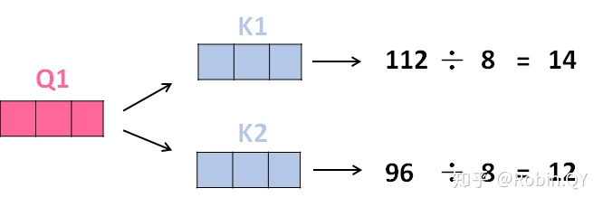

4、将上述结果进行softmax运算得到，softmax主要将分数标准化，使他们都是正数并且加起来等于1。

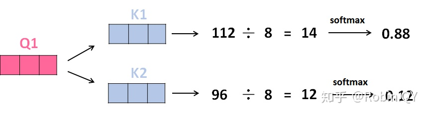

5、将V向量乘上softmax的结果，这个思想主要是为了保持我们想要关注的单词的值不变，而掩盖掉那些不相关的单词（例如将他们乘上很小的数字）

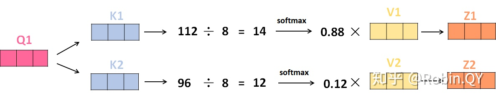

6、将带权重的各个V向量加起来，至此，产生在这个位置上（第一个单词）的self-attention层的输出，其余位置的self-attention输出也是同样的计算方式。

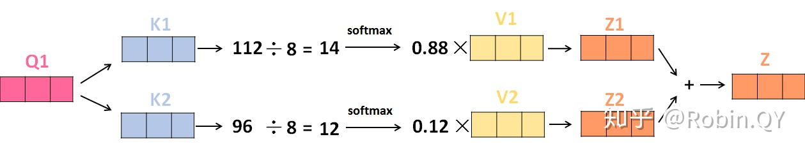

将上述的过程总结为一个公式就可以用下图表示：

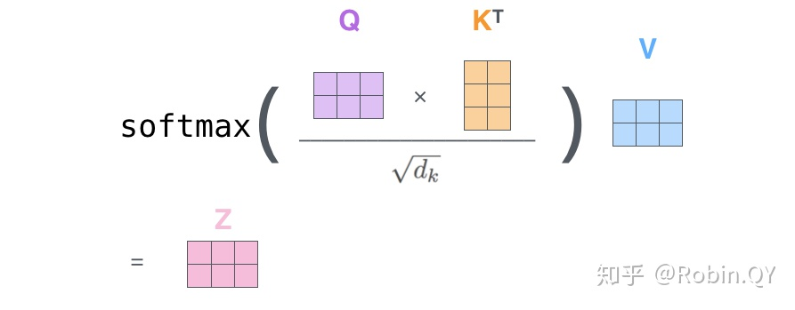

因此，对于每一个位置的词向量，都计算一个z矩阵

论文为了进一步细化自注意力机制层，增加了“多头注意力机制”的概念，这从两个方面提高了自注意力层的性能。

第二个方面，他给了自注意力层多个“表示子空间”。对于多头自注意力机制，我们不止有一组Q/K/V权重矩阵，而是有多组（论文中使用8组），所以每个编码器/解码器使用8个“头”（可以理解为8个互不干扰自的注意力机制运算），每一组的Q/K/V都不相同。然后，得到8个不同的权重矩阵Z，每个权重矩阵被用来将输入向量投射到不同的表示子空间。

经过多头注意力机制后，就会得到多个权重矩阵Z，我们将多个Z进行拼接就得到了self-attention层的输出：

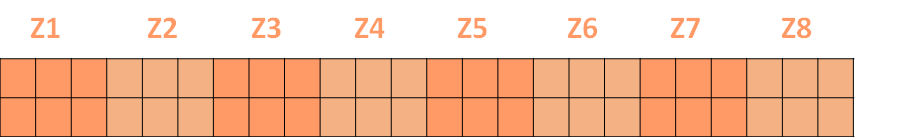

上述我们经过了self-attention层，我们得到了self-attention的输出，self-attention的输出即是前馈神经网络层的输入，然后前馈神经网络的输入只需要一个矩阵就可以了，不需要八个矩阵，所以我们需要把这8个举着压缩成一个，我们怎么做呢？只需要把这些矩阵拼接起来然后用一个额外的权重矩阵与之相乘即可。

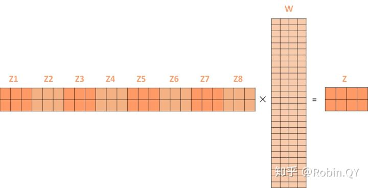

最终的Z就作为前馈神经网络的输入。

接下来就进入了小编码器里边的前馈神经网模块了，关于前馈神经网络，网上已经有很多资料，在这里就不做过多讲解了，只需要知道，前馈神经网络的输入是self-attention的输出，即上图的Z,是一个矩阵，矩阵的维度是（序列长度×D词向量），之后前馈神经网络的输出也是同样的维度。

以上就是一个小编码器的内部构造了，一个大的编码部分就是将这个过程重复了6次，最终得到整个编码部分的输出。

然后再transformer中使用了6个encoder，为了解决梯度消失的问题，在Encoders喝Decoder中都是用了残差神经网络的结构，即每一个前馈神经网络的输入不光包含上述self-attention的输出Z，还包含最原始的输入。

上述说道的encoder是对输入（机器学习）进行编码，使用的是自注意力机制+前馈神经网络的结构，同样的，在decoder中使用的也是同样的结构。也是首先对输出（machine learning）计算自注意力得分，不同的地方在于，进行过自注意力机制后，将self-attention的输出再与Decoders模块的输出计算一遍注意力机制得分，之后，再进入前馈神经网络模块。

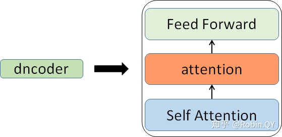

以上，就讲完了Transformer编码和解码两大模块，那么我们回归最初的问题，将“机器学习”翻译成“machine learing”，解码器输出本来是一个浮点型的向量，怎么转化成“machine learing”这两个词呢？

是个工作是最后的线性层接上一个softmax，其中线性层是一个简单的全连接神经网络，它将解码器产生的向量投影到一个更高维度的向量（logits）上，假设我们模型的词汇表是10000个词，那么logits就有10000个维度，每个维度对应一个惟一的词的得分。之后的softmax层将这些分数转换为概率。选择概率最大的维度，并对应地生成与之关联的单词作为此时间步的输出就是最终的输出啦！！

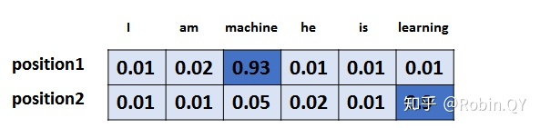

以上就是Transformer的框架了，但是还有最后一个问题，我们都是到RNN中的每个输入是时序的，是又先后顺序的，但是Transformer整个框架下来并没有考虑顺序信息，这就需要提到另一个概念了：“位置编码”。

Transformer中确实没有考虑顺序信息，那怎么办呢，我们可以在输入中做手脚，把输入变得有位置信息不就行了，那怎么把词向量输入变成携带位置信息的输入呢？

我们可以给每个词向量加上一个有顺序特征的向量，发现sin和cos函数能够很好的表达这种特征，所以通常位置向量用以下公式来表示：

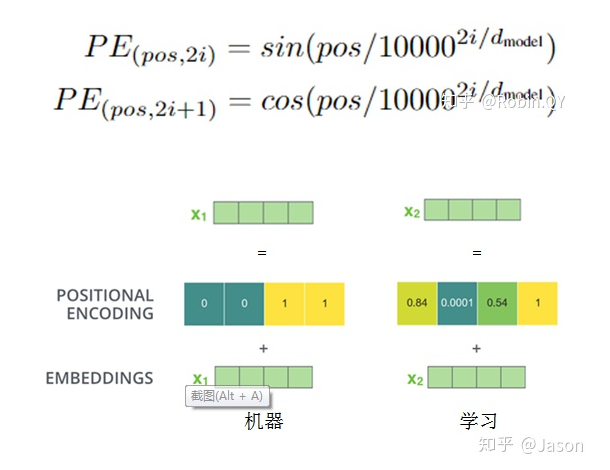

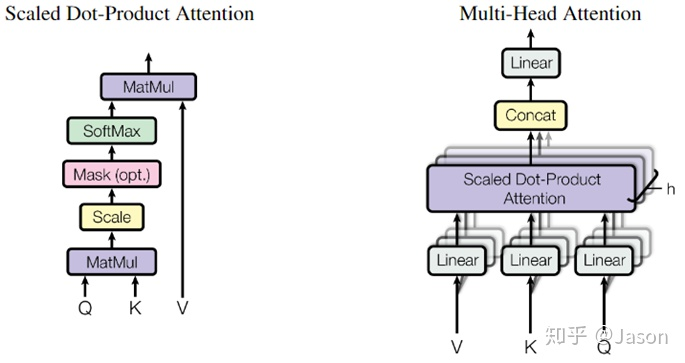

#### Transformer模型的位置编码

## **Why: 为什么需要位置编码?**

为什么需要位置编码？引入位置编码主要归因于两方面：

（1）对于任何一门语言，单词在句子中的位置以及排列顺序是非常重要的，它们不仅是一个句子的语法结构的组成部分，更是表达语义的重要概念。一个单词在句子的位置或排列顺序不同，可能整个句子的意思就发生了偏差。

> I **do not** like the story of the movie, but I **do** like the cast.
> I **do** like the story of the movie, but I **do not** like the cast.

上面两句话所使用的的单词完全一样，但是所表达的句意却截然相反。那么，引入词序信息有助于区别这两句话的意思。

（2）Transformer模型抛弃了RNN、CNN作为序列学习的基本模型。我们知道，循环神经网络本身就是一种顺序结构，天生就包含了词在序列中的位置信息。当抛弃循环神经网络结构，完全采用Attention取而代之，这些词序信息就会丢失，模型就没有办法知道每个词在句子中的相对和绝对的位置信息。因此，有必要把词序信号加到词向量上帮助模型学习这些信息，位置编码（Positional Encoding）就是用来解决这种问题的方法。

