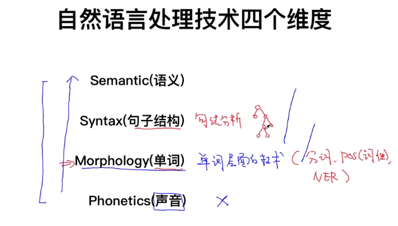

## 一、分词

分词工具介绍

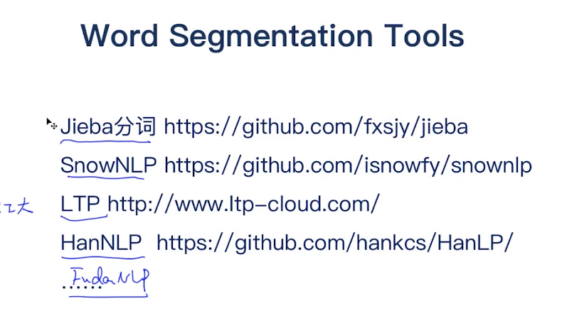

### 前向最大匹配算法 (forward max matching)

定义max _len  = 5 

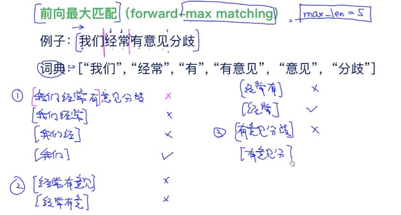

先选择max _len 个字符，依次减一判断剩下的字符串在不在词典中直到匹配，然后再次循环取max _len 个字符

### 后向匹配算法 （backward max matching）

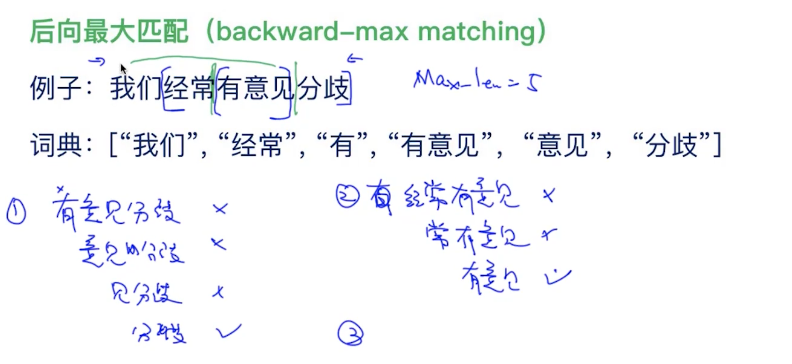

### 考虑语义（incorporate semantic）

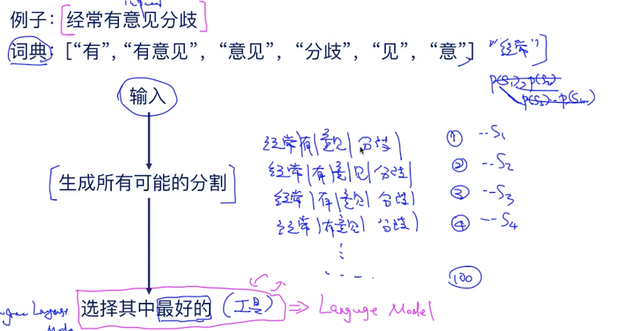

问题：复杂度很高，效率低

怎么解决效率的问题

#### 维特比算法

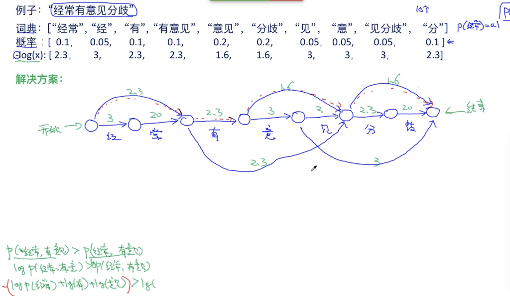

给定词典和词的概率，分词问题变为找路径问题，找概率乘积最大的路径，即找-log和 最小的路径

因此变成最小路径问题，动态规划

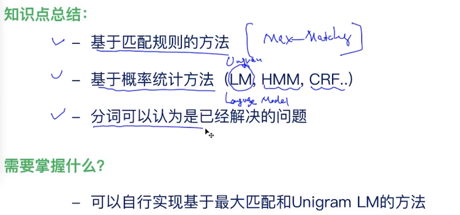

## spell correction 拼写错误纠正 

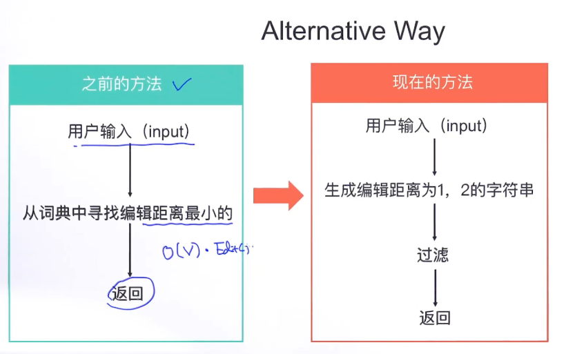

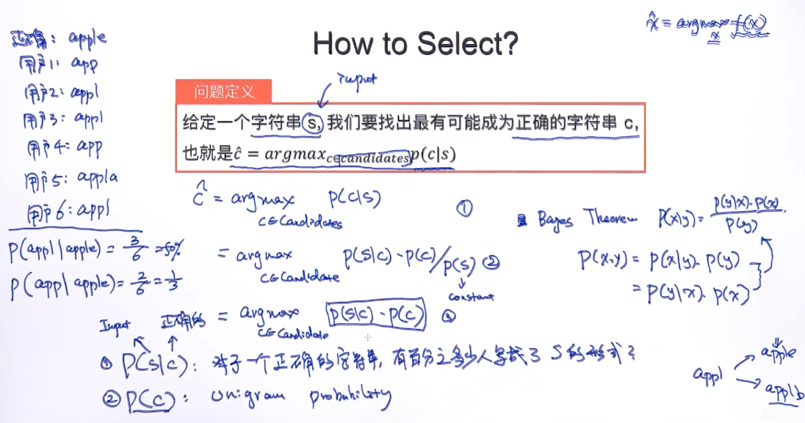

argmax p(c|s) 表示给定字符串，找到最可能的字符串c

根据贝叶斯公式 p(c|s) = p(s|c)*p(c)/p(s), s给定,p(s)固定，p(s|c) 表示用户把字符串c输入错为s的概率，可以通过历史统计得到，p(c) 表示c 出现的概率，unigram probabilty 可能根据文献，图书中出现的概率求得,因此，通过贝叶斯公式可以转化为可求得的方式

## Filtering words 词过滤

停用词过滤，出现频率低的词汇过滤

英文中 the an their 都可以作为停用词，但是可要考虑自己的应用场景

stemming ：one way to normalize

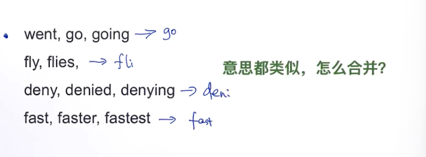

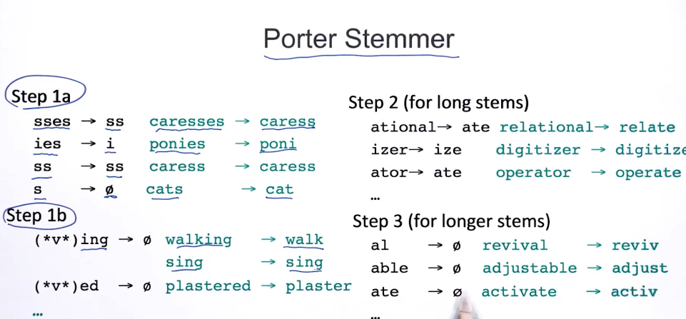

## word representation

one hot 向量表示，向量长度等于词典大小，词典里面为已分词的词

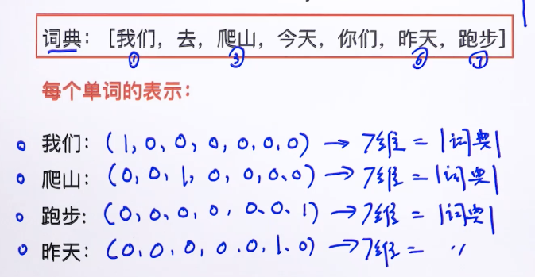

boolean 类型的one hot 表示

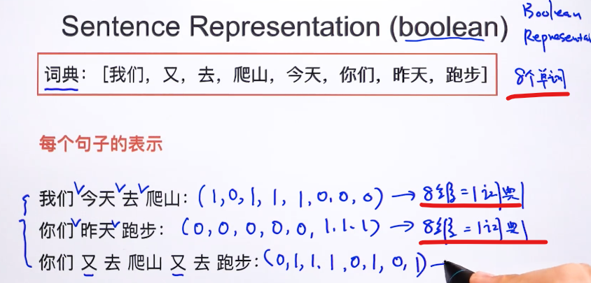

统计个数的one hot,考虑词频

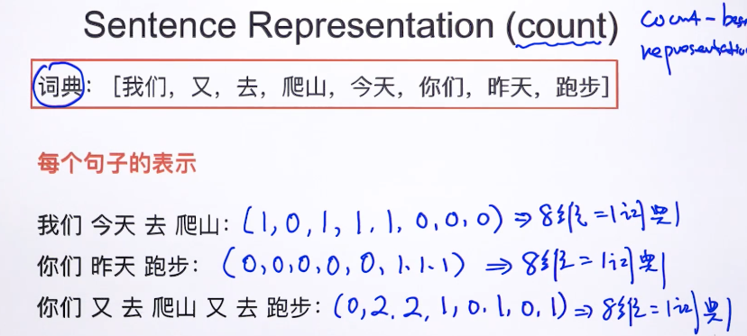

### 文本相似度

欧式距离计算相似度

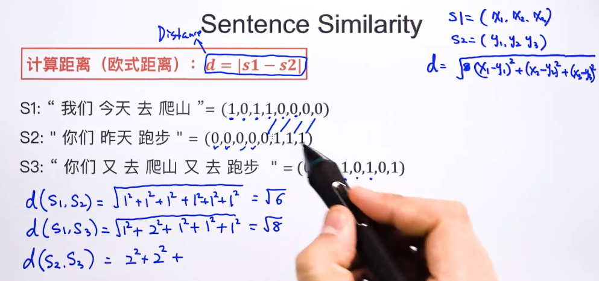

余弦相似度 cosine  similarity

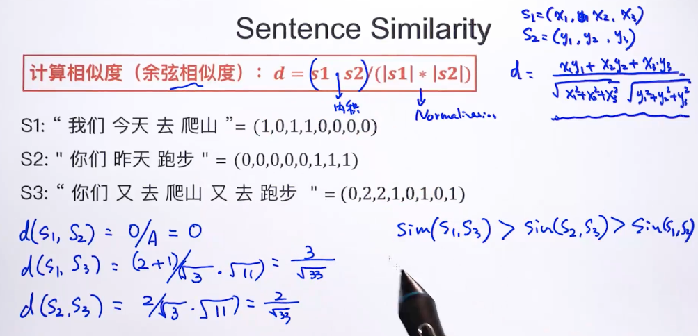

one hot 向量表示缺点

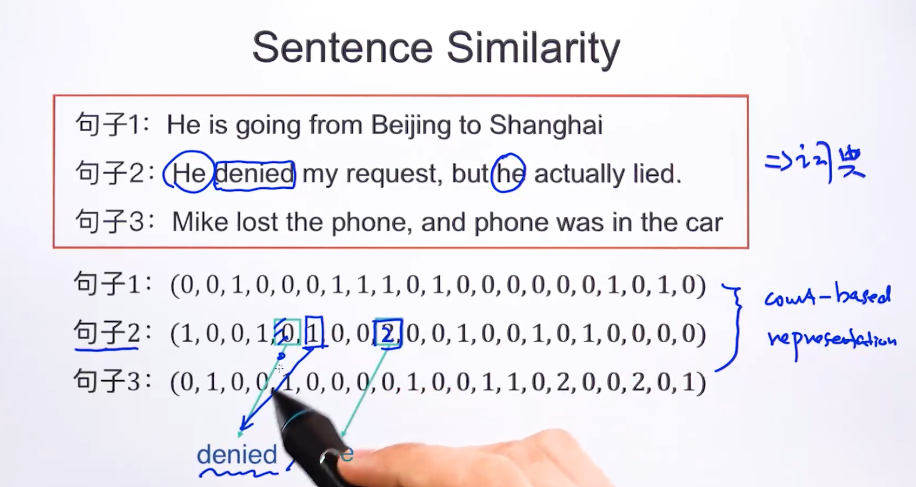

出现频次高的不一定最重要，因此one hot 表示有缺陷，在句子2中，denied 重要性最高，而 he 相对不重要，但是频次2 高于denied 的1

### tf-idf representation

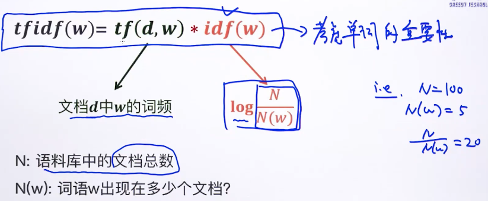

tf(d,w) 表示当前词w的词频，idf(w)  表示词w的重要性，在N中出现的次数越少越重要，例如 he 可能在很多文档里都出现过，因此N/N(w) 会比较小，因此综合的tfidf(w) 不一定会很大

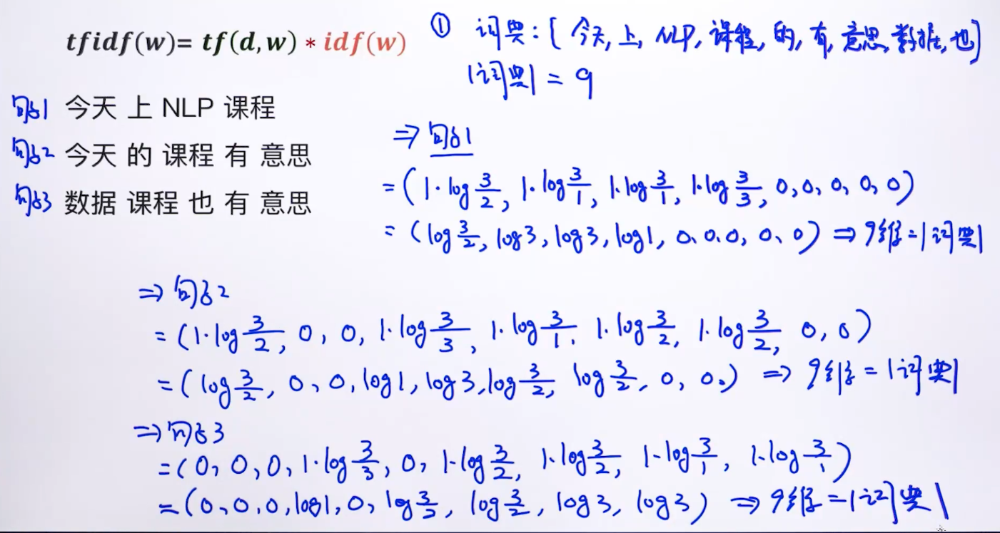

给三句话如何计算tfidf  

1.根据这三句话创建词典

2.N = 3，N(w)表示该词出现在几句话中

3.tf(d,w) 计算词频，计算idf(w) 

### measure similaritybetween words 词相似度

上面讨论的都是文本的相似度，如何表示词之间的相似度？ 

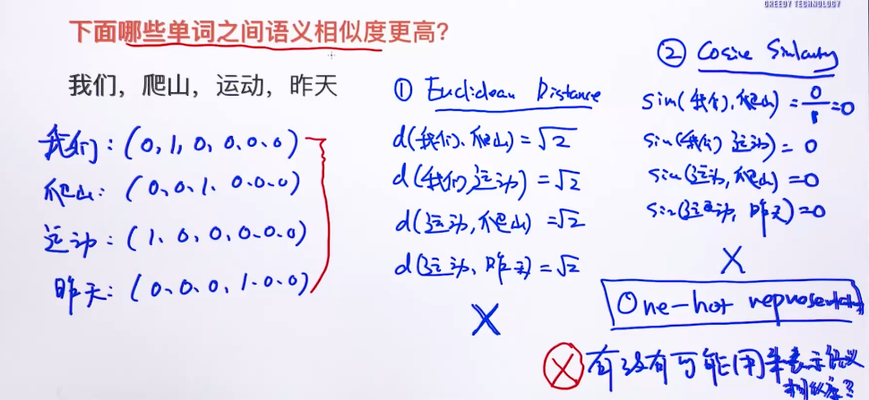

显然，one hot 表示的词向量中，计算词向量相似度中，欧式距离和余弦距离都失效了，词的相似度从语义相关的角度来考虑

由于词典数量很大，而one hot 表示的向量太sparsity 

#### from one-hot representation to distributed representation

 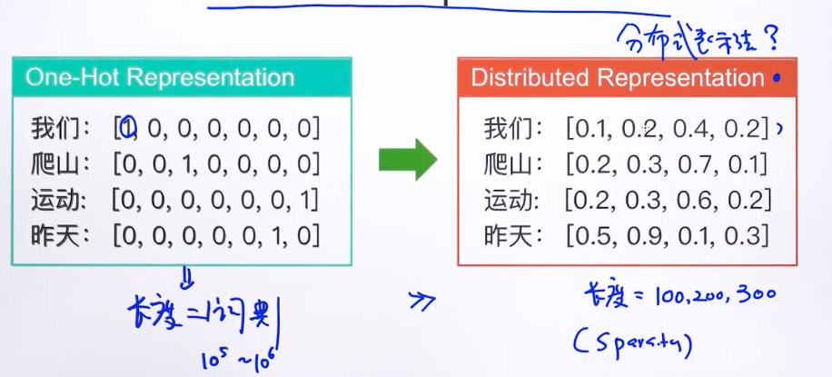

分布式的表示方法向量的每个位置都是非0表示，同时向量的长度可自定义，不依赖词典的长度

通过分布式的词向量表示，因此可以计算词向量的相似度

### learn word embeddings 学习词向量

学习词向量的模型这里一般为深度学习模型

skip-grim,rnn mf,CBOW,Glove等可以训练词向量

训练词向量的流程，输入大量的句子到深度学习模型中，训练得到词向量

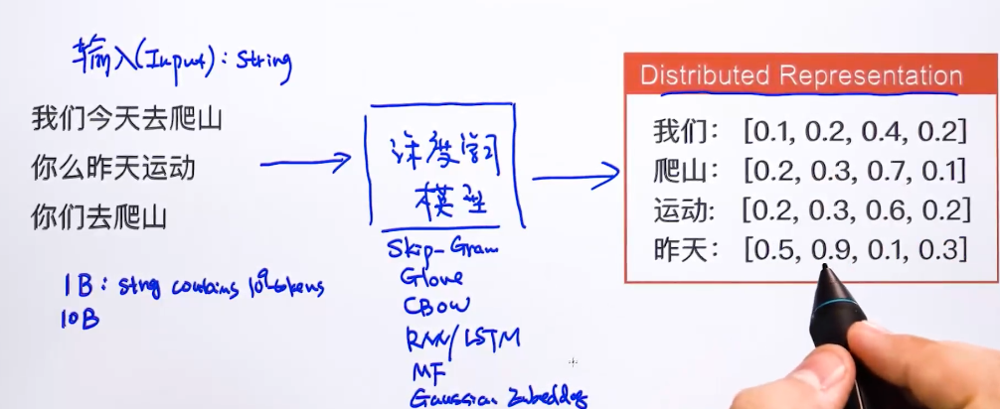

很多时候，大公司已经训练好了很多的词向量，直接拿过来用就行了，但是针对特殊领域，医疗，金融领域依然需要手动训练词向量

### essence of word embedding

词向量从某种意义上可以理解成为词的意思，meaning

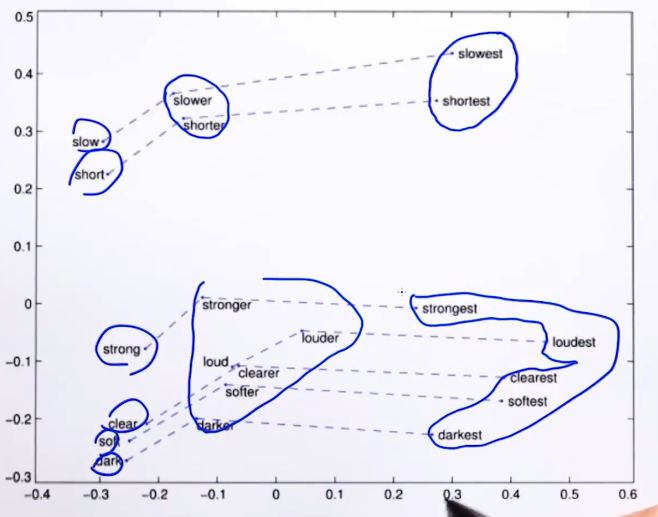

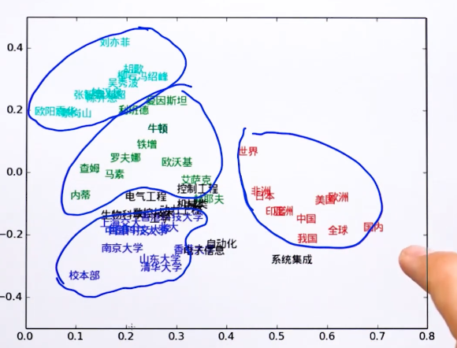

### from word embedding to sentence embedding

根据词向量如何得到句子的向量

1、平均法

 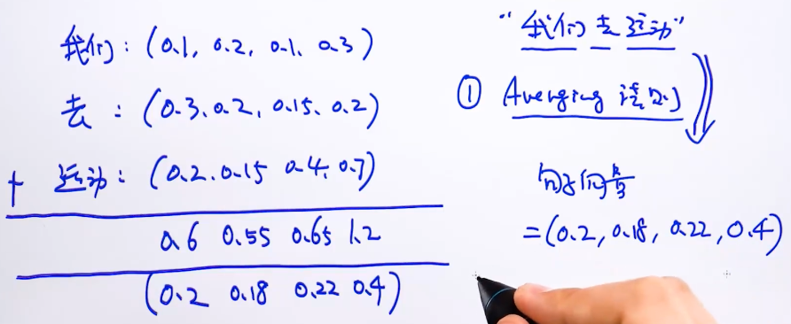

2、lstm  rnn 方法得到句子向量

### recap retrieval based QA system

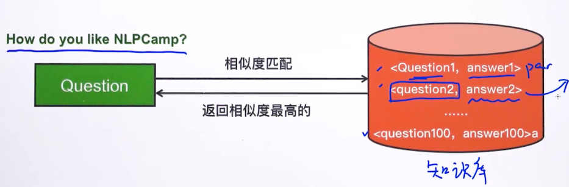

问答系统中，给出一个问题question，同时有一个知识库，知识库里面是问题和答案pair 的库，

问答系统的功能就是从知识库里面挑一个跟问题最相似的 问题答案pair,有N个pair，就有N个求相似度的过程，时间复杂度O(N) 

How to reduce time complexity 

核心思路 层次过滤思想

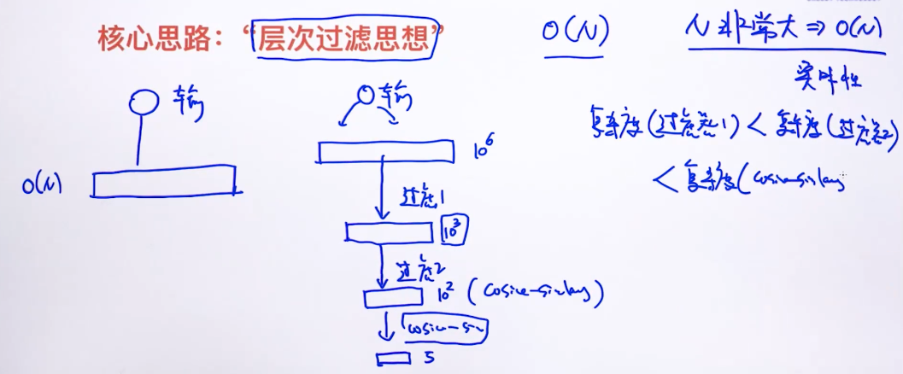

先过滤掉不可能的选项，再拿剩下的选项去做余弦相似度计算比对

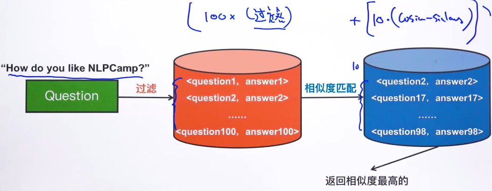

过滤可以极大低降低时间复杂度

#### introducing inverted index 倒排表

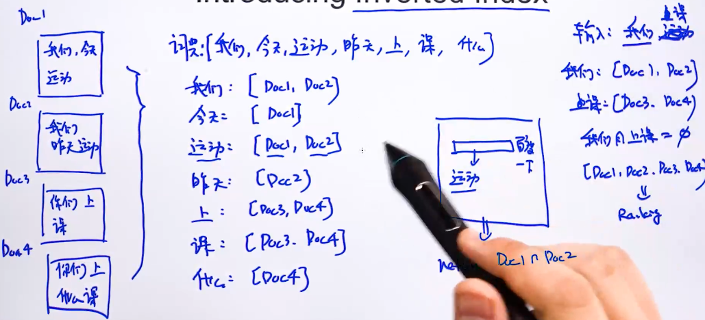

从搜索引擎来看，现在的做法是预先检索文档里面出现的所有词汇，根据词汇建立词汇与文档的索引关系，当用于输入一个词汇时，可以直接根据这个索引直接找到所有的相关的文档,**这种方法叫做倒排表**

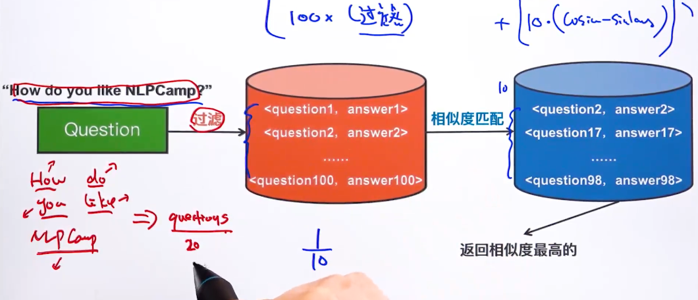

回到QA，首先把question 分词，**根据预先建立好的索引**，然后从知识库的问题中过滤掉不包含question输入的，即过滤知识库的每一个问题中都没有输入的question中的词汇，剩下的问题都是可能相关的，通过这种方法可以极大地降低计算量

### Noisy channel model 

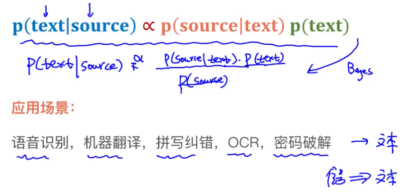

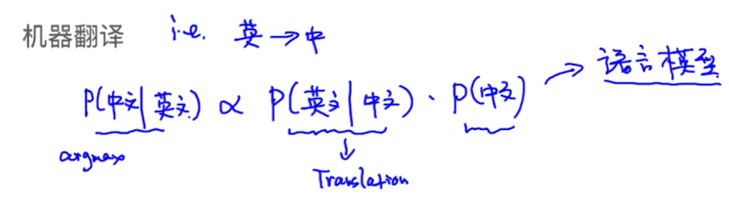

在机器翻译中，可以使用上述的表达式来表示，以英中翻译为例，根据贝叶斯公式，可以得到右侧的模型，p(英|中)表示的是中英的翻译模型，而p(中)表示的是中文的语言模型

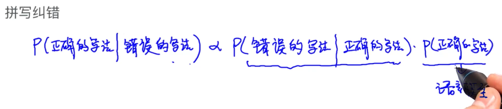

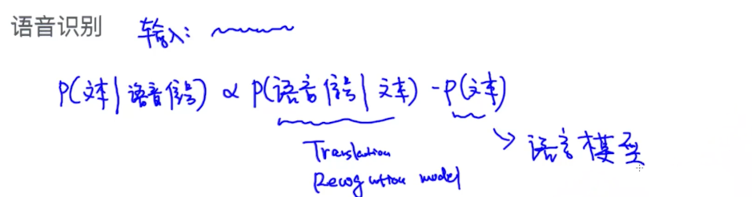

p(信号|文本)  识别模型

p(文本) 判断输出文本是合理的

### language model  （LM）

语言模型作用，用于判断一句话从语法上通顺

 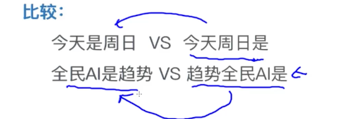

在翻译任务中，很可能得到的是右边的结果，因此需要用语言模型纠正成左边的结果

#### Chain rule 

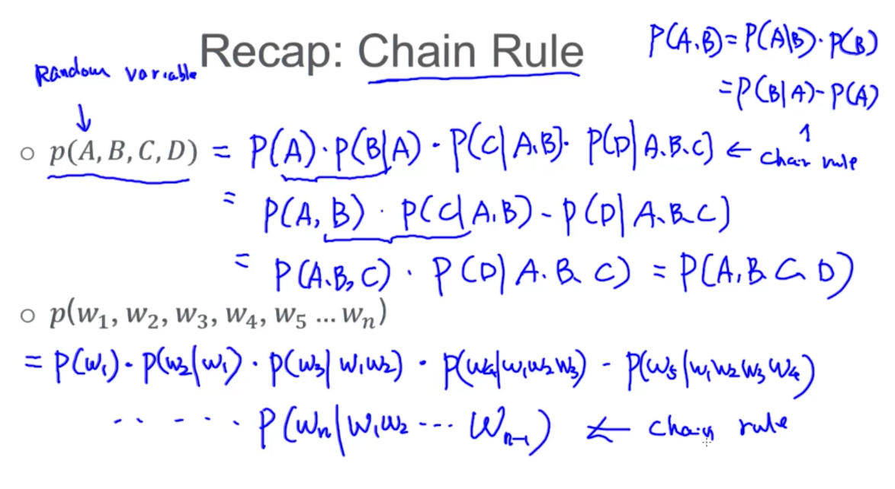

联合概率的链式法则  ，当 A B C D 非条件独立时，可以使用上述的式子求出联合概率

同理，当求语言模型的概率时

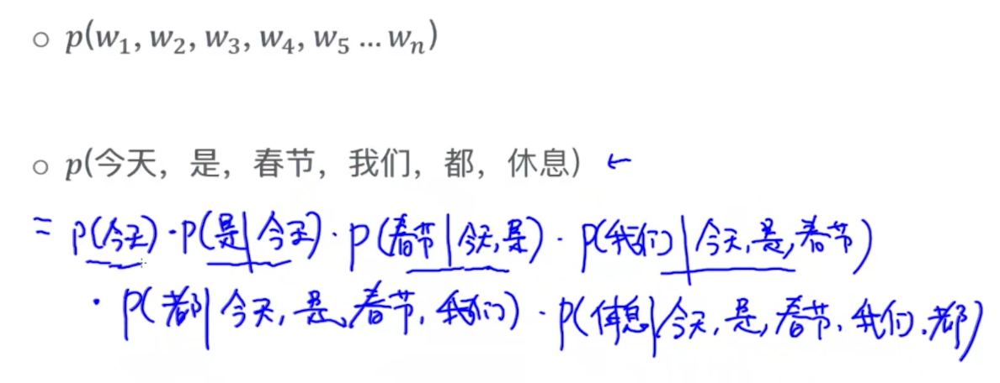

#### markov assumption 马尔可夫假设

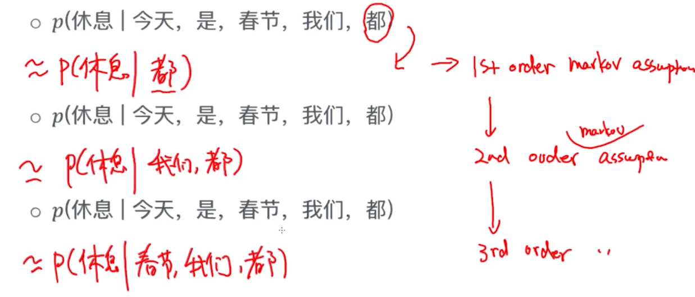

当要预测 **休息** 的概率时，已知的条件概率前提太长了，在文档中出现的概率很小，或者可能没有，因此，根据马尔库夫假设，可以将条件概率约等于 p(休息|都)，这是1st order assumption，或者p(休息|我们，都) 这是2st order assumption 等等，从而极大地简化计算

根据马尔可夫假设，可以在求语言模型时简化概率如下，

p(w1,w2,w3,...wn) = p(w1)p(w2|w1)P(w3|w2)P(w4|w3)...p(wn|wn-1)  一阶马尔可夫假设

还有二阶，或者三阶概率

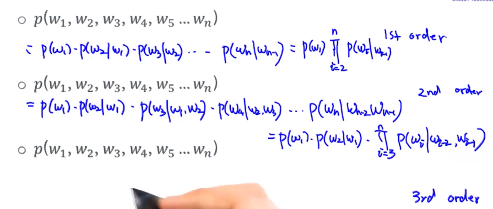

使用一阶 马尔可夫假设时，语言模型的计算过程如下

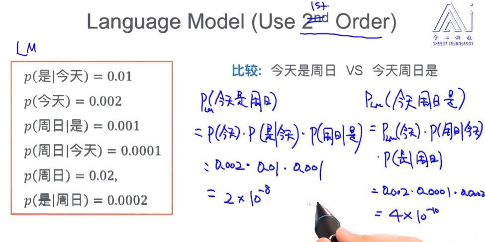

### language model : unigram

当认为变量条件独立时，即为unigram 模型

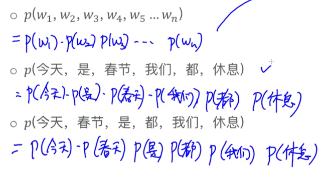

显然，在第二种情况和第三种情况下时，概率是相等的，但是语义没有考虑

### language model ：bigram   -> 1st order  markov assumption

一阶马尔可夫假设即是 bigram 

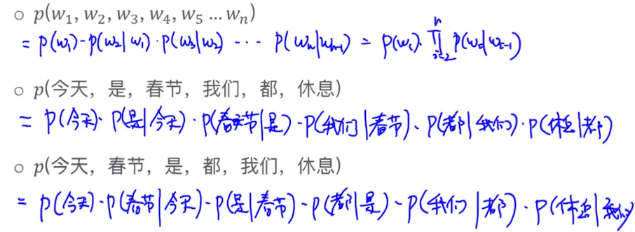

### language model : N-gram    N > 2 higher order

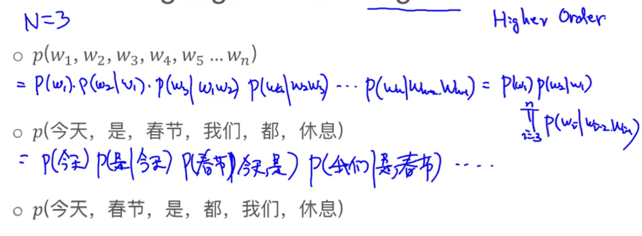

### unigram : estimating probability

如何计算单个词汇的概率 

统计法，统计某个词汇出现的次数，除以语料库中总的词汇量

 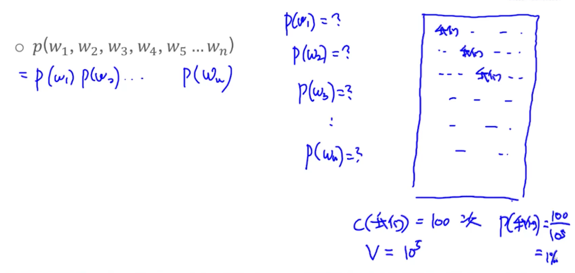

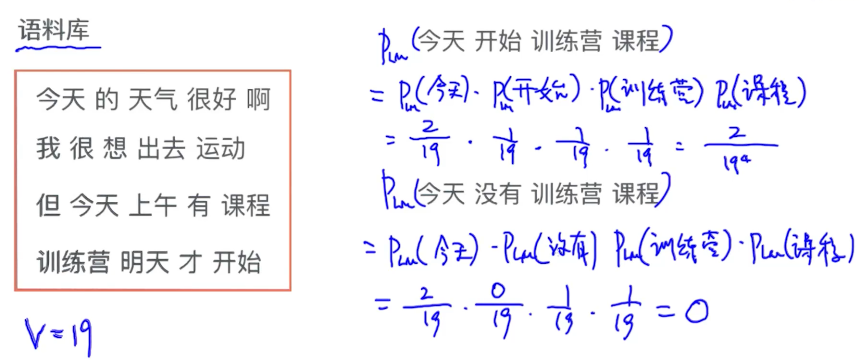

当某些词汇并不在语料库中的时候，会采用平滑项，避免出现0的情况

### bigram : estimating probability

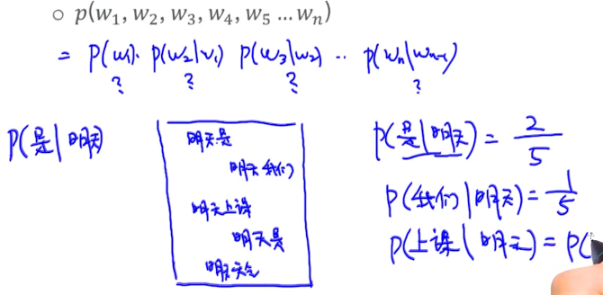

以例子中的条件为例，bigram 求条件概率时，统计文档中满足条件的概率

求p(w2| w1) 时，计算c(w2,w1)/c(w1), 出现的次数的比值即得到概率

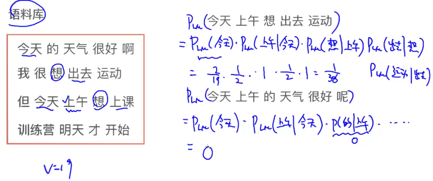

### N-gram : estimating probability

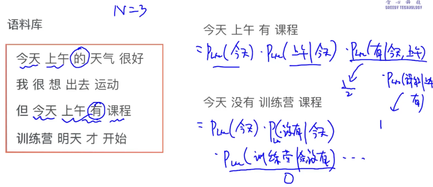

### evaluation of language model 

 perplexity = 2exp(-x)    x: average log likelihood

perplexity 越小越好

计算perplexity

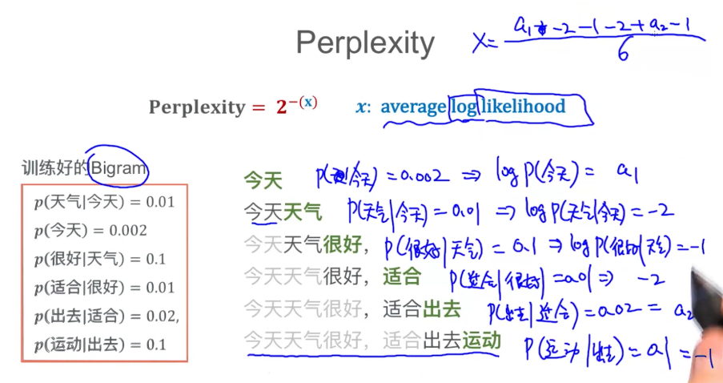

依次计算条件概率，即likelihood，然后取log，再取平均值，得到x,可求得perplexity

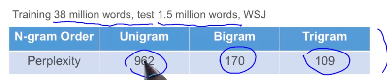

*<u>当语料库中没有某个出现的词汇时，会导致计算的概率为0，因此采用平滑的方法规避这种情况</u>*

### Smoothing

add-one smoothing

add-k smoothing

interpolation

good-turning smoothing

#### add-one smoothing (laplace smoothing)

通过加上平滑项  **1 和 V** ，避免出现概率为0 的情况

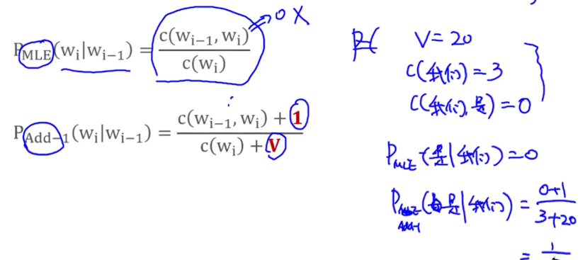

v 表示词典中的词汇的数量（去重）

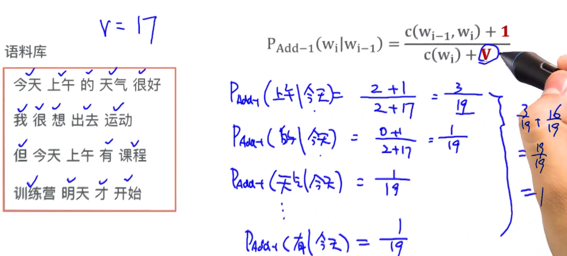

例如语料库中v=17,分别计算条件为<u>**今天**</u>时，其他词汇出现的概率

<u>今天</u>出现两次，今天上午 ，带入公式计算概率值

#### add-k smoothing ( laplace smoothing)

 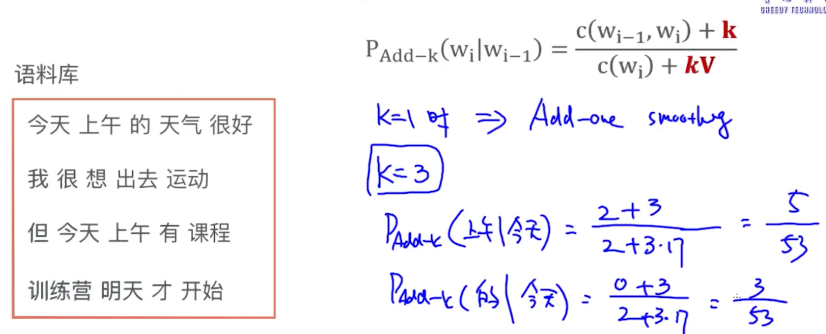

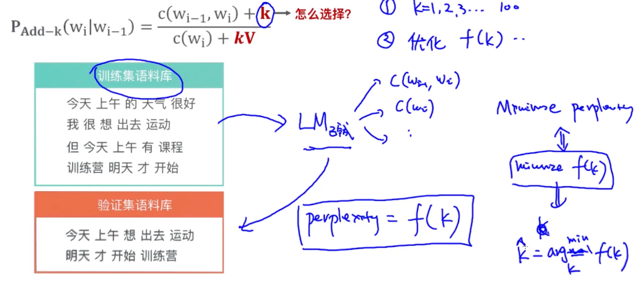

在训练数据集上训练好的模型，放在验证集上测试时，求的的perplexity 相当于k的函数，因此整个过程可以认为是k的最优化问题，使得perplexity最小

#### interpolation

核心思路：在计算trigram 概率时同时考虑unigram，bigram,trigram 出现的频次

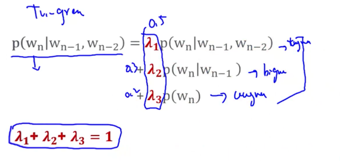

解决方法是对 trigram bigram unigram 做加权平均 

