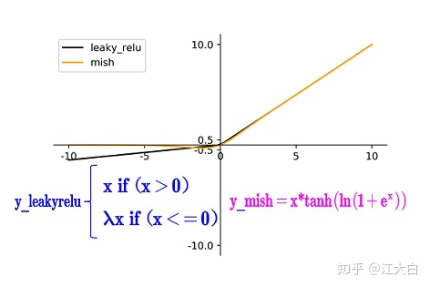

## 目标检测综合

### yolo系列

#### yolov2

特点：darknet网路；使用先验框；多尺度训练

**一、Batch normalization（每个卷积之后进行批归一化）**

批归一化可以提升模型的收敛速度，而且起到正则化的效果，降低模型的的过拟合，YOLOv2中，每个卷积层后面都添加了batch normalization, 不再使用dropout, mAP提高了2.4%

**二、High-resolution classifier****（使用****448\*448****大小的图片训练****darknet-19****）**

YOLOv1中GoogleNet训练的图片大小是224*224，YOLOv2在ImageNet数据上使用448*448来finetune分类网络这一中间过程（10epochs）,使得模型在监测数据集之前已经适用高分别率输入

**三、Convolutional with anchor boxes****（采用先验框）**

YOLOv1最后直接使用全连接层对边界框进行预测，其中边界框的高度是相对整张照片大小的，而由于各个图片中存在不同尺寸和长宽比的物体，YOLOv1在训练过程中学习适应不同物体的形状是比较困难的，这也导致YOLOv1在精确定位方面的表现较差。

YOLOv2借鉴Faster-CNN的RPN网络的先验框，PRN对CNN特征提取器得到的特征图进行卷积来预测每个位置的边界框以及置信度（是否有目标），并且各个位置设置不同尺寸和比例的先验框，**所有RPN预测的是边界框相对于先验框的偏移值，使用先验框使得更容易学习**

为了使检测框的分辨率更高，移除其中的一个pool层，在检测模型中输入是**416\*416**大小的，YOLOv2模型下采样总步长是32，因此得到的特征图大小为13*13，只有一个中心位置。对于一些大的物体，他们的中心点落在图片中心位置，此时使用特征图的一个中心点去预测物体的边界框相对容易一些。YOLOv2中包保证最终的特征图有奇数个位置

YOLOv1中每个gird cell值预测一套分类概率值（其实是置信度下的条件概率值）供两个boxes分享。

YOLOv2使用了anchor boxes之后，每个位置的各个anchor box都单独预测一套分类概率值

**使用了anchor box之后mAP稍微下降（原因是什么？）但是召回率有81%提升到88%。**

**四、Dimension clusters****（使用聚类选择先验框的个数）**

在Faster-RCNN和SSD中，先验框的长和宽是主观手动设置的，设置的先验框比较合适则更容易学习，反之。因此YOLOv2对训练集的边界框做K-MEANS聚类分析。先验框的主要目的是为了使得预测框和ground truth的IOU更好，所以聚类分析时选用box与聚类中心box之间的IOU值作为距离标准：

**五、Direct location prediction****（采用左上方为参考点，计算以左上方为参考点的偏移值）**

YOLOv2借鉴RPN网络使用anchor boxes来预测边界框相对先验框的offsets.边界框的实际中心位置（x,y）

需要根据预测的坐标偏移值(tx,ty)(tx,ty)，先验框的尺度(wa,ha)(wa,ha)以及中心坐标(xa,ya)(xa,ya)（特征图每个位置的中心点）来计算：

x=(tx*wa)−xa,y=(ty*ha)−ya

上面的公式是无约束的，预测的边界框很容易向任何方向偏移，这导致模型的不稳定性，需要很长时间预测出正确的offsets。所以YOLOv2弃用这种方法，而是用YOLOv1的方法，就是：**预测边框中心点相对于对应网格左上角的相对偏移值**，使用sigmoid函数处理偏移值，根据边界框预测tx,ty,tw,th4个offsets值。

这就是YOLOv2边界框的整个解码过程。约束了边界框的位置预测值使得模型更容易稳定训练，结合聚类分析得到先验框与这种预测方法，YOLOv2的mAP值提升了约5%。

**Multi-scale training（**多输入尺度训练：一个重要的创新点）

**YOLOv2****模型只有卷积核池化层，所以输入大小没有限制**，为了增强鲁棒性，YOLOv2采用了多尺度训练策略，就是在训练过程中每经过一定的itreations之后改变模型输入图片大小，由于YOLOv2的下采样总步长为32，输入图片大小选择一系列为32倍数的值。

**YOLOv2*的训练

1. 在ImageNet训练Draknet-19，模型输入为**224\*224**，共160个epochs
2. 调整网络输入为448*448，继续在ImageNet上finetune分类模型，训练10epoches
3. 修改Darknet-16分类模型为检测模型，并在监测数据集上继续finetune模型

​           网络修改包括：

1. 移除最后一个卷积层、global avgpooling层和softmax层
2. 增加3个3*3*2014卷积层
3. 增加passthrough层
4. 最后使用1*1卷积层输出预测结果，输出的channel数为num_anchors*(5+num_calsses)

**YOLOv2****的先验框匹配**

对于训练图片中的ground truth，如果其中心店落在某个cell内，那么该cell内的***\*5\*******\*个先验框\****所对应的边界框负责预测它，具体是哪个预测它，需要在训练中确定，即由那个与ground truth的IOU最大的边界框预测它，而剩余的边界框不与该ground truth匹配。YOLOv2中同样需要假定每个cell中至多含有一个ground truth，与ground truth匹配的先验框计算坐标误差、置信度误差（此时表示target=1）以及分类误差，而其他的边界框只计算置信度误差（这个表示target=0）

说明：W,H表示特征图（13*13）的宽和高，A指先验框的数目，λ 值是各个loss部分的权重系数

1. 第一行loss是计算background的置信值；先计算各个预测框和所有ground truth的IOU值，并且取最大值ma_IOU,如果该值小于阈值（YOLOV2中使用的是0.6），就标记为background，同时计算noobj的执行度
2. 第二行计算先验框与预测框的坐标误差，只在前12800个iterations间计算
3. 第三行计算ground truth框和预测框的坐标误差，
   1. 首先确定其中心点落在哪个cell上
   2. 然后计算这个cell的5个先验框与ground truth的IOU值（不考虑坐标，只考虑形状，所以会将先验框和ground truth的中心点都偏移到同一位置，然后计算IOU，IOU最大的那个先验框与ground truth匹配，对应的先验框用来预测ground truth）
4. 第四行计算目标置信度，在YOLOv1中target=1，而YOLOv2增加了一个控制参数rescore，当其为1时，target取预测框与ground truth的真实IOU值。对于那些没有与ground truth匹配的先验框（与预测框对应），除去那些Max_IOU低于阈值的，其它的就全部忽略，不计算任何误差
5. 第五行计算分类误差

需要注意的是：在计算boxes的W,H误差时，YOLOv1使用了平方根降低boxes的大小对误差的影响，而YOLOv2直接计算，但是根据ground truth的大小对权重系数进行了修正

#### YOLOV3

一、backbone

网络结构解析：

1. Yolov3中，只有卷积层，通过**调节卷积步长控制输出特征图的尺寸**。所以对于输入图片尺寸没有特别限制。流程图中，输入图片以256*256作为样例。
2. Yolov3借鉴了**金字塔特征图**思想，**小尺寸特征图用于检测大尺寸物体**，而**大尺寸特征图检测小尺寸物体**。特征图的输出维度为 ![[公式]](https://www.zhihu.com/equation?tex=N%5Ctimes+N+%5Ctimes+%5B3+%5Ctimes+%284+%2B+1+%2B+80%29%5D) ， ![[公式]](https://www.zhihu.com/equation?tex=N%5Ctimes+N) 为输出特征图格点数，一共3个Anchor框，每个框有4维预测框数值 ![[公式]](https://www.zhihu.com/equation?tex=t_x+%2Ct_y+%2Ct_w%2C+t_h) ，1维预测框置信度，80维物体类别数。所以第一层特征图的输出维度为 ![[公式]](https://www.zhihu.com/equation?tex=8+%5Ctimes+8+%5Ctimes+255) 。
3. Yolov3总共输出3个特征图，第一个特征图下采样32倍，第二个特征图下采样16倍，第三个下采样8倍。输入图像经过Darknet-53（无全连接层），再经过Yoloblock生成的特征图被当作两用，第一用为经过3*3卷积层、1*1卷积之后生成特征图一，第二用为经过1*1卷积层加上采样层，与Darnet-53网络的中间层输出结果进行拼接，产生特征图二。同样的循环之后产生特征图三。
4. concat操作与加和操作的区别：加和操作来源于ResNet思想，将输入的特征图，与输出特征图对应维度进行相加，即 ![[公式]](https://www.zhihu.com/equation?tex=y+%3D+f%28x%29%2Bx) ；而concat操作源于DenseNet网络的设计思路，将特征图按照通道维度直接进行拼接，例如8*8*16的特征图与8*8*16的特征图拼接后生成8*8*32的特征图。
5. 上采样层(upsample)：作用是将小尺寸特征图通过插值等方法，生成大尺寸图像。例如使用最近邻插值算法，将8*8的图像变换为16*16。上采样层不改变特征图的通道数。

Yolo的整个网络，吸取了Resnet、Densenet、FPN的精髓，可以说是融合了目标检测当前业界最有效的全部技巧。

检测框解码

- 检测置信度解码

物体的检测置信度，在Yolo设计中非常重要，关系到算法的检测正确率与召回率。

置信度在输出85维中占固定一位，由sigmoid函数解码即可，解码之后数值区间在[0，1]中。

- 类别解码

COCO数据集有80个类别，所以类别数在85维输出中占了80维，每一维独立代表一个类别的置信度。使用sigmoid激活函数替代了Yolov2中的softmax，取消了类别之间的互斥，可以使网络更加灵活。

三个特征图一共可以解码出 8 × 8 × 3 + 16 × 16 × 3 + 32 × 32 × 3 = 4032 个box以及相应的类别、置信度。这4032个box，在训练和推理时，使用方法不一样：

1. 训练时4032个box全部送入打标签函数，进行后一步的标签以及损失函数的计算。
2. 推理时，选取一个置信度阈值，过滤掉低阈值box，再经过nms（非极大值抑制），就可以输出整个网络的预测结果了。

训练策略与损失函数

1. 预测框一共分为三种情况：正例（positive）、负例（negative）、忽略样例（ignore）。
2. 正例：任取一个ground truth，与4032个框全部计算IOU，IOU最大的预测框，即为正例。并且一个预测框，只能分配给一个ground truth。例如第一个ground truth已经匹配了一个正例检测框，那么下一个ground truth，就在余下的4031个检测框中，寻找IOU最大的检测框作为正例。ground truth的先后顺序可忽略。正例产生置信度loss、检测框loss、类别loss。预测框为对应的ground truth box标签（需要反向编码，使用真实的x、y、w、h计算）；类别标签对应类别为1，其余为0；置信度标签为1。
3. 忽略样例：正例除外，与任意一个ground truth的IOU大于阈值（论文中使用0.5），则为忽略样例。忽略样例不产生任何loss。
4. 负例：正例除外（与ground truth计算后IOU最大的检测框，但是IOU小于阈值，仍为正例），与全部ground truth的IOU都小于阈值（0.5），则为负例。负例只有置信度产生loss，置信度标签为0。

- 训练策略解释：

1. ground truth为什么不按照中心点分配对应的预测box？

（1）在Yolov3的训练策略中，不再像Yolov1那样，每个cell负责中心落在该cell中的ground truth。原因是Yolov3一共产生3个特征图，3个特征图上的cell，中心是有重合的。训练时，可能最契合的是特征图1的第3个box，但是推理的时候特征图2的第1个box置信度最高。所以Yolov3的训练，不再按照ground truth中心点，严格分配指定cell，而是根据预测值寻找IOU最大的预测框作为正例。

（2）笔者实验结果：第一种，ground truth先从9个先验框中确定最接近的先验框，这样可以确定ground truth所属第几个特征图以及第几个box位置，之后根据中心点进一步分配。第二种，全部4032个输出框直接和ground truth计算IOU，取IOU最高的cell分配ground truth。第二种计算方式的IOU数值，往往都比第一种要高，这样wh与xy的loss较小，网络可以更加关注类别和置信度的学习；其次，在推理时，是按照置信度排序，再进行nms筛选，第二种训练方式，每次给ground truth分配的box都是最契合的box，给这样的box置信度打1的标签，更加合理，最接近的box，在推理时更容易被发现。

2. Yolov1中的置信度标签，就是预测框与真实框的IOU，Yolov3为什么是1？

（1）置信度意味着该预测框是或者不是一个真实物体，是一个二分类，所以标签是1、0更加合理。

（2）笔者实验结果：第一种：置信度标签取预测框与真实框的IOU；第二种：置信度标签取1。第一种的结果是，在训练时，有些预测框与真实框的IOU极限值就是0.7左右，置信度以0.7作为标签，置信度学习有一些偏差，最后学到的数值是0.5，0.6，那么假设推理时的激活阈值为0.7，这个检测框就被过滤掉了。但是IOU为0.7的预测框，其实已经是比较好的学习样例了。尤其是coco中的小像素物体，几个像素就可能很大程度影响IOU，所以第一种训练方法中，置信度的标签始终很小，无法有效学习，导致检测召回率不高。而检测框趋于收敛，IOU收敛至1，置信度就可以学习到1，这样的设想太过理想化。而使用第二种方法，召回率明显提升了很高。

3. 为什么有忽略样例？

（1）忽略样例是Yolov3中的点睛之笔。由于Yolov3使用了多尺度特征图，不同尺度的特征图之间会有重合检测部分。比如有一个真实物体，在训练时被分配到的检测框是特征图1的第三个box，IOU达0.98，此时恰好特征图2的第一个box与该ground truth的IOU达0.95，也检测到了该ground truth，如果此时给其置信度强行打0的标签，网络学习效果会不理想。

（2）笔者实验结果：如果给全部的忽略样例置信度标签打0，那么最终的loss函数会变成 ![[公式]](https://www.zhihu.com/equation?tex=Loss_%7Bobj%7D) 与 ![[公式]](https://www.zhihu.com/equation?tex=Loss_%7Bnoobj%7D) 的拉扯，不管两个loss数值的权重怎么调整，或者网络预测趋向于大多数预测为负例，或者趋向于大多数预测为正例。而加入了忽略样例之后，网络才可以学习区分正负例。

[reference] https://zhuanlan.zhihu.com/p/76802514

#### YOLOV4

Yolov4的结构图和Yolov3相比，因为多了**CSP结构，PAN结构**，如果单纯看可视化流程图，会觉得很绕，不过在绘制出上面的图形后，会觉得豁然开朗，其实整体架构和Yolov3是相同的，不过使用各种新的算法思想对各个子结构都进行了改进。

**先整理下Yolov4的五个基本组件**：

1. **CBM：**Yolov4网络结构中的最小组件，由Conv+Bn+Mish激活函数三者组成。
2. **CBL：**由Conv+Bn+Leaky_relu激活函数三者组成。
3. **Res unit：**借鉴Resnet网络中的残差结构，让网络可以构建的更深。
4. **CSPX：**借鉴CSPNet网络结构，由卷积层和X个Res unint模块Concate组成。
5. **SPP：**采用1×1，5×5，9×9，13×13的最大池化的方式，进行多尺度融合。

**其他基础操作：**

1. **Concat：**张量拼接，维度会扩充，和Yolov3中的解释一样，对应于cfg文件中的route操作。
2. **add：**张量相加，不会扩充维度，对应于cfg文件中的shortcut操作。

主要从以上4个部分对YoloV4的创新之处进行讲解，让大家一目了然。

1. **输入端：**这里指的创新主要是训练时对输入端的改进，主要包括**Mosaic数据增强、cmBN、SAT自对抗训练**
2. **BackBone主干网络：**将各种新的方式结合起来，包括：**CSPDarknet53、Mish激活函数、Dropblock**
3. **Neck：**目标检测网络在BackBone和最后的输出层之间往往会插入一些层，比如Yolov4中的**SPP模块**、**FPN+PAN结构**
4. **Prediction：**输出层的锚框机制和Yolov3相同，主要改进的是训练时的损失函数**CIOU_Loss**，以及预测框筛选的nms变为**DIOU_nms**

仅对比**Yolov3和Yolov4**，在COCO数据集上，同样的FPS等于83左右时，Yolov4的AP是43，而Yolov3是33，直接上涨了**10个百分点**。

##### 输入端创新

考虑到很多同学GPU显卡数量并不是很多，**Yolov4**对训练时的输入端进行改进，使得训练在单张GPU上也能有不错的成绩。比如**数据增强Mosaic、cmBN、SAT自对抗训练。**

但感觉cmBN和SAT影响并不是很大，所以这里主要讲解Mosaic数据增强。

针对这种状况，Yolov4的作者采用了**Mosaic数据增强**的方式。

主要有几个优点：

1. **丰富数据集：**随机使用**4张图片**，随机缩放，再随机分布进行拼接，大大丰富了检测数据集，特别是随机缩放增加了很多小目标，让网络的鲁棒性更好。
2. **减少GPU：**可能会有人说，随机缩放，普通的数据增强也可以做，但作者考虑到很多人可能只有一个GPU，因此Mosaic增强训练时，可以直接计算4张图片的数据，使得Mini-batch大小并不需要很大，一个GPU就可以达到比较好的效果。

##### BackBone创新

每个CSP模块前面的卷积核的大小都是3*3，stride=2，因此可以起到下采样的作用。

因为Backbone有5个**CSP模块**，输入图像是**608\*608**，所以特征图变化的规律是：**608->304->152->76->38->19**

经过5次CSP模块后得到19*19大小的特征图。

而且作者只在Backbone中采用了**Mish激活函数**，网络后面仍然采用**Leaky_relu激活函数。**

我们再看看下作者为啥要参考2019年的**CSPNet**，采用CSP模块？

CSPNet论文地址：[https://arxiv.org/pdf/1911.11929.pdf](https://link.zhihu.com/?target=https%3A//arxiv.org/pdf/1911.11929.pdf)

CSPNet全称是Cross Stage Paritial Network，主要从网络结构设计的角度解决推理中从计算量很大的问题。

CSPNet的作者认为推理计算过高的问题是由于网络优化中的**梯度信息重复**导致的。

因此采用CSP模块先将基础层的特征映射划分为两部分，然后通过跨阶段层次结构将它们合并，在减少了计算量的同时可以保证准确率。

因此Yolov4在主干网络Backbone采用CSPDarknet53网络结构，主要有三个方面的优点：

**优点一：**增强CNN的学习能力，使得在轻量化的同时保持准确性。

**优点二：**降低计算瓶颈

**优点三：**降低内存成本

##### Mish激活函数

##### Dropblock

Yolov4中使用的**Dropblock**，其实和常见网络中的Dropout功能类似，也是缓解过拟合的一种正则化方式。

中间Dropout的方式会随机的删减丢弃一些信息，但**Dropblock的研究者**认为，卷积层对于这种随机丢弃并不敏感，因为卷积层通常是三层连用：**卷积+激活+池化层**，池化层本身就是对相邻单元起作用。而且即使随机丢弃，卷积层仍然可以从相邻的激活单元学习到**相同的信息**。

因此，在全连接层上效果很好的Dropout在卷积层上**效果并不好**。

所以**右图Dropblock的研究者**则干脆整个局部区域进行删减丢弃。

这种方式其实是借鉴**2017年的cutout数据增强**的方式，cutout是将输入图像的部分区域清零，而Dropblock则是将Cutout应用到每一个特征图。而且并不是用固定的归零比率，而是在训练时以一个小的比率开始，随着训练过程**线性的增加这个比率**。

**Dropblock**的研究者与**Cutout**进行对比验证时，发现有几个特点：

**优点一：**Dropblock的效果优于Cutout

**优点二：**Cutout只能作用于输入层，而Dropblock则是将Cutout应用到网络中的每一个特征图上

**优点三：**Dropblock可以定制各种组合，在训练的不同阶段可以修改删减的概率，从空间层面和时间层面，和Cutout相比都有更精细的改进。

**Yolov4**中直接采用了更优的**Dropblock**，对网络的正则化过程进行了全面的升级改进。

##### Neck创新

在目标检测领域，为了更好的提取融合特征，通常在**Backbone**和**输出层**，会插入一些层，这个部分称为Neck。相当于目标检测网络的颈部，也是非常关键的。

Yolov4的Neck结构主要采用了**SPP模块**、**FPN+PAN**的方式。

Yolov4的Neck结构主要采用了**SPP模块**、**FPN+PAN**的方式。

##### （1）SPP模块

SPP模块，其实在Yolov3中已经存在了，在**Yolov4**的C++代码文件夹**中**有一个**Yolov3_spp版本**，但有的同学估计从来没有使用过，在Yolov4中，SPP模块仍然是在Backbone主干网络之后：

作者在SPP模块中，使用k={1*1,5*5,9*9,13*13}的最大池化的方式，再将不同尺度的特征图进行Concat操作。

**注意：**这里最大池化采用**padding操作**，移动的步长为1，比如13×13的输入特征图，使用5×5大小的池化核池化，**padding=2**，因此池化后的特征图仍然是13×13大小。

##### FPN+PAN

**PAN结构**比较有意思，看了网上Yolov4关于这个部分的讲解，大多都是讲的比较笼统的

##### Prediction创新

IOU loss

GIOU loss

DIOU loss

好的目标框回归函数应该考虑三个重要几何因素：**重叠面积、中心点距离，长宽比。**

针对IOU和GIOU存在的问题，作者从两个方面进行考虑

**一：如何最小化预测框和目标框之间的归一化距离？**

**二：如何在预测框和目标框重叠时，回归的更准确？**

CIOU loss

#### yolov5

改进点：

**（1）输入端：**Mosaic数据增强、自适应锚框计算、自适应图片缩放
**（2）Backbone：**Focus结构，CSP结构
**（3）Neck：**FPN+PAN结构
**（4）Prediction：**GIOU_Loss

（1）输入端：

Yolov5的输入端采用了和Yolov4一样的Mosaic数据增强的方式。

Mosaic数据增强提出的作者也是来自Yolov5团队的成员，不过，**随机缩放**、**随机裁剪**、**随机排布**的方式进行拼接，对于小目标的检测效果还是很不错的。

**（2） 自适应锚框计算**

在Yolo算法中，针对不同的数据集，都会有**初始设定长宽的锚框**。

在网络训练中，网络在初始锚框的基础上输出预测框，进而和**真实框groundtruth**进行比对，计算两者差距，再反向更新，**迭代网络参数**。

