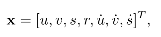

# 目标跟踪

## 论文 算法

#### simple online and realtime tracking

### 摘要

本文探讨了一种实用的多 目标跟踪方法，旨在有效地联合 目标做在线和实时地应用。为此，检测质量被认为是影响跟踪性能的关键因素，其中改变检测器可以改善追踪率高达18.9%。尽管只使用了一种将大家熟悉的**卡尔曼滤波**和***\*匈牙利算法\**** 作为跟踪组建的初级结合，该方法实现了与现有最先进跟踪技术相当的精度。此外，由于我们的跟踪简单化，**跟踪器以260Hz的速率做更新**，比其他先进跟踪器快了20倍。

关键词——计算机视觉，多目标跟踪，检测，数据关联

本文侧重于高效可靠地处理常见的帧到帧间的关联，利用目标检测的最新进展来解决检测问题，不做目标检测误差针对性解决

本文主要贡献：

- 利用基于CNN的检测器；
- 呈现了一种基于卡尔曼滤波和匈牙利算法的 实用性跟踪方法；

方法：

1目标检测，目标检测的性能能极大地提高跟踪的效果

2 估计模型   外观模型，运动模型将会被传到下一帧中用于身份识别，我们认为**每个目标的帧间位移满足线性恒速模型，并且每个目标间的运动是独立的，和相机的运动也是独立的**。那每个目标的状态模型可以描述为：

其中u和v代表目标中心的水平和垂直的像素位置；

s和r分别表示：目标的尺度（面积） ， 目标框bbox的比例值（注：比例r被认为是常数）；

**数据关联**

在为现有目标分配检测时，每个目标框的bbox几何框都是通过预测当前帧新的位置估计得到的。assignment cost matrix **分配代价矩阵**通过每个**检测结果**和**所有现有目标的预测框** 间的**IOU距离**计算得到。**分配方法通过使用匈牙利算法得到最佳优化**。此外，到检测到的IOU与预测目标物间IOU小于IOUmin阈值时，检测的物体将被拒绝分配。

我们发现边界框的IOU距离能够潜在解决因目标移动造成的短时间遮挡问题。具体地说，当目标物被遮挡物遮挡时，只有遮挡物被检测出来，由于IOU距离适当地支持具有类似尺度目标的检测。这使得遮挡物目标需要通过检测得到矫正，而被遮挡的目标不受影响，因为没有分配任务。

**创建与输出跟踪ID**

当目标进入和离开图像时，唯一的ID需要创建或者销毁。用于创建跟踪器时，我们认为任何检测结果重叠小于IOUmin时，存在没有被跟踪的对象。使用边界框的几何图形来初始化跟踪器，并使速度设置为0。由于速度此时速度未被观测到，初始速度分量的协方差很高，反应了这种不确定性。此外，新的跟踪器需要经历试用期，即目标物需要与检测结果相关联积累到足够才能防止误追踪。

当跟踪器未被检测到TLost帧时，将终止这个跟踪器。这么做可以防止跟踪器数量的无线增长，以及长时间未通过检测来得到矫正的局部误差增长。在所有实验中，TLost设置为1有有两个原因：第一，恒定速度模型在真实动力学模型中是个很差的预测模型；第二，我们主要关注帧和帧之间的跟踪，而目标REID超出本工作范围。此外，早期删除目标有助于提高效率。如果目标重新出现，则会隐式分配新的ID来跟踪。

