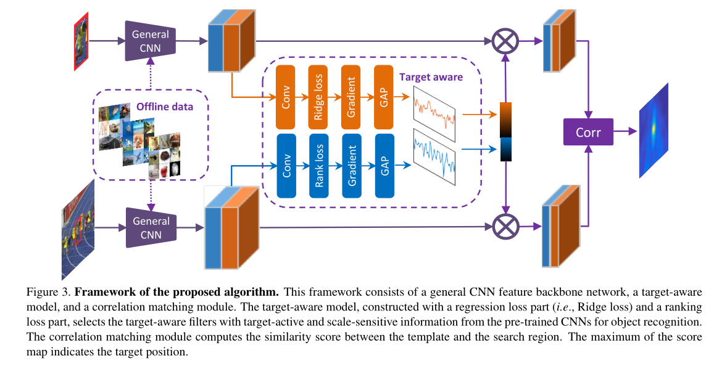

# person reid

在监控视频中，由于相机分辨率和拍摄角度的缘故，通常无法得到质量非常高的人脸图片。当人脸识别失效的情况下，ReID就成为了一个非常重要的替代品技术。ReID有一个非常重要的特性就是跨摄像头，所以学术论文里评价性能的时候，是要检索出不同摄像头下的相同行人图片。ReID已经在学术界研究多年，但直到最近几年随着深度学习的发展，才取得了非常巨大的突破。因此本文介绍一些近几年基于深度学习的ReID工作，由于精力有限并不能涵盖所有工作，只能介绍几篇代表性的工作。按照个人的习惯，我把这些方法分为以下几类：

1. 基于表征学习的ReID方法
2. 基于度量学习的ReID方法
3. 基于局部特征的ReID方法
4. 基于视频序列的ReID方法
5. 基于GAN造图的ReID方法

## 1、基于表征学习的ReID方法

基于表征学习(Representation learning)的方法是一类非常常用的行人重识别方法[1-4]。这主要得益于深度学习，尤其是卷积神经网络(Convolutional neural network, CNN)的快速发展。由于CNN可以自动从原始的图像数据中根据任务需求自动提取出表征特征(Representation)，所以有些研究者把行人重识别问题看做分类(Classification/Identification)问题或者验证(Verification)问题：（1）分类问题是指利用行人的ID或者属性等作为训练标签来训练模型；（2）验证问题是指输入一对（两张）行人图片，让网络来学习这两张图片是否属于同一个行人。

Deep Transfer Learning for Person Re-identification

行人重识别是一种对不同个体跨摄像头的细粒度检索任务，由于任务自身的特性，数据的标注代价远大于其他常见的视觉任务，例如图片分类（ImageNet）或者一些人脸匹配任务。目前最大的行人重识别数据集也仅仅只有数千人，十万个左右的bounding box，这对于神经网络的训练来说，并不是一个充足的大小，因此，如果能将在一个或者若干个数据集上学习到的模型进行一些简单的调节就可以应用到新的场景下降非常具有实际意义。但是实际情况是，reid的常用模型在跨数据集场景下，准确率将大大下降，远远不如在target数据集监督训练的结果。因此，通过迁移学习，将一个已经学习的比较好的模型去适应新的场景将变得非常重要。

**Improving Person Re-identification by Attribute and Identity Learning**

行人重识别和属性学习是两个联系非常紧密的领域，他们都是一种对行人的描述，但是两者在粒度方面存在一定差异，行人重识别考虑的是行人的全局描述，而属性学习是一种在局部描述上的考量。本文从这个角度出发，用多任务方法把ID分类损失和特征分类损失结合在一起，用这个损失函数求出相应的权重。

之前的研究相比，这篇文章主要有以下两点差异：

1、之前的方法几乎都是利用属性来增强两张或三张图片之间的联系，原因是因为在使用的数据集中一般是每个身份有两到三张图片，**但是在行人重识别数据集中，每一个身份有多个图片，因此我们在这里使用CNN模型而不是孪生模型（siamese model）。**

2、我们在这里尝试引入属性来检验是否可以提高Re-ID的性能，值得一提的是，在本文中我们考虑的是属性都是ID级别属性而非实例属性。两者的差异如下：

**ID级别属性**：行人本身所具有的属性，而且在长时间内保持不变，如年龄、性别等与之相关的属性

**实例属性**：在短时间内出现，或者输入外部环境的属性，如自行车、手机等。

### **Attribute Person Recognition（APR）网络**

在本节中，我们将对Attribute Person Recognition（APR）网络进行详细描述。APR网络是由基本模型组成，在损失计算前有M + 1 M +1_M_+1个 FC层，其中一个是身份分类损失，M个是属性分类损失，其中M是属性的数量。新的FC层表示为FC0，FC1，…，FCM，其中FC0用于ID分类，FC1，…，FCM用于属性识别。 预先训练的模型可以是ResNet-50 或CaffeNet。对于ResNet-50，FC层是连接的到Pool5。 对于CaffeNet，FC层已连接改为FC7。 尺寸为224 ∗ 224 224*224224∗224和227 ∗ 227 227*227227∗227的图像分别用于ResNet-50和CaffeNet。

**Gated Siamese Convolutional Neural NetworkArchitecture for Human Re-Identication  ECCV 2016**

#### **Motivation**

现在的Siamese CNN对每个照片仅在final level提取固定的表示进行比较，而不管与其配对的其他图像情况。

缺点：难以提取对于区分hard negative pairs与positive pairs局部的细致模式

对于以上的问题，本文提出了一个a gating function通过比较图像对中间层的特征来选择性的突出公共的细致局部模式

#### **Contribution**

提出了一个baseline siamese convolutional neural network architecture性能能够超过大多数深度学习方法

为了将运行时选择与增强特征融入S-CNN结构，提出了**a novel matching gate**来提升不同视角的局部特征

促使网络中的卷积核学习细致的模式来区分hard-negatives

**提出的matching gate是可微的，能够端到端学习**

在CUHK03、Market1501、VIPeR数据集上进行了实验，证明了本文方法的有效性

**End-to-End Comparative Attention Networks for Person Re-identification**

整体框架 

训练 triplet loss 用于训练  

softmax 用于输出预测的类别

使用LSTM 产生注意力机制映射 

**Person Re-Identification by Multi-Channel Parts-Based CNN with Improved**

**Triplet Loss Function  CVPR 2016**

## **Motivation**

如今的Re-ID工作大多是将特征学习与度量学习分开，那么能不能把两者一起学习来提高性能呢？

同时对整张图像直接提取特征往往不能捕捉图像中人物的细节信息，怎么能设计模型来更好利用局部特征呢？

之前的triplet loss仅仅使类内距离小于类间距离就行，这样学习出来的类簇相对较大，能不能学到更紧凑的类簇来提高判别力呢？

本文的multi-channel + improved triplet loss

## **Contribution**

提出了multi-channel CNN model来同时学习身体全局特征以及局部细节特征，最后将两者结合作为输入行人图像的表示

an improved triplet loss function：不仅要求类内距离小于类间距离，同时还要小于一个预先定义的margin，通过改进的loss能够进一步提高模型的精度

网络设计 **按H分段**

全身通道：conv:5x5 s=1 –> max-pooling:3x3 –> conv:3x3 s=1 –>max-pooling:3x3 –> fc:400

4个身体分块通道：conv:3x3 s=1 –> conv:3x3 s=1 –>fc 100

对于较大的数据集CUHK01，对五个通道各加了一个卷积层，本文使用了两种网络配置

在最后对各通道输出的向量进行了拼接，特征向量同时有全局与局部的特征，能带来显著的性能提升。

改进的loss 

实验

**Data augmentation:**resize图片到100x250，然后随机crop80x230并加上微小的随机扰动

**Setting training parameters:**:

权重初始化:两个均值为0的高斯分布，一个方差为0.01,另一个方差为0.001

产生triplets:batch size=100，随机选五个人，对每个人随机生成20个triplets，相同对从类中选，不同对从剩下的类中选。

τ1,τ2,βτ1,τ2,β分别设置为-1，0.01，0.002

**Beyond triplet loss: a deep quadruplet network for person re-identification CVPR 2017**

**

**

**

**

**

**

**

**

文章的出发点就在上面这张图。 如上图a，传统的Triplet Loss可能在test集上泛化效果一般，主要是因为类内方差依然比较大。文章对此增加了新的约束，用于**减小类内方差**和**增加类间方差**。

三元损失函数  欧氏距离

改进的四元损失函数   g是学习到的度量方式

上式共有两项，前一项是传统的Triplet Loss，后一项用于进一步缩小类内差距。 由于前一项的重要更大，因此作者控制α1>α2.

**Pose Invariant Embedding for Deep Person Re-identification   **

**利用姿态识别解决对不准问题**

摘要：主要由**检测器错误和姿势变化引起的行人不对准**是健壮的行人重识别（re-ID）系统的关键问题。如果对齐不良，背景噪声将严重影响功能学习和匹配过程。为了解决这个问题，本文介绍了姿态不变嵌入（PIE）作为行人描述符。首先，为了将行人与标准姿势对齐，引入了PoseBox结构，其通过姿势估计然后仿射变换生成。其次，为了减少PoseBox构造过程中姿势估计误差和信息丢失的影响，我们设计了一种Pose-Box融合（PBF）CNN架构，它将原始图像，PoseBox和姿势估计置信度作为输入。因此，所提出的PIE描述符被定义为用于检索任务的PBF网络的完全连接层。实验在Market-1501，CUHK03和VIPeR数据集上进行。我们证明Pose-Box单独产生了良好的re-ID精度，并且当集成在PBF网络中时，与最先进的方法相比，学习的PIE描述符产生了竞争性能。

**Online Joint Multi-Metric Adaptation from Frequent Sharing-Subset Mining for**

**Person Re-Identification**
