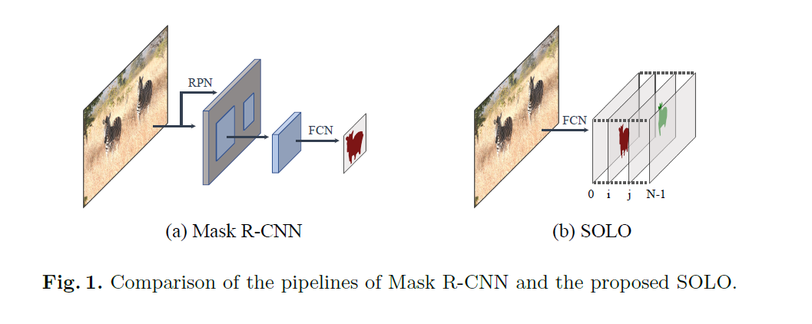
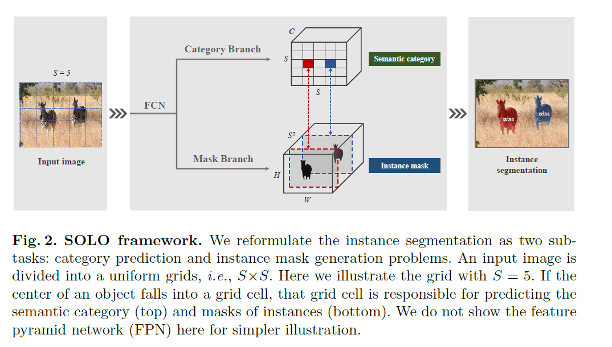
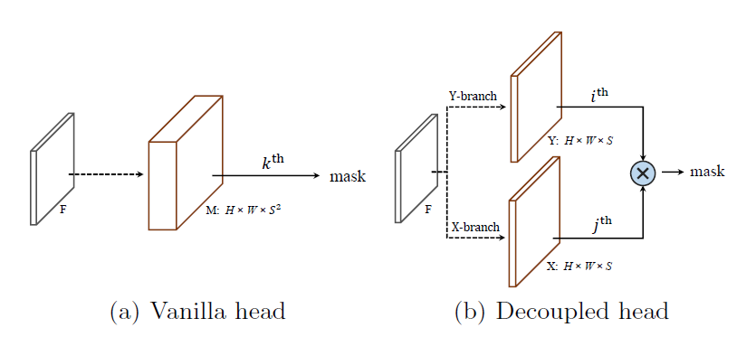
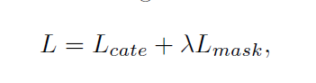
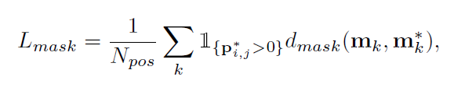
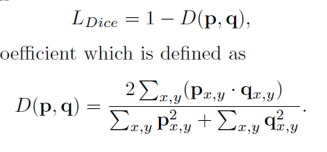
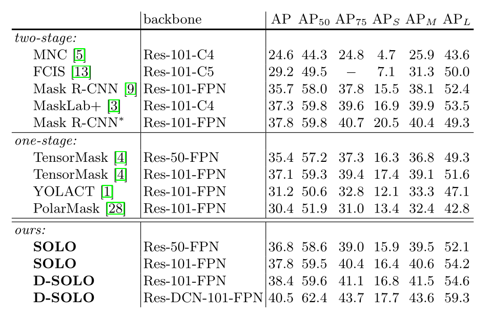
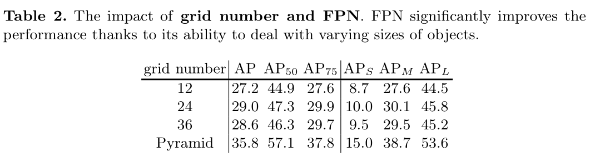
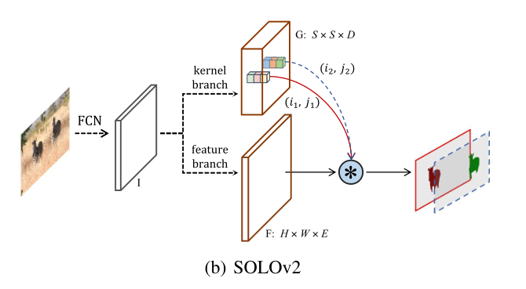
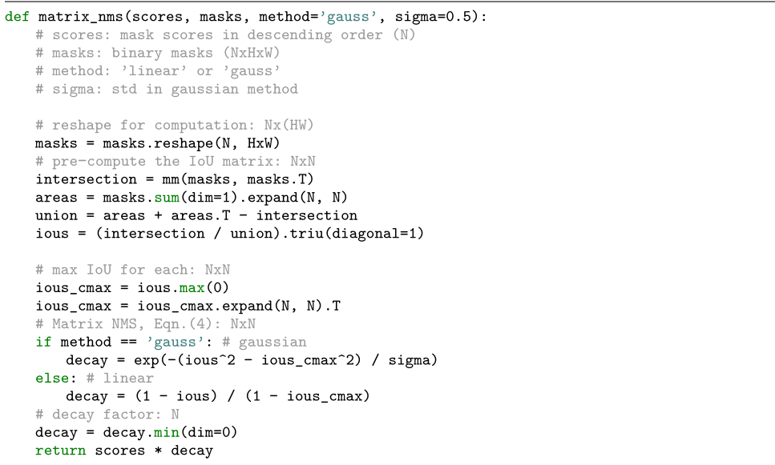

# segmentation


##  Segmenting Objects by Locations

创新点 box free，直接预测instance segmentation

实例分割一般有两种做法，一种是top-down，既先检测 bbox，后在每个bbox中进行mask的分割，例如Mask R-CNN。第二种为bottom-up做法，先分割出每一个像素，再进行归类。本文介绍的两篇论文另辟蹊径, 直接分割实例 mask，属于box-free的做法



问题：

实例分割和语义分割在算法处理上最大的不同就是，实例分割需要处理同类别的实例重叠或粘连的问题



### 网络设计

类似YOLO做法，将图片分为S * S 格子，网络输出为两个分支，分类分支和mask分支，当目标物体中心落入哪一个格子，分类分支对应位置以及mask分支对应通道负责该物体的预测。

分类分支大小 S * S * C, C个通道表示C个类别，每个格子预测一个类别，

mask分支大小为H * W * S*S , 像素级的预测，每个位置有$S^2$ 个通道，跟分类分支是对应的。当实例分配到$(i,j)$ 格子上，则$k = i * S + j$ 通道负责预测该目标的mask图，即每个通道负责预测不同的实例


而对于Sizes，则采用通用做法：FPN。大的特征图负责预测小的目标，小的特征图负责预测大的目标。 FPN也可以一定程度上缓解目标重叠的问题，尺度不同的实例会被分配到不同FPN输出层中进行预测。


**CoordConv**

使用了**CoordConv**，将像素横纵坐标x，y（归一化到[-1,1]）与输入特征做了concat再输入网络中。这样**输入的维度**就是 **H\*W\*(D+2）**


#### Decoupled head

由于mask分支预测 $S^2$ 个通道, 如果grid cell 设置过多的话，该输出通道会过于庞大。因此论文提出Decoupled head的改进方式。具体见下图，将mask分支拆分为X方向和Y方向两个分支，每一个分支的通道数为 $S$。将两个分支按照element-wise的方式进行相乘获取mask输出，这样预测通道由原来的  $S^2$ 变为了$S$个。此时想要获取第$k$个格子预测的mask，只需要将Y分支的第$i$个通道和X分支的第 个$j$通道取出来，进行element-wise乘即可，其中$k = i * S + j$.




### 损失函数设计



位置多分类损失函数使用focal loss 

mask损失采用dice loss 损失函数





mask 只在有实例的位置计算损失  ，如果没有目标，当前通道被忽视


## **预测过程**

因此整个预测的过程为：

1. 提取所有分类分支的预测概率值，并利用阈值（例如0.1）进行过滤；
2. 获取过滤后剩下的分类位置对应的 i,j索引；
3. 将X分支***i***通道和Y分支**j**通道利用element-wise相乘的方式获取该类别的mask；
4. 利用阈值（例如0.5）对mask进行筛选；
5. 对所有mask进行nms；
6. 将最终mask缩放到原图大小。


#### 性能比较




#### 不同 grid size 的性能比较




## SOLOV2




**SOLOv2中引入动态方案，原来的Mask分支被解藕成Mask kernel分支和Mask feature分支**，用来分开预测卷积核和卷积特征。

对于每个grid cell，**Mask kernel分支预测D维输出来表示预测的卷积核权重**，其中D是参数的数量。例如，为了生成具有E个输入通道的1×1卷积的权重，D等于E。对于3×3卷积，D等于9E。产生的这些权值是和位置关联在一起的，比如grid cell。如果把输入图像划分为S * S个grid，那么输出就是S * S * D维的tensor。

**Mask feature 分支用来预测实例感知特征图**F∈R H×W×E，其中E是Mask特征的维数。特征图F将由Mask kernel分支进行卷积。如果使用了所有预测的权重，即S^2分类器，则最终卷积后的输出实例蒙版将为$H*W* S^2$，这与SOLOv1的输出空间相同。

作者将Mask feature 分支与Mask kernel分支一起放入头部，为所有FPN级别预测统一的Mask特征表示。


### Matrix NMS




segmentation loss  设计

```python

```

