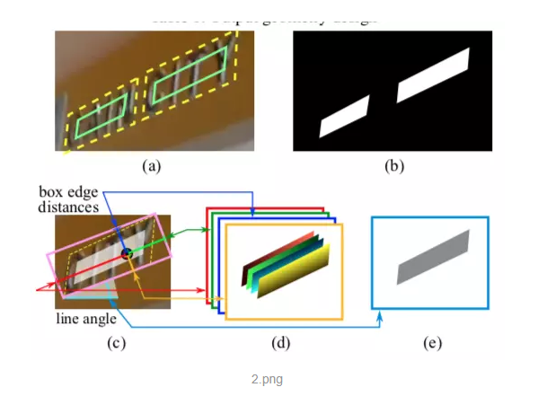
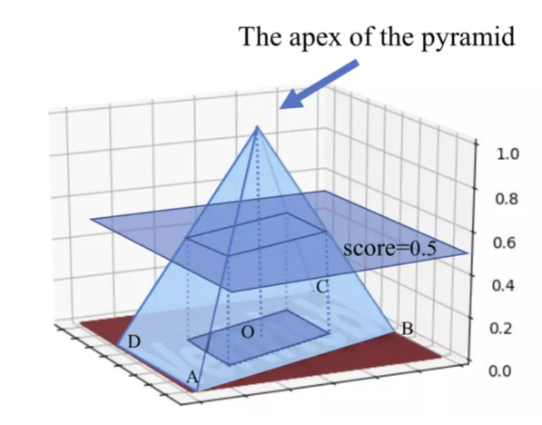

# 文本检测

1. ** ctpn      **

## 摘要

我们提出了一种新颖的连接文本提议网络（CTPN），它能够准确定位自然图像中的文本行。CTPN直接在卷积特征映射中的一系列细粒度文本提议中检测文本行。我们开发了一个垂直锚点机制，联合预测每个固定宽度提议的位置和文本/非文本分数，大大提高了定位精度。序列提议通过循环神经网络自然地连接起来，该网络无缝地结合到卷积网络中，从而形成端到端的可训练模型。这使得CTPN可以探索丰富的图像上下文信息，使其能够检测极其模糊的文本。CTPN在多尺度和多语言文本上可靠地工作，而不需要进一步的后处理，脱离了以前的自底向上需要多步后过滤的方法。它在ICDAR 2013和2015的基准数据集上达到了0.88和0.61的F-measure，大大超过了最近的结果[8，35]。通过使用非常深的VGG16模型[27]，CTPN的计算效率为0.14s每张图像。

**工作：**

本文工作基于faster RCNN , 区别在于

改进了rpn，anchor产生的window的宽度固定为3。

rpn后面不是直接接全连接+分类/回归，而是再通过一个LSTM，再接全连接层。

坐标仅仅回归一个y，而不是x1, y1, x2, y2

添加 side-refinement offsets（可能这个就是4个回归值中的其中2个）

**idea：**

文本检测的其中一个难点就在于文本行的长度变化是非常剧烈的。因此如果是采用基于faster rcnn等通用物体检测框架的算法都会面临一个问题？怎么生成好的text proposal？这个问题实际上是比较难解决的。因此在这篇文章中作者提供了另外一个思路，检测一个一个小的，固定宽度的文本段，然后再后处理部分再将这些小的文本段连接起来，得到文本行。检测到的文本段的示意图如下图所示。

具体的说，作者的基本想法就是去预测文本的竖直方向上的位置，水平方向的位置不预测。因此作者提出了一个vertical anchor的方法。与faster rcnn中的anchor类似，但是不同的是，vertical anchor的宽度都是固定好的了，论文中的大小是16个像素。而高度则从11像素到273像素变化，总共10个anchor.

同时，对于水平的文本行，其中的每一个文本段之间都是有联系的，因此作者采用了CNN+RNN的一种网络结构，检测结果更加鲁棒。RNN和CNN的无缝结合可以提高检测精度。CNN用来提取深度特征，RNN用来序列的特征识别（2类），二者无缝结合，用在检测上性能更好。

Top-down（先检测文本区域，再找出文本线）的文本检测方法比传统的bottom-up的检测方法（先检测字符，再串成文本线）更好。自底向上的方法的缺点在于（这点在作者的另一篇文章中说的更清楚），总结起来就是没有考虑上下文，不够鲁棒，系统需要太多子模块，太复杂且误差逐步积累，性能受限。

基于检测的方法能很好地解决水平文字的检测问题，缺点是对于非水平的文字不能检测。具体的做法可以参考Detecting Text in Natural Image with Connectionist Text Proposal Network，ECCV16的一篇论文，网络结构为RPN，针对文字检测的特点做了一些修改，最重要的有两点，一是改变了判断正负样本的方法，不同于物体检测，文字检测中proposal如果只框住了一行文字中的几个文字其实也算正样本，而用IOU计算的话会被当成负样本，所以判断正负样本只需要计算proposal与ground truth高度的overlap就可以了。第二点是anchor的选取，既然我们判断正负样本的时候不考虑宽度，自然选anchor的时候也不用选择不同宽度的了，只需要固定宽度然后根据具体任务选择几个合适的高度就可以了。其他地方和RPN基本一样。

**pipeline**

整个算法的流程主要有以下几个步骤：（参见下图）

首先，使用VGG16作为base net提取特征，得到conv5_3的特征作为feature map，大小是W×H×C

然后在这个feature map上做滑窗，窗口大小是3×3。**也就是每个窗口都能得到一个长度为3×3×C的特征向量**。这个特征向量将用来预测和10个anchor之间的偏移距离，也就是说每一个窗口中心都会预测出10个text propsoal。

将上一步得到的特征输入到一个双向的LSTM中，得到长度为W×256的输出，然后接一个512的全连接层，准备输出。

输出层部分主要有三个输出。2k个vertical coordinate，因为一个anchor用的是中心位置的高（y坐标）和矩形框的高度两个值表示的，所以一个用2k个输出。（注意这里输出的是相对anchor的偏移）。2k个score，因为预测了k个text proposal，所以有2k个分数，text和non-text各有一个分数。k个side-refinement，这部分主要是用来精修文本行的两个端点的，表示的是每个proposal的水平平移量。

这是会得到密集预测的text proposal，所以会使用一个标准的非极大值抑制算法来滤除多余的box。

最后使用基于图的文本行构造算法，将得到的一个一个的文本段合并成文本行。

**总结**

这篇文章的方法最大亮点在于把RNN引入检测问题（以前一般做识别）。文本检测，先用CNN得到深度特征，然后用固定宽度的anchor来检测text proposal（文本线的一部分），并把同一行anchor对应的特征串成序列，输入到RNN中，最后用全连接层来分类或回归，并将正确的text proposal进行合并成文本线。这种把RNN和CNN无缝结合的方法提高了检测精度。

**特点**

**全卷积网络， 在特征图上密集滑动窗口检测文本行 ，输出固定宽度的proposals**

不是在字的级别，最终输出是在行的级别

对每一行，每一个feature map位置，固定需要回归的框的宽度为16像素，需要预测k个anchor的高度和数值方向

side-refinement用来预测每一个anchor的x的坐标，准确率有效得到提升

**代码**

正如上文所提的，这个网络预测的是一些固定宽度的text proposal，所以真值也应该按照这样来标注。但是一般数据库给的都是整个文本行或者单词级别的标注。因此需要把这些标注转换成一系列固定宽度的box。代码在prepare_training_data这个文件夹。

整个repo是基于RBG大神的faster rcnn改的，所以根据他的输入要求。要再将数据转换为voc的标注形式，这部分代码也在prepare_training_data这个文件夹。

**问题**

1没有很好地处理多方向的文本行

2训练的时候由于有regression和LSTM，需要小心控制梯度爆炸。

1.

场景文本检测是计算机视觉中的一个挑战性问题。在本文中，我们提出了一种基于流行的对象检测框架的新型文本检测网络。为了获得更强的语义特征，我们采用ResNet作为特征提取层，并结合分层卷积网络利用多层次特征。垂直提议机制用于避免提案分类，而回归层仍在努力提高本地化准确性。我们在ICDAR2013数据集上评估的方法实现了0.91 F-measure，其优于先前在场景文本检测中的最先进结果。

**idea：**

**基于ctpn，把backbone换成resnet**

在本文中，我们提出了一个名为残差文本检测网络（RTN）的框架。 RTN的灵感来自ResNet和CTPN垂直提案机制。首先，ResNet用于生成强大的语义特征，而不是像VGG-16这样的传统网络。我们结合多级特征来生成层次结构残差特征，而不是天真的层替换。出色的表现主要来自于这种更强大的语义特征。其次，采用垂直提案机制，并使用额外的回归部分来提高定位准确性，这一步骤是通过两阶段培训策略实施的。它在ICDAR2013上实现了91.54％的F测量。

**2、利用多层特征**

3 Detecting Curve Text in theWild: New Dataset and New Solution  17  **曲线文本检测**

场景文本检测近年来取得了很大进展。检测方式从轴对齐矩形演变为旋转矩形，进一步演变为四边形。

但是，当前数据集包含非常少的曲线文本，可以在场景图像（如招牌，产品名称等）中广泛观察到。为了提出在野外阅读曲线文本的问题，在本文中，我**们构建了一个名为CTW1500的曲线文本数据集**，其中包括1,500个图像中的超过10k文本注释（1000个用于训练，500个用于测试）。基于该数据集，**我们开创性地提出了一种基于多边形的曲线文本检测器（CTD），它可以直接检测曲线文本而无需经验组合。****此外，通过无缝地集成循环横向和纵向偏移连接（TLOC），所提出的方法可以是端对端可训练的，以学习位置偏移之间的固有连接。**

**这允许CTD探索上下文信息而不是独立地预测点，从而导致更平滑和准确的检测。我们还提出了两种简单但有效的后处理方法，即非多边形抑制（NPS）和多边形非最大抑制（PNMS），以进一步提高检测精度。**

此外，本文提出的方法是以通用的方式设计的，也可以用矩形或四边形边界框进行训练而无需额外的努力。在CTW-1500上的实验结果表明，我们只有轻骨架的方法可以大大超过现有技术的方法。**通过仅在曲线或非曲线子集中进行评估**，CTD + TLOC仍然可以获得最佳结果。

1. Detecting Multi-Oriented Text with Corner-based Region Proposals

**摘要   ** **角点检测文本**

用于场景文本检测的先前方法通常依赖于手动定义的滑动窗口。这项工作提供了一种直观的两阶段基于区域的方法来检测多向文本，而无需任何关于文本形状的先验知识。在第一阶段，我们通过检测和链接角来估计文本实例的可能位置，而不是移动一组默认锚。四边形提议是几何自适应的，这允许我们的方法处理各种文本宽高比和方向。在第二阶段，我们设计了一个名为Dual-RoI Pooling的新池化层，它将数据扩充嵌入到区域子网中，以便对这些提议进行更强大的分类和回归。公共基准测试的实验结果证实，所提出的方法能够与最先进的方法实现相当的性能。

我们总结了我们的主要贡献如下：

（1）我们新的基于角落的区域提议网络与以前依赖于精心设计的锚点的工作不同，它通过检测和链接文本边界框的角来生成四边形区域提议。

（2）为了抑制负面联系，我们设计了一个名为Link Direction的新变量，以指示在哪里找到每个检测到的角落候选者的伙伴。

（3）提出了一种几乎没有成本的模块，名为Dual-RoI Pooling，它将数据增强嵌入到区域性子网中，以提高训练数据的利用率。 **基于rroi**

（4）我们的场景文本检测器在公共基准上实现了强大的性能和有竞争力的速度。我们所有的培训和测试代码现在都是开源的。

在这里，我们介绍我们的新区域提议算法，名为基于角落的区域提议网络（CRPN）。它主要借鉴DeNet [22]，这是一种新颖的通用对象检测框架。我们扩展了基于角的RoI检测器，它只能在DeNet中输出矩形提议，以生成用于匹配任意方向文本实例的四边形提议。通常，两个相交的对角线可以确定四边形。 CRPN的主要目的是在整个图像上搜索角点，并找到连接它们的交叉对角线。它主要包括两个步骤：角点检测和建议抽样。

5 Arbitrary-Oriented Scene Text Detection via rotation proposals 18

**特点 旋转多角度文本检测**

**摘要**

**基于Faster rcnn**

本文介绍了一种新的基于旋转的自然场景图像任意导向文本检测框架。

我们提出了旋转区域提议网络（RRPN），它旨在生成具有文本方向角度信息的倾斜提议。然后，角度信息适用于边界框回归，以使提议在方向方面更准确地适合文本区域。提出了旋转兴趣区域（RRoI）池层，以将面向任意的提议投影到文本区域分类器的特征映射。整个框架建立在基于区域提议的架构之上，与先前的文本检测系统相比，这确保了任意导向文本检测的计算效率。我们使用基于旋转的框架对三个真实世界场景文本检测数据集进行实验，并证明其在效率和效率方面优于先前的方法。

**贡献：**

与以前基于分段的框架不同，我们的框架能够使用基于区域提案的方法预测文本行的方向;因此，提议可以更好地适应文本区域，并且可以容易地校正范围文本区域并且更便于文本阅读。新的组件，如RRoI池层和学习轮换提案，被纳入基于区域提案的架构[20]，与基于分段的文本检测系统相比，它确保了文本检测的计算效率。

我们还提出了以任意方向细化区域提案的新策略，以改进任意导向文本检测的性能。

这项工作受到RPN检测管道的启发，该管道涉及用于检测的基于密集建议的方法和用于进一步加速检测流水线的RoI池操作。基于RPN的检测管道广泛用于各种计算机视觉应用[43]  -  [45]。该想法也类似于空间变换器网络（STN）[46]，即，神经网络模型可以通过学习其仿射变换矩阵来校正图像。在这里，我们尝试通过注入角度信息将模型扩展到多方向文本检测。也许与我们最相关的工作是[43]，其中作者提出了一个初始RPN并进行了进一步的文本检测特定优化以适应文本检测。我们将轮换因素纳入区域提案网络，以便能够生成面向任意的提案。我们还将RoI池层扩展到Rotation RoI（RRoI）池层，并在我们的框架中应用角度回归来执行整改过程，最终获得出色的结果。

**Affine Transformation（仿射变换）：**

1. EAST: An Efficient and Accurate Scene Text Detector  17

**摘要**

用于场景文本检测的先前方法已经在各种基准测试中获得了有希望的性能然而，在处理具有挑战性的情况时，即使配备了深度神经网络模型，它们通常也会出现问题，因为整体性能取决于管道中多个阶段和组件的相互作用。在这项工作中，我们提出了一个简单而强大的管道，可以在自然场景中产生快速准确的文本检测。管道直接预测完整图像中任意方向和四边形形状的单词或文本行，消除了使用单个神经网络的不必要的中间步骤（例如，候选聚合和字分区）。我们的管道简单，可以集中精力设计损耗函数和神经网络架构。对标准数据集（包括ICDAR 2015，COCO-Text和MSRA-TD500）的实验表明，所提出的算法在准确性和效率方面明显优于最先进的方法。在ICDAR 2015数据集上，所提出的算法在720p分辨率下以13.2fps达到0.7820的F分数。

**FCN 直接预测文本行，速度快**

**优势：**

**提供了方向信息，可以检测各个方向的文本**

**缺点：**

**对较长的文本检测效果不好，感受野不够长**

整体网络结构分为3个部分

(1) 特征提取层：

使用的基础网络结构是PVANet，分别从stage1，stage2，stage3，stage4抽出特征，一种FPN(feature pyramid network)的思想。

(2) 特征融合层：

第一步抽出的特征层从后向前做上采样，然后concat

(3) 输出层：

输出一个score map和4个回归的框+1个角度信息，或者输出，一个scoremap和8个坐标信息。

#### **二、关于训练标签的生成**

如上可知，训练标签由两个部分组成，一个是score map的标签，一个是geometry map标签。

**注意：程序要求输入的四边形标定点是以顺时针方向标定的，这点很重要**

**1. score map标签的生成方法**

* 首先生成一个与图片大小一样的矩阵，值都为0
* 根据标定好的四边形框对该四边形框进行缩小，缩小方法下面会详细说明，得到最终结果如上图2a中的绿框
* 将绿框中的像素赋值1表示正样本的score，其他为负样本的score
* 最后按照每隔4个像素采样，得到图片

**2. geometry map标签的生成方法**

* 首先生成一个与图片大小一样的5通道矩阵用来制作text boxes 与 text rotation angle
* 根据标定的四变形生成一个面积最小的平行四边形，进而得到平行四边形的外界旋转矩形
* 根据旋转矩形的四个点坐标，可以选择出y值最大的坐标顶点和该顶点逆时针方向的顶点(也可以称该顶点右边的顶点)，根据这两个点的连线可以求出连线与x轴的夹角，这个夹角取值在(0,90)度之间，称这个夹角为angle
* 当angle<45度时，定义y值最大的点为
* 上述还有一种特殊情况要考虑，当y值最大的点有两个时，说明矩形与x轴平行，angle定义为0度，这时候将x与y坐标相加最小的点定义为
* 根据得到的旋转矩形和angle值将geometry map的五个通道赋值，赋值方法为，对于text boxes的四个通道，每个通道表示图像中的像素点坐标到旋转矩形的四个边的距离顺序为，0通道表示点到
* 最后得到的五个通道按照每隔4个像素采样，这样就可以得到图片

**7.****Single Shot Text Detector with Regional Attention**

**摘要**

我们提出了一种新颖的单发文本检测器，可直接在自然图像中输出字级边界框。我**们提出了一种注意机制，通过自动学习的注意力图粗略地识别文本区域。**

这基本上抑制了卷积特征中的背景干扰，这是产生单词精确推断的关键，特别是在极小的尺寸下。这导致单个模型基本上以粗到精的方式工作。它脱离了最近基于FCN的文本检测器，其将多个FCN模型级联以实现准确的预测。此外，我们开发了一个分层初始模块，它有效地聚合了多尺度的初始特征。这增强了局部细节，并且还编码了强大的上下文信息，使探测器能够在单尺度图像的多尺度和多方向文本上可靠地工作。我们的文本检测器在ICDAR 2015基准测试中实现了77％的F测量，在[18,28]中推进了最先进的结果。

首先，我们提出了一种新的文本注意模块，它引入了一种基于聚合初始卷积特征的新辅助损失。它使用逐像素文本掩码显式编码强文本特定信息，允许模型在文本区域上学习粗略的自上而下的空间关注。该文本的区域关注显着地抑制了卷积特征中的背景干扰，其结果是减少错误检测并且还突出了具有挑战性的文本模式。

其次，我们开发了一个分层初始模块，它有效地聚合了多尺度的初始特征。

将扩散卷积[34]的初始架构应用于每个卷积层，使模型能够捕获多尺度图像内容。多层聚合进一步增强了本地详细信息并编码了丰富的上下文信息，从而为单词预测提供了更强的深层特征。

第三，提议的特定于文本的模块无缝地集成到SSD框架中，该框架优雅地将其定制为快速，准确和单短文本检测。

这样就形成了一个功能强大的文本检测器，可以在具有单一尺度输入的多尺度和多方向文本上可靠地工作。它在标准的ICDAR 2013和ICDAR 2015基准测试中获得了最先进的性能，在704的图像上运行时间约为0：13？ 704。

模型架构：

－text-specific component: Text Attention Module(TAM) 和Hierarchical Inception Module(HIM)   引入Inception来增强detector对文字大小的鲁棒性

－convolutional component: 由SSD扩展而来

－box prediction component: 由SSD扩展而来

**Text Attention Mechanism：引入注意力机制强化文字特征**

**原理：****利用文字的像素级别的binary mask**

步骤：

1.从卷积特征中学习文字的空间区域信息

2.将文字特征封装回卷积层，实现特征增强

HIM

1. **TextBoxes: A Fast Text Detector with a Single Deep Neural Network**

1. ## **文章核心****：**

    * **改进版的SSD**

2. ## **端到端识别的****pipeline****:**

    * **Step 1**
    * **Step 2**

3. ## **方法的性能**

    * **多尺度版本-定位：**
    * **单尺度版本**

4. ## **改进的SSD****的地方：**

    * **default box的长宽比**
    * 作为classifier的
    * SSD原来为多类检测问题，现在转为
    * 从输入图像为单尺度变为
    * **利用识别来调整检测**

# **创新点和贡献**

1. ## **创新点**

    * **把SSD进行修改，使其适用于文字检测**

2. ## **贡献**

    * 提出一个
    * 提出一个
    * 实验方法

# **方法细节**

**9.****TextBoxes++: A Single-Shot Oriented Scene Text ****Detector**

**摘要:**

场景文本检测是场景文本识别系统的重要步骤，也是一个具有挑战性的问题。与一般物体检测不同，场景文本检测的主要挑战在于任意取向，小尺寸以及自然图像中文本的显着变化的纵横比。在本文中，我们提出了一种名为TextBoxes ++的端到端可训练快速场景文本检测器，它可以在单个网络前向传递中以高精度和高效率**检测任意导向的场景文本**。除了有效的非最大抑制之外，不涉及后处理。我们已经在四个公共数据集上评估了提议的TextBoxes ++。在所有实验中，TextBoxes ++在文本本地化准确性和运行时方面优于竞争方法。更具体地说，TextBoxes ++在1024？1024 ICDAR 2015附带文本图像上以11.6fps实现0.817的f度量，对于768？768 COCO-Text图像，f-measure为0.5591,19.8fps。此外，与文本识别器结合使用，TextBoxes ++在流行的基准测试中明显优于用于字识别和端到端文本识别任务的最先进方法。

其实大体框架基本没变，就是卷积层从conv6变成了conv5。采用最基本的VGG16，保留了conv1_1到conv5_3，将最后两层由全连接层替换成了卷积层，另外加了8个卷积层。某些层通过textboxes layers之后预测输出，然后nms处理，**所以textboxes++只包含卷积层和pooling层**，因此可以使用不同尺度的输入。

**主要贡献**

1.用四边形或者矩形表示文本框 ；

2 ：为defaut boxes设置上下偏置，方便预测临近的文本；

3 ：修改卷积核, we adapt(修改) the convolution kernels to better handle text lines which are usually long objects as compared to general object detection；将卷积核大小由3X3修改到3X5。

4 ：文本定位之后添加一个文字识别(用的CRNN网络)的过程，根据文本识别的效果，反馈给detection网络，帮助更好的detection。比如确定不是文字的部分，可以从结果中删除。

5：More comparative experiments have been conducted to further demonstrate the efficiency of TextBoxes++ in detecting arbitrary-oriented text in natural images;在很多数据集上测试过。

6：TextBoxes++ detects oriented text at 6 different scales in 6 stages. 在6个尺度上做检测，对检测结果做做nms。

**网络结构**

如上图所示，采用最基本的VGG16，保留了conv1_1到conv5_3，将最后两层由全连接层替换成了卷积层，另外加了8个卷积层。某些层通过textboxes layers之后预测输出，然后nms处理，所以textboxes++只包含卷积层和pooling层，因此可以使用不同尺度的输入。

### **多偏置的default boxes**

ext-layer是网络的核心，default boxes是矩形的，输出四边形预测框{q}或者{r}，以及最小的外接矩形框{b}。预测的是框相对于default boxes的offsets。预测过程如下图所示：

预测框的偏置

黄色实线是ground truth，绿色虚线是匹配上的default box，红色箭头表示学习过程，这是在3*3的图像上的结果，Note that the black dashed（黑色虚线） default box is not matched to the ground truth. The regression from the matched default box to the minimum horizontal rectangle (green solid) containing the ground truth quadrilateral is not shown for a better visualization.

也就是default boxes绿色虚线框同时回归黄色ground boxes和绿色的最小外接框

text经常有很大的长宽比，我们定义了1,2,3,5,7,10,六种默认的长宽比，由于不仅仅检测水平的text，我们加入了1,2,3,5,1/2,//3,1/5特殊的长宽比，由于文本经常集中在某些区域，所以我们给默认框加入偏置让它更好的预测临近物体。如下图所示：黑色默认框是无法是无法处理两个靠的很近的物体，所以我们加偏置形成了黄色框。

**Testing with efficient cascaded non-maximum suppression**

测试的时候改进了nms，将6个尺度的图片归一化，进行nms，由于四边形的nms耗时较多，我们将nms分成了两步执行

1进行nms在最小外接框上，设置threshold= 0.5,这一步很快并且消除了大量框。

2 ：四边形nms设置tnreshold = 0.2

输出作为预测结果。

**文字识别和文字定位的结合**

文本识别可以消除一些假的框，当假框内没有字的时候，Following this intuitive idea, we propose to improve the detection results of TextBoxes++ with word spotting and end-to-end recognition

使用RCNN做文字识别结果反馈给detectio帮助去除一些detection的框

**10.****A Single Shot Text Detector with Scale-adaptive Anchors**

**摘要：**

目前，大多数表现最佳的文本检测网络倾向于使用固定大小的锚箱来指导搜索文本实例。

通常依靠大量不同尺度的锚来发现场景图像中的文本，从而导致高计算成本。在本文中，我们提出了一种**具有尺度自适应锚点**的端到端盒式文本检测器，它可以通过引入额外的尺度回归层，根据基础文本的大小动态调整锚的尺度。

提出的尺度自适应锚点允许我们使用少量锚点来处理多尺度文本，从而显着提高计算效率。此外，与先前方法中使用的离散尺度相比，学习的连续尺度更可靠，特别是对于小文本检测。

此外，我们建议使用Anchor卷积，通过根**据学习的尺度动态调整感受野的大小来利用必要的特征信息**。大量实验表明，所提出的探测器速度快，每张图像仅需0.28秒，同时在精度方面优于大多数最先进的方法。

**anchor的尺寸是可以学习的**

最初，输入图像通过VGG16 [21]的卷积层转发，并生成Conv4 3特征映射。我们在Conv4 3要素图后面添加了一个额外的比例回归图层来生成比例图，该比例图用于指示每个位置的文本大小。

接下来，将比例图传递给Conv4 3层以产生尺度适应性锚和柔性尺寸的感受野。最后，这些锚点通过检测模块进行分类和细化，检测模块包含分类层和边界框回归层，类似于SSD检测器[14]。每个阶段的细节将在下面描述。

11.Spatial Transformer Networks  stn

Insight：

文章提出的STN的作用类似于传统的矫正的作用。比如人脸识别中，需要先对检测的图片进行关键点检测，然后使用关键点来进行对齐操作。但是这样的一个过程是需要额外进行处理的。但是有了STN后，检测完的人脸，直接就可以做对齐操作。关键的一点就是这个矫正过程是可以进行梯度传导的。想象一下，人脸检测完了，直接使用ROI pooling取出人脸的feature map，输入STN就可以进行矫正，输出矫正后的人脸。后面还可以再接点卷积操作，直接就可以进行分类，人脸识别的训练。整个流程从理论上来说，都有梯度传导，理论上可以将检测+对齐+识别使用一个网络实现。当然实际操作中可能会有各种trick。

why:

1. **一个理想中的模型：**
2. **什么是空间不变性：**
3. **CNN在这方面的能力是不足的：**
4. **Spatial Transformer：**

STN是什么：

1. STN对feature map（包括输入图像）进行空间变换，输出一张新的图像。
2. 我们希望STN对feature map进行变换后能把图像纠正到成理想的图像，然后丢进NN去识别，举例来说，
3. 这个网络可以作为单独的模块，可以在CNN的任何地方插入，所以STN的输入不止是输入图像，可以是CNN中间层的feature map

**STN是怎么做的（How）**

1. **如下图所示**
2. Localisation net：是一个自己定义的网络，它输入U，输出变化参数
3. Grid generator：根据V中的坐标点和变化参数
4. Sampler：要做的是填充V，根据Grid generator得到的一系列坐标和原图U（因为像素值要从U中取）来填充，因为计算出来的坐标可能为小数，要用另外的方法来填充，比如双线性插值。

**摘要：**

卷积神经网络定义了一类异常强大的模型，但仍然缺乏以计算和参数有效的方式对输入数据进行空间不变的能力。在这项工作中，我们引入了一个新的可学习模块，即空间变换器，它明确允许对网络内的数据进行空间操作。这种可区分模块可以插入到现有的卷积体系结构中**，使神经网络能够主动空间变换特征图，以特征图本身为条件，而无需对优化过程进行任何额外的培训监督或修改**。我们展示了空间变换器的使用导致模型学习了平移，缩放，旋转和更通用的变形的不变性，从而在几个基准测试和许多类变换中产生了最先进的性能。

近年来，通过采用快速，可扩展的端到端学习框架 - 卷积神经网络（CNN）[21]，计算机视觉领域得到了极大的改变和推进。虽然不是最近的发明，但我们现在看到基于CNN的模型的聚宝盆在分类[19,28,35]，定位[31,37]，语义分割[24]和行动方面取得了最新成果。承认[12,32]任务，等等。

能够推断图像的系统的期望特性是从纹理和形状中解开对象姿势和部分变形。在CNN中引入局部最大池化层有助于通过允许网络在某种程度上在空间上对特征的位置不变来满足该属性。然而，由于对最大池（例如2~2个像素）的空间支持通常较小，这种空间不变性仅在最大池和卷积的深层次上实现，并且CNN中的中间特征映射（卷积层激活）实际上对输入数据的大变换并不是不变的[6,22]。 CNN的这种限制是由于仅具有有限的预定义池化机制来处理数据空间排列的变化。

在这项工作中，我们引入了一个空间变换器模块，它可以包含在标准的神经网络架构中，以提供空间转换功能。空间变换器的动作取决于各个数据样本，并且在训练期间学习了适当的行为（没有额外的监督）。与汇集层不同，感知域是固定的和局部的，空间变换器模块是一种动态机制，可以通过为每个输入样本生成适当的变换来主动空间变换图像（或特征映射）。然后在整个特征图（非局部）上执行变换，并且可以包括缩放，裁剪，旋转以及非刚性变形。这允许包括空间变换器的网络不仅选择最相关（关注）的图像区域，而且还将这些区域变换为规范的预期姿势以简化以下层中的识别。值得注意的是，空间变换器可以通过标准的反向传播进行训练，从而可以对注入的模型进行端到端的训练。

1. STN-OCR: A single Neural Network for Text Detection and Text Recognition

**摘要：**

检测和识别自然场景图像中的文本是一项具有挑战性但尚未完全解决的任务。近年来，已经提出了几种试图解决两个子任务（文本检测和文本识别）中的至少一个的新系统。在本文中，我们提出了STN-OCR，这是向场景文本识别的半监督神经网络迈出的一步，可以进行端到端的优化。与大多数由多个深度神经网络和几个预处理步骤组成的现有作品相比，我们建议使用单个深度神经网络，该网络学习以半监督方式从自然图像中检测和识别文本。

STN-OCR是一个集成并共同学习空间变换器网络的网络[16]，可以学习检测图像中的文本区域，以及文本识别网络，它采用识别的文本区域并识别其文本内容。我们研究了我们的模型在一系列不同任务（行为的检测和识别以及文本行）上的行为方式。公共基准数据集的实验结果显示了我们的模型处理各种不同任务的能力，而不会对其整体网络结构进行实质性更改。

13 Pyramid Mask Text Detector  19

摘要：

场景文本检测是场景文本识别系统的重要步骤，是自动在自然场景图像中定位文本实例。最近受益于Mask R-CNN的一些尝试将场景文本检测任务制定为实例分割问题并且实现了显着的性能。在本文中，我们提出了一个新的基于Mask R-CNN的框架，名为Pyramid Mask Text Detector（PMTD）来处理场景文本检测。我们的PMTD不是通过现有的基于Mask R-CNN的方法生成的二进制文本掩码，而是在位置感知监督的指导下执行像素级回归，为每个文本实例提供更具信息性的软文本掩码。

对于文本框的生成，PMTD将获得的2D软掩模重新解释为3D空间，并引入了一种新颖的平面聚类算法，以在3D形状的基础上导出最优文本框。标准数据集上的实验表明，所提出的PMTD带来了一致且显着的增益，并且明显优于最先进的方法。具体而言，它在ICDAR 2017 MLT数据集上实现了80.13％的F度量。

基于Mask Rcnn方法的缺点：

* 监督过于简化，目前文字检测常用的还是用四个点表示的四边形进行定位，目前基于Mask R-CNN的检测方法只是将文本从背景中分割出来，没有很好的考虑到groundtruth为四边形的情况，所以没有很好的利用这点
* 不准的groundtruth用于分割，很多情况下分割的标签只是简单的从标定框二值化而来，有时候一个框内可能有很大一部分像素是背景，这样会导致产生的gt不准，如下图所示
* 错误信息的传递，因为在Mask R-CNN中是先得到检测的框，然后对框内的物体进行分割，如果框的位置不准确，这样会导致分割出来的结果也不会准确，如下图所示

PMTD基本框架

##### 金字塔标签(Pyramid label)的生成

这部分也就是groundtruth的生成

以前的做法是将文本框中的像素置为1，其他置为0，groundtruth只有这两个值，现在groundtruth是[0,1]区间内的值。groundtruth的取值如下图所示，文章将文本框的中心称为金字塔顶，且该点的取值为1，金子塔底为文本标定框的边。图中每条三角形的边的取值都采用线性插值得到。

对于给定的四个点%2CB(x_%7Bb%7D%2C%20y_%7Bb%7D)%2CC(x_%7Bc%7D%2C%20y_%7Bc%7D)%2CD(x_%7Bd%7D%2C%20y_%7Bd%7D))，对于框中的一点)的值的计算如下：

首先对于金子塔尖，也就是框的中心点的计算如下所示：

%2F4)

%2F4)

对于每个，其中M和N指的是A、B、C、D四点中的两点，即区域、、、。能用下式分解：

这样可以通过下式获得

因为P点在R区域内，所以应该满足下面条件

P点的取值为

%2C%200))

##### **损失函数**

损失函数和Mask R-CNN类似如下式所示

其中分别取值为1、1、5。

##### 推断过程的后处理操作

知道了label的制作方法，网络结构和loss函数后就可以训练模型了，在得到模型进行推断过程中，经过网络的前向操作可以得到对应原图中每个像素的预测值。

得到这些预测值后需要经过平面聚类(plane clustering)的方法来得到最终的预测文本框。

首先要明确的是在一张图上，图是二维的，加上预测出的每个像素的值就是三维的了。将值看成是z轴的值，也就是第三维上的值。

平面聚类(plane clustering)是一个迭代的过程，如下图所示：

迭代过程为：

1. 将网络输出预测图，将大于0.1的像素看成是正样本，这些正样本组成一个集合称为P。将P的中心点作为金字塔的顶点，并设其值为1。预测出的boundingbox的四个顶点作为金字塔底的四个点(如上图虚线所示)。
2. 经过上面步骤就可以得到初始的四个金字塔平面，然后将预测出来的点分配给离点最近的平面
3. 所以点分配完成后采用最小二乘法更新平面的位置
4. 回到第一步进行迭代

迭代的结束条件为最小二乘返回一个很小的值（文章设为1e-4）或者到达最大的迭代次数（文章设为10），这样就得到最终的文本框（如上图最后一图的虚线所示）。

**14 Detecting Oriented Text in Natural Images by link Segments  17**

* **改进版的SSD**用来解决多方向的文字检测问题

类似与ctpn的思路，改进点在添加了角度，可以检测任意方向，而且类似ctpn的小box，然后连接起来

改进的SSD的地方：

    * 原版SSD只输出rectangle bounding box(x, y, w, h四个参数）→加入角度信息，输出的是oriented bounding box(x, y, w, h, θ), θ表示矩形的角度（与水平方向，按顺时针为正，逆时针为负）

    * 每个feature map的每个位置上有多个不同aspect ratio的default box　→**每个位置上只有１个default box**（加速的原因之一）

    * 每层的feature map决定的default box的scale不再人工定义(10-90，平均分５次）→scale由感受野大小来决定

    * 最大的亮点：网络不但学习了segment的box，也学习了segment的link关系，来表示是否属于同一个单词（或者同一文本线）

    * 训练用的groundTruth除了因为多方向所以用的是旋转后的groundTruth，还要有一个link的ｇroundTruth

    * 损失函数加入了link的损失项

**摘要：**

大多数最先进的文本检测方法特定于水平拉丁文本，并且对于实时应用程序来说不够快。我们介绍了一种定向文本检测方法Segment Linking（SegLink）。主要思想是将文本分解为两个本地可检测的元素，**即段和链接**。**段是一个定向框，覆盖单词或文本行的一部分;链接连接两个相邻的段，表示它们属于同一个单词或文本行**。通过端对端训练的完全卷积神经网络在多个尺度上密集地检测这两个元素。通过组合通过链接连接的段来产生最终检测。与以前的方法相比，SegLink在准确性，速度和易于培训方面都有所改进。它在标准ICDAR 2015附带（挑战4）基准测试中达到了75.0％的f-测量值，大大超过了之前的最佳值。它在512×512图像上以超过20 FPS的速度运行。此外，无需修改，SegLink就能够检测到很长的非拉丁文本，例如中文。

**文本与一般目标检测的区别**

首先，**单词/文本行边界框具有比一般对象大得多的纵横比**。由于其提议或锚箱设计，（快速/快速）R-CNN [5,4,19]或SSD [14]式探测器可能难以制造这种箱子。此外，一些非拉丁文本在单词之间没有空格，因此甚至更大的边界框宽高比会使问题变得更糟。其次，与一般对象不同，**文本通常具有明确的方向定义[25]。**对于文本检测器来说，生产定向盒子是很重要的。然而，大多数一般物体检测方法不是设计用于产生定向盒子。

**思路：**

这种方法的关键优势在于现在可以在本地检测长文本和定向文本，因为两个基本元素都是本地可检测的：检测段不需要观察整个单词。并且链接都没有，因为可以从本地上下文推断出两个段的连接。此后，我们可以灵活高效地检测任何长度和方向的文本。

具体地说，我们提出了一种卷积神经网络（CNN）模型，以完全卷积的方式同时检测段和链路。该网络使用VGG-16 [21]作为其主干。在其上添加了一些额外的要素图层。将卷积预测值添加到6个要素图层中，以检测不同比例的线段和链接。为了处理冗余检测，我们引入了两种类型的链接，即层内链接和跨层链接。层内链接将段连接到同一层上的邻居。另一方面，跨层链路将段连接到下层的邻居。通过这种方式，我们连接相邻位置的段以及比例。最后，我们找到具有深度优先搜索（DFS）算法的连通段，并将它们组合成整个单词。

**15 ****PixelLink: Detecting Scene Text via Instance Segmentation 18**

摘要：

许多前沿的文本检测算法都是基于深度学习的方法，依赖于边界框回归，并执行至少两种预测：文本/非文本分类和位置回归。在这些方法中，回归对边界框的获取起着关键作用。但这并不是必不可少的，因为文本/非文本预测也可以看作是一种本身包含全部位置信息的语义分割。然而，场景图像中的文本实例往往彼此之间非常接近，使得它们很难通过语义分割来分离。因此，需要实例分割来解决这个问题。本文提出了一种新的基于实例分割的场景文本检测算法-像素链接。**首先将同一实例中的像素链接起来分割出不同的文本实例，然后直接从分割结果中提取文本包围框。**实验表明，与基于回归的方法相比，像素链接可以在几个基准上实现更好或更可比较的性能，同时只需要更少的训练迭代轮次和更少的训练数据。

ctpn， textboxes， seglink， east等文本检测算法大多基于全卷积网络，执行至少两种预测：1、**文本/非文本分类**。这样的预测可以被看作是在文本包围盒内的像素概率，但它们更常用于回归结果的置信度（例如，Textboxes、SegLink、East）。2、**位置回归**。文本实例或其分割/切片的位置被预测为相对参考框(例如TextBoxes, SegLink, CTPN)或边界框绝对位置(例如EAST)的偏移量。  在seglink等方法中，分段之间的连接也被预测。在这些预测之后的后处理主要包括将段连接在一起（例如SegLink,CTPN)或将非最大抑制应用于获得的包围框(例如TextBoxes,EAST)作为最终的输出。

16 Tightness-aware Evaluation Protocol for Scene Text Detection

摘要：

评估协议在文本检测方法的发展过程中起着关键作用。有严格的要求，以确保评估方法公平，客观和合理。但是，现有的指标显示出一些明显的缺点：1）它们不是以目标为导向的; 2）他们无法识别检测方法的紧张程度; 3）现有的一对多和多对一解决方案涉及固有的漏洞和缺陷。因此，本文提出了一种新的评估协议，称为Tightnessaware Intersect-over-Union（TIoU）度量，可以量化基本事实的完整性，检测的紧凑性和匹配度的紧密性。具体而言，不仅仅使用IoU值，而是适当考虑两种常见的检测行为;同时，直接用TIoU的分数来识别紧张度。此外，我们进一步提出了一种简单的方法来解决注释粒度问题，它可以同时公平地评估单词和文本行检测。通过采用已发布方法和一般目标检测框架的检测结果，对ICDAR 2013和ICDAR 2015数据集进行了全面实验，以比较最近的指标和建议的TIoU指标。该比较展示了一些有希望的新前景，例如，确定检测更严格且更有益于识别的方法和框架。我们的方法非常简单;然而，新颖之处莫过于提议的指标可以利用最简单但合理的改进来带来许多有趣和富有洞察力的前景并解决大多数先前指标的问题

论文创新点

现有评价指标存在的问题：

1、As shown in Fig. 1 (a), detection over a fixed IoU threshold with the ground truth (GT) may not com- pletely recall the text (some characters are missed); however, previous metrics consider that the GT has been entirely recalled.在检测不完全的情况下，交并比达到一定阈值也为认为检测到了，这在文本检测中会丢失信息。 不合理

2、As shown in Figs. 1 (b), (c), and (d), detection over a fixed IoU threshold with the GT may still contain background noise; however, previous metrics consider such detection to have 100% precision.含有背景噪声，但是认为precision已经是100%，不是很合理。

3、Previous metrics severely rely on an IoU threshold. However, if a relatively high IoU threshold is set, some satisfactory bounding boxes may be discarded (e.g., if 0.7 is set as the threshold, the detection in Fig. 1 (b) will be misjudged); if a low IoU threshold is set, sev- eral inexact bounding boxes would be included.单纯靠IOU阈值来判断文本检测结果,造成了单个文本指标不是1就是0的局面，不合理的。

这个文章主要做的创新点分为以下三点：

1、Completeness.Using the TIoU metric would force methods to pay more attention to recalling every part of the GT, i.e., ensuring the completeness of GT,完整性，要求指标更关注GT的每一个部分，确保文本的完整性

2、Compactness..Because the detections of outlier-GT will be punished by TIoU, the compactness of the de- tection would receive more attention.将其他文本的GT包含进来将会被惩罚，更关注检测结果的简洁。

1、Tightness-aware.TIoU can distinguish the tightness among different detection methods, i.e., a 0.9 IoU de- tection would be much better than a 0.5 IoU detection in our metric.有区分不单单是一个阈值，0.9的iou比0.5iou指标更高。

**17 Character Region Awareness for Text Detection**

**弯曲文本检测  需要字符级别的标注**

## **贡献**

1. 提出了一种新的用于检测弯曲文字的方法
2. 所提出的方法可以做到字符级检测

**摘要：**

最近出现了基于神经网络的场景文本检测方法，并且已经显示出有希望的结果

使用刚性单词级边界框训练的先前方法在以任意形状表示文本区域方面表现出限制。在本文中，我们提出了一种新的场景文本检测方法，通过探索每个字符和字符之间的亲和力来有效地检测文本区域。为了克服个别字符级别注释的缺乏，我们提出的框架利用合成图像的给定字符级别注释和由学习的中间模型获取的真实图像的估计字符级基础事实。为了估计字符之间的亲和性，使用新提出的关联性表示来训练网络。六个基准测试的广泛实验，包括TotalText和CTW-1500数据集，其中包含自然图像中的高度弯曲文本，表明我们的字符级文本检测明显优于最先进的检测器。根据结果，我们提出的方法保证了在检测复杂场景文本图像时的高度灵活性，例如任意定向，弯曲或变形文本。

**思路：**

在本文中，我们提出了一种新颖的文本检测器，它定位各个字符区域并将检测到的字符链接到文本实例。我们的框架，被称为用于文本检测的字符区域意识的CRAFT，设计有卷积神经网络，**产生字符区域得分和亲和度得分**。**区域分数用于定位图像中的单个字符**，并且**亲和度分数用于将每个字符分组到单个实例中**。为了弥补字符级注释的不足，我们提出了一种弱监督学习框架，用于估计现有真实单词级数据集中的特征级基础事实。

**评：**有点类似于pixlink的味道，同时也有east的影子，east采用的是score map，预测字符到字符边界的距离，pixklink采用分割方法预测字符块和字符块内的连接，

网络架构

1. region score: 一个高斯heatmap，代表该像素是字符中心点的概率
2. affinity score: 一个高斯heatmap，代表该像素是相连字符之间空间的中心点的概率

GT生成过程

**Training：**

**生成标签，是热力图的形式**

对于每个训练图像，我们生成区域得分的基本事实标签和带有角色边界框的亲和力得分。区域得分表示给定像素是角色中心的概率，并且亲和度得分表示相邻角色之间的空间的中心概率。

与二进制分割图不同，二维分割图以离散方式标记每个像素，我们使用高斯热图对字符中心的概率进行编码。该热图表示已经用于其他应用，例如姿势估计工作[1,29]，因为它在处理非严格限制的地面真实区域时具有高度的灵活性。

我们使用热图表示来学习区域分数和亲和度分数。

**不同数据集的处理**

在**合成图像**中，每个字符的box角点是已知的。

对于affinity score的box，通过下面的步骤进行计算

对于两个相连的字符，分布进行如下操作

1. 连接字符box的两对对焦点能够得到上三角形和下三角形
2. 计算得到两个三角形的中心点

计算得到的四个中心点就是affinity score box的四个角点坐标。

拿到affinity socre的box之后，region score和affinity score的label制作过程的一样的。

1. 准备好一个2d高斯map和一个原图大小的全 0 label图
2. 根据高斯map和字符box计算出一个透视矩阵
3. 使用透视变换将高斯map变成字符box的形状
4. 将透视之后的高斯map根据字符box在原图的坐标贴到label图里

**对于icdar 15** 这类只提供了单词级box和word的数据集来说，训练过程如下： **先要经过预训练的网络才能生成score map **

1. 文字区域的crop图片
2. heatmap经过
3. 如果  <0.5, 就讲文字区域进行等宽划分，并且将  置为0.5

**inference**

* **字符级框**

字符级的框可以直接根据region socre map使用分水岭算法得到

* **四角点box**

1. 初始化一个和输入图像一样大的全0矩阵, 
2. cv2.connectedComponents 标记连通域
3. cv2.minAreaRect 和 cv2.boxPoints 获取四角点坐标

**曲形**

1. 第一步是沿着扫描方向(x方向)找到字符区域的局部极大值线，在图中表示为在椭圆内部且垂直扫描方向的最长线。
2. 连接局部极大值的所有中心点的线称为中心线，用黄色表示。
3. 将局部极大值线旋转到垂直于中心线的位置，以反映字符的倾斜角，用红色箭头表示。局部极大值线的端点是文本多边形边缘控制点的候选点。
4. 为了完全覆盖文本区域，将最倾斜的两条局部极大值线沿着局部极大值中心线向外移动，形成最终的控制点(绿色点)。移动的终止点为刚好左右椭圆相切的地方。

评：牛逼  **但是需要提供字符级别的标注，太麻烦了**

18 Shape Robust Text Detection with Progressive Scale Expansion Network   

**PSENet**

**任意形状文本检测**

摘要：

任意文本检测面临的挑战主要表现在两个方面:

1)**现有的基于四边形边界框的检测器难以定位任意形状的文本，难以将文本完美地封装在矩形中**;

2)**大多数基于像素分段的检测器可能无法将非常接近的文本实例分开**。

为了解决这些问题，我们提出了一种新型的渐进比例扩张网络(PSENet)，它被设计成一个基于分段的检测器，对每个文本实例进行多个预测。这些预测对应于通过将原始文本实例缩小到不同的范围而产生的不同内核。因此，最终的检测可以通过我们的渐进比例扩张算法进行，该算法将最小尺度的内核逐步扩展到最大和完整形状的文本实例。由于这些最小核之间存在较大的几何边界，因此我们的方法能够有效地区分相邻的文本实例，并且对任意形状具有鲁棒性。ICDAR 2015和ICDAR 2017 MLT基准测试的最新结果进一步证实了PSENet的巨大有效性。值得注意的是，PSENet在SCUT-CTW1500曲线文本数据集上的性能比之前的最佳记录绝对高6.37%。

19 Towards Robust Curve Text Detection with Conditional Spatial Expansion  19

**任意文本检测**

摘要：

由于其不规则的形状和不同的尺寸，检测曲线文本是具有挑战性的。在本文中，我们首先研究现有曲线检测方法的不足，然后提出一种新的条件空间扩展（CSE）机制来提高曲线文本检测的性能。我们不将曲线文本检测视为多边形回归或分割问题，而是将其视为区域扩展过程。**我们的CSE以在文本区域内任意初始化的种子开始，并且基于CNN提取的局部特征和合并区域的上下文信息逐渐合并邻域区域。 CSE具有高度参数化，可以无缝集成到现有的对象检测框架中**。通过数据相关的CSE机制增强，我们的曲线文本检测系统提供了强大的实例级文本区域提取，并且后处理最少。

分析实验表明，**我们的CSE可以处理具有各种形状，大小和方向的文本**，并且可以有效地抑制来自同一RoI中包含的文本纹理或意外文本的误报。与现有的曲线文本检测算法相比，我们的方法更加健壮，处理流程更简单。它还在曲线文本基准测试中创建了一种新的最先进的性能，其F分数高达78.4％。

20 Learning Shape-Aware Embedding for Scene Text Detection 19

摘要：

我们解决了以**任意形状检测场景文本**的问题，由于场景的高度多样性和复杂性，这是一项具有挑战性的任务。我们将文本检测视为实例分割，并提出基于分段的框架，该框架将每个文本实例提取为独立的连接组件。为了区分不同的文本实例，我们的方法将像素映射到嵌入空间，其中鼓励属于相同文本的像素彼此更接近，反之亦然。

此外，我们引入了一个形状感知的损失，使训练适应性地适应文本实例的各种宽高比，甚至它们之间的微小差距。新的后处理管道产生精确的边界框预测。

三个具有挑战性的数据集（ICDAR15 [20]，MSRA-TD500 [55]和CTW1500 [32]）的实验结果证明了我们工作的有效性。

我们的贡献是三倍的。

我们提出了一种形状感知丢失，以便于分离相邻实例并检测大型实例。

我们提出了一种新的文本检测管道，可以检测任意形状的文本实例。

我们的方法在三个有代表性的场景文本数据集上实现了竞争性。

我们的方法是一个基于分段的框架，它通过嵌入聚类生成任意形状的文本实例的预测。给定输入图像，我们的网络首先生成嵌入特征和文本前景掩模，随后对其进行处理以获得最终预测的文本框。

我们网络的整体结构如图2所示。它具有FPN的镜像对称性[27]。首先，我们从ResNet50的中间层提取特征[13]。

接下来，在每个特征合并模块中，我们使用类似的特征合并策略作为PANet [28]的自适应特征池，通过上采样和逐像素相加来组合来自不同层的提取特征。不涉及池化，它需要保持相同数量的通道。

与使用单个模块[60,30,53]设计的其他多任务网络不同，我们使用两个独立的特征合并模块来形成一对独立但互补的分支。**一个分支产生嵌入映射，在每个像素处具有8通道嵌入特征以用于区分文本实例，而另一个分支用于生成用于分割的两个文本前景掩模**。

**形状感知**

**Shape-Aware Embedding**

场景文本实例与普通对象不同，因为文本笔划通常会混合到背景中。

虽然两个对象实例之间可能会发生重叠，但这种情况并不经常发生。两个普通对象实例之间的一般边界是清晰的，因此比文本实例更容易确定。更糟糕的是文本实例的宽高比可能在整个图像上从一个小字到一个很长的句子变化很大，这使得检测文本实例变得更加困难。

为了克服这些困难，我们**建议学习形状感知嵌入，以适应各种宽高比和不精确边界的文本实例**。

嵌入分支接收来自一个特征合并模块的特征，以及由x和y坐标[41]表示的另外的2通道位置信息。我们将功能合并模块的功能与位置信息相结合，并将它们连续三次传递给它 3个卷积层分别具有32,16和8个输出通道。最终输出是每个像素的8通道嵌入功能。

给定一组文本实例和每个文本区域内像素的嵌入特征，我们提出了一个形状感知损失（SA Loss），它包含一个方差损失Lvar，用于收集来自同一文本实例的像素嵌入和距离损失Ldist到推动嵌入不同实例的像素。它们表示为

20 FOTS: Fast Oriented Text Spotting with a Unified Network  18

**识别方法类似EAST，基于EAST**

摘要：

附带的场景文本识别被认为是文档分析社区中最困难和最有价值的挑战之一。大多数现有方法将文本检测和识别视为单独的任务。在这项工作中，我们提出了一个统一的**端到端可训练的快速定向文本定位（FOTS）网络**，**用于在两个互补任务之间同时检测和识别**，共享计算和视觉信息。特别地，引入RoIRotate以在检测和识别之间共享卷积特征。受益于卷积共享策略，我们的FOTS与基线文本检测网络相比几乎没有计算开销，联合训练方法学习更多通用特征，使我们的方法比这两个方法表现更好。在ICDAR 2015，ICDAR 2017 MLT和ICDAR 2013数据集上的实验表明，所提出的方法明显优于最先进的方法，这进一步使我们能够开发出第一个超越以往所有状态的实时导向文本定位系统 - -art在ICDAR 2015文本定位任务中的结果超过5％，同时保持22.6 fps。

该体系结构如图2所示。特征映射首先用共享卷积提取。基于完全卷积网络的定向文本检测分支建立在特征映射之上以预测检测边界框。 RoIRotate运算符从特征映射中提取与检测结果相对应的文本提议特征。然后将文本提议特征馈送到用于文本识别的递归神经网络（RNN）编码器和连接主义时间分类（CTC）解码器[9]。由于网络中的所有模块都是可区分的，因此可以对整个系统进行端到端的培训。

就我们所知，这是第一个面向文本检测和识别的端到端可训练框架。

我们发现无需复杂的后处理和超参数调整即可轻松训练网络。

贡献总结如下。

我们提出了一种端到端的可训练框架，用于快速定向文本定位。通过共享卷积特征，网络可以在几乎没有计算开销的情况下同时检测和识别文本，从而实现实时速度。

我们介绍了RoIRotate，一种新的可区分算子，用于从卷积特征映射中提取定向文本区域。此操作将文本检测和识别统一到端到端管道中。

21 Look More Than Once: An Accurate Detector for Text of Arbitrary Shapes  19

**摘要：**

在过去几年中，先前的场景文本检测方法已经取得了很大进展。然而，受CNN的接收领域和用于描述文本的矩形边界框或四边形的简单表示的限制，在处理更具挑战性的文本实例（例如极长文本和任意形状的文本）时，先前的方法可能不足。为了解决这两个问题，我们提出了一种新颖的文本检测器，即LOMO，它可以逐步对文本进行多次本地化（或换句话说，LOok不止一次）。 LOMO由直接回归器（DR），迭代细化模块（IRM）和形状表达模块（SEM）组成。首先，DR分支生成四边形形式的文本提议。

接下来，IRM基于提取的初步提议的特征块，通过迭代细化逐步感知整个长文本。最后，通过考虑文本实例的几何属性（包括文本区域，文本中心线和边界偏移），引入SEM来重建更精确的不规则文本表示。包括ICDAR2017-RCTW，SCUT-CTW1500，Total-Text，ICDAR2015和ICDAR17-MLT在内的多项公共基准测试的最新成果证实了LOMO的惊人的稳健性和有效性。

网络结构如下：

DR网络预测文本行，但是由于感受野的限制，导致导致很难检测长文本，因此IRM用于迭代修正DR的预测框，SEM用于框紧文本，边界修正

DR 模块：

**EAST中预测到四个边，这里预测到四个角点**

原始文本区域的缩小版本中的像素被认为是正的。**对于每个正样本，8个通道将其偏移值预测为包含该像素的四边形的4个角。 **

我们将文本/非文本分类术语视为1/4下采样分数图上的二元分割任务。

我们提出了一种尺度不变的版本，用于在检测字段大小下检测文本实例时改进DR的规模泛化，而不是直接使用骰子系数损失[25]。

IRM模块：

IRM的设计继承了基于区域的对象检测器[29]，只有边界框回归任务。然而，我们使用RoI变换层[32]来提取输入文本四边形的特征块而不是RoI pooling [29]层或RoI align [5]层。与后两者相比，前者可以在保持纵横比不变的情况下提取四边形建议的特征块。此外，如第二节所述。 **靠近角点的位置可以在同一感受野内感知更准确的边界信息。因此，引入角落注意机制来回归每个角落的坐标偏移。**

SEM模块：

四边形的文本表达不能精确地描述不规则形状的文本实例，尤其是如图1（b）所示的**弯曲或波浪形状**。受Mask R-CNN [5]的启发，我们提出了一种基于提议的形状表达模块（SEM）来解决这个问题。 SEM是完全卷积网络，随后是RoI变换层。**在SEM中回归三种类型的文本几何属性，包括文本区域，文本中心线和边界偏移（文本中心线和上/下文本边界线之间的偏移），以重建文本实例的精确形状表达**。文本区域是二进制掩码，其中前景像素（即，多边形注释内的像素）被标记为1和背景像素0.文本中心线也是基于文本多边形注释的侧缩版本的二进制掩码。边界偏移是4个通道映射，其在文本行映射的相应位置上的正响应区域内具有有效值。当中心线样本（红点）如图4（a）所示，我们绘制一条垂直于其切线的法线，该法线与上下边界线相交，得到两个边界点（即，粉色和橙色的）。对于每个红点，通过计算从其自身到其两个相关边界点的距离来获得4个边界偏移。

SEM的结构如图4所示，两个卷积阶段（每个阶段由一个上采样层和两个3？3卷积层组成）后面跟着由RoI变换层提取的特征块，然后我们使用一个1？ 1个带有6个输出通道的卷积层，用于回归所有文本属性映射。的目标函数

22  ABCNet: Real-time Scene Text Spotting with Adaptive Bezier-Curve Network   cvpr2020

摘要：

场景文本的检测与识别越来越受到人们的关注。现有的方法大致可以分为两类：基于字符的方法和基于分割的方法。这些方法要么代价高昂，要么需要维护复杂的管道，这通常不适合实时应用。在这里，我们提出了自适应贝塞尔曲线网络（ABCNet）来解决这个问题。我们的贡献有三个方面：1）我们第一次通过参数化的Bezier曲线自适应地拟合任意形状的文本。2） 我们设计了一个新的bezierallign层，用于提取任意形状文本实例的精确卷积特征，与以往的方法相比，大大提高了精度。3） 与标准包围盒检测方法相比，我们的Bezier曲线检测方法的计算开销可以忽略不计，从而使我们的方法在效率和精度上都具有优越性。

在任意形状的基准数据集Total Text和CTW1500上的实验表明，ABCNet在获得最新精度的同时，显著提高了速度。特别是，在总文本上，我们的实时版本比最新的状态识别方法快10倍以上，具有竞争性的识别精度。

贡献：

1、为了准确定位图像中的有向和曲线场景文本，我们首次提出了一种新的基于Bezier曲线的曲线场景文本参数化表达方法。与标准的边界框表示相比，它引入了可忽略的计算开销。

2、我们提出了一种采样方法，即bezierralign，用于精确的特征对齐，因此识别分支可以自然地连接到整体结构上。通过共享主干特征，识别分支可以设计成轻量级结构。

3、我们方法的简单性允许它实时执行推理。ABCNet在Total Text和CTW1500这两个具有挑战性的数据集上实现了最先进的性能，在效率和有效性方面都显示出了优势。

23 Deep Relational Reasoning Graph Network for Arbitrary Shape Text Detection cvpr2020

摘要：

由于场景文本的高度多样性和复杂性，任意形状文本检测是一项具有挑战性的任务。本文提出了一种用于任意形状文本检测的统一关系推理图网络。在我们的方法中，一个创新的局部图通过卷积神经网络（CNN）连接一个文本建议模型和一个通过图卷积网络（GCN）连接的深层关系推理网络，使得我们的网络端到端可训练。具体来说，每个文本实例将被划分为一系列小的矩形组件，并且小组件的几何属性（例如高度、宽度和方向）将由我们的文本建议模型估计。

在给定几何属性的情况下，局部图构造模型可以粗略地建立不同文本成分之间的联系。为了进一步推理和推断构件与其邻域之间的关联可能性，我们采用基于图的网络对局部图进行深度关系推理。
