# 视觉目标跟踪

## 一、回顾一下SiamRPN，DaSiamRPN

介绍SiamRPN++之前，我们先简单回顾一下之前的SiamRPN和DaSiamRPN

## 1. [SiamRPN](https://zhuanlan.zhihu.com/p/56254712/bo-li.info/SiamRPN)

* •

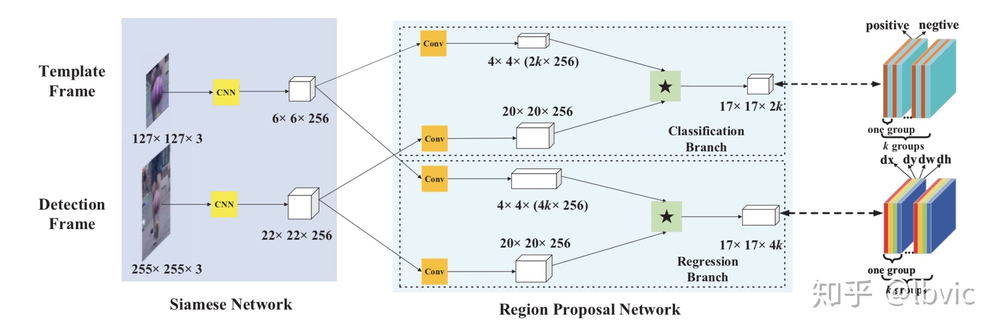

* •

## 2. [DaSiamRPN](https://zhuanlan.zhihu.com/p/56254712/bo-li.info/DaSiamRPN)

* •
* •

## 3. VOT2018 entry SiamRPN

* •

## 二、SiamRPN++

## motivation

这次的motivation就是解决网络问题。从SiamFC以来，改进很多，但是网络还一直都是AlexNet，换了深网络后性能没上升不说，反而带来了极大的下降。[[github issue](https://link.zhihu.com/?target=https%3A//github.com/bertinetto/siamese-fc/issues/37%23issue-271271390)]

## 问题分析

首先回顾SiamFC, 通过相关操作，可以考虑成滑窗的形式计算每个位置的相似度。

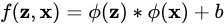

这里带来了两个限制：

* •
* •

对于这两点：

* 现代化网络：随着kaiming he的残差网络的提出，网络的深度得到了巨大的释放，通常物体检测和语义分割的baseline backbone都采用ResNet50的结构。为了保证网络具有适当/整齐的分辨率，几乎所有的现代网络backbone都具有padding结构。(可以参考一下这个讨论中[[padding or not padding](https://link.zhihu.com/?target=https%3A//stats.stackexchange.com/questions/246512/convolutional-layers-to-pad-or-not-to-pad)]的第三小点) 如ResNet肯定不具备严格平移不变性，padding的引入使得网络输出的响应对不同位置有了不同的认知。而我们在这一步的训练希望的是网络学习到如何通过表观来分辨回归物体，这里就限制了深网络在tracking领域的应用。

* 网络对称性：由于SiamRPN的监督不再是相似度，而是回归的偏移量/前背景分数，不再具有对称性。所以在SiamRPN的改进中需要引入非对称的部件（adj_x in Fig. 3），如果完全Siamese的话没法达到目的。这一点主要会引导后面的correlation设计。

我们认为现代化网络破坏严格平移不变性以后，带来的弊端就是会学习到位置偏见：按照SiamFC的训练方法，正样本都在正中心，网络会学到这种统计特性，学到样本中正样本分布的情况。

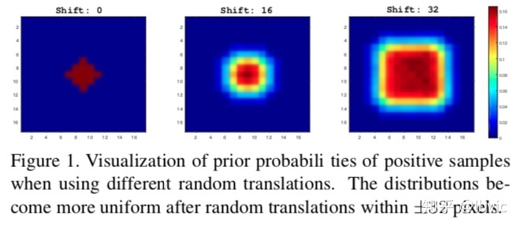

为了验证我们的猜测，我们设计了一个模拟实验。当我们像SiamFC一样训练，把正样本都放在中心时，网络只对中心有响应；如果把正样本均匀分布在某个范围内，而不是一直在中心时（范围是离中心点一定距离，该距离为shift；正样本在这个范围内均匀分布），随着shift的不断增大，这种现象能够逐渐得到缓解。

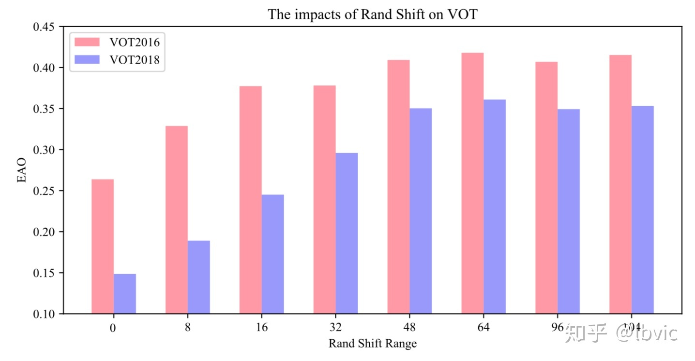

我们按照这个思想进行了实际的实验验证，在训练过程中，我们不再把正样本放在中心，而是以均匀分布的采样方式让目标在中心点附近进行偏移。由上图可以看出，随着偏移的范围增大，深度网络可以由刚开始的完全没有效果逐渐变好。

**所以说，通过均匀分布的采样方式让目标在中心点附近进行偏移，可以缓解网络因为破坏了严格平移不变性带来的影响，即消除了位置偏见，让现代化网络可以应用于跟踪中。**

## 额外讨论：

为什么你所说的问题在检测和语义分割中并不存在？ 因为对于物体检测和语义分割而言，训练过程中，物体本身就是在全图的每个位置较为均匀的分布。我们可以很容易的验证，如果在物体检测网络只训练标注在图像中心的样本，而边缘的样本都不进行训练，那么显然，这样训练的网络只会对图像的中心位置产生高响应，边缘位置就随缘了，不难想象这种时候边缘位置的性能显然会大幅衰减。而更为致命的是，按照SiamFC的训练方式，中心位置为正样本，边缘位置为负样本。那么网络只会记录下边缘永远为负，不管表观是什么样子了。这完全背离了我们训练的初衷。

## 在跟踪中使用深网络

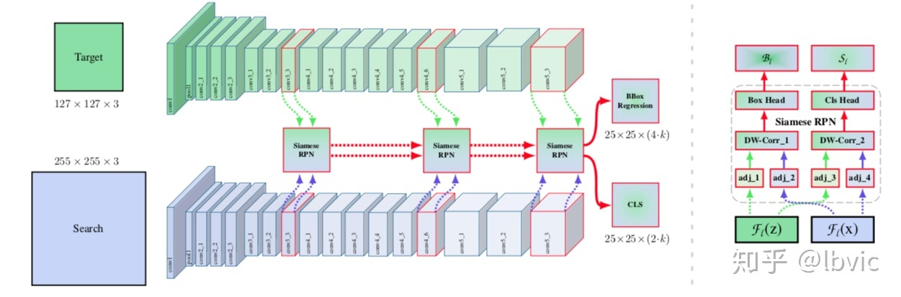

**我们主要的实验实在ResNet-50上做的**。现代化网络一般都是stride32，但跟踪为了定位的准确性，一般stride都比较小（Siamese系列一般都为8），所以我们把ResNet最后两个block的stride去掉了，同时增加了dilated convolution，一是为了增加感受野，二是为了能利用上预训练参数。论文中提到的MobileNet等现代化网络也是进行了这样的改动。如上图所示，改过之后，后面三个block的分辨率就一致了。

在训练过程中采用了新的采样策略后，我们可以训练ResNet网络了，并且能够正常跟踪一些视频了。（之前跟踪过程中一直聚集在中心，根本无法正常跟踪目标）。对backbone进行finetune以后，又能够进一步得到一些性能提升。

## 多层融合

加上了现代化网络以后，一个自然的想法就是使用多层融合。我们选择了网络最后三个block的输出进行融合（由于之前对网络的改动，所以分辨率一致，融合时实现起来简单）。对于融合方式上我们并没有做过多的探究，而是直接做了线性加权。

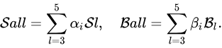

## Depthwise Cross Correlation

这一点是一个通用的改进，并不是只针对于深网络的。

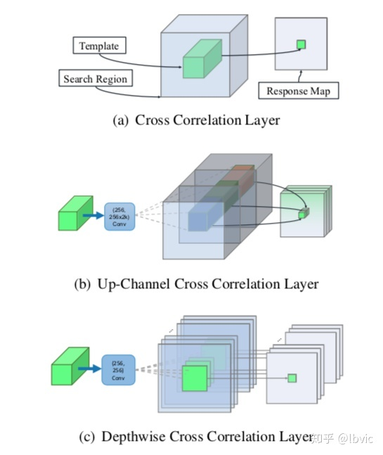

下面分别来介绍与之前的区别：

* Cross Correlation：如上图(a)，用于SiamFC，模版支特征在搜索区域上滑窗的方式获取不同位置的响应。

* •
* •
* •
* •

## 实验

## Ablation

为了验证我们的提出的内容，我们做了详细的对比实验

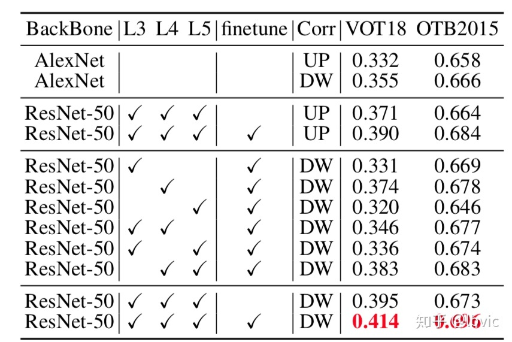

* •
* •
* •

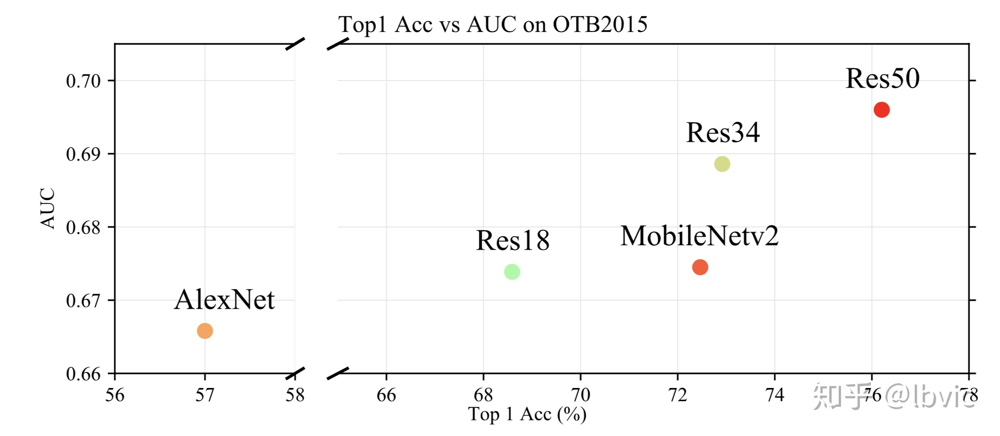

* •

## state-of-the-art

为了验证我们提出的SiamRPN++的性能，我们在六个数据集上进行了实验。首先是比较重要的两个数据集，VOT和OTB，然后添加了UAV123，同时在两个比较大的数据集LaSOT，TrackingNet上也进行了实验。最后我们又将算法应用于longterm，在VOT18-LT上进行了实验。我们新提出的算法在这些数据集上都取得了非常好的效果。

## VOT数据集

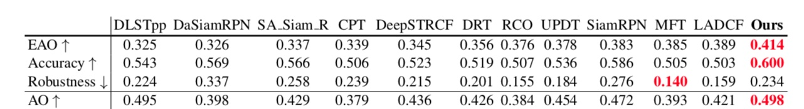

* •
* •

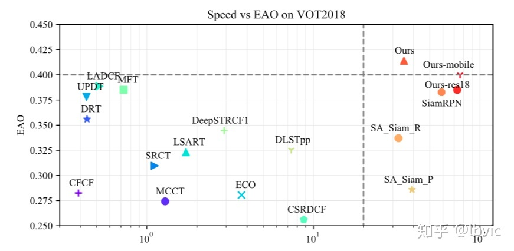

* •

## OTB数据集

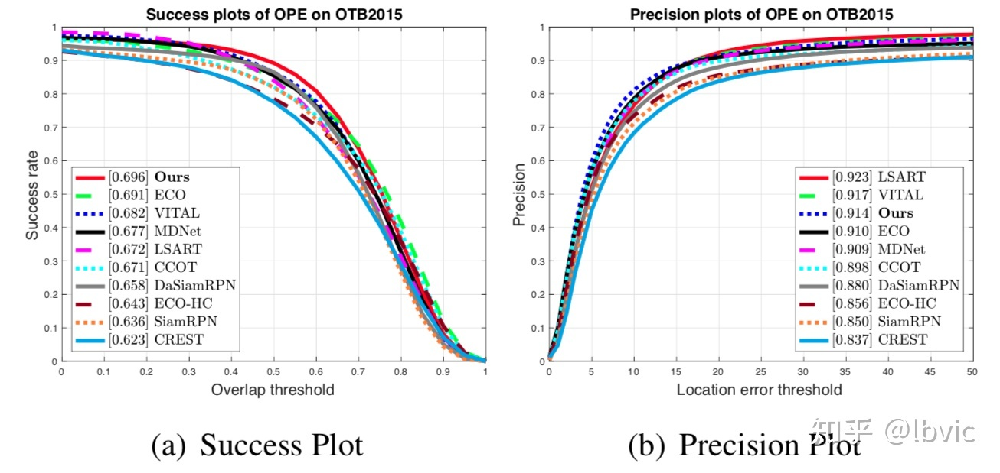

* •

## UAV123

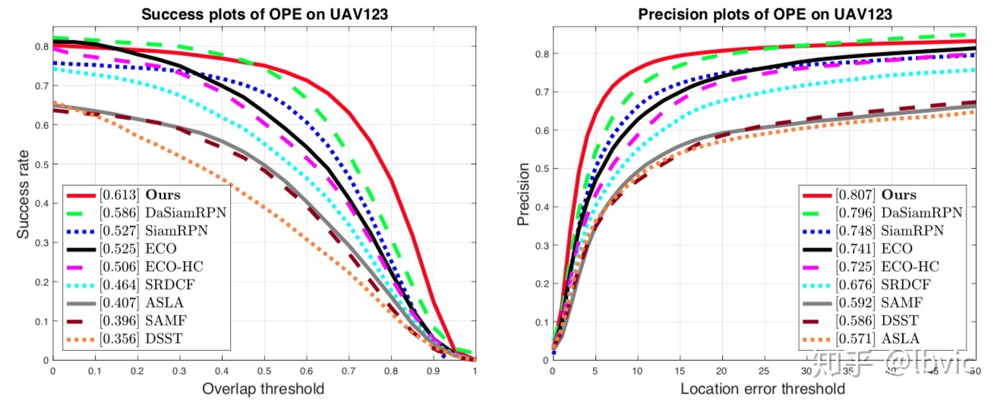

* •

## LaSOT

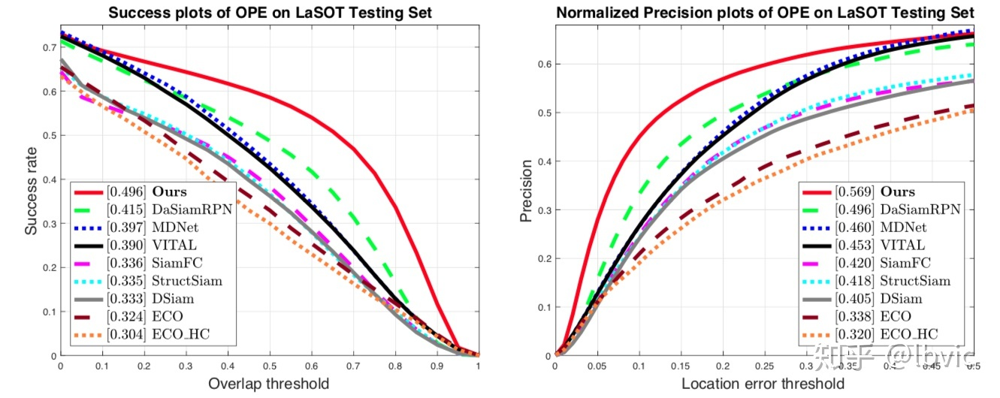

* •

## TrackingNet

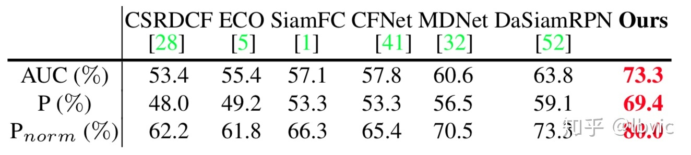

* •

## VOT18-LT

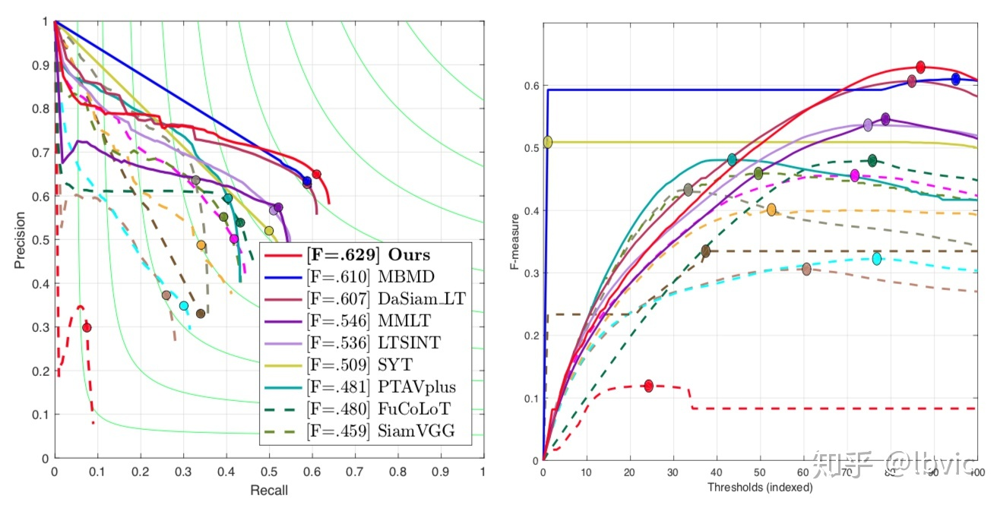

* •

## 总结

总结一下，深网络一直是Siamese系列的一大痛点，我们简单的通过调整训练过程中正样本的采样方式让深网络可以在跟踪中发挥作用，同时通过多层聚合更大程度的发挥深网络的作用。除此之外，新的轻量级的correlation方式在减少参数量的同时，也增加了跟踪的性能。最终，我们的算法可以在多个数据集上达到state of the art的性能。

# **Deeper and Wider Siamese Networks for Real-Time Visual Tracking**

****

孪生网络因其平衡了准确性和速度而引起了视觉跟踪领域的极大关注。然而，在连体追踪器中使用的骨干网络相对较浅，例如AlexNet [18]，它没有充分利用新型深度神经网络的能力。在本文中，我们研究如何利用更深和更广泛的卷积神经网络来增强跟踪的鲁棒性和准确性。我们观察到，**使用现有的强大架构直接替换主干，例如ResNet [14]和Inception [33]，并没有带来改进**。主要原因是1）**神经元感受野的大幅增加导致特征可辨性和定位精度降低**; 2）卷积的网络padding在学习中引起位置偏差。为了解决这些问题，我们提出了新的残差模块，以消除填充的负面影响，并进一步设计使用这些模块的新架构，具有受控的感受野大小和网络步幅。

**Siamese Cascaded Region Proposal Networks for Real-Time Visual Tracking**

**背景动机：**

**基于siamese做的改进**

1、 正负样本的比例，不一致，导致 Siamese Network 的训练不够有效；大部分的负样本都是简单样本，对最终的结果贡献很小，所以，在出现相似物体的时候，经常会出现跟踪混淆；

2、 Low-level spatial features 并没有充分的被探索，仅仅利用了高层的特征，底层的信息具有更多详细的空间信息，高层具有更多抽象的语义信息

3、One-stage Siamese RPN 采用 单个回归器进行物体的定位，但是实际上并没有很好的处理跟踪中物体的尺寸变换的问题。利用预先定义好的 Coarse anchor Box 不能很好的进行精确的定位；

**根据上述动机，作者引入 多级的 RPN 网络，来解决定位问题；同时选择 hard negative samples 来改善网络的鲁棒性，重点解决了样本不均衡的问题。此外，作者还引入了多层特征的融合，得到了更好的特征表达。**

**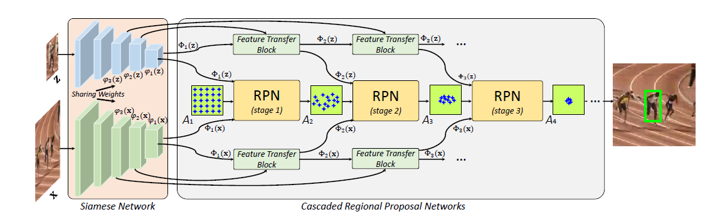

**

target template x and the search region z.

**backbone：AlexNet**

**RPN：**

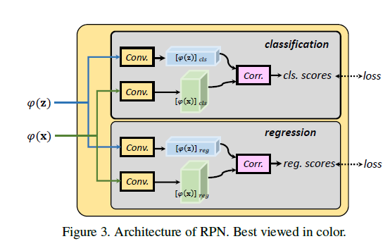

**Feature Transfer Block (FTB)**

进行多层特征融合 ，融合高层的语义信息去改善网络辨识的能力

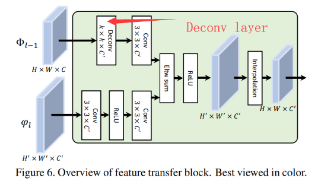

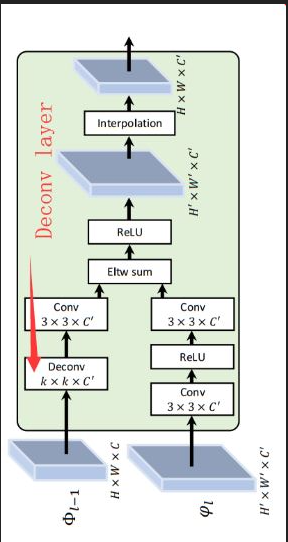

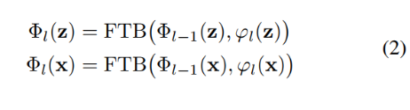

**anchor的变换**

**不断用上一个rpn的结果来优化下一个rpn的anchor**

**第一个rpn的anchor是人为初始设定的**

我们用 Al表示在阶段 l 的 anchor set。根据分类的得分，我们可以过滤出该集合中的样本，当其 negative confidence 大于预先设定的阈值时。然后，剩下的那些样本就构成了新的 anchor 集合 Al+1，并且用于训练 RPNl+1。此外，为了提供更好的初始化，我们优化了 Al+1中 anchor 的 center location 以及 size，所以，产生了更加准确的定位。作者也提供了一个案例，来表明 BBox 的准确性提升。

**采用级联RPN的效果图 ，级联之后的区分干扰源的能力更强**

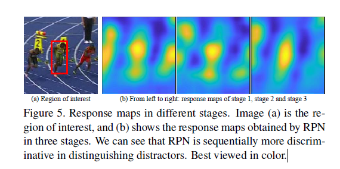

**损失函数loss**

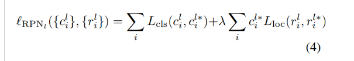

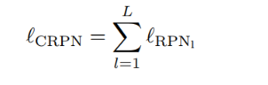

# IoU-Net：Acquisition of Localization Confidence for Accurate Object Detection

**背景动机：**

1. 目标检测分为分类和回归两个任务，目前的范式是：先用分类在多个候选框中**挑出置信分数最高的**，然后对其进行回归得到最终的目标框。然而，在这一流程中，分类网络对最后框的挑选占据了主导作用，回归的重要性在一定程度上被忽视了。这么做的一个缺陷在于，**当分类的置信度与定位（回归）的准确度不匹配时，会导致定位更准确的边界框在 NMS 过程中反被更不准确的边界框抑制。**比如下图：

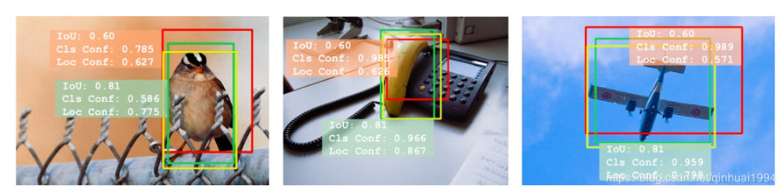

回归得更精确的框（绿框），因为在分类置信度上略低于红框，在NMS得过程中会被抑制掉，产生一种“劣币驱逐良币”的现象。

**2.**缺乏定位置信度使得被广泛使用的边界框回归方法缺少**可解释性**或**可预测性**。比如，常用的迭代式边界框回归方法，随着迭代轮次的增加，在定位精度上不一定是单调增加的。所以，如果粗暴的多次应用边界框回归，可能会降低回归精度。

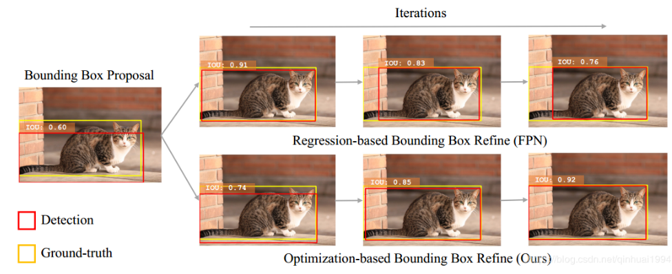

Contributions：

1. 针对第一个问题，作者提出了一种IoU引导式的NMS方法（IoU-guided NMS），**不再将同一个框的分类置信度和定位置信度绑定。而是用定位置信度作为NMS的排名依据**，将其匹配上附近框中最高的分类置信度。这样就可以消除由误导性的分类置信度所造成的抑制错误。

2. 针对第二个问题，作者提出了一种基于优化的边界框修正流程（Optimization-based Bounding Box Refinement）。简而言之，这种方法在预测某一个框的IoU的同时，能够利用预测网络的反向梯度通过梯度上升求解边界框的优化。

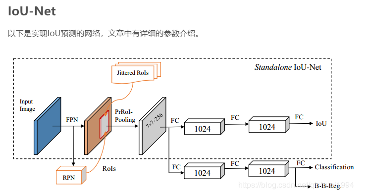

与Faster RCNN的主要区别在RoI-Pooling 换成了PrRoI-Pooling, 加入了一个IoU预测器。

**ROI的产生发生了变化**

1. IoU predictor

**本文IoU预测器的输入不是用RPN产生的RoIs，而是对Ground Truth框随机扰动，得到Jittered RoIs，过滤掉与GT的IoU<0.5的框，剩下的作为输入，经过PrRoI Pooling给IoU predictor。**

2. IoU-guided NMS

分类置信度与定位置信度不是对齐的。本文提出了IoU-guided NMS，将IoU与分类置信度结合在一起。算法如下：

对于一类的所有检测出的bbox B：

  取出定位置信度最大的框bmbm, 得分为s

    对于与bmbm的IoU大于阈值的框，将其过滤，若分类置信度高于bmbm，则更新bmbm的分类置信度。

不断迭代进行，直到B中所有bbox都处理完毕。

之前的NMS是以bbox的分类置信度排序，然后按IoU过滤。得到分类置信度最高的框

IoU-guided NMS则是以bbox的定位置信度排序，然后按IoU过滤，并更新分类置信度。得到定位置信度最高的框，并且分类置信度变成最高了

3. Bounding box refinement as an optimization procedure

**ROIpooling 发生变化**

4. Precise RoI Pooling

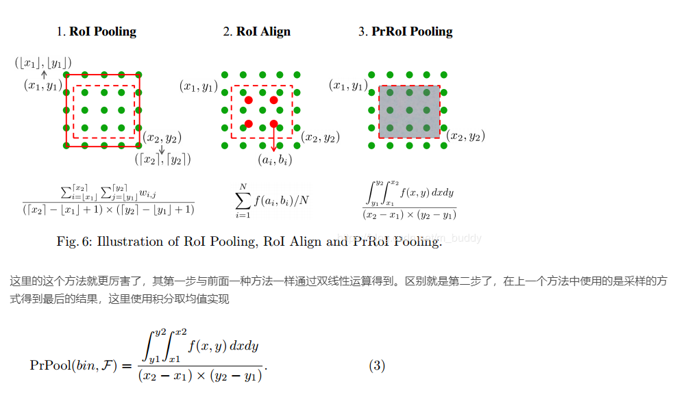

优点：

不涉及任何量化取整操作

解决了ROI Align中插值像素点数目N的问题，这里不再有该参数，整个feature map是一个连续的整体。

整个区域的像素值通过求积分得到，所以，所有的像素值都有梯度的传递。

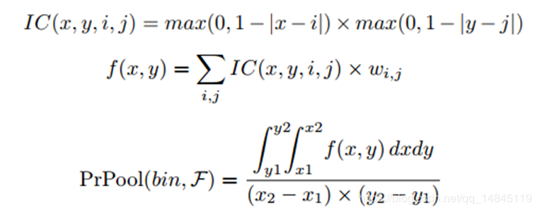

对于每一个bin区域，假设(x1, y1)、(x2, y2)为其中一个bin区域的左上角和右下角坐标，图中红色虚线框。基于每个bin中的整数值位置的像素点就可以积分出整个区域的像素值。

IC函数计算每一个连续的x,y方向的偏移的乘积，在1个像素以内的偏移，使用该像素（i,j）计算，即该像素上下左右1个像素以内的区域都会被计算到。超过一个像素的偏移的，使用下一个整数像素点（i+1,j）或者（i,j+1）计算。然后该偏移的乘积和（i,j）的像素值wij乘积得到f(x,y)。从(x1, y1)到(x2, y2)对f(x,y)求积分，即可以得到整个bin区域的像素的和，然后求平均，就得到该bin区域的输出。最终每一个bin区域都输出1个数值，形成最终的7*7输出的feature map。

# Accurate Tracking by Overlap Maximization（ATOM）

背景动机

主要动机是从改善重合度的角度，来提升跟踪的总体性能。因为现有的算法，大部分都在强调，怎么做才能跟的上，而很少有人专门研究：“怎么跟踪，才能跟踪的好？”这里的好，不但是指能时刻跟住目标，而且所预测的 BBox 要能很好的框柱目标物体，**所以本为的研究重点在如何更准确地预测目标框**

作者将跟踪任务主要分为两种：a**classification**task and an**estimation******task。前者是粗略的将提取的图像块分类为前景和背景，得到一个粗略的目标位置；而后者是通过一个 BBox 来预测目标的状态。最新的一个顶尖跟踪算法，也是依赖于模型中的分类成分来进行目标预测。但是这种策略是有很大局限性的，因为 bounding box estimation 是一个非常具有挑战性的任务，需要对目标的姿态有高层的理解

IoU-Net

首先简单介绍一下IoU-Net，IoU-Net主要的贡献有两点：

IoU引导式的NMS方法（IoU-guided NMS），避免了高分类置信度的框抑制高定位置信度框的情况。

基于优化的边界回归方案（Optimization-based Bounding Box Refinement），进一步提升了边界框回归的精度。

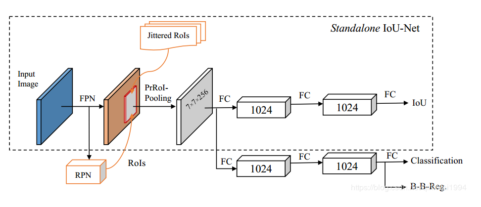

作者在常规的检测器基础上，增加了一个IoU输出分支，同时提出了更精确的PrRoI Pooling取代原来的RoI Align。 虚线框部分就是一个独立的IoU-Net结构。

作者针对IoU的这两点改进恰好都有助于提升框的定位精度，所以同样对基于检测的tracking算法有明显提升。

## 

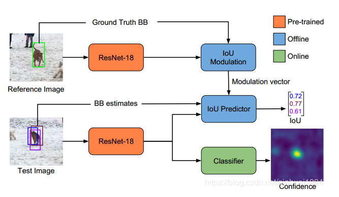

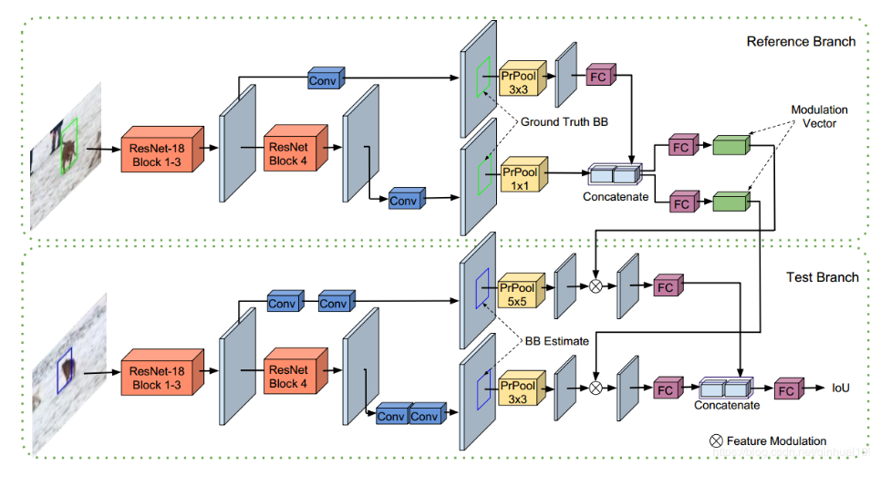

由于跟踪任务的类别无先验性，作者参考孪生网络设计出了一个类似的结构，在模板分支（Reference Branch）处理第一帧的目标特征，得出一个调制向量，然后逐通道与测试分支（Test Branch）特征相乘，过两个全连接层之后得到预测的IoU分数。上下两支结构上差别十分微小。(从后面的实验结果可以看出，直接用对称的结构性能也是不错的)

– 分类网络

分类网络与预测网络共用了Backbone（ResNet-18），结构上比较简单，在ResNet之后加上了两层conv用于输出对候选框的打分。值得注意的是，由于跟踪目标只出现在第一帧中，训练样本上得不到目标的信息，所以分类网络的head是在线训练的，而预测网络的部分是离线训练好的。

– Inference

虽然从整体框架上看，预测和分类部分是并行的，但其实并不是。大致流程如下：

将候选区域通过分类网络，得到一个分类置信度最大的框，由框的坐标可以得到目标粗略的位置。（这一步与IoU-Net的IoU引导式NMS方法不太一样）

基于Step 1 的目标位置，造若干个初始的bounding box，然后过IoU预测网络，用梯度上升最大化IoU求出3个IoU最高的bbox，取平均得到最终的结果。（这一步类似于IoU-Net的基于优化的边界框回归过程）

**Fast Online Object Tracking and Segmentation: A Unifying Approach**

**Abstract**

在这篇论文，作者阐述了如何进行实时且单阶段的目标追踪和视频中的物体分割。他们把这个方法命名为 SiamMask，用一个二元分割任务增强损失函数，优化目前流行的全卷积Siamese方法的线下训练。在训练过程中，SiamMask 只需初始化边框，然后通过线上操作，产生与类别无关的物体分割masks以及边框，速度为35帧每秒。此方法很简洁，速度快，它在VOT-2018上也能和 state of art 的追踪器相比较，表现极具竞争力，在半监督视频物体分割任务DAVIS-2016和DAVIS-2017上，它的速度是最快的。项目网址是：[http://www.robots.ox.ac.uk/~qwang/SiamMask](http://www.robots.ox.ac.uk/~qwang/SiamMask)

这篇论文中，我们旨在通过SiamMask缩小物体跟踪和VOS的差距，SiamMask是一个简单的多任务学习方法，可用于解决这两个问题。全卷积Siamese网络在物体跟踪上比较成功，速度较快，它在几百万对视频帧上进行线下训练；而且近来也有了像素级标注的数据集如YoTube-VOS，我们受它们启发提出了SiamMask。我们意图保留这些方法线下的可训练性，以及线上的速度；同时，极大地改善它们对目标物体的表现力。

**D3S – A Discriminative Single Shot Segmentation Tracker（目前没有代码）**

**结合了分割**

基于模板的判别式跟踪器由于其健壮性目前是主要的跟踪范例，但仅限于边界框跟踪和有限范围的转换模型，这降低了其定位精度。 我们提出了一种可区分的单发分段跟踪器– D3S，它缩小了视觉对象跟踪和视频对象分段之间的差距。 单发网络应用具有互补几何特性的两个目标模型，**一个对广泛的变换（包括非刚性变形）不变，另一个模型假定为刚性对象以同时实现高鲁棒性和在线目标分割**。  D3S无需按数据集进行微调，并且仅针对分段进行训练作为主要输出，因此在VOT2016，VOT2018和GOT-10k基准测试中，其性能均优于所有跟踪器，并且在TrackingNet上的性能接近最先进的跟踪器。  D3S在视频对象细分基准上胜过领先的细分跟踪器SiamMask，并且与顶级视频对象细分算法表现相当，同时运行速度快了一个数量级，接近实时。

**一个重点：解决目标框的不够精细化，提出可以旋转的框**

基于模板的最新跟踪器对目标本地化应用了有效的蛮力搜索。 这种策略适用于低维度转换，例如平移和缩放比例更改，但对于更一般的情况（例如放射变换和旋转作为一种折衷，现代跟踪器将近似穷举搜索与采样和/或边界框优化/回归网络[10、27]相结合，以进行长宽比估计。 但是，这些方法仅限于轴对齐的矩形。 

我们提出了一种新的单次判别式细分跟踪器D3S，它可以解决上述限制。 目标由两个判别式视觉模型编码-一个是自适应且高度判别式，但在几何上受欧几里德运动（GEM）的约束，而另一个则在广泛的变换范围内不变（GIM，几何不变模型），

   GIM牺牲空间关系以**允许目标在显着变形下定位**。 另一方面，**GEM仅预测位置，但有区别地适应目标**，并充当GIM推断出的多个目标细分之间的选择器。 与相关的跟踪器相比，D3Sisasegmentation贴图的主要输出是通过网络单次计算得出的，仅针对端到端进行训练以进行分段

   某些应用程序和大多数跟踪基准需要将目标位置报告为边界框。 作为第二贡献，我们提出了一种有效的方法来将分割蒙版解释为旋转的矩形。 这避免了容易出错的贪婪搜索，并自然解决了位置，比例，纵横比和旋转的变化

%!(EXTRA markdown.ResourceType=, string=, string=)

网络分为两个部分，一个是GEM  另一个是GIM 

通过相关滤波算法（这里使用的是马丁丹尼尔建的ATOM在线训练跟踪）得到比较精确的目标位置信息，通过目标分割（此处采用的VOS中的videomatch）的方法得到目标的分割前景、背景特征响应图，然后将目标位置信息与分割的响应图进行融合（融合就是concat到一起），进行上采样（标准的U-net的套路）。因此本文可以说优雅的将ATOM，videomatch,U-net的方法融合起来，从而得到一个比较好的视频目标分割算法，由于在线跟踪的鲁棒性高，分割结果精度高，网络比较简单，因此速度相对比较快

%!(EXTRA markdown.ResourceType=, string=, string=)

 首先对第一帧的目标进行学习，通过马丁atom的算法可以学到一个比较鲁邦的分类器filter，从而在后续帧中可以得到比较鲁邦的目标位置，在得到目标的 位置上生成attention图，将目标的位置同目标的尺度相关联，得到目标位置区域的高斯图L，我个人简称为定位高斯attention。具体过程如下图所示：

 第二个分支就是分割网络了，就是求已知目标与搜索帧中pixel级别的相似度。借鉴了videomatch中的内容（论文全称：matching based video object segmentation）。将由bounding box 标注的跟踪信息转换成前景前景背景信息，并映射到特征图上，前景目标特征图上的每个特征对应通道上的向量与搜索帧的特征进行相关匹配求相似度（具体细节见代码），从而找到目标的前景背景区域在当前帧中可能的分布概率图，简称前景背景分割结果图。

%!(EXTRA markdown.ResourceType=, string=, string=)

由于分割结果图是很粗糙的，因此要将定位高斯attention与之融合才能得到目标的分割结果图，因此这部分可以看做将ATOM中的IOU回归预测巧妙替换成了分割，从而极大的提高了目标估计的精度。

 这就实现了分割级别的跟踪，得到分割结果之后，采用旋转矩形框的方式得到目标的最终bounding box ,这个我之前的专栏也探讨过，就是在不改变当前结果的鲁棒性的前提下，采用旋转矩形框的方法可以很大提升算法在VOT库上的精度结果，可能这就相当于在拟合vot这个库，因此这也是各路大佬吐槽目标跟踪算法容易被vot的库带偏的地方。不过作为学生，黑猫白猫 ，能发论文都是好猫。         得到目标的分割结果之后，剩下的就是tricks了，之前我们也讲到如何用椭圆得到目标更高精度的旋转矩形框：本文也采用了这种拟合椭圆的形式，文章原文是这么说的：The bounding box fitting method is very fast and takes on average only 2 ms。是的这个部分开销小，收益却非常大。能够得到非常好的效果。

 椭圆fitting起关键作用： 如果这套算法去掉最后的椭圆fitting的部分，仅仅采用旋转最小闭包框的形式，结果将下降4.5个百分点（0.489 vs 0.444）,如果在分割结果上直接采用垂直矩形框，结果与采用旋转椭圆fitting框相比下降9.1个百分点（0.489 vs 0.398），可想而知，旋转椭圆fitting矩形框的效果是多么好了。         ATOM在线跟踪鲁棒性尤为关键：如果去掉atom定位分支，算法的rob将变得极差，EAO结果下降20几个百分点，可想而知，定位在整套算法中的地位。 看到这里顿时感觉这文章没啥新意了，哈哈哈，但是能够取之所长，为我所用的的能力还是非常好的，拿别人的轮子，造自己的汽车，而且结果还是非常好，达到NO.1的水平，可见作者还是功力深厚的。

D3S中引用的论文

**VideoMatch**: Matching based Video Object Segmentation

摘要：

视频对象分割在各种视频分析应用中具有挑战性，但也很重要。 最近的工作将视频对象分段公式化为使用深网的预测任务，以实现具有吸引力的最新性能。 由于将公式表示为一种预测任务，因此这些方法中的大多数都需要在测试期间进行微调，以使深层网记忆给定视频中感兴趣对象的外观。 但是，微调非常耗时且计算量很大，因此算法远非实时。 为了解决这个问题，我们开发了一种新颖的基于匹配的视频对象分割算法。 与基于记忆的分类技术相比，所提出的方法学习将提取的特征与提供的模板进行匹配，而无需记忆对象的外观。 我们在具有挑战性的DAVIS-16，DAVIS-17，Youtube-Objects和JumpCut数据集上验证了该方法的有效性和鲁棒性。 大量结果表明，我们的方法无需微调即可达到可比的性能，并且在计算时间方面更为有利。

本文提出了一种不需要任何微调的端到端可训练的快速**半监督视频对象分割**方法。我们的方法基于这样的直觉：任何一帧的前景和背景的特征都应该与第一帧的前景和背景的特征相匹配。

为了确保所提出的方法能够处理外观和几何变化，我们使用一个深度网络来学习在推理过程中应该匹配和适应特征集的特征。

%!(EXTRA markdown.ResourceType=, string=, string=)

**Learning Discriminative Model Prediction for Tracking（DiMP）**

摘要：

目前朝着端到端可培训的计算机视觉系统的努力，给可视化跟踪的任务带来了重大挑战。与视觉问题不同的是，在推理阶段，跟踪需要在线学习鲁棒的目标特定外观模型。因此，要实现端到端的可训练性，就需要在跟踪体系结构本身中嵌入onlinelearningofthetargetmodel。由于所施加的挑战，**流行的siamese只是预测目标特征模板，而忽略了推理过程中的背景外观信息。因此，预测模型具有有限的目标背景判别能力**。

我们开发了一个端到端的跟踪架构，能够**充分利用目标和背景的外观信息进行目标模型预测**。通过设计一个专用的优化过程，我们的体系结构是从区别性的学习损失中派生出来的，该优化过程能够在几次迭代中预测出一个强大的模型。

此外，我们的方法能够学习歧视性损失本身的关键方面。该跟踪器在6个跟踪基准上设置了一个新的最新技术，在VOT2018上获得了0.440的EAO分数，同时运行速度超过40 FPS。

作者认为的siamese 系列的缺点：

1.指利用了目标的信息，没有利用背景信息，背景信息在区分相似性物体时很有用

2.学习到的相似性度量对于不在离线学习中的目标不一定有泛化性

3.siamese 没有提供强大的更新策略

**Graph Convolutional Tracking**

**创新：利用GCN进行目标跟踪**

摘要：

近年来，siamese网络的跟踪取得了良好的效果。然而，现有的siamese方法大多没有充分利用时空背景下的目标外观造型。事实上，时空信息可以提供多种特征来增强目标的表现力，而上下文信息对于目标定位的在线自适应具有重要意义。为了**综合利用历史目标样本的时空结构，充分利用背景信息**，本文提出了一种用于高性能视觉跟踪的图卷积跟踪方法。具体地说，GCT将两种类型的图卷积网络（GCNs）合并到一个用于目标外观建模的siamese框架中。在这里，我们采用时空GCN对历史目标样本的结构化表示进行建模。此外，文中还设计了一个上下文GCN，利用当前帧的上下文来学习目标定位的自适应特征。对4个具有挑战性的基准测试的广泛结果表明，我们的GCT方法在每秒运行约50帧的情况下，相对于最先进的跟踪器表现良好。

method 没看懂，需要补充GCN知识

**GradNet: Gradient-Guided Network for Visual Object Tracking**

摘要：

基于模板匹配的全卷积siamese网络在视觉跟踪中显示出巨大的潜力。在测试过程中，模板与初始目标特征固定，性能完全依赖于siamese网络的总体匹配能力。**然而，这种方法不能捕捉目标或背景杂波的时间变化。在这项工作中，我们提出了一种新的梯度引导网络，利用梯度中的辨别信息，通过前向和后向操作更新****siamese****网络中的模板**。具体来说，该算法可以利用梯度信息来更新当前帧中的模板。另外，为了更好地利用梯度信息，避免过度拟合，提出了一种模板泛化训练方法。据我们所知，这项工作是第一次尝试利用梯度信息进行模板更新的siamese为基础的追踪器。

在最近的基准上进行的大量实验表明，我们的方法比其他最先进的跟踪器取得了更好的性能。

这就是GradNet被提出的初衷：**通过改变模板，不断是去适应目标的新形象，使得网络始终可以通过基于模板的cross correlation来获得高的相似度来跟踪目标。**

作者分析目前跟踪系列方法的优缺点

目标跟踪分为两大系列：

1 第一组[36，28，32，4]通过**频繁的在线更新来提高深度网络的辨别能力**。他们利用第一个框架来初始化模型并对其进行更新每隔几帧。及时的在线更新使追踪器能够捕捉目标的变化，但也需要更多的计算时间。因此，**这些跟踪器的速度一般不能满足实时性的要求。**

2.siamese为基础的追踪器是第二组的代表[3，44，22]，这是完全基于离线训练。

通过**大量的离线训练，他们学会了不同框架下的不同对象之间的相似性**。在线测试时，将初始目标特征作为模板，用于搜索后续帧中的目标。这些方法不需要在线更新，因此，它们通常以实时速度运行。然而，这些方法在没有重要的在线适应性的情况下，无**法适应目标的外观变化，从而增加了跟踪漂移的风险。为了解决这个问题，许多研究[16，45，40]提出了不同的模板特征更新机制。**然而，这些方法只注重结合以往的目标特征，**忽略了背景杂波中的分辨信息**。这导致基于暹罗的跟踪器和在线更新的跟踪器之间存在很大的精度差距。

**motivation**

%!(EXTRA markdown.ResourceType=, string=, string=)

第一列将目标区域遮挡一部分，这张图的特**征的梯度在被遮挡的区域会有很大的值**（第二列玫瑰色的区域代表值很大）。第三列的**图像展示了和目标相似的背景目标，一样会有很大的梯度**。所以梯度是可以反映目标的变换以及背景的位置。

目前的一些跟踪方法中，有一些方法是用到**了在线学习，就是在测试的时候，依然训练网络**。这些方法也是要借助梯度更新参数，使网络适应目标的新形象。但是往往需要几十次的迭代，才能收敛，所以测试时间会非常慢。

而作者提出的GradNet，仅仅依靠两次前向计算和一次反向求梯度，就能实现更新模板并且准确跟踪。

网络框架

%!(EXTRA markdown.ResourceType=, string=, string=)

**Deep Meta Learning for Real-Time Target-Aware Visual Tracking**

摘要：

本文提出了一种**基于siamese匹配网络和元学习网络的实时视觉跟踪框架**。传统的基于深度卷积特征的判别式视觉跟踪算法需要不断地对分类器或相关滤波器进行重新训练，这需要**解决复杂的优化任务**，以适应目标物体的新外观。为了缓解这一复杂的过程，我们提出的算法通过加入targetware特征空间，结合并利用元学习网络为匹配网络提供目标对象的新的外观信息。从元学习者网络的一个forwardpass中立即提供目标特定特征空间的参数。通过消除跟踪过程中连续求解复杂优化任务的必要性，实验结果表明，我们的算法在保持其他最新跟踪算法的竞争性能的同时，具有实时性。

本文基于以上背景和动机，提出了一种 end to end visual tracking network structure，主要包括了两个部分：

　　一个是：**Siamese matching network**for target search，

　　另一个是：**meta-learning network**for adaptive feature space.

我们的方法通过构建一个视觉跟踪系统来解决上述问题，该系统包括用于**目标搜索的连体匹配网络**和**用于自适应特征空间更新的元学习网络**。我们使用类似于[2]的完整连体网络结构来搜索给定帧中的目标对象，其中可以使用特征映射之间的互相关操作快速有效地进行目标搜索。对于元学习者网络，我们提出了一个参数预测网络，其灵感来自于元学习方法学对few shot学习问题的最新进展[35，47，14]。

元学习网络为更新模板template 

通过训练**元学习者网络**，**为匹配网络提供额外的卷积核和信道注意信息，使得匹配网络的特征空间可以自适应地修改，以采用在跟踪过程中获得的新的外观模板，而不会过度拟合**。元学习者网络只看到匹配网络最后一层的梯度，给出了新的训练样本。我们还针对元学习者网络采用了一种新的训练方案，通过防止元学习者网络产生导致匹配网络过度拟合的新参数来保持特征空间的泛化能力。通过引入元学习网络，无需迭代计算优化，只需一次前向传递，即可快速构造出目标的特征空间，提高了跟踪算法的性能。

%!(EXTRA markdown.ResourceType=, string=, string=)

%!(EXTRA markdown.ResourceType=, string=, string=)

算法流程

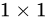

**‘Skimming-Perusal’ Tracking: A Framework for Real-Time and Robust Long-term Tracking**

**基于siameseRPN网络**

摘要：

与传统的短期跟踪相比，**长期跟踪**具有更大的挑战性，更接近于实际应用。然而，这方面的工作却很少，其表现也很有限。在这项工作中，我们提出了一个新的鲁棒性和实时性的长期跟踪框架。**精读模块由一个有效的包围盒回归器和一个鲁棒的目标验证器组成，前者生成一系列候选方案，后者用其置信度来推断最优候选方案。**基于此分数，我们的跟踪器判断被跟踪对象是否存在，然后在下一帧中分别选择局部搜索和全局搜索的跟踪策略。为了加快图像的全局搜索速度，设计了一个新的浏览模块，从大量的滑动窗口中有效地选择最可能的区域。

**重点强调长期跟踪**

short-term tracking和long-term tracking的区别

  对于这两者而言，主要存在2个不同之处：

即视频帧的总数不同。前者的测试视频的长度一般都比较短，整个视频帧总共几十帧或者几百帧；而后者的测试视频的长度一般都比较长，整个视频帧总共几千帧。

即两者的输出内容不同。前者仅仅需要在视频的每一帧中输出对应的BB即可；而后者不仅仅需要输出每一帧中目标的BB信息，同时需要提供出待跟踪目标的状态，存在或者缺失。

论文贡献：

为了解决长期跟踪问题，提出了一种基于深度网络的快速浏览框架。浏览和说服模块都是离线训练的，在跟踪过程中直接使用。我们的框架简单而有效，可以作为长期跟踪的新基线。

•开发了一个新的阅读模块，用于精确捕获局部搜索区域中的被跟踪对象，该模块由一个基于siameserpn的有效BB回归器和一个基于深度特征嵌入的健壮离线训练验证器组成。

•设计了一种新的掠过模块，有效地从密集采样滑动窗口中选择最可能的局部区域，在目标不存在的情况下，加快了图像范围内的再检测过程。

总体框架如图1所示。我们的跟踪器首先使用Perual模块在本地搜索区域（目标大小的四倍）中搜索目标。在获得每帧中的最佳候选对象后，我们的跟踪器根据其置信度将被跟踪对象视为存在或不存在，然后确定下一帧中的搜索状态（局部搜索或全局搜索）。如果置信度得分是预先定义的阈值，则跟踪器将目标视为存在，并继续跟踪目标位置所进入的本地搜索区域。

否则，跟踪器将目标视为不存在，并在下一帧中进行全局搜索。具体地说，我们的全局搜索方案使用滑动窗口来裁剪一系列的局部搜索区域，然后使用阅读模块来处理这些区域。为了加快速度，我们开发了一个新的略读模块来有效地选择最可能的局部区域，并使用略读模块有效地处理这些区域。我们的浏览和阅读模块的详细描述如下。

%!(EXTRA markdown.ResourceType=, string=, string=)

我们的阅读模块由离线学习的暹罗模型和离线学习的验证模型组成（如图1所示）。前者在一个局部搜索区域内生成一系列候选方案，而后者对其进行验证并确定最佳候选方案。

给定目标模板Z和搜索区域X，略读模块旨在学习函数p=g（Z，X），其中p指示目标是否出现在该区域中。函数g（，）使用深卷积神经网络（CNN）实现，其网络结构如图4所示。目标模板和搜索区域都被输入到CNN特征提取器中，然后将它们的特征映射融合并拼接成一个长向量。最后，加入具有sigmoid函数的全连接（FC）层进行二值分类。

采用交叉熵损失对网络进行训练。

%!(EXTRA markdown.ResourceType=, string=, string=)

**CDTB: A Color and Depth Visual Object Tracking Dataset and Benchmark**

**内容：发布了一个新的数据集**

摘要：

提出了一种新的颜色和深度通用视觉目标跟踪基准（CDTB）。CDTB由几个被动和主动RGB-D装置记录，包含在阳光直射下采集的室内和室外序列。CDTB数据集是用于RGB-D跟踪的最大、最多样化的数据集，其帧数比相关数据集大一个数量级。这些序列被仔细地排序，以确保目标的变化、杂波、遮挡和长期目标的消失，从而使跟踪器能够在现实条件下进行评估。序列每帧用13个视觉属性进行注释，以便进行详细分析。使用RGB和RGB-D跟踪器的实验表明，CDTB比以前的数据集更具挑战性。最先进的RGB跟踪器优于最近的RGB-D跟踪器，这表明两个字段之间存在很大的差距，这是以前的基准没有检测到的。在分析的基础上，指出了在RGB-D跟踪器设计中未来研究的机会。

CDTB的RGB和深度序列。深度为颜色提供了补充信息：两个相同的物体在深度上更容易区分（a），如果深度信息可用，低照度场景（b）对跟踪器的挑战性较小，深度跟踪可变形物体简化了问题（c），而深度的突然显著变化是遮挡（d）的有力线索。

**Visual Tracking via Adaptive Spatially-Regularized Correlation Filters**

**公式看不懂系列  （2019cvpr oral ） 需要重新看，这个公式太多了**

**

**

摘要：

本文提出了一种**新的自适应空间正则化相关滤波器（ASRCF）模型来同时优化滤波器系数和空间正则化权值**。首先，这种自适应空间正则化方法可以学习特定对象的有效空间权重及其外观变化，从而在跟踪过程中获得更可靠的滤波系数。其次，我们的ASRCF模型可以基于乘子交替方向法进行有效的优化，其中每个子问题都有封闭解。第三，我们的跟踪器分别使用两种CF模型来估计位置和规模。位置CF模型利用浅层和深层特征的集合来精确地确定最优位置。尺度CF模型利用多尺度浅层特征有效地估计最优尺度。对五个最新基准进行的大量实验表明，我们的跟踪器相对于许多最先进的算法表现良好，实时性能为28fps。

%!(EXTRA markdown.ResourceType=, string=, string=)

contribution

首先，本文提出了一种新的自适应空间正则化相关滤波器（ASRCF）模型，该模型能够有效地估计目标感知的空间正则化（见图1），并在跟踪过程中获得更可靠的滤波器系数。我们的ASRCF是一个通用的CF模型，著名的KCF、SRDCF和BACF算法都是它的特例。

其次，我们的ASRCF模型可以通过交替方向乘数法（ADMM）进行有效的优化，其中每个子问题都有解析解。

第三，我们的跟踪器使用两个CF模型有效地估计位置和尺度：一个利用复杂特征进行精确定位；另一个利用浅特征进行快速尺度估计。

**Target-Aware Deep Tracking**

摘要：

现有的深度跟踪器主要利用卷积神经网络对一般的目标识别任务进行预训练以进行表示。尽管在许多视觉任务中都取得了成功，但是使用预先训练好的深层特征进行视觉跟踪的贡献并没有目标识别的贡献大。关键问题是，在视觉跟踪中，感兴趣的目标可以是任意形式的任意对象类。因此，预先训练的深度特征在以任意形式建模这些目标以将其与背景区分开来时效果较差。本文提出了一种新的学习目标感知特征的方法，与预先训练的深度特征相比，该方法能更好地识别出存在显著外观变化的目标。

为此，**我们提出了一个回归损失和一个排序损失来指导目标主动和尺度敏感特征的生成**。我们根据后向传播的梯度来确定每个卷积滤波器的重要性，并基于激活来选择目标感知特征来表示目标。目标感知特征与暹罗匹配网络集成，用于视觉跟踪。

motivation：

跟踪的任务是要将目标从背景中区分出来，而目标的可以是任意的，但是在分类任务上预训练的网络，它们不知道目标是啥，只要是它们见过的东西，它们都会割出来，所以不怎么适用于跟踪；

即使跟踪的目标在训练集中出现过，分类的网络一般都很深，提取的都是深层的语义信息，不利于定位；

**分类网络注重于类之间的距离而忽略了类内距离，这使得跟踪任务很容易被cluster影响**；

**分类的任务需要分多类，最后每个类的响应只会集中在某些channel上，但是跟踪任务只需要分前景和背景，只需要用到特定通道的信息，其他的都是冗余。**

### **Contribution**

提出了回归loss和rank loss来**选择最有效的表示当前目标的特征**；

将这些target-aware的特征与Siamese的框架相结合，并且减少了跟踪时使用的特征，加快了速度。

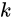

%!(EXTRA markdown.ResourceType=, string=, string=)

**Target-Active Features via Regression**

**

**

通过识别在目标区域活动而在背景区域不活动的过滤器来获得与目标相关的目标信息。

**%!(EXTRA markdown.ResourceType=, string=, string=)

**

利用回归损失的梯度和公式2，我们找到了**能够区分目标和背景的目标有源滤波器**。与预先训练的深度特征相比，生成的特征具有以下优点。**我们选择一部分特定于目标的滤波器来产生有区别的深层特征**。这不仅缓解了模型过拟合的问题，而且减少了特征的数量。targetware特性对于表示训练集中的任意目标或未查看的对象是有效的。

%!(EXTRA markdown.ResourceType=, string=, string=)

**Scale-Sensitive Features via Ranking**

为了生成对尺度敏感的特征，我们需要找到对目标尺度变化最为活跃的过滤器。

作者认为，不仅是不同类的物体在不同channel上的表现是不一样的，不同尺度的物体在不同channel上的响应也是不同的，所以他们搞了一个scale的选择机制，只激活与第一帧尺度一样的channel。训练的时候就是把标记的数据中，bbox尺度一样的放在一起训练，使得这两个之间的loss小，也就是下面这个公式：

%!(EXTRA markdown.ResourceType=, string=, string=)

Tracking

模型初始化：在初始化的时候，回归的loss和ranking的loss是分开训练的，分别用第一帧的ground truth训练，直到网络收敛；

在线跟踪：将回归分支和rank分支的特征concate一下，然后对比search region和template的相似度，找到最相似的就行了，为了适应尺度变化，他们还把search region做了不同的尺度变化，然后去找，文章里没有提到最终的bbox怎么来的，估计还是用到SiamFC中的上采样把。

**Unsupervised Deep Tracking     **

**中科大   ** Github(**pytorch**)：[https://github.com/594422814/UDT_pytorch](https://github.com/594422814/UDT_pytorch)

**让人眼前一亮，本文思路清奇**

摘要：

本文提出了一种无监督的视觉跟踪方法。不同于现有的方法，使用广泛的注释数据的监督学习，我们的模型训练大规模无标签视频在无人监督的方式。我们的动机是一个健壮的跟踪器应该在向前和向后的预测中都是有效的（**即跟踪器可以在连续的帧中向前定位目标对象，并在第一帧中回溯到其初始位置**）。我们建立在连体相关过滤网路上的架构，这个网路是使用未标记的原始影像训练的。同时，我们提出了一个多帧验证方法和一个代价敏感的损失，以便于无监督学习。无监督跟踪器在训练过程中需要完整、准确的标签，**可以达到完全监督跟踪器的基线精度**。此外，无监督框架显示出利用未标记或弱标记数据进一步提高跟踪精度的潜力。

%!(EXTRA markdown.ResourceType=, string=, string=)

本文提出了一种基于无监督学习的视觉跟踪模型。我们的直觉在于观察到视觉跟踪可以向前和向后两种方式进行。最初，**在第一个帧上给定标注，我们可以在随后的帧中向前跟踪目标对象。**

**当向后跟踪时，我们使用最后一帧的预测位置作为初始目标标注，并向后跟踪到第一帧**。通过反向跟踪估计的第一帧中的目标位置预计与初始注释相同。在测量了前向和后向目标轨迹之间的差异之后，我们的网络将通过考虑轨迹一致性在一个非监督的manner 1中训练，如图1所示。

通过利用未标记视频中的连续帧，我们的模型通过反复执行前向跟踪和后向验证来学习目标的定位。

我们将提出的无监督学习集成到基于siamese的相关滤波器框架中[54]。该网络由前向跟踪和后向验证两个步骤组成。我们注意到，反向验证并不总是有效的，因为跟踪器可能成功地从偏离或错误的位置返回到初始目标位置。此外，未标记视频中的严重遮挡等挑战将进一步降低网络表示能力。为了解决这些问题，**我们提出了多帧验证和代价敏感损失**，以利于无监督训练。多帧验证增加了前后轨迹的差异，减少了验证失败。同时，代价敏感损失降低了训练过程中噪声样本的干扰。

%!(EXTRA markdown.ResourceType=, string=, string=)
