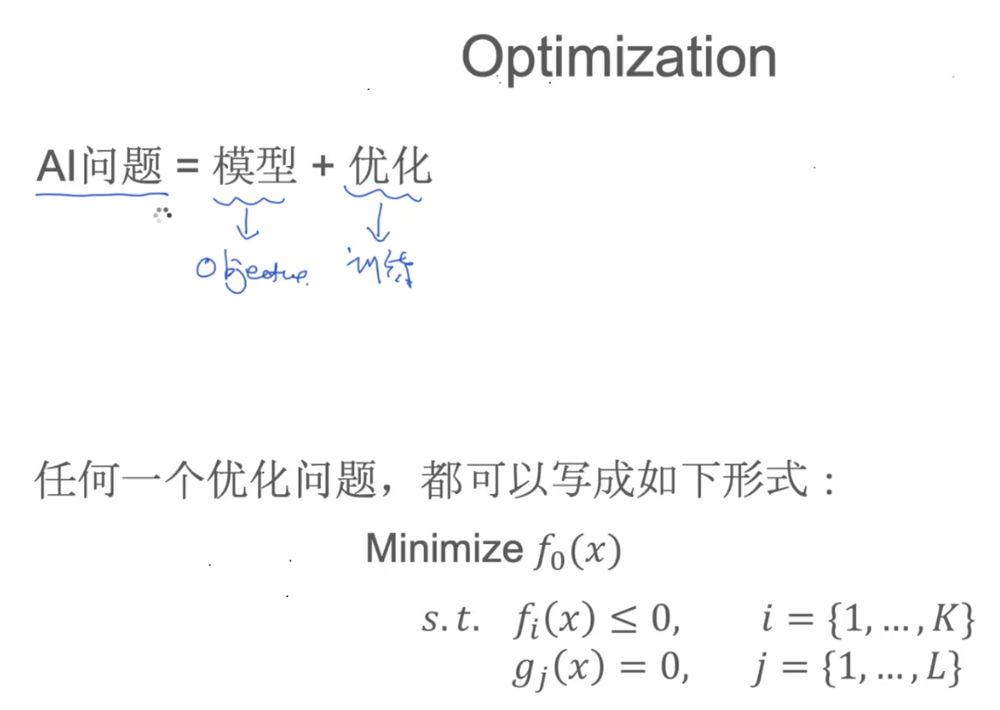
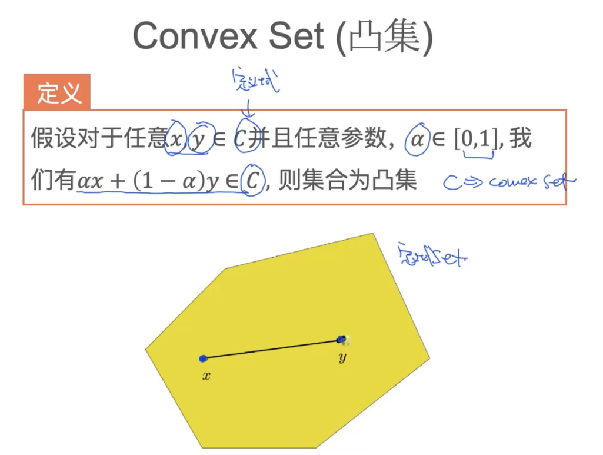
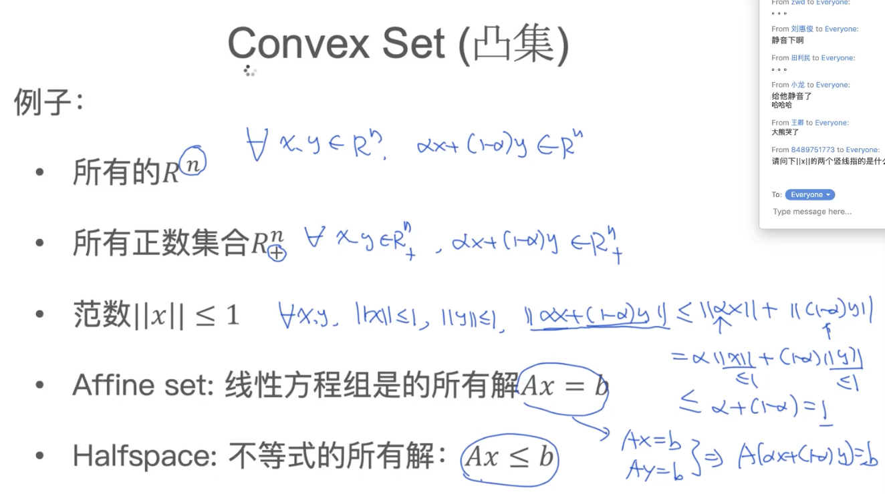
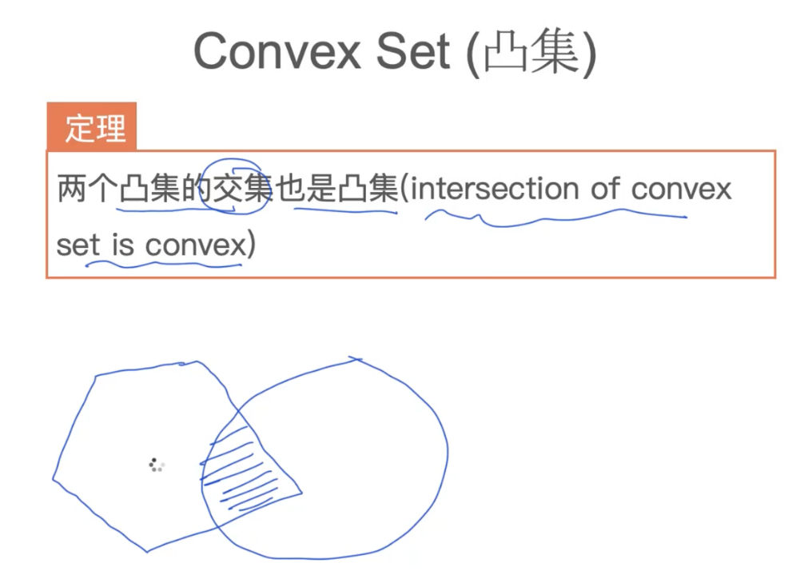
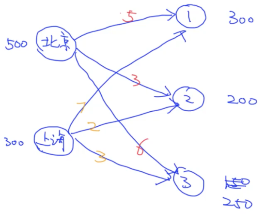
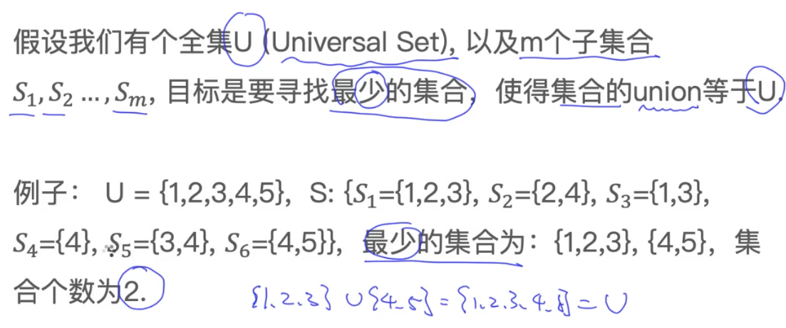
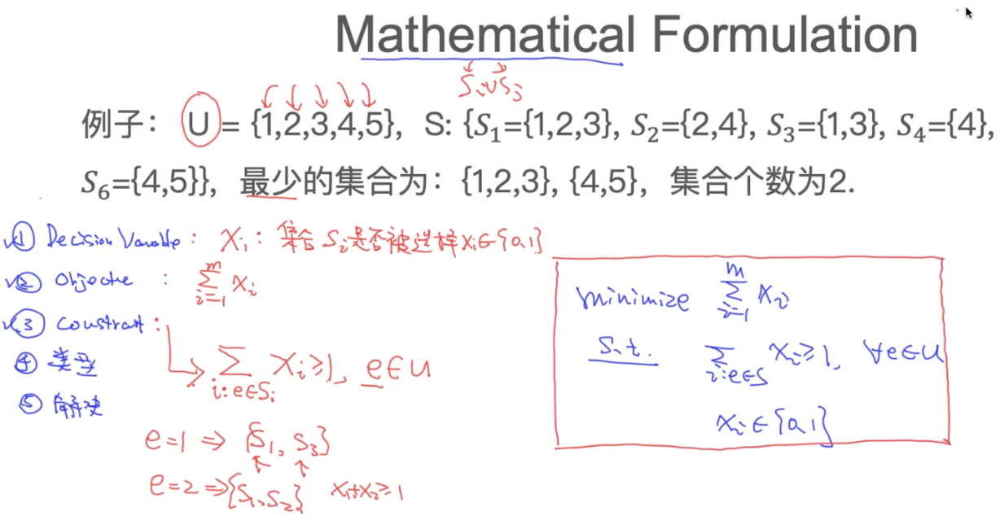
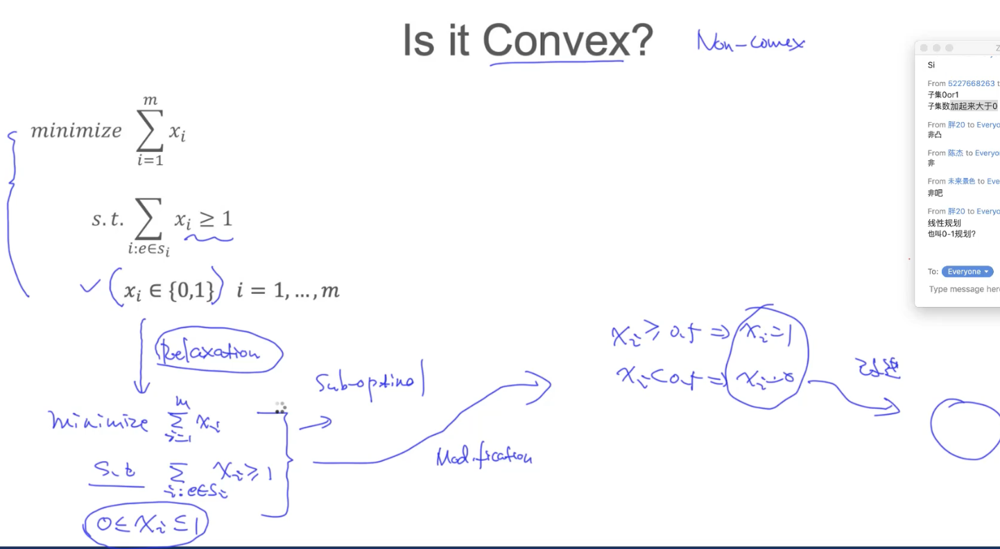
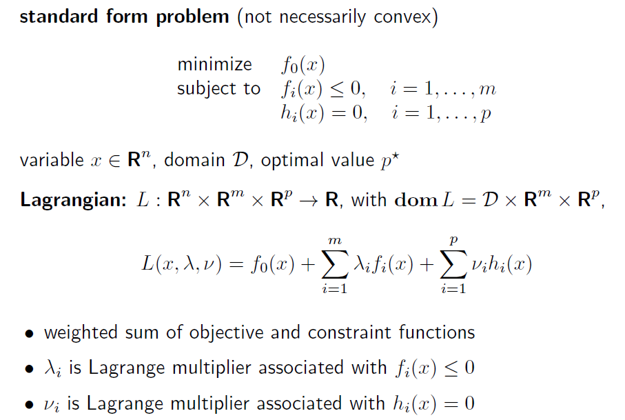

# 机器学习

## 凸集 凸函数 判定凸函数

AI 模型 = 模型 + 优化

#### 凸集

两个凸集的交集也是凸集

#### convex function 凸函数

二阶导数大于0的函数

如果是个矩阵，则矩阵二阶导数是半正定矩阵 才是凸函数

A是n阶方阵，如果对任何非零向量X，都有X'A*X≥0*，其中*X‘'*表示X的转置，就称A为**半正定矩阵**。

线性函数是凸函数

二次方函数

## transportation problem

1. 变量 decision variable
2. 目标 objective
3. 限制 constant
4. 判断目标类型
5. 寻找solver

优化问题函数库 **cvxopt.org**

## Set Cover Problem

constraint 中，对于Si中的每一个元素，都必须存在>=1 

如何转化

因为Xi 是离散的，不能通过线性优化问题解决，此时的思路是对xi范围做一个relaxation，令 xi 为离散变量，最后根据求得的xi值变换到0 或者1上
$$
0 <= x_i <= 1
$$

## duality 

standard form problem (not necessarily convex)
minimize f0(x)
subject to fi(x) ≤ 0, i = 1, . . . ,m
hi(x) = 0, i = 1, . . . , p

