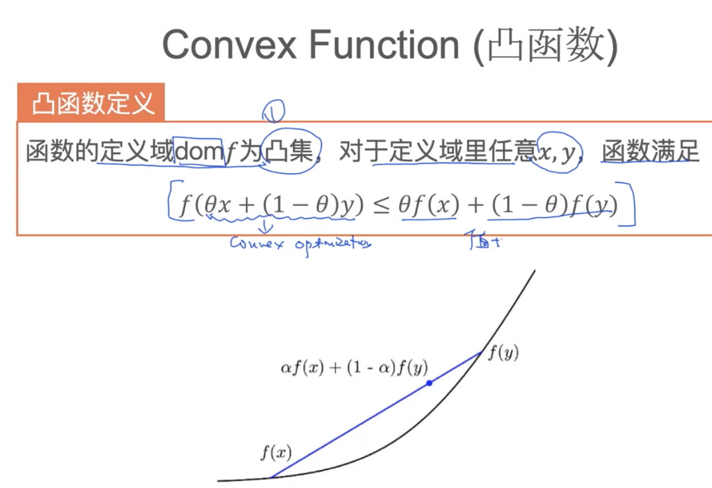
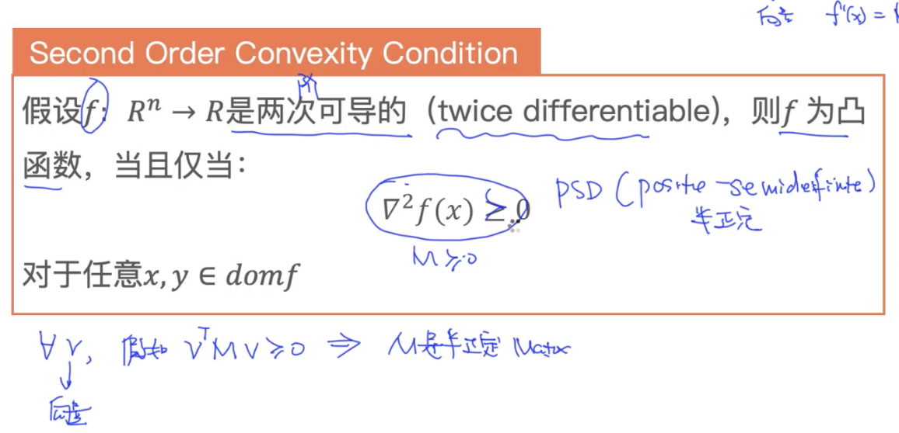
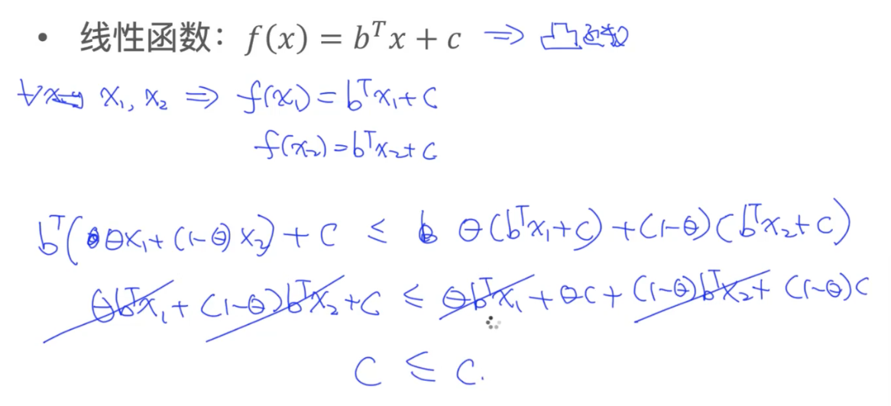
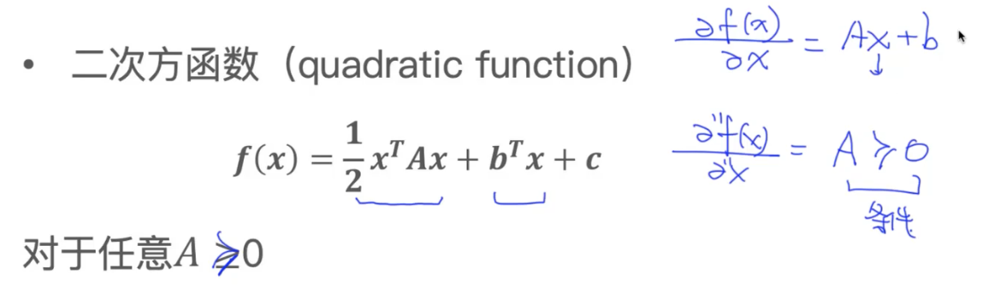

# 机器学习

## 凸集 凸函数 判定凸函数

AI 模型 = 模型 + 优化

#### 凸集

两个凸集的交集也是凸集

#### convex function 凸函数

二阶导数大于0的函数

如果是个矩阵，则矩阵二阶导数是半正定矩阵 才是凸函数

A是n阶方阵，如果对任何非零向量X，都有X'A*X≥0*，其中*X‘'*表示X的转置，就称A为**半正定矩阵**。

线性函数是凸函数

二次方函数

